Hi there! This guide aims to teach people unfamiliar with GitHub or the Git
command line how to suggest edits and submit Pull Requests using only the GitHub
Web UI. We will use the
[Tanzu Agile Practices section](https://tanzu.vmware.com/developer/practices/)
for our examples. Follow the steps below to get started!

# Workflow overview

It takes many clicks to suggest an edit, but these are the 5 big stages you have to go through.

1. **Prepare**: Type up your suggested edits
1. **Fork**: Forking just means creating a copy of the Tanzu Developer Center code and content (including the practices) in your GitHub account
1. **Edit**: Copy and paste suggested edits into the files in your copy of the site through the GitHub UI and save it in a branch.
1. **Submit a Pull Request**: Submitting a Pull Request is the technical term for submitting the suggested edits to be reviewed, approved by someone else and updated on the site. It is so named because the reviewer will be 'pulling' your code into the VMware repository to merge it.
1. **Delete**: When the change is approved, delete your copy of the `tanzu-dev-portal`.

Repeat steps when you want to suggest new edits to the site.

# Step by Step Instructions

If you’re doing this for the first time, set aside around 35 minutes to go
through these steps.

## 1. Prepare

1. Type up the changes you want to make to the `tanzu-dev-portal` pages you are
   updating. While any text editor will do, some editors include support for
   [Markdown](https://guides.github.com/features/mastering-markdown/)
   and may offer a better experience. We encourage multiple small changes
   which are easier to review and publish.

1. Create a GitHub account, if you don’t have one, and login.

## 2. Fork (Create a copy of the Tanzu Developer Center)

1. Go to the
   [Tanzu Developer Center on GitHub](https://github.com/vmware-tanzu/tanzu-dev-portal/tree/main/)
   This is where all the code for the site sits, such as Blogs, Guides, and
   Practices. It is also open to the public for contribution.

1. Click on Fork to make a copy of the code to your own GitHub account.

   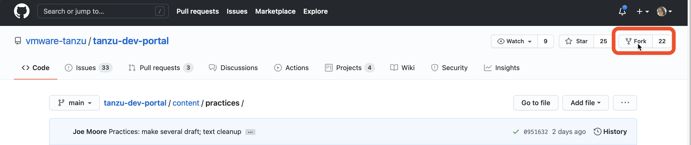

1. Check the title of the repository to make sure that you are editing on your
   own copy of the code. It should show your GitHub account
   **name/tanzu-dev-portal**, as you can see below:

   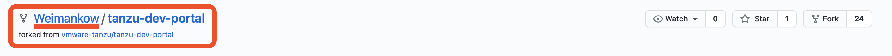

1. Find the file you wish to edit. Using the "Design Studio" practice as an example, first click on content.

   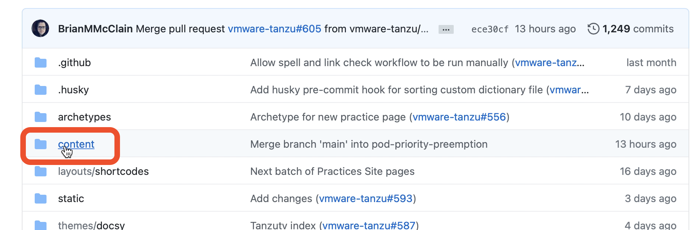

1. Click on practices. You’ll see a list of all the practices currently on the site.

   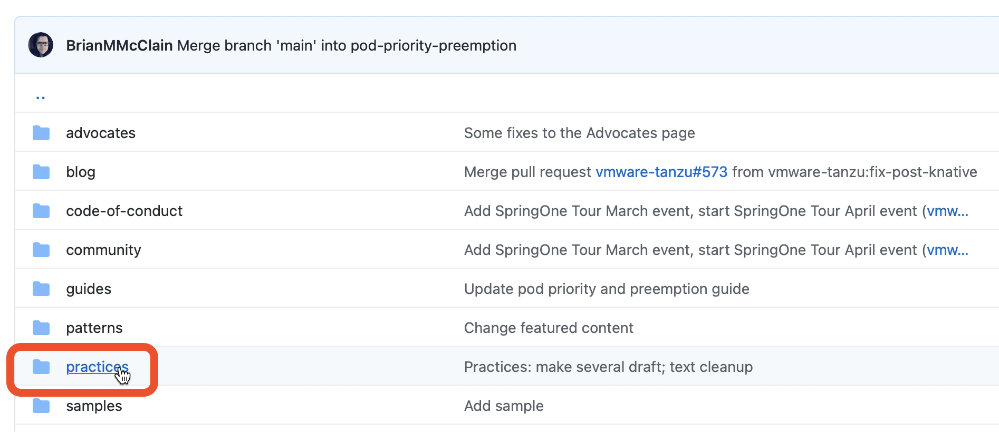

1. Click on the practice you want to add to. For this example, I clicked on design-studio.

   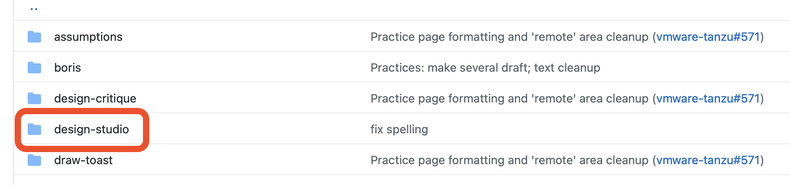

1. Click on `index.md`. This shows you what the page looks like in plain text.

1. Click on the pencil edit icon. This shows you what the page looks like in
   markdown language. Don’t worry, markdown is a simplified HTML/CSS script.
   You may find
   [GitHub's markdown guide](https://guides.github.com/features/mastering-markdown/)
   helpful for learning the basic syntax for formatting.

   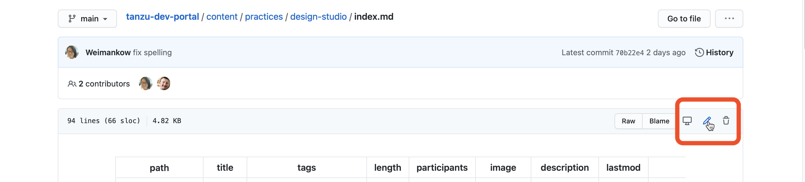

## 3. Edit (Make Edits and save as branch)

1. Paste your edits into the right section. Also note that some of
   the pages use a special syntax for things like tips or callouts.

   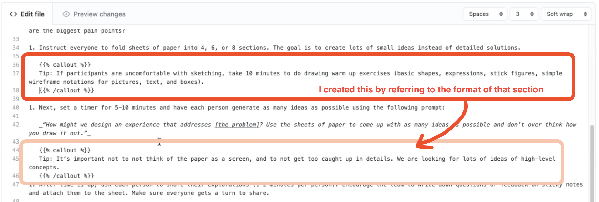

   For example, I added a tip in the example above.

   A tip is written like this:

   ```
   {}
   This is a tip
   {{/%callout%}}.
   ```

   Try to also keep to the indentation format so that the text looks neat and readable.

   Unfortunately, at this point in time, it is not possible to preview what it
   will look like on the actual website, but you can click on the Preview
   Changes tab to see if the edits show up in the right places.

1. Scroll down to the Commit Changes section, and fill in the title. It defaults
   to `Update <the file you changed>`, but delete that and give it a short
   summary of **what you did**. Refer to the image below for an example. For
   help on writing good commit messages, check out
   [this article](https://chris.beams.io/posts/git-commit/).

1. Fill up the extended description with the reason **why** the update was
   needed, or the context around the update. This will be read by the reviewers:
   help them understand why they should approve this edit!

1. Select ‘Create a new branch for this commit’

1. Create a name for the new branch that explains **what it is**

   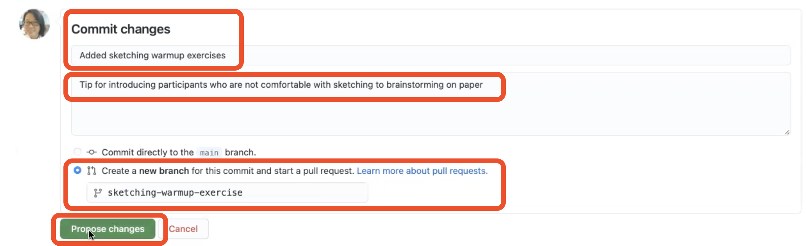

1. Click Propose Changes.

1. Click on the Pull Requests tab. Do NOT click the green ‘Create Pull Request’
   button that appears at the bottom of the next screen.

   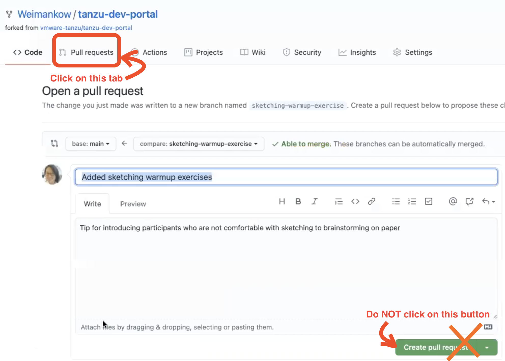

## 4. Submit a Pull Request (Submit edits for review)

1. Click ‘New Pull Request’.

   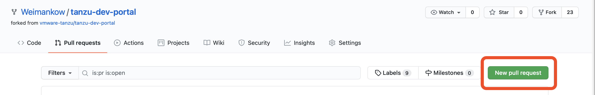

1. Make sure that your base repository is `vmware-tanzu/tanzu-dev-portal`, and
   the head repository is your account.

1. Change the dropdown for your “compare: main” to the name of the branch you have created.

   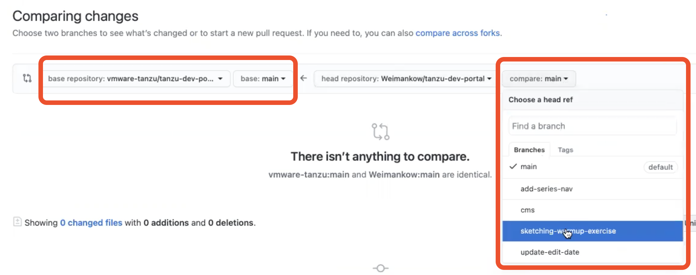

1. Scroll down to check that text highlighted in green is the change you want to make.

1. Click Create Pull Request

   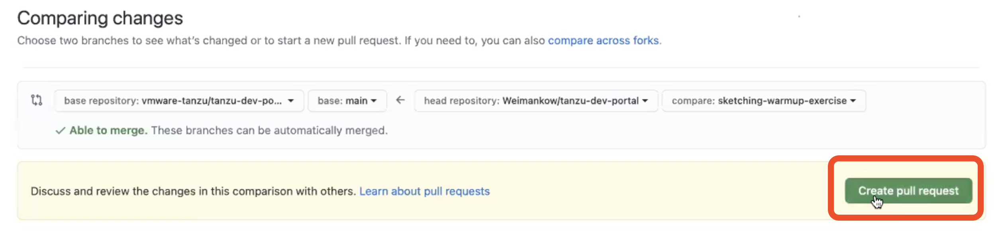

1. Click Create Pull Request again. _Tip:_ it's helpful to include the text
   `WIP` (for "Work in Progress") in the title of your pull request. This
   signals to the maintainers that it has just been opened and it not yet ready
   for review. When you have completed the process and are happy with your
   changes you can edit the title to remove this keyword.

   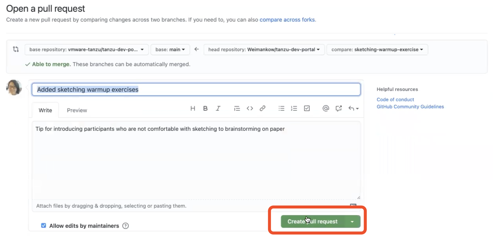

1. If you scroll down, you can see that the edits are going through some automated checks.

   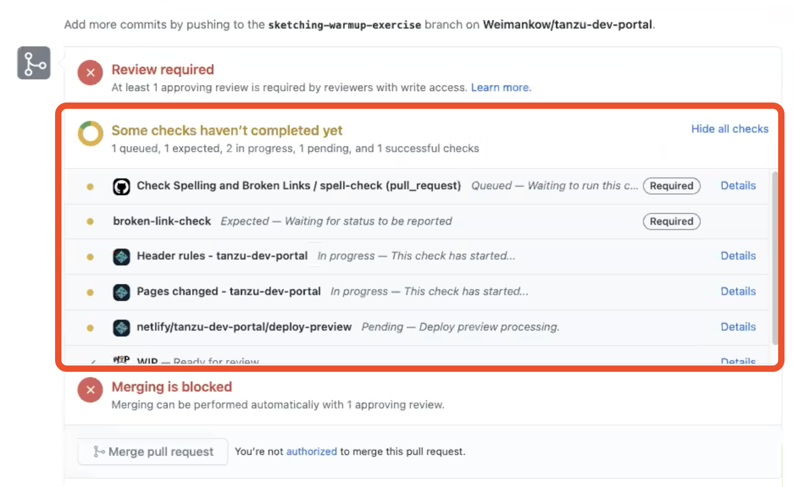

1. If you want to, you can keep the screen running until all the tests have
   passed, just to have a peace of mind. In the list of checks, some people can
   see a row below WIP called Netlify. If you see it, you can click on the
   Netlify row after all the checks have completed to preview how it will look
   on the site.

1. Otherwise, feel free to close GitHub and continue with your life. The checks
   will continue running even if you leave the page. Once the change passes
   through all the checks, it will land on the reviewers’ plate, and all you
   have to do is wait for it to be reviewed, approved and merged.

1. You’ve successfully suggested a change to the Tanzu Developer Center!

## Short FAQ

### How will I know if the changes have passed the checks, been rejected, approved or merged?

If there’s a change to the status of your pull request, GitHub will alert you
via the email linked to your GitHub account, and add a notification to the
notifications icon of your GitHub account. Here's how to check from the GitHub
site:

1. Click on the notification icon.

   

1. Click on the notification with the name of the branch you submitted for pull request

   

1. Check out the status under the title! (Some possible statuses are: Open, Rejected, Merged, etc)

   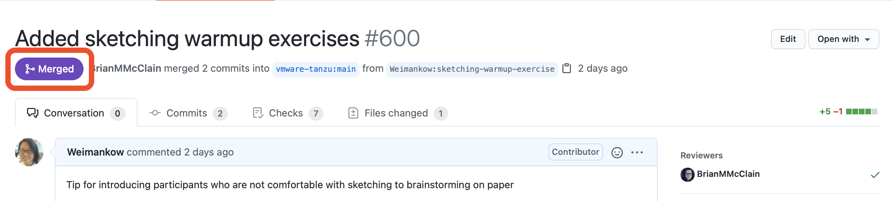

### How can I make a change to the pull request?

1. Go to your copy of the Tanzu Developer Center, making sure that you are in the right branch to make the edits.

   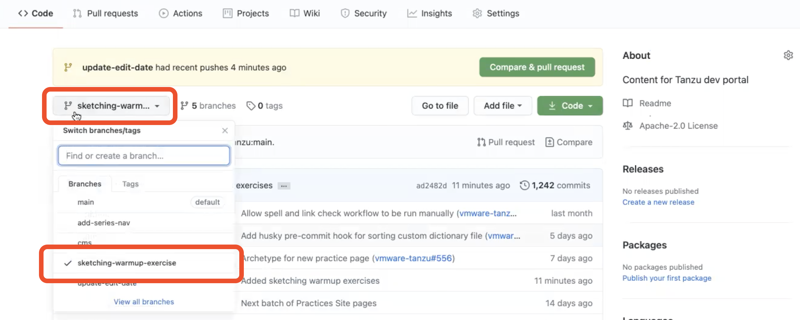

1. Navigate to file you would like to update. For example, for a specific agile
   practice, click on the 'Content' folder, 'Practices' folder, the folder of
   the practice you edited, and then `index.md`. Click on the pencil icon to
   edit it.

1. When saving the edits, under Commit Changes, fill in the title and
   description for the change.

1. This time, commit directly to the branch. Do NOT create a new branch. This
   updates your pull request with your latest edits.

   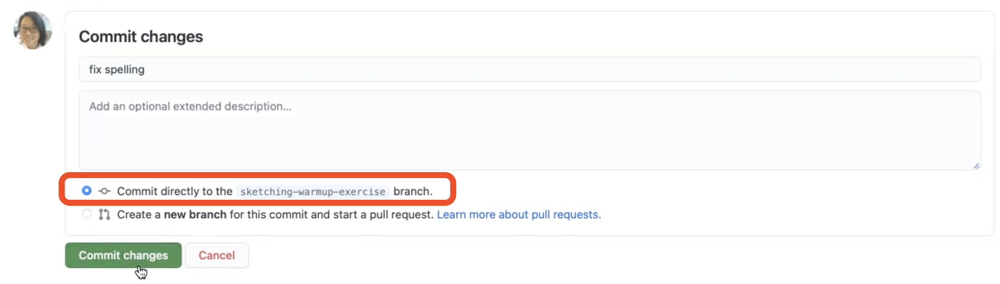

   That’s it!

## 5. Delete your fork

Once you’re sure your edits have been merged, you can delete your repo with these steps:

1. Click on settings

   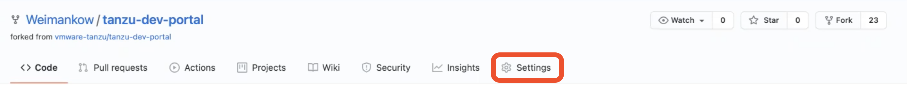

1. Scroll all the way down to the Danger Zone, and click Delete this repository

   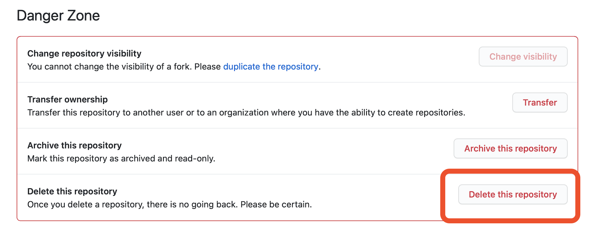

1. Follow the instructions to type the name of your repo, and enter your password. Done!
