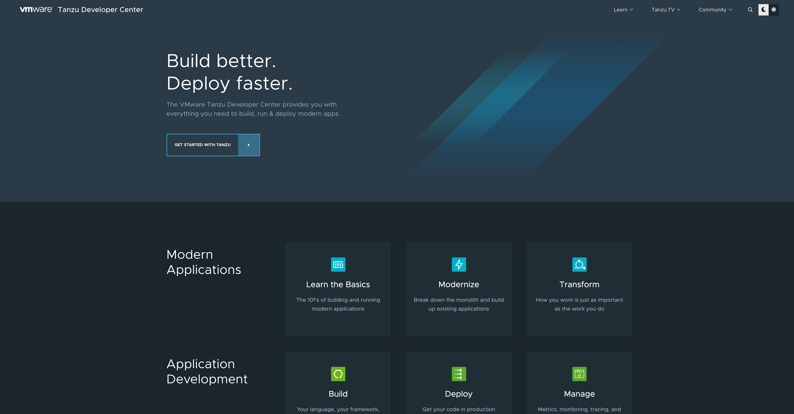

- [About The Project](#about-the-project)
  - [Site Built With](#site-built-with)
- [Getting Started Building a Local Deployment of the Tanzu Developer Center](#getting-started-building-a-local-deployment-of-the-tanzu-developer-center)
  - [Software Installation Prerequisites](#software-installation-prerequisites)
  - [Run a Local Copy of the Tanzu Developer Center](#run-a-local-copy-of-the-tanzu-developer-center)
- [Open Projects, Issues, and Content Backlog](#open-projects-issues-and-content-backlog)
- [Contributing](#contributing)
  - [Contributing Code](#contributing-code)
  - [Contributing Content](#contributing-content)
- [Code of Conduct](#code-of-conduct)
- [Tanzu Developer Center Open Source License](#tanzu-developer-center-open-source-license)


## About The Project



The VMware Tanzu Developer Center is a site specifically built to be a great resource for software development teams. The contributions on the Tanzu Developer Center are from teams across VMware, as well as individuals without.

Our guiding principle is to ensure readers have free, immediate access to all the content on the Tanzu Developer Center. No purchase is ever necessary to access content on the Tanzu Developer Center because it is either open source or an easily accessible trial.


### Site Built With

* [Hugo](https://gohugo.io)
* [Netlify](https://www.netlify.com)
* [npm](https://www.npmjs.com)
* [act](https://github.com/nektos/act)
* [Docker](https://docs.docker.com/get-docker/)


## Getting Started Building a Local Deployment of the Tanzu Developer Center

Before you can build a local copy of the Tanzu Developer Center, there are software prerequisites that you’re going to need to install.

### Software Installation Prerequisites

* **Install Hugo** — The VMware Tanzu Developer Center uses [Hugo](https://gohugo.io/) to build the site from Markdown files. You'll need to [get Hugo](https://gohugo.io/getting-started/installing/) if you want to build and run the site locally. Make sure you install the extended version with built in SCSS/SASS support. This site pins hugo to a specific version (currently 0.82.0) to build so if you're using a different version, your experience may vary. To install this version, see the [gohugo GitHub releases page for 0.82.0](https://github.com/gohugoio/hugo/releases/tag/v0.82.0).

     ```sh
     brew install hugo
     ```

* **Install NPM** — Hugo uses NPM to manage its local packages. If you don’t already have it installed, you’ll need it to move further.

     ```sh
     brew install npm
     ```

* **Install [act](https://github.com/nektos/act)** — Used to runs GitHub Action’s tests locally. The Tanzu Developer Center uses GitHub Actions to perform automated testing periodically, and on pull requests. 

     **NOTE**: The tests currently break on `act` > [v0.2.20, be sure to install v0.2.20](https://github.com/nektos/act/releases/tag/v0.2.20).

* **Install Docker** — Used to build images for local automated tests.  

    **NOTE:** (Mac OS X requires Docker Desktop 2.4, or later)

     ```sh
     brew install docker --cask
     ```

### Run a Local Copy of the Tanzu Developer Center

To get a local copy of the Tanzu Developer Center up and running follow these steps.

1. Clone the repository.

     ```sh
     git clone --recurse-submodules https://github.com/vmware-tanzu/tanzu-dev-portal.git
     ```

2. Build a preview of the website. The website will be available at [`http://localhost:1313/developer`](http://localhost:1313/developer).
    
     ```sh
     make preview
     ```


## Open Projects, Issues, and Content Backlog

See the [open issues](https://github.com/vmware-tanzu/tanzu-dev-portal/issues) and [project boards](https://github.com/vmware-tanzu/tanzu-dev-portal/projects) for a list of proposed features, content backlog, and known issues.


## Contributing

Content contributions are what make open source and the developer community such an amazing place to learn, inspire, and create. Any contributions you make are greatly appreciated.


### Contributing Code

The code contribution process is documented in [CONTRIBUTING.md](https://github.com/vmware-tanzu/tanzu-dev-portal/blob/main/CONTRIBUTING.md).


### Contributing Content

The content contribution process is documented fully on our GitHub [wiki site](https://github.com/vmware-tanzu/tanzu-dev-portal/wiki) and includes methods for both VMware employees as well as non-employees to contribute to content or bug fixes.


## Code of Conduct

We, the Admin team of the Tanzu Developer Center adhere to a code of conduct that you can read more about here: <code>[CODE_OF_CONDUCT.md](https://github.com/vmware-tanzu/tanzu-dev-portal/blob/main/CODE_OF_CONDUCT.md)</code>


## Tanzu Developer Center Open Source License

The Tanzu Developer Center is distributed under the Apache License .For more information, see <code>[LICENSE](https://github.com/vmware-tanzu/tanzu-dev-portal/blob/main/LICENSE)</code>.
