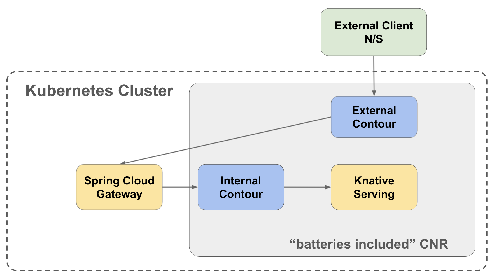
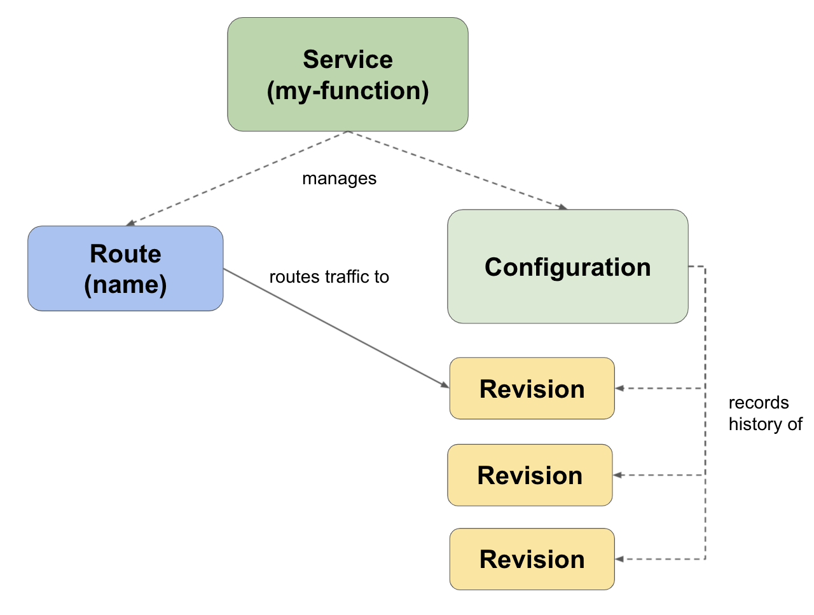
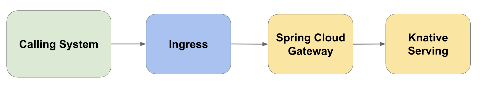
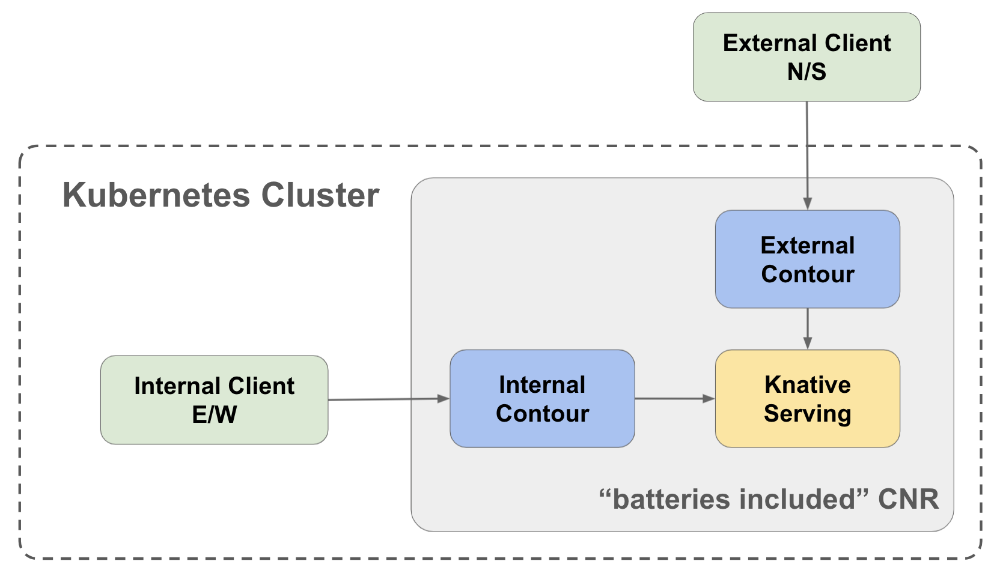
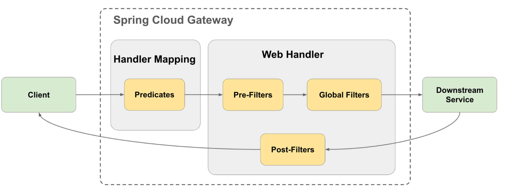
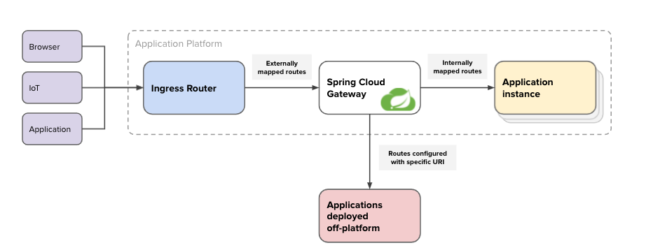

Modern application teams that release frequently to production find that dynamic service routing is a crucial capability. Deployment strategies like [blue-green](https://tanzu.vmware.com/developer/blog/declarative-deployments-in-kubernetes-what-options-do-i-have/#3) and [canary](https://tanzu.vmware.com/developer/blog/declarative-deployments-in-kubernetes-what-options-do-i-have/#4) are dependent upon routing. These strategies involve multiple concurrent “versions” of a service to be deployed and routing rules to determine how traffic is sent to each version. Ideally the routing rules are exposed as an API and can be managed via an application operator, or even better, with automation.

Taking this to the next level of detail, let us look at a number of use cases:

1. Within a [“strangler fig pattern”](https://martinfowler.com/bliki/StranglerFigApplication.html) modernization effort, gradually adjust traffic volume toward a new service while monitoring performance SLAs and functional efficacy.
2. Implement an [A-B testing](https://en.wikipedia.org/wiki/A/B_testing) pattern among alternative implementations of the same service endpoint based upon a weighted distribution, timeframes, or a calling system IP address.
3. Route a small percentage of traffic toward “canary” deployments as part of a continuous delivery processes.
4. Expose the latest release version for testing without exposing it to the general user base.
5. If a new release-related defect has been identified impacting only iPhone users, route all requests from iPhones to the previous released version.

These are realistic and common requirements, and the solution domain spans several aspects of a distributed and complex system of cloud technologies. At lower levels of the networking stack, network traffic routing is content agnostic and focused on transport delivery, extending into the service runtime. Higher up the stack, the content and metadata of network requests provide inputs to make complex routing decisions.

The remainder of this article will focus on several key components of the VMware Tanzu portfolio and how they can work together to solve the above use cases. As is the case with all Tanzu portfolio components, the best of open source technologies are brought to bear in a secure and enterprise-appropriate manner. Here we focus on the OSS projects [Knative Serving](https://knative.dev/docs/serving/) and [Spring Cloud Gateway](https://spring.io/projects/spring-cloud-gateway).



We first explore the components from right to left and how they are integrated, then review how their capabilities can be combined to address the above use cases.

**[Knative Serving](https://knative.dev/docs/serving/)** delivers a service runtime along with integrated routing capabilities, incorporating management of a set of immutable revisions. Requests are routed to a revision based upon weights or header tags. In the event that a revision is inactive (scaled to zero), Knative Serving will delay requests while the service revision scales up and becomes ready to receive the request. Knative Serving is considered content agnostic with respect to routing decisions.



**[Spring Cloud Gateway](https://cloud.spring.io/spring-cloud-gateway/reference/html/)** provides a simple and effective way to present a user-facing API as a composition of APIs provided by one or more microservices. It is content aware, inspecting each request in order to match it against an available set of routes. The request is then run through a chain of filters defined by the route before sending the request to the downstream service. The response can also be modified by filters before being returned to the client. In addition to service routing, Spring Cloud Gateway enables the application of cross-cutting concerns like rate limiting, single sign-on, and circuit breaking.



VMware Tanzu incorporates both of these powerful OSS projects into its enterprise offerings.  Knative Serving is a key component of **[Cloud Native Runtime for VMware Tanzu](https://docs.vmware.com/en/Cloud-Native-Runtimes-for-VMware-Tanzu/1.0/tanzu-cloud-native-runtimes-1-0/GUID-cnr-overview.html)**, while Spring Cloud Gateway is offered as **[Spring Cloud Gateway for Kubernetes](https://tanzu.vmware.com/content/blog/vmware-spring-cloud-gateway-kubernetes-distributed-api-gateway-generally-available)**. Each enterprise offering can be deployed on its own, including deployment instructions, patterns, enterprise features, and batteries-included supporting components.

The **[Kubernetes Ingress](https://kubernetes.io/docs/concepts/services-networking/ingress/)** completes our routing path from calling system to running service. An ingress defines edge routing for API access to services within the cluster. Knative Serving depends on compatible implementations of the ingress controller in order to achieve its routing capabilities. Cloud Native Runtimes for VMware Tanzu incorporates [Contour](https://projectcontour.io/) as a “batteries-included” ingress controller—a great choice as Contour is also provided as a component of [Tanzu Standard edition](https://tanzu.vmware.com/tanzu/standard).  



Spring Cloud Gateway for Kubernetes does not require an ingress controller. However, a typical deployment would integrate with one. 



Spring Cloud Gateway can be incorporated into the Cloud Native Runtime traffic flow between the external and internal Contour deployments.



With Spring Cloud Gateway for Kubernetes and Cloud Native Runtimes deployed as described above, we are ready to solve for our use cases. In each of the examples below, you will find code examples for the key API resources, the Knative `Service`, and the `SpringCloudGatewayRouteConfig`.


## Use cases explained

We will demonstrate these use cases through a hypothetical app modernization story.  


### Strangler fig

Acme Co. has a monolithic application that exposes an API. They want to incrementally break apart this monolithic app following the [strangler fig pattern](https://martinfowler.com/bliki/StranglerFigApplication.html). In order to decouple the API consumers from service providers and provide flexibility for service implementation changes, they deploy Spring Cloud Gateway for Kubernetes in front of their API, then update DNS entries for the API to point to the Spring Cloud Gateway instance. They developed a new microservice for their `catalog` business domain and deployed it to Tanzu’s Cloud Native Runtime as a Knative Service. All API traffic is directed toward the legacy monolithic application with the exception of the endpoints now implemented by the microservice. These endpoints are described as routes within the `SpringCloudGatewayRouteConfig`, where weighted traffic distribution is configured to send 10% of the traffic to the new microservice in order to compare performance and efficiency.

```yaml
apiVersion: serving.knative.dev/v1
kind: Service
metadata:
  name: catalog
  namespace: catalog
 labels:
    networking.knative.dev/visibility: cluster-local
...
```

The `networking.knative.dev/visibility: cluster-local` annotation indicates to Knative Serving that the service should not be exposed outside of the Kubernetes cluster.

```yaml
apiVersion: "tanzu.vmware.com/v1"
kind: SpringCloudGatewayRouteConfig
metadata:
  name: catalog-route-config
  namespace: catalog
spec:
  service:
    namespace: catalog
    port: 80
    name: catalog
  routes:
    - predicates:
        - Path=/api/catalog/**
        - Weight=catalog-group, 1
    - predicates:
        - Path=/api/catalog/**
        - Weight=catalog-group, 9
      uri: http://legacy-monolithic-app-api.amcmeco.com
    - predicates:
        - Path=/api/**
      uri: http://legacy-monolithic-app-api.amcmeco.com
```

For brevity, the `SpringCloudGateway` resource and `SpringCloudGatewayMapping` resources that define the gateway instance itself and maps it to the `SpringCloudGatewayRouteConfig` are not shown. Additionally, an ingress resource exposes the `SpringCloudGateway` as `https://app-api.acmeco.com`.

Now all requests made to [`https://app-api.acmeco.com/api/catalog`](https://app-api.acmeco.com/api/catalog) are evaluated by Spring Cloud Gateway and 10% of requests are routed to the new microservice. The Acme Co. dev team monitors the performance SLAs and incrementally increases the weighted distribution until all catalog traffic is hitting the new microservice.


### A-B tests

The catalog business domain is now completely serviced by the new microservice. However, it did carry forward some technical debt from the original implementation. The catalog development team wants to refactor the business logic for the deactivation endpoint, replacing hard-coded business logic with a rules engine library. Again they want to methodically test and validate the effectiveness of the new implementation. They choose to expose an alternative endpoint within the same service, `/api/catalog/deactivation-rules-engine`, and have Spring Cloud Gateway route requests from internal systems to the new rules engine implementation, while external callers access the hard-coded implementation.

```yaml
apiVersion: "tanzu.vmware.com/v1"
kind: SpringCloudGatewayRouteConfig
metadata:
  name: catalog-route-config
  namespace: catalog
spec:
  service:
    namespace: catalog
    port: 80
    name: catalog
  routes:
    - predicates:
        - Path=/api/catalog/deactivation
        - RemoteAddr=10.105.0.0/16
      filters:
        - SetPath=/api/catalog/deactivation-rules-engine
    - predicates:
        - Path=/api/catalog/**
```

Spring Cloud Gateway will transform the downstream path for all requests coming from the Acme Co. internal network CIDR to access the rules engine–based implementation. This demonstrates our second use case, implementing an A-B testing pattern. Spring Cloud Gateway offers a rich set of “[predicate](https://cloud.spring.io/spring-cloud-gateway/reference/html/#gateway-request-predicates-factories)” matchers that can be used to segment requests. When the team has observed acceptable SLAs from the new service, they can remove the previous implementation from the code base.


## Canary

The catalog team at Acme Co. is looking to further enhance their CI/CD pipelines by deploying a canary rollout strategy, allocating a small percentage of traffic to the latest release. Cloud Native Runtimes will do the heavy lifting. Instead of Knative Serving’s default behavior of sending all inbound traffic to the latest revision of the service, you can configure custom traffic behavior. In the Service configuration below, 10% of the traffic is destined for the new revision, while the remaining traffic goes to the previous revision. Knative Serving takes care of this traffic management and ensures the revisions are available to respond to the requests. Knative Serving [Traffic Management docs](https://knative.dev/docs/developer/serving/traffic-management/) covers this use case in great detail. 

```yaml
apiVersion: serving.knative.dev/v1
kind: Service
metadata:
  name: catalog
  namespace: catalog
 labels:
    networking.knative.dev/visibility: cluster-local
spec:
...
  traffic:
  - percent: 10
    latestRevision: true
  - percent: 90
    revisionName: catalog-0003 # second latest revision
```

### Hidden candidate version

The canary release strategy has worked out well for the team. However, they have found for certain releases, they would like to allow for some internal testing to be performed on the candidate revision prior to receiving live production traffic. With Knative Serving, they can set the traffic percentage of the latest revision to zero and add a tag to the latest revision. This allows for direct access to a specific revision leveraging a unique Kubernetes service.

```yaml
apiVersion: serving.knative.dev/v1
kind: Service
metadata:
  name: catalog
  namespace: catalog
 labels:
    networking.knative.dev/visibility: cluster-local
spec:
...
  traffic:
  - percent: 0
    latestRevision: true
    tag: candidate
  - percent: 100
    revisionName: catalog-0004 # second latest revision
```

Now that the candidate revision is directly accessible within the cluster, a new route can be configured within Spring Cloud Gateway to send traffic to it. Since the target of the route is a distinct Kubernetes service, a new `SpringCloudGatewayRouteConfig` resource is defined. In the first route config below, the new route matches traffic that is sourced from within the corporate network and begins with the path `/api-canary/`. For matching requests, Spring Cloud Gateway will modify the downstream path to what the service expects, `/api/`, and send to the unique Kubernetes service for the tagged revision. All other requests are sent to the “current production” revision matching the routes in the second route config. The `order` attribute of the route definition ensures evaluation for the candidate route is processed first.

```yaml
apiVersion: "tanzu.vmware.com/v1"
kind: SpringCloudGatewayRouteConfig
metadata:
  name: candidate-catalog-route-config
  namespace: catalog
spec:
  service:
    namespace: catalog
    port: 80
    name: candidate-catalog
  routes:
    - predicates:
        - Path=/api-canary/catalog/{segment}
        - RemoteAddr=10.105.0.0/16
      filters:
        - SetPath=/api/catalog/{segment}
      order: 0
```

```yaml
apiVersion: "tanzu.vmware.com/v1"
kind: SpringCloudGatewayRouteConfig
metadata:
  name: catalog-route-config
  namespace: catalog
spec:
  service:
    namespace: catalog
    port: 80
    name: catalog
  routes:
    - predicates:
        - Path=/api/catalog/**
      order: 1
```


### Selective rollback

A similar approach is used for our final use case. The Acme Co. catalog team has found that despite their best efforts, a new release has a regression bug that only affects iPhone consumers. Knative Serving maintains immutable references to past revisions, so the service resource can be updated to allow for the previously released revision to run in parallel to the current version. We specify the previous revision in the traffic section of the Knative Service and give it a unique name.

```yaml
apiVersion: serving.knative.dev/v1
kind: Service
metadata:
  name: catalog
  namespace: catalog
 labels:
    networking.knative.dev/visibility: cluster-local
spec:
...
  traffic:
  - percent: 0
    latestRevision: true
    tag: candidate
  - percent: 100
    revisionName: catalog-0004
  - percent: 0
    revisionName: catalog-0003
    tag: mobile
```

The Spring Cloud Gateway route configs are updated by adding a new route that matches for requests that have iPhone in the user-agent header, and directs those requests to the tagged revision while keeping the default route config for `/api/catalog/` to be serviced by the current revision.

```yaml
apiVersion: "tanzu.vmware.com/v1"
kind: SpringCloudGatewayRouteConfig
metadata:
  name: mobile-catalog-route-config
  namespace: catalog
spec:
  service:
    namespace: catalog
    port: 80
    name: mobile-catalog
  routes:
    - predicates:
        - Path=/api/catalog/**
        - Header=User-Agent, iPhone
      order: 0
```

```yaml
apiVersion: "tanzu.vmware.com/v1"
kind: SpringCloudGatewayRouteConfig
metadata:
  name: catalog-route-config
  namespace: catalog
spec:
  service:
    namespace: catalog
    port: 80
    name: catalog
  routes:
    - predicates:
        - Path=/api/catalog/**
      order: 1
```

Application rollout strategies have evolved from being performed during maintenance windows toward all manner of concurrent rollouts. The capabilities within the Tanzu portfolio provide your team the ability to solve for a variety of use cases using the declarative Kubernetes API. Increase the pace of your application releases with thoughtful concurrent rollouts using [Cloud Native Runtimes for VMware Tanzu](https://docs.vmware.com/en/Cloud-Native-Runtimes-for-VMware-Tanzu/1.0/tanzu-cloud-native-runtimes-1-0/GUID-cnr-overview.html) and [Spring Cloud Gateway for Kubernetes](https://tanzu.vmware.com/solutions-hub/application-tier-networking-and-gateway/spring-cloud-gateway).  

## Get started early with the Tanzu Application Platform beta

We are actively working with a wide variety of customers as we build momentum toward general availability. We would love for you to [take part by signing up for the beta](https://network.tanzu.vmware.com/products/tanzu-application-platform/)! 
