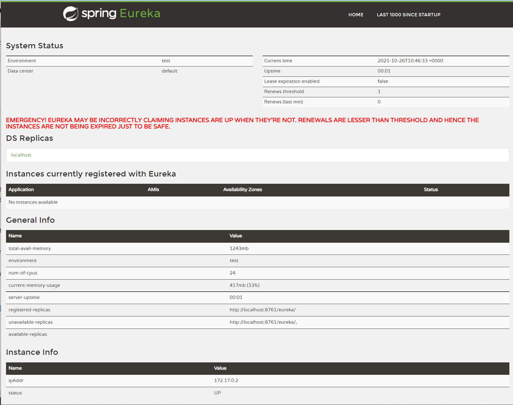
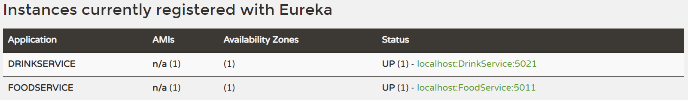

In this previous [blog](/blog/build-api-gateway-csharp-yarp), you learnt how to implement an API gateway in .NET 6 with _YARP_, a reverse proxy library.
All external traffic can be routed through the API gateway to the backend services, making securing and managing the application far easier.


However, if you have a scalable, distributed system, your API gateway may not know where all of the instances of your services actually are.
That’s where a service registry, such as _Netflix Eureka_ can save the day.

[_Eureka_](https://github.com/Netflix/eureka) is a RESTful service that is primarily used in the AWS cloud for the purpose of discovery, load balancing and failover of middle-tier servers. It plays a critical role in Netflix mid-tier infrastructure. It’s built with Java, but for your purposes, you can run _Eureka_ easily from a Docker container.

You’ll register all your services and instances with _Eureka_ and then _Eureka_ will tell your API gateway where everything is, so that it can direct traffic to the right place.


Before you begin you will need:

- An understanding of ASP.NET and C#
- The [.NET 6 SDK](https://dotnet.microsoft.com/download/dotnet/6.0) installed
- A C# code editor such as [Visual Studio](https://visualstudio.microsoft.com/), [JetBrains Rider](https://www.jetbrains.com/rider/promo/) or [VS Code](https://code.visualstudio.com/Download)
- A local copy of this [GitHub Repository](https://github.com/Layla-P/APIGatewayWithYarpEureka) (either downloaded or forked+cloned)
- [Docker for desktop](https://www.docker.com/get-started) installed
- To have gone through the  [Build an API gateway with .NET 6, C# and YARP](/blog/build-api-gateway-csharp-yarp) blog post

## The API Gateway
If you followed along with the Build an API gateway with .NET 6, C# and _YARP_ blog post, then you should already have an application ready to go.
If you didn’t build the application yourself, you can download or clone a copy from this [repository](https://github.com/Layla-P/APIGatewayWithYarpEureka). If you would just like to see the finished code, switch to the `completed` branch within the same repository.

First, let’s test that everything is working. You’ll need to start all four projects; the `Client`, `Gateway`, `DrinkService`, and finally, the `FoodService`.
If you are unsure on how to do this, there are full instructions in the [blog post](/blog/build-api-gateway-csharp-yarp).

If you are satisfied that everything is working, then it’s time to start with _Eureka_!

## Running _Eureka_ in Docker
You can run _Eureka_ without needing to install Java and build an application by using Docker. [Steeltoe](https://steeltoe.io), an open source project providing some great features for building distributed systems, has kindly provided a Docker image of _Eureka_.

Ensure that Docker is running and enter the following command:

```bash
docker run -p 8761:8761 steeltoeoss/eureka-server
```
The default port for _Eureka_ is `8761` so that is what you set in the above Docker command.

You should now be able to navigate to `http://localhost:8761/` and see a page just like the one pictured below.



As you haven’t registered any of your applications, yet, the “applications” section should be empty.
Let’s rectify that!

## Registering an application with _Eureka_

You are going to use Steeltoe to make registering with _Eureka_ as easy as possible, so you’ll need to add it to your projects.
Open up `Gateway.csproj` and update it with the `Steeltoe.Common.Hosting` and `Steeltoe.Discovery.Eureka` packages to an `ItemGroup` tag alongside the YARP package .

```xml
// Gateway/Gateway.csproj
// other code removed for brevity
<ItemGroup>
	<PackageReference Include="Steeltoe.Common.Hosting" Version="3.1.3" />
	<PackageReference Include="Steeltoe.Discovery.Eureka" Version="3.1.3" />
	<PackageReference Include="Yarp.ReverseProxy" Version="1.0.0" />
</ItemGroup>
// other code removed for brevity
```


Now repeat the above, adding both of the Steeltoe packages to the `FoodService.csproj` and the `DrinkService.csproj` as well.

Next, you need to connect the `FoodService`, the `DrinkService` and the `Gateway` with _Eureka_ by adding the following code to the `FoodService/Program.cs`, the `DrinkService/Program.cs`  and `Gateway/Program.cs` files.

Add the using statement to the top of the file and the Discovery Client to the `IServiceCollection` before `builder.Build()` is called.

```c#
using Steeltoe.Discovery.Client;
//code removed for brevity
builder.Services.AddDiscoveryClient();
var app = builder.Build();
//code removed for brevity
```

You will also need to add the following to the `appsettings.json` file of both the `FoodService` and the `DrinkService` - it can go anywhere in the top level.

```json
// appsettings.json
 "Urls": "https://localhost:<PORT>",
 "eureka": {
    "client": {
      "shouldRegisterWithEureka": true
    }
  },
```

The `<PORT>` will depend on what is specified in the `Properties/launchsettings.json` in each project. It will most likely be `https://localhost:5011` in the `FoodService` and `https://localhost:5021` in the `DrinkService`.

You won’t need to add the `"Urls"` node to the `Gateway` project as you don’t need to register it with _Eureka_. You will, however, need to explicitly tell it not to register!

Add the following to the top level of the `Gateway/appsettings.json` file:

```json
"eureka": {
	"client": {
		"shouldRegisterWithEureka": false
	}
}
```


Next, test if this code is working by running the solution, starting all four projects and checking to see if the `DrinkService` and the `FoodService` are registered with Eureka on `http://localhost:8761/`.



Now that the projects are configured to talk with _Eureka_, you may begin setting up _YARP_ to dynamically set up its redirects.

## Configuring _YARP_
In the previous tutorial, you configured the `Gateway` project via the `appsettings.json`. _YARP_ also supports programmatically adding configuration and you can use this to tell _YARP_ where all your applications reside via _Eureka_.

Create a new directory in the `Gateway` project called `Extensions`. You’ll be creating the _routes_ and _clusters_ dynamically by implementing the `IProxyConfigProvider` provided in the _YARP_ library - you’ll also add this to the `Yarp.ReverseProxy.Configuration` namespace.
You will also want this code to be a long running service so you will also implement `IHostedService` - and `IDisposable` for a tidy codebase.

Add a new C# file to the `Extensions` directory and call it `InMemoryConfigProvider`.
Replace all the code with the following code:

```csharp
using Yarp.ReverseProxy.Configuration;

namespace Gateway.Extensions
{
    public class InMemoryConfigProvider : IProxyConfigProvider, IHostedService, IDisposable
    {
        public void Dispose()
        {
            throw new NotImplementedException();
        }

        public IProxyConfig GetConfig()
        {
            throw new NotImplementedException();
        }

        public Task StartAsync(CancellationToken cancellationToken)
        {
            throw new NotImplementedException();
        }

        public Task StopAsync(CancellationToken cancellationToken)
        {
            throw new NotImplementedException();
        }
    }
}
```

You’ll need some private properties for your code to work. At the top of the class add the following:

```csharp
using Microsoft.Extensions.Primitives;
using Steeltoe.Discovery;
using Steeltoe.Discovery.Eureka;
using Yarp.ReverseProxy.Configuration;

```

You will need an implementation of _YARP_'s `IProxyConfig` to hold your routes and clusters. As this will only be used within the `InMemoryConfigProvider` class you can nest it within.

```csharp
private class InMemoryConfig : IProxyConfig
{
	public IReadOnlyList<RouteConfig> Routes => throw new NotImplementedException();

	public IReadOnlyList<ClusterConfig> Clusters => throw new NotImplementedException();

	public IChangeToken ChangeToken => throw new NotImplementedException();
}
```

You can update the `InMemoryConfig` class to the following:

```csharp
private class InMemoryConfig : IProxyConfig
{
	private readonly CancellationTokenSource _cts = new CancellationTokenSource();

	public InMemoryConfig(IReadOnlyList<RouteConfig> routes, IReadOnlyList<ClusterConfig> clusters)
	{
		Routes = routes;
		Clusters = clusters;
		ChangeToken = new CancellationChangeToken(_cts.Token);
	}


	public IReadOnlyList<RouteConfig> Routes { get; }

	public IReadOnlyList<ClusterConfig> Clusters { get; }

	public IChangeToken ChangeToken { get; }

	internal void SignalChange()
	{
		_cts.Cancel();
	}
}
```
You can see that the above code will take in the _route_ and _cluster_ values and assign them to internal values. You’ll then use the `SignalChange` method to update the locations within the _clusters_ a bit later in the code.


Now you can create a constructor for `InMemoryConfigProvider` to enable us to inject the _Steeltoe Discovery client_ and set up the basic `RouteConfig` for _YARP_. The `"Routes"` will be static and won’t need updating, hence why you can hardcode them.
Add the following code to the `InMemoryConfigProvider`:

```csharp
public InMemoryConfigProvider(IDiscoveryClient discoveryClient)
{
	_discoveryClient = discoveryClient as DiscoveryClient;

	_routes = new[]
				{
					new RouteConfig()
					{
						RouteId = "drink_route",
						ClusterId = "DRINKSERVICE",
						Match = new RouteMatch
						{
							Path = "drinkservice/{**catchall}"
						},
						Transforms =  new List<Dictionary<string, string>>
						{
							new Dictionary<string, string>
							{
								{ "PathPattern", "{**catchall}"}
							}
						}
					},
					new RouteConfig()
					{
						RouteId = "food-route",
						ClusterId = "FOODSERVICE",
						Match = new RouteMatch
						{
							Path = "foodservice/{**catchall}"
						},
						Transforms =  new List<Dictionary<string, string>>
						{
							new Dictionary<string, string>
							{
								{ "PathPattern", "{**catchall}"}
							}
						}
					}
				};

	PopulateConfig();

}
```

If you open `appsettings.json` in the `Gateway` project you will see the above code is a programmatic representation of the `"Routes"` node in the `ReverseProxy` node.
You can actually delete the `"ReverseProxy"` node from the `appsettings.json` file as it’s no longer needed.
Also to note in the above code, the setting of the _routes_ could be configured elsewhere and injected into the constructor using the `Options` pattern. This may make the code more maintainable.

You will need to write the method `PopulateConfig` and you will do that imminently.

You’ll need to update the `GetConfig` method next so let’s update the following code:
```csharp
public IProxyConfig GetConfig()
        {
            throw new NotImplementedException();
        }

```
To this code, returning our privately set `_config` when the _Proxy_ configuration is requested.

```csharp
public IProxyConfig GetConfig() => _config;
``` 

Now you’ll create an `Update` method which will be called on a regular interval, hence the implementation of `IHostedService`. This method will accept `object state` as it’s required for the `Timer` function you will need to call, but you won’t do anything with it.

Add the following to `InMemoryConfigProvider`.
```csharp
private void Update(object state)
{
	PopulateConfig();
}

```
The above code calls `PopulateConfig()`, which we first called in the constructor so let’s now write it.

Add the following to `InMemoryConfigProvider`.

```csharp
private void PopulateConfig()
{
      var apps = _discoveryClient.Applications.GetRegisteredApplications();
}
```

`PopulateConfig` will query _Eureka_ via the `DiscoveryClient` and return all the apps and instances registered with it. 
Now you can iterate over the returned `apps` and add them to a list of `ClusterConfig`. 

Add the following to the `PopulateConfig` method:

```csharp
List<ClusterConfig> clusters = new();

foreach (var app in apps)
{
	var cluster = new ClusterConfig
	{
		ClusterId = app.Name,
		Destinations = app.Instances
		.Select(x =>
			(x.InstanceId,
				new DestinationConfig()
				{
					Address = $"https://{x.HostName}:{x.SecurePort}"
				}))
		.ToDictionary(y => y.InstanceId, y => y.Item2)
	};

	clusters.Add(cluster);
}
```
The final piece of your `PopulateConfig` method is to instigate a configuration change in _YARP_.
After the `foreach` loop in `PopulateConfig` add the following code:

```csharp
var oldConfig = _config;
_config = new InMemoryConfig(_routes, clusters);
oldConfig?.SignalChange();
```


Now that you have your `PopulateConfig` method ready, and by virtue of that, your `Update` method and constructor ready, you can implement the `StartAsync` method from the `IHostedService` implementation.

```csharp
public Task StartAsync(CancellationToken cancellationToken)
{
	_timer = new Timer(Update, null, TimeSpan.Zero, TimeSpan.FromSeconds(30));
	return Task.CompletedTask;
}	
``` 
The above code will start a timer when the application starts, and call the `Update` method every 30 seconds.

You can also update the `StopAsync` method to the following:

```csharp
public Task StopAsync(CancellationToken cancellationToken)
{
	_timer?.Change(Timeout.Infinite, 0);
	return Task.CompletedTask;
}
```

The final piece of code on this page is the `Dispose` method. Update it to the following
```csharp

public void Dispose()
{
	_timer?.Dispose();
}

```

You’ve  added a lot of code here. The completed class can be found [here](https://github.com/Layla-P/APIGatewayWithYarpEureka/blob/completed/Code/Gateway/Extensions/InMemoryConfigProvider.cs) if you run into any issues.


## Extending YARP

You’ve created all the code you need to dynamically populate the _clusters_ on _YARP_. Now you just have to call the code.

You could add the code directly to `Program.cs` but it’s cleaner to extend the `IReverseProxyBuilder` provided by Microsoft Dependency Injection instead.

Add a new class to the , and update the `clusters` object within the `routes` object `Extensions` directory in the `Gateway` project, calling it `DependencyInjectionExtensions`.

Update all of the code with the following:

```csharp
using Steeltoe.Discovery;
using Yarp.ReverseProxy.Configuration;

namespace Gateway.Extensions
{
    public static class DependencyInjectionExtensions
    {
        public static IReverseProxyBuilder LoadFromMemory(this IReverseProxyBuilder builder)
        {
            return builder;
        }
    }
}
```
This code will enable us to add both an implementation of `IProxyConfigProvider` and `IHostedService` using the `InMemoryConfigProvider` class you just created, to the _IoC_ container.

Update the `LoadFromMemory` method with the following:

```csharp
public static IReverseProxyBuilder LoadFromMemory(this IReverseProxyBuilder builder)
{
	builder.Services.AddSingleton<InMemoryConfigProvider>();

	builder.Services.AddSingleton<IHostedService>(ctx => ctx.GetRequiredService<InMemoryConfigProvider>());

	builder.Services.AddSingleton<IProxyConfigProvider>(ctx => ctx.GetRequiredService<InMemoryConfigProvider>());

	return builder;

}
```


The above code will add an instance of `InMemoryConfigProvider` as both an implementation of `IHostedService` and `IProxyConfigProvider` to the _IoC_ container.

The final step is to call this new code in the `Program.cs` file.

Replace the standard _YARP_ implementation below:

```csharp
var proxyBuilder = builder.Services.AddReverseProxy();
// Initialize the reverse proxy from the "ReverseProxy" section of configuration			
proxyBuilder.LoadFromConfig(Configuration.GetSection("ReverseProxy"));

```
With the following - ensuring it comes after the `services.AddDiscoveryClient(Configuration);` line but before the `builder` is built:

```csharp
builder.Services.AddReverseProxy().LoadFromMemory();
```
Adding `using Gateway.Extensions;` to the top of the file. 

Wow! That was a lot of code! If you need to check anything, the completed repository can be found [here](https://github.com/Layla-P/APIGatewayWithYarpEureka/tree/completed).


## Trying it all together

The API gateway now knows how to route incoming traffic through to your backend services, and the client already knows how to connect to the API Gateway project.
All that’s left to do is run the solution and try it out!!

The application shouldn’t look any different than it did before. Only now, the `FoodService` and `DrinkService` will be registered with _Eureka_ and we don’t need to hardcode the configuration in `appsettings.json`. It’s all done dynamically.


I hope you enjoyed this tutorial. If you have any thoughts or ideas please say hello on any of the channels below:


Email: laylap@vmware.com  
Twitter: [@LaylaCodesIt](http://twitter.com/laylacodesit)  
GitHub: [layla-p](https://github.com/Layla-P)  
TikTok: [LaylaCodesIt](https://www.tiktok.com/@laylacodesit/)  
Twitch: [LaylaCodesIt](https://www.twitch.tv/laylacodesit/)

