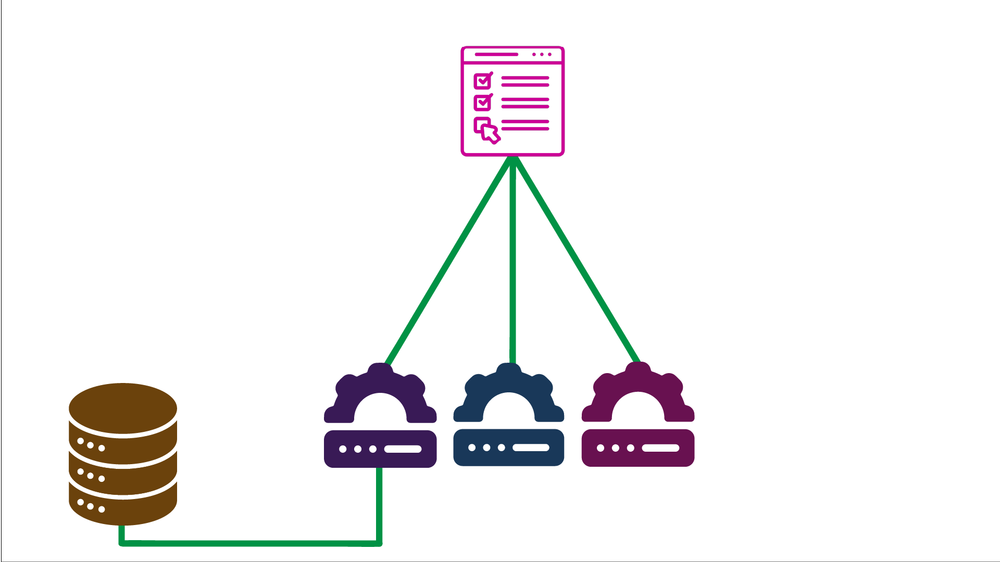

Consider an API gateway to be a virtual "garden gate" to all your backend services. Implementing one means that all external traffic must pass through the gateway. This is great as it increases security and simplifies a lot of processes such as rate limiting and throttling.


There are many paid for services that offer API management but they can be costly and you may not need all the features they offer.

In this tutorial, you will build a basic API Gateway using [YARP](https://microsoft.github.io/reverse-proxy/) or "Yet Another Reverse Proxy". YARP is an open-source library  built by developers from within Microsoft. It’s highly customisable, but you are just going to use a simple implementation today.

Before you begin you will need:

- An understanding of ASP.NET and C#
- The [.NET 6 SDK](https://dotnet.microsoft.com/download/dotnet/6.0) installed
- A C# code editor such as [Visual Studio](https://visualstudio.microsoft.com/), [Jetbrains Rider](https://www.jetbrains.com/rider/promo/) or [VS Code](https://code.visualstudio.com/Download)
- A local copy of this [GitHub Repository](https://github.com/Layla-P/APIGatewayWithYarp) (either downloaded or forked+cloned)


## What does an app look like without an API gateway?

Below is a simple diagram consisting of 3 services and a database - note our demo looks slightly different to this. The front end client app is talking directly to all three services directly. This means that each service will need to manage its own security and makes implementing patterns such as service discovery much harder.



Once you add in an API gateway, as you can see in the diagram below, all external traffic must now go via the gateway and the gateway will redirect the requests to the appropriate service.
The gateway will now handle security such as authorisation and authentication, thus reducing the complexity of the application.


## Exploring the application

You should already have a copy of the application downloaded or cloned. If not, you can find it [here](https://github.com/Layla-P/APIGatewayWithYarp). There is also the option to switch to the `completed` branch on the repo to see the completed tutorial.

The app consists of 3 projects; a `FoodService`, a `DrinkService` and a `Client`. All the projects are in a single solution for ease of demonstration. Normally, each service would be in its own solution.

The `FoodService` and `DrinkService` are both .NET WebAPI applications. Both have just a single controller, and when called, will return a random food item and random drink item respectively.

The Client directory contains a Blazor WASM application. There is only one page in the app and it has a button that when clicked, will display a random food and drink item. Behind the scenes, there is a method which calls both the FoodService and DrinkService respectively, retrieving a random food item and random drink item to display to the user.

Let’s run the application and make sure it behaves as expected. All three projects should be set to startup at once. If not, then configure your [application start](https://docs.microsoft.com/en-us/visualstudio/ide/how-to-set-multiple-startup-projects?view=vs-2022) to do so.

The application is configured to run on Kestrel. If you would prefer to run on IIS then you will need to update the `localhost` port numbers on both the FoodService and the DrinkService in "Client/Program.cs" as shown below.

```c#
// ~\Client\Program.cs
using Client;
using Microsoft.AspNetCore.Components.Web;
using Microsoft.AspNetCore.Components.WebAssembly.Hosting;

var builder = WebAssemblyHostBuilder.CreateDefault(args);
builder.RootComponents.Add<App>("#app");
builder.RootComponents.Add<HeadOutlet>("head::after");

builder.Services.AddHttpClient("FoodService", client =>
{
	client.BaseAddress = new Uri("https://localhost:5011/");
});

builder.Services.AddHttpClient("DrinkService", client =>
{
	client.BaseAddress = new Uri("https://localhost:5021/");
});


await builder.Build().RunAsync();
```

Run the application, click the big green button and a random food and drink order should be displayed!

## Adding in the YARP NuGet package

The repository already has a "Gateway" project ready for you to use. Open the "Gateway.csproj" file and add in the reference to Yarp. 


```xml
//  ~\Gateway\Gateway.csproj
<Project Sdk="Microsoft.NET.Sdk.Web">

  <PropertyGroup>
    <TargetFramework>net6.0</TargetFramework>
    <ImplicitUsings>enable</ImplicitUsings>
  </PropertyGroup>

  <ItemGroup>
    <PackageReference Include="Yarp.ReverseProxy" Version="1.0.0" />
  </ItemGroup>

</Project>
```

## Using YARP as a gateway

Now that you have the YARP library available in the application you can set it up with just a few lines of code.
Open the "Program.cs" file in the "Gateway" project. You will be deleting a lot of the code as it will no longer be required. Below is the complete "Program.cs" file with all the updates and the addition of the code relating to YARP (all the `ReverseProxy` references).

```c#
//  ~\Gateway\Program.cs
var builder = WebApplication.CreateBuilder(args);

var proxyBuilder = builder.Services.AddReverseProxy();
// Initialize the reverse proxy from the "ReverseProxy" section of configuration
proxyBuilder.LoadFromConfig(builder.Configuration.GetSection("ReverseProxy"));

var app = builder.Build();

// Configure the HTTP request pipeline.
if (!app.Environment.IsDevelopment())
{
	app.UseExceptionHandler("/Error");
	app.UseHsts();
}

app.UseRouting();

app.UseEndpoints(endpoints =>
{
	endpoints.MapReverseProxy();
});


app.Run();

```


Yarp is now almost ready to use, you just need to add in the configuration. There are a couple of ways to configure YARP, in "appsettings.json" and also programmatically in code.

For this post, you will be adding configuration in the "appsettings.json".


## Gateway Configuration

When using an API gateway, you’ll have a downstream URL address to an application and an upstream.
The downstream address is the actual address of the service, with or without endpoints.
The upstream address is the URL that points to the API Gateway and has information on which service the client is aiming to reach.

Yarp divides the configuration into routes and clusters. 
Routes are where you’ll define the upstream endpoints that the client will use and clusters will be where you can define the downstream endpoints that the gateway will route requests to.
The configuration should follow this pattern:

```json
{
 "ReverseProxy": {
	"Routes": {
	  "ROUTE_NAME": {
		"ClusterId": "CLUSTER_NAME",
		"Match": {
		  "Path": "DOWNSTREAM_PATH"
		},
		"Transforms": [
		  {
			"PathPattern": "PATTERN"
		  }
		]
	  }
	},
	"Clusters": {
	  "CLUSTER_NAME": {
		"Destinations": {
		  "destination1": {
			"Address": "UPSTREAM_PATH"
		  }
		}
	  }
	}
  }
}
```

Open the "appsettings.json" in the "Gateway" project and replace the contents of the file with the following. You’ll be adding two routes and two clusters.

```json
// ~\Gateway\appsettings.cs
{
  "Logging": {
	"LogLevel": {
	  "Default": "Information",
	  "Microsoft": "Warning",
	  "Microsoft.Hosting.Lifetime": "Information"
	}
  },
  "AllowedHosts": "*",
  "ReverseProxy": {
	"Routes": {
	  "food-route": {
		"ClusterId": "food-cluster",
		"Match": {
		  "Path": "foodservice/{**catchall}"
		},
		"Transforms": [
		  {
			"PathPattern": "{**catchall}"
		  }
		]
	  },
	  "drink-route": {
		"ClusterId": "drink-cluster",
		"Match": {
		  "Path": "drinkservice/{**catchall}"
		},
		"Transforms": [
		  {
			"PathPattern": "{**catchall}"
		  }
		]
	  }
	},
	"Clusters": {
	  "food-cluster": {
		"Destinations": {
		  "destination1": {
			"Address": "https://localhost:5011"
		  }
		}
	  },
	  "drink-cluster": {
		"Destinations": {
		  "destination1": {
			"Address": "https://localhost:5021"
		  }
		}
	  }
	}
  }
}

```

If you needed to update your ports earlier on in this tutorial, you’ll need to do it in the above settings too.

The above routes such as `foodservice/{**catchall}` means that every request that comes into the gateway with `foodservice` as the first route path segment will be routed to the cluster.
If you had another route that was more specific, such as `foodservice/food` that would take precedence over the catchall.

The above configuration can be expanded to include load balancing, authorisation and authentication, and much more. Check out the YARP documentation for more information.


## Using the Gateway

The last thing you need to do is update the client application to use the gateway rather than calling the services directly.
Open "Program.cs" in the client application. Here, you’ll see two HttpClients have been configured and named using the HttpClientFactory Pattern.

Update the URL to the address of the API gateway, found in "Properties/launchSettings.json", as shown in the code below.

```c#
// ~\Client\Program.cs
builder.Services.AddHttpClient("FoodService", client =>
	{
		client.BaseAddress = new Uri("https://localhost:5001/foodservice/");
	});

builder.Services.AddHttpClient("DrinkService", client =>
	{
		client.BaseAddress = new Uri("https://localhost:5001/drinkservice/");
	});

```
Again, if you are using IIS over Kestrel, the port will differ from "5001".
The path of the new URL will point to the route path you defined in the route in "appsettings.json".


## Testing it all out

You now just need to ensure that your new gateway app starts along with all the other applications. In Visual Studio, right click on the solution and choose "Set Startup Projects…".
Ensure that the new "Gateway" project is set to "start" along with the other three projects in the "multistart" section.

Once your app is up and running, it should behave just as before. Only now, behind the scenes, all traffic is being routed through the gateway.

## Summary

With just a few lines of code you’ve reduced the complexity of your application. You now have a single point of entry where you can manage user authentication and authorisation. This will make the application easier to secure and limit the access to the backend services.


I hope you enjoyed this tutorial. If you have any thoughts or ideas please say hello on any of the channels below:


Email: laylap@vmware.com  
Twitter: [@LaylaCodesIt](http://twitter.com/laylacodesit)  
GitHub: [layla-p](https://github.com/Layla-P)  
Twitch: [LaylaCodesIt](https://www.twitch.tv/laylacodesit/)
TikTok: [LaylaCodesIt](https://www.tiktok.com/@laylacodesit/)