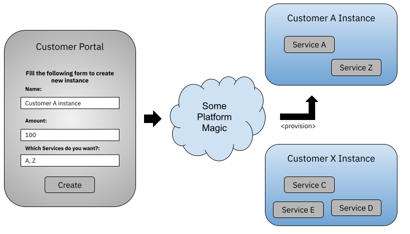
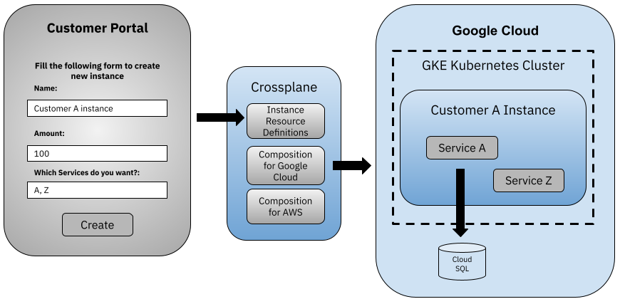
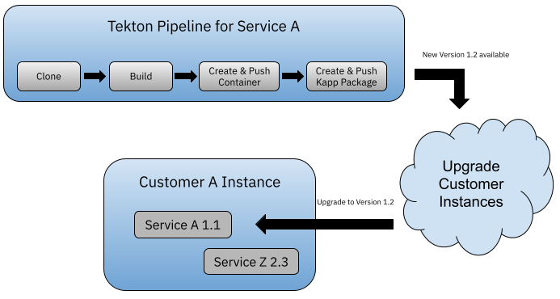
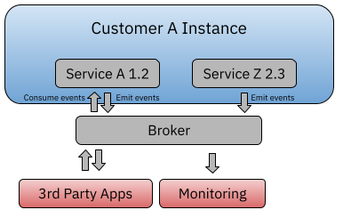
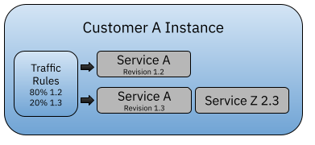

The Kubernetes tools landscape keeps growing, with more and more companies and projects building specific tools to tackle specific challenges. Making sense of all these tools and how they can be used to build a SaaS platform on top of Kubernetes is a full-time job. 

These platforms are commonly built to provision a set of domain-specific components that provide the services (a set of features) that the platform is offering. You might end up having internal “customers,” such as different departments or teams that require new instances of these components, or external customers that  are willing to pay for a managed instance of these components. Whether they are internal or external, application platforms should provide a self-service approach, where each customer can access a portal and easily request new instances (that could be via GUI, CLI, and/or whatever is most natural for that user).



If you are building this kind of platform, and you are also fully invested in Kubernetes, you might want to look for tools that are built on top of the Kubernetes APIs. This way, the solution you build can be run on top of any Kubernetes installation, managed or on-premises. 

This blog post covers three different angles that you will need to cover if you are tasked to build one of these SaaS platforms. 

* Packaging and building your services
* Creating isolated instances for your customers
* Frictionless delivery and interoperability

## Packaging and building your services

Before even thinking about how you’ll provision these components, you need to have a clear plan on how to build each individual service. You also need to have a clear path to continuously deliver new versions of these services to your customers. Because these services are going to be running in remote environments, you also need to have a strategy to package and distribute the new versions of the services when development teams apply changes. 

For building cloud native software [**Tekton pipelines**](http://tekton.dev) are a clear winner. Tekton builds on top of the Kubernetes APIs, providing resources to define pipelines and tasks that can be configured to build, package, and distribute software artifacts. The following example shows a Tekton pipeline resource that clones the source code of a service from GitHub, then builds the Java service using Maven, creates a Docker container image using [Kaniko](https://github.com/GoogleContainerTools/kaniko), and pushes the resulting image to DockerHub. 


```
apiVersion: tekton.dev/v1beta1
kind: Pipeline
metadata:
  name: service-a-pipeline
  annotations:
    description: |
      Build the artifacts for Service A
spec:
  tasks:
    - name: clone-repo
      taskRef:
        name: git-clone
        bundle: gcr.io/tekton-releases/catalog/upstream/git-clone:0.4
      params:
        - name: url
          value: github.com/repo/service-a
        - name: revision
          value: main
    - name: maven-build
      runAfter: [clone-repo]
      taskRef:
        name: maven
        bundle: gcr.io/tekton-releases/catalog/upstream/maven:0.2
      params:
        - name: GOALS
          value: 
            - -DskipTests
            - clean
            - package  
    - name: image-build
      runAfter: [maven-build]
      taskRef:
        name: kaniko
        bundle: gcr.io/tekton-releases/catalog/upstream/kaniko:0.4
      params:
        - name: IMAGE
          value: $(params.target)/$(params.target-name):$(params.version)
```

However, when it comes to packaging and distributing Kubernetes applications, having a Docker image is just the first step. You also must be able to package, version, and distribute the Kubernetes manifests that are used to deploy your services to a Kubernetes cluster. There are several tools in this space, but I wanted to mention two that are worth highlighting:

* [**Helm:**](http://helm.sh) Helm provides templating and package manager capabilities for Kubernetes applications. Helm is quite popular with application infrastructure components, such as databases and message brokers. Cloud software providers like [Bitnami](https://bitnami.com/stacks/helm) (the foundation of our VMware Tanzu Application Catalog) provide a handful of curated Helm charts to install these components. But Helm has its issues, including that, Helm charts tend to become quite complicated and cryptic if you want to support parameterizing every possible value that can be configured inside your services. I encourage you to check the [**ElasticSearch** Helm Chart templates](https://github.com/bitnami/charts/blob/master/bitnami/elasticsearch/templates/master-statefulset.yaml) to understand how complex this can get. 
* [**Carvel kapp:**](https://carvel.dev/kapp/) If you are building your own domain-specific services that are going to be consumed only by your platform, it might be good to take a look at Carvel kapp. kapp is focused on packaging Kubernetes resources without doing any templating. kapp packages are just plain OCI images, meaning that they can be published to any OCI compatible registry, such as Harbor, DockerHub, or GCR in Google Cloud. If you need to change or parameterize your packages, you can use tools like [Kustomize](https://kustomize.io/) or [Carvel YTT](https://carvel.dev/ytt/), which are focused on manipulating Kubernetes resources and provide a wide range of mechanisms to do so. 



## Creating isolated instances for your customers

Sooner rather than later, you will be faced with a big question: In which cloud provider do we run our platform? If your platform is an end-user platform such as Netflix or Spotify, the answer to this question might be purely related to costs and specific services offered by a given cloud provider. On the other hand, if you are a software or application infrastructure provider, you might have more restrictions on where you run your services. Software consumers tend to be restricted by company’s policies (e.g., “I cannot move my data out of my datacenter” or “The data produced by the platform cannot leave the country where I am operating.”). If this is the case, it’s worth focusing on a multi-cloud strategy from the beginning. 

But even then you must answer the question of how can you easily provision and manage isolated resources for your customers using a multi-cloud approach. [Crossplane](https://crossplane.io) is a CNCF project that allows you to declaratively, using the Kubernetes API, provision resources across multiple cloud providers. 

First, you need to figure out what a customer instance means for your scenario. Does it mean a separate Kubernetes namespace for each new customer? Does it mean a new Kubernetes cluster for each customer? What about provisioning cloud-provider-specific resources such as databases and message brokers that a service needs to work? 

In my experience, if customers can absorb the cost, dedicated Kubernetes clusters are the approach that provides more isolation between different customers’ workloads. Hence, it would make a lot of sense to have the following topology: 



Crossplane allows you to create new managed resource types, extending the Kubernetes APIs to define what your instances are and what resources will need to be created for each instance. These new Crossplane managed resources allow you to define a sort of an interface that defines which knobs (parameters) users can set for each instance. Usually, these knobs are the ones exposed in the customer portal. 

More importantly, Crossplane allows you to define compositions that contain cloud-provider-specific resources to implement the previously defined interface for a given cloud provider. For this example, and given that we want a dedicated Kubernetes cluster per customer, the Crossplane `CompositeResourceDefinition` contains the following Kubernetes resources: `GKECluster`, `NodePool`, `Network`, `CloudSQLInstance`, and all the resources necessary to create to be able to run the services for that instance. 


```
apiVersion: apiextensions.crossplane.io/v1
kind: Composition
metadata:
  name: my-instance.composition.example.com
spec:
  compositeTypeRef:
    apiVersion: example.com/v1alpha1
    kind: MyInstanceCluster
  resources:
    - base:
        apiVersion: compute.gcp.crossplane.io/v1beta1
        kind: Network
    … <Other configurations here>	
    - base:
        apiVersion: container.gcp.crossplane.io/v1beta1
        kind: GKECluster
        … <Other configurations here>
    - base:
        apiVersion: container.gcp.crossplane.io/v1alpha1
        kind: NodePool
        … <Other configurations here>
    - base:
        apiVersion: database.gcp.crossplane.io/v1beta1
        kind: CloudSQLInstance
        … <Other configurations here>
```

Having this `Composition` definition and Crossplane configured, I can now provision new instances by just creating a `MyInstanceCluster` resource:

```
apiVersion: example.com/v1alpha1
kind: MyInstanceCluster
metadata:
  name: CustomerAInstance
spec:
  name: "Customer A Instance"
  amount: 100
  services: 
    - A
    - B
```
           

Notice how this CustomResourceDefinition looks pretty aligned with the customer portal interface, and how it doesn’t include any cloud-provider-specific definition. The Composition resource allows us to hide all the cloud-provider-specific details, maintaining a nice abstraction that defines exactly what our customers are trying to create. Because it is a Kubernetes resource, you can use any other tools to apply this to a Kubernetes cluster; tools such as Helm or Kapp can be used to package these definitions and apply them to a live cluster. 


## Frictionless delivery and interoperability

Provisioning complex instances composed of several services that need to be upgraded in a continuous delivery fashion requires you to have all the right mechanisms in place. You should be able to test, validate with users (live traffic), and rollback new versions if they are not behaving as expected. From an interoperability point of view, your services should externalize internal state in a way that other tools and systems can integrate with them, without relying on custom-made mechanisms. 

A project that  helps tackle these challenges is [Knative](http://knative.dev). Knative builds on top of the Kubernetes APIs to provide mechanisms to deliver and scale your applications in a more efficient way. Knative Serving (a module inside Knative) provides advanced traffic management, allowing multiple versions (Knative revisions) of a service to run at the same time, allowing us to control how much traffic is going to be sent to each version. This mechanism highly simplifies the implementation of different release strategies, such as canary releases and blue/green deployments. Knative Serving also deals with scaling your services based on the traffic that they are receiving, using a custom Kubernetes autoscaler. This autoscaler can handle scaling your services down to zero to save resources if your service is not being used. 



You can easily define how many service revisions are running at the same time. For example, as shown in the previous figure, you can see Revision 1.2 of Service A running alongside Revision 1.3, as well as how much traffic is being routed to each of these revisions. For this example, 80 percent of the traffic is routed to Revision 1.2, which is the version that we know is stable, and 20 percent to Revision 1.3, which is a new version that we are testing to see how it behaves. By default, these services can be scaled up or down based on utilization; Knative automatically monitors the traffic that is being routed to these services and scales them up or down accordingly. All these configurations are done by using Knative resources, which build on top of Kubernetes built-in resources. 

Another aspect Knative covers is around events. Kubernetes by default doesn’t provide any constructs to define event consumers or producers, or any way to route events from one service to another. Knative Eventing was designed with this purpose in mind. By relying on CloudEvents as the de facto language to share events data, it offer us broker and trigger resources that allow our events to be routed from producers to any number of consumers.


 

You can build full event-driven architectures or just rely on events for monitoring or third-party integrations. But another great thing about Knative Eventing is that you can plug your own broker implementation, such as Kafka, RabbitMQ, or even cloud-provider-specific tools. This facilitates the multi-cloud strategy and easy integration with tools like Crossplane. 

## Learn more

If you want to learn more about these projects and tools, you can attend my upcoming KubeCon session: [Tools That I Wish Existed 3 Years Ago To Build a SaaS Offering](https://sched.co/lV3A). It happens on Friday, Oct. 15., and I will be live for the Q&A session at the end of my presentation. 

You can also check out a book I’m writing, titled  ["Continuous Delivery for Kubernetes"](http://mng.bz/jjKP). If you read the early drafts and you have suggestions or you want me to add more examples of a certain topic or project, please feel free to reach out via Twitter. I’m [@salaboy](http://twitter.com/salaboy) and my DMs are open. 

I hope you all have a great [KubeCon NA](https://sched.co/lV3A) this week!
