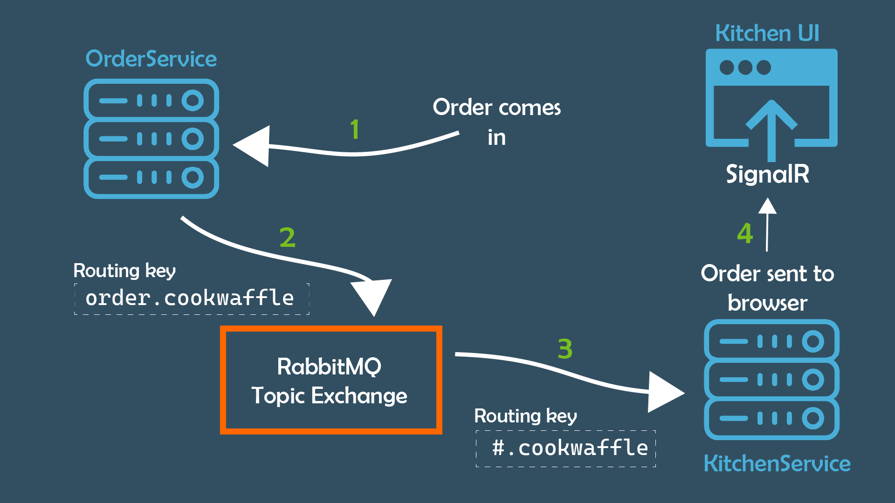

## What Is RabbitMQ?


At a high level, [RabbitMQ](https://www.rabbitmq.com/) is an open source message broker. A message broker accepts messages from a producer (the message sender) and holds it in a queue so that a consumer (the message receiver) can retrieve it. This allows for multiple producers and consumers to share the same queue without having to directly pass messages between each other. What RabbitMQ excels at is doing this at scale whilst staying lightweight and easy to deploy.

To get started with a basic RabbitMQ implementation, checkout this [guide](https://tanzu.vmware.com/developer/guides/rabbitmq-gs).


## Why use a message broker?

The first question you may have is "why do I want to add in additional complexity?"

If you were not using a message broker, you would most likely be using an HTTP or socket-based form of communication. These methods can be difficult to scale and are not always robust. HTTP communication can also tightly couple two systems together - increasing inter-dependency, which is undesirable.

The addition of a message broker improves the fault tolerance and resiliency of the systems in which they are employed. 

They are easy to scale as their [publish/subscribe pattern](https://en.wikipedia.org/wiki/Publish%E2%80%93subscribe_pattern) means the addition of many more services can be easily supported - without having to modify existing systems.


## What is a Topic Exchange?

RabbitMQ has four types of exchanges (or message routers) available to route the message in different ways. You will focus specifically on a *topic* exchange.

Topic exchanges route messages to one or many queues based on matching a message routing key and the pattern that was used to bind a queue to an exchange. The topic exchange type is often used to implement various publish/subscribe pattern variations. Topic exchanges are commonly used for the multicast routing of messages.

If you would like to learn more about the three other types of exchange available in RabbitMQ, then checkout the [documentation](https://www.rabbitmq.com/tutorials/amqp-concepts.html).


## Before You Begin

Before you begin, there are a few tools you will need:

* [Docker](https://www.docker.com/) - you’ll run your RabbitMQ server in a container for ease of setup. If you’d prefer to run RabbitMQ natively, checkout the documentation on RabbitMQ’s website.
* Text editor or IDE of choice.
* [.NET 6](https://dotnet.microsoft.com/en-us/download) or newer
* A clone or download of this [repo](https://github.com/Layla-P/RabbitMQTopicExchange/tree/start)

## Using RabbitMQ

For this example, you’ll need a simple, single-node RabbitMQ server, so you won’t need to change any of the default settings. You can run the container image with the following:

```bash
docker run -it --rm -p 5672:5672 -p 15672:15672 rabbitmq:3-management
```

The above will run the *3-management* tag of the RabbitMQ container image. The *3-management* tag of this image ships with the management plug-in, which will provide an `HTTP API` and a web-based UI for your RabbitMQ server.

You’ll tell Docker to run this with an interactive shell with the `-it` option, as well as tell it to automatically remove the container when it exits with the `-rm` option. You’ll also forward a couple of ports (`5672` for the RabbitMQ server and `15672` for the HTTP API and web UI) from your local machine to the container, which means that you can connect to it on `localhost`.

To access the web UI, navigate to `http://localhost:15672`. The username and password are both `guest`. The UI offers features such as add and remove users, as well as being able to view diagnostic information from the server.

## The waffle ordering system



To demonstrate the topic exchange you will use this simple flow:

1. An order will come into the `OrderService` via an API call
2. A message will be created with the routing key `order.cookwaffle` and passed to RabbitMQ
3. The `KitchenService` will listen for any messages with a routing key that contains `cookwaffle`
4. The `KitchenService` will then create a new Order object and pass it to the `SignalR` hub to be displayed on the UI

The bare bones of this project have been created for you in the following [repo](https://github.com/Layla-P/RabbitMQTopicExchange/tree/start) on GitHub. This is the `start` branch. If you would like to see the completed code, checkout the `complete` branch.

This repo consists of three discrete projects - detailed below. Each project already has the RabbitMQ nuget package, `RabbitMQ.Client` installed ready to use.

### OrderService

A *webAPI* application which, when its API endpoint is called, will create a new order. You will need to add a message to the topic exchange with the routing key `order.cookwaffle`. This project is the "Producer".

### KitchenService

A *[Blazor Server](https://docs.microsoft.com/en-us/aspnet/core/blazor/?view=aspnetcore-6.0)* application with [`SignalR`](https://docs.microsoft.com/en-us/aspnet/signalr/overview/getting-started/introduction-to-signalr). `SignalR` will be used to update the kitchen UI browser window as orders come in.

You will need to add a listener to this application to listen for messages with a specific routing key pattern matching `#.cookwaffle`, to publish an order to the kitchen UI. This is a wildcard routing key as it contains the `#`. This service will look for any messages relating to `cookwaffle` regardless of suffixes.

This project is the "Consumer".

### Messaging.Common

A *class library* where you will store shared code to do with RabbitMQ setup. This project has a model called `RabbitMQSettings` consisting of three fields: `HostName`, `ExchangeName` and `ExchangeType` which will be used to define these properties in RabbitMQ. It also has a class called `IServiceCollectionExtensions` which you will use in your other two projects to set up RabbitMQ client connections.

## Connecting to RabbitMQ

Open up the solution in your IDE of choice. You will start with the `Messaging.Common` project as this will be used by the other two projects.

As previously mentioned, this project contains a file called `IServiceCollectionExtensions` which you will use to set a connection to RabbitMQ.

First you will need to get the connection settings for the RabbitMQ broker from `appsettings.json` and bind them to a C# object. You can then add these settings as a *singleton* in the IoC container `IServiceCollection`.

```csharp
public static IServiceCollection SetUpRabbitMq(this IServiceCollection services, IConfiguration config)
{
    var configSection = config.GetSection("RabbitMQSettings");
    var settings = new RabbitMQSettings();
    configSection.Bind(settings);
    // add the settings for later use by other classes via injection
    services.AddSingleton<RabbitMQSettings>(settings);

}
```

Next, you will need to create an instance of `ConnectionFactory` and add it to the IoC container, using the `HostName` from the `RabbitMQSettings` object. As you'll be using an async consumer later on in this demo, you will also need to tell the `ConnectionFactory` this by setting `DispatchConsumersAsync` to `true.

```csharp
services.AddSingleton<IConnectionFactory>(sp => new ConnectionFactory
        {
            HostName = settings.HostName,
            DispatchConsumersAsync = true;
        });
```

To ensure your connections are disposed of correctly by the IoC container, you will need to create a `ModelFactory` that implements the `IDisposable` interface. The outline for this class is already created for you in the `IServiceCollectionExtensions` file.

For more information on correct disposal of dependencies added to the `IServiceCollection` please refer to this excellent blog series by [Steve Collins](https://stevetalkscode.co.uk/disposables-in-di-part-1).

First, create a constructor that accepts both the `RabbitMQSettings` and the `IConnectionFactory` you just created and added to the IoC container. You will also call `CreateConnection` on the `ConnectionFactory`.

Assign both of the above to private fields.

```csharp
public class ModelFactory : IDisposable
{
    private readonly IConnection _connection;
    private readonly RabbitMQSettings _settings;
    public ModelFactory(IConnectionFactory connectionFactory, RabbitMQSettings settings)
    {
        _settings = settings;
        _connection = connectionFactory.CreateConnection();
    }

    public void Dispose()
    {
        throw new NotImplementedException();
    }
}
```

Now, create a method called `CreateChannel` that will return an instance of `IModel`. This is where you will declare both the type and name of your RabbitMQ exchange.

```csharp
 public IModel CreateChannel()
{
    var channel = _connection.CreateModel();
    channel.ExchangeDeclare(exchange: _settings.ExchangeName, type: _settings.ExchangeType);
    return channel;
}
```

Lastly, in the `Dispose` method, you will need to call `Dispose` on the connection.

```csharp
public void Dispose()
{
    _connection.Dispose();
}
```

You will now have a completed `ModelFactory` class which you can add to the IoC container back in the `SetUpRabbitMq` method above and calling the `CreateChannel` method.

```csharp
public static IServiceCollection SetUpRabbitMq(this IServiceCollection services, IConfiguration config)
{
    var configSection = config.GetSection("RabbitMQSettings");
    var settings = new RabbitMQSettings();
    configSection.Bind(settings);
    // add the settings for later use by other classes via injection
    services.AddSingleton<RabbitMQSettings>(settings);

    // As the connection factory is disposable, need to ensure container disposes of it when finished
    services.AddSingleton<IConnectionFactory>(sp => new ConnectionFactory
    {
        HostName = settings.HostName
    });

    services.AddSingleton<ModelFactory>();
    services.AddSingleton(sp => sp.GetRequiredService<ModelFactory>().CreateChannel());

    return services;
}
```

That is everything you need to do in the "Messaging.Common" project.


## RabbitMQ Configuration

For both the `KitchenService` and the `OrderService` projects you will store the configuration for RabbitMQ in the `appsettings.json` file in each project.

In production, you will store this configuration wherever you add environment variables.

Add the following JSON to the top-level of  `appsettings.json` file in the `KitchenService` and `OrderService` projects:

```json
{
// other configuration removed for brevity
  "RabbitMQSettings": {
    "HostName": "localhost",
    "ExchangeName": "waffle_messaging",
    "ExchangeType": "topic"
  }
}
```

Here you are specifying:

* the `HostName` as `localhost` as you are running locally
* the `ExchangeName` as `waffle_messaging` - this can be changed to suit your needs
* finally you define which type of `Exchange` you would like as `topic`

##  Producing Messages in the Order Service

The first thing you will need to do is to call the code you just wrote in the "Messaging.Common" project.

The reference to the "Messaging.Common" project is already in place, therefore in the "Program.cs" file, before `builder.Build()` is called, add the following:

```csharp
builder.Services.SetUpRabbitMq(builder.Configuration);
```

This will pass in the application configuration including the `RabbitMQSettings` – you can see these in the `appsettings.json` file – and set up the topic exchange, if it doesn't already exist, and connect to it.

Next, you will need to write the code that will convert a C# `Order` object into a message.

Open the "RabbitSender.cs" file and add the following constructor and fields:

```csharp

public class RabbitSender
{
	private readonly IModel _channel;

	private readonly RabbitMQSettings _rabbitSettings;

	public RabbitSender(RabbitMQSettings rabbitSettings, IModel channel)
	{
		_channel = channel;
		_rabbitSettings = rabbitSettings;
	}
}
```

Both the `RabbitMQSettings` and the `IModel` dependencies were set up in the `Messaging.Common` project.

You can now add a generic method called `PublishMessage` to the `RabbitSender` class with the following code:

```csharp
public void PublishMessage<T>(T entity, string key) where T : class
{
	var message = JsonSerializer.Serialize(entity);

	var body = Encoding.UTF8.GetBytes(message);

	_channel.BasicPublish(exchange: _rabbitSettings.ExchangeName,
                                        routingKey: key,
                                        basicProperties: null,
                                        body: body);

	Console.WriteLine(" [x] Sent '{0}':'{1}'", key, message);

}
```

The above code serializes the C# object to JSON, encodes it to `UTF8` and then publishes it to the RabbitMQ message broker, along with the specified routing key.

The key and serialized message will both be printed to the console for monitoring. This could be changed at a later date to print to logs.

Now you can add the `RabbitSender` to the IoC container. Back in "Program.cs". add the following immediately after you call `SetUpRabbitMq`:

```csharp
builder.Services.SetUpRabbitMq(builder.Configuration);
builder.Services.AddSingleton<RabbitSender>();
``` 

The `OrderService` already has an API endpoint in the "Program.cs" file that will automatically create a seed waffle order, for demonstration purposes only, when the endpoint is called unless an actual order is passed through. You can now update the API to use `RabbitSender` and send a message to the message broker like so:

``` csharp
app.MapPost("/waffleOrder", (RabbitSender rabbitSender, [FromBody] Order order) =>
{
    if (order.Id is 0)
    {
        order = new Order().Seed(orderIdSeed);
        orderIdSeed++;
    }

    rabbitSender.PublishMessage<Order>(order, "order.cookwaffle");
});
```

You have made the `RabbitSender` class available via dependency injection and then called the `PublishMessage` method passing both the order and the routing key `order.cookwaffle`.

That is everything you need to do in the "OrderService" project.

##  Consuming Messages in the Kitchen Service

Just as you did in the `OrderService`, add the RabbitMQ setup to the `IServiceCollection` in the "Program.cs" file before `builder.Build()` is called.

```csharp
builder.Services.SetUpRabbitMq(builder.Configuration);
```

Next, you will need to write the code that will listen for incoming messages from the message broker.

The `RabbitReceiver` class has already been created for you and it implements `IHostedService`. This means that the service, once added to the IoC container, will be a long-running, background service.

Open the "RabbitReceiver.cs" file and add the following constructor and fields:

```csharp
public class RabbitReceiver : IHostedService
{
	private readonly RabbitMQSettings _rabbitSettings;
	private readonly IModel _channel;
	private readonly IHubContext<OrderHub> _orderHub;

	public RabbitReceiver(RabbitMQSettings rabbitSettings, IModel channel, 	IHubContext<OrderHub> hub)
	{
		_rabbitSettings = rabbitSettings;
		_channel = channel;
		_orderHub = hub;
	}

// code omitted for brevity
}
```

Next, you'll need to create a method in the `RabbitReceiver` class that actually does the listening. Call this `DoStuff` and add the following code:

```csharp
private void DoStuff()
{
	_channel.ExchangeDeclare(exchange: _rabbitSettings.ExchangeName,
				type: _rabbitSettings.ExchangeType);

	var queueName = _channel.QueueDeclare().QueueName;

	_channel.QueueBind(queue: queueName,  exchange: _rabbitSettings.ExchangeName, routingKey: "#.cookwaffle");		
}
```

In the above code, you are declaring the Exchange, checking if it exists and creating if it doesn't.

You will then tell the `IModel channel` to declare a queue and return the generated name.

Next, the queue is bound to the `IModel` and set to listen to any message with a routing key matching `cookwaffle` .

Finally, you will declare the `consumer` and add an expression to the `Received` event on that consumer. The `BasicConsume` at the end of this code block will actually start the consumption process.

Add the following code to the `DoStuff` method:

```csharp
var consumerAsync = new AsyncEventingBasicConsumer(_channel);

consumerAsync.Received += async (_, ea) =>
{

	var body = ea.Body.ToArray();
	var message = Encoding.UTF8.GetString(body);
	var order = JsonSerializer.Deserialize<Order>(message);

	await _orderHub.Clients.All.SendAsync("new-order", order);
            _channel.BasicAck(ea.DeliveryTag, false);

};

_channel.BasicConsume(queue: queueName, autoAck: true, consumer: consumerAsync);
```

When the consumer receives a message with the required routing key pattern `#.cookwaffle` it will:


1. Get the message body from the `EventArgs ea` - note that the first argument (happens to be the `IModel`) in the expression is not used currently and is therefore discarded.
2. Decode the body into a string called `message`
3. Deserialize the `message` from JSON to a strongly typed `Order` model called `order`
4. Call the "SignalR" hub `_orderhub` to send a message to all clients (i.e. the kitchen UI)
5. Finally, the `BasicAck` is called to let RabbitMQ know that the message has been received and processed

The last two steps of the `RabbitReceiver` class is to implement the `IHostedService` interface correctly.

First, the `StartAsync` code should be updated to this:

```csharp
 public Task StartAsync(CancellationToken cancellationToken)
 {
        DoStuff();
        return Task.CompletedTask;
}
```

The above code will begin on application start and call the `DoStuff` method.

Lastly, you need to dispose of the channel correctly on shutdown by updating the `StopAsync` method to the following:

```csharp
public Task StopAsync(CancellationToken cancellationToken)
{
	_channel.Dispose();
	return Task.CompletedTask;
}
``` 

The final step to complete the code in the "KitchenService" is to ensure all the code you have written is instantiated on startup.

In the "Program.cs" file, add the following  code after you call the `SetUpRabbitMq` on `builder.Services`: 

```csharp
builder.Services.AddHostedService<RabbitReceiver>();
```


## Getting it up and running

Now the code is complete, you can start both the "KitchenService" and "OrderService" projects either from using `dotnet run` in the CLI root of each project or by configuring your IDE to run both projects on start. The `Messaging.Common` project will not run as it is just a class library.

You'll, of course, need to have RabbitMQ running in Docker as outlined at the start of this post.

Once the "OrderService" has started you can navigate to [https://localhost:7196/swagger/index.html](https://localhost:7196/swagger/index.html) to see the API explorer provided by [Swagger]([https://swagger.io/](https://swagger.io/)).

The "KitchenService" UI is available on [https://localhost:7193/](https://localhost:7193/) and should be a simple web view.

On swagger, click on the endpoint `/waffleorder` and then on the "Try it out" button. You can either modify the message body or leave it as is - it will seed automatically if not set - then click on "Execute".

Almost instantaneously, you should see an order pop up on the "KitchenService" UI. Your message has been successfully delivered by RabbitMQ - Congrats!



## What's Next?

You have covered a very happy path above that software seldom follows!

RabbitMQ is a powerful, enterprise-level message broker with a plethora of features including those that deal with the unhappy path. I strongly urge you to check out the [documentation](https://www.rabbitmq.com/documentation.html) and learn more about what to do when things go wrong.

I hope you enjoyed this tutorial. If you have any thoughts or ideas please say hello on any of the channels below:

Email: laylap@vmware.com  
Twitter: [@LaylaCodesIt](http://twitter.com/laylacodesit)  
GitHub: [layla-p](https://github.com/Layla-P)
