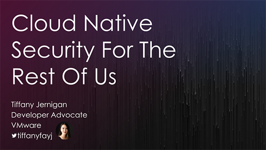
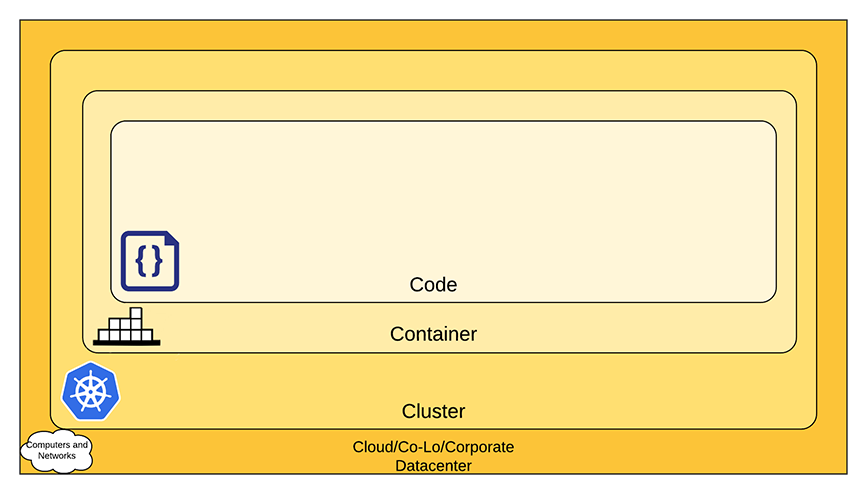

This blog is the first part of a three-piece blog that comes out of a (much more condensed and lighter) talk done at Open Source Summit and Cloud Native Security Con at KubeCon. You can find a video recording [here](https://www.youtube.com/watch?v=jWz-faPWmzE) and the slides [here](https://speakerdeck.com/tiffanyfay/cloud-native-security-for-the-rest-of-us).
 
[](https://speakerdeck.com/tiffanyfay/cloud-native-security-for-the-rest-of-us)

In modern applications that process information for thousands, or even millions of users, the impact of security breaches can be dramatic. It can be damaging for the brand (especially when it reveals negligent security postures). It can also cause significant harm to the users of the applications, including financial damage if for example, credit card or social security numbers are stolen (leading to potential identity theft) or even physical threats when the real addresses of users targeted by extremist groups are leaked.

Securing Cloud Native applications can seem daunting, because they have a larger footprint. Beyond the application itself, we also need to think about the platform that it runs on (for instance: Kubernetes clusters), the various cloud services that it leverages, and sometimes its entire software delivery pipeline: base container images, application dependencies, CI/CD platforms…

The principles of [Defense in depth](https://en.wikipedia.org/wiki/Defense_in_depth_(computing)) still apply to Cloud Native applications. This means that we won't rely on a single "silver bullet" solution, but rather on a whole host of defense mechanisms. Should one of these mechanisms fail or be actively defeated by a persistent attacker, that attacker will have to deal with multiple layers of defense, hopefully giving us enough time to notice the intrusion and stop it in its tracks.

Of course, there are entire parts of the security landscape that change drastically when we use "the cloud" instead of old-fashioned data centers. For instance, physical access to servers is no longer a concern of ours. It is, however, a concern for our cloud provider; and we should ensure that the provider's posture on these matters is adequate. And to stick to this particular example, instead of securing physical access to our servers, we need to secure our cloud API keys, which typically involves learning how to use the provider-specific user- and permission-management APIs and services, as well as set up appropriate audit and access logs.

So where should we start?

In this first blog, we'll talk about the framework of the “4 C's of [Cloud Native Security](https://tanzu.vmware.com/cloud-native-security)” and discuss how to secure the lower layers of the stack: our cloud platform and Kubernetes clusters.

Then, in a [second one](/blog/cloud-native-security-for-the-rest-of-us-p2/), we will talk about securing our applications themselves; in particular in their usage of Kubernetes APIs, but also in the way that they're built.


## 4 C’s of Cloud Native Security

The “4 C's” are an interesting framework proposed by the Kubernetes documentation. They correspond to Code, Container, Cluster, and Cloud. (The last one can also stand for CoLo or Corporate Datacenter when running applications on premises.)



(source: https://k8s.io/docs/concepts/security/overview/)

It's worth noticing that these 4 C's also correspond to separation of concerns that may already be in place within some organizations or teams.

For instance, there are organizations where software development teams don't have to worry about containerizing their applications, because other teams will take care of writing and maintaining Dockerfiles, or [buildpacks](https://buildpacks.io/), or similar container image build systems (separation of the “Code” and “Container” layers); while in other organizations, developers are directly working with containers and are empowered to make changes to container images, thus empowering them to e.g. rapidly add, test, and deploy new dependencies and libraries.

Similarly, some organizations have a separate team to manage the Kubernetes infrastructure and expose it as a platform to other teams, while in other organizations, this responsibility falls on the Cloud or CoLo teams, or the other way around, is merged with the work from the “containerization” team.

This means that the recommendations given in the [Kubernetes documentation](https://kubernetes.io/docs/concepts/security/overview/) can be examined by the respective teams in charge of each layer. There, instead of having to deal with one very long list of guidelines, we have broken it down into four smaller lists that can be assigned to teams and units that already exist within our organization!


## Less is more
One good rule of thumb to achieve a better security posture is **less is more**. As in, the less you have, the more secure you can be.

*Write (and maintain!) **less code**.*

Try to favor existing solutions and libraries, especially the ones that are widely used, because these off-the-shelf solutions are likely to have more eyes on them, meaning that vulnerabilities and bugs are more likely to be found and patched in a timely manner. Unfortunately, this is not always a silver bullet, as we've seen with high-profile vulnerabilities in OpenSSL or Log4J; but on average it is a relevant strategy.

Be wary of temporary solutions and makeshift hacks that turn into legacy code and build up technical debt in the process. It is unfortunately very easy to gather “dead code” in monolithic applications. Microservices architectures and Cloud Native apps can help, because the temporary solutions can sometimes be hosted in separate microservices which will be easier to turn off when they're not necessary anymore (and might provide better insights on whether the code is still in use, how often, and by which other parts of the system).

*Give **fewer permissions**.*

When running applications on virtual machines and bare metal, most of us have learned (hopefully not the hard way!) to not run applications as "root", because a security vulnerability can then have catastrophic results. Interestingly, containers tend to mitigate the impact of "root exploits", because *root in the container* doesn't automatically translate to *root on the machine*.

That said, the general idea remains the same with Cloud Native apps: do not give the keys of the kingdom to every piece of code that we deploy!

Applications should only receive the strict minimum of permissions that they require to operate. For instance, if an app needs to upload files to an object store (like an S3 bucket), it should only have permissions to create objects; not to list existing objects, retrieve, or delete them; and the permissions should only extend to the required bucket, certainly not to all our buckets. This also means that production services should not be able to access pre-production or staging data and vice versa, for instance.

It's also a good idea to avoid unique, long-lived secrets and issue short-lived bound tokens instead. *Short-lived* tokens (that are automatically rotated every hour or even every few minutes) reduce the risk of accidental leaks of credentials, in the sense that if a token is accidentally shared during a debugging session, or included into a backup or snapshot, it won't constitute a security risk (at least, not a long term one) because the token will quickly become invalid. *Bound* tokens (that are associated with a specific resource, for instance a Kubernetes Pod) also enhance security for two reasons. Firstly, they give us better audit trails, since they make it possible to know where the token comes from, or more precisely, for whom or what it was generated. Secondly, when their associated resource is deleted (for instance: Pod gets terminated), the token is automatically invalidated.

Since Kubernetes 1.24, Service Account tokens are automatically *bound tokens*, which results in an improved security posture without particular effort on our part. Yay!

*Have **fewer dependencies** to minimize the attack surface.*

Following the simple idea that “we don't have to worry about vulnerabilities for packages that we don't install”, you can use smaller base images for your containers. Distroless base images, e.g. [Chainguard Images](https://www.chainguard.dev/chainguard-images), can be helpful in that endeavor, as well as some interesting projects like [Docker Slim](https://dockersl.im/). Some folks also favor using Alpine-based images, since the tooling that they provide is simpler, while they also typically yield significantly smaller images.


## Building and operating a secure platform
If you deploy your applications to Kubernetes (which is certainly the case for a lot of Cloud Native apps!), you will need to make sure that your Kubernetes cluster (or *clusters* since it's likely that you will have more than one!) are secure. Here are some recommendations and guidelines in that area.


### Managed >> DIY
"Running Kubernetes" is a lot of work. Setting up and configuring the control plane and the nodes, managing upgrades for these components, issuing and renewing the certificates that secure communications within the control plane and with the nodes, picking the right CNI plugin, storage solution, and so much more!

Unless there is a strong imperative that forces you  to run everything yourself, try to avoid it. Instead, we suggest that you **use a managed Kubernetes offering**. Managed services take care of a _lot_ of the work for you. Security and hardening is one of the primary value-adds for cloud platforms. And if you truly need to run on premises (for instance if you're safekeeping nation state secrets, military intelligence, or operate nuclear plants or similar high-stakes environments), try to hire specialists to do it for you, or at least help you along the way.


### Securing control planes and nodes
Let's review a few things that we can do to secure our Kubernetes clusters.

**Make sure that the only way to interact with the control plane is  via Kubernetes APIs**. This means that if you're running Kubernetes yourself, you should make sure that the control plane is properly isolated from other workloads. The less you have running on your control plane servers, the fewer potential avenues an attacker can exploit to gain access to your cluster.

**Restrict access to your nodes**. This is good advice whether you operate your cluster yourself or not, because even when running managed Kubernetes clusters, the nodes might be under your responsibility. Furthermore, there is a bigger variation in node deployment between providers; or rather, the variations are more visible. Some providers will let you SSH into your Kubernetes nodes; others won't. Some will even make it extra difficult for you to get SSH access into your nodes - not to block you, but to deter potential attackers. (Trivial example: if nodes don't run SSH servers, it's harder for you to get a shell there; but it's also harder for an attacker!)

What kind of damage can be done by someone with shell access to the node? If they have non-privileged user access, they might be able to access the cloud metadata server (see next paragraph). It might also give them a foothold to try and escalate to root privileges. If someone has root privileges, or if they have a way to read the node's files (for instance, with hostPath volumes and the like), they may obtain the node's credentials and impersonate the node. This can result in denial-of-service attacks, but also leak sensitive information, including secrets and config maps.


**If you have a cloud metadata server, never allow pods to access it directly**, because the cloud metadata server is typically used to hand out credentials and other sensitive information to the virtual machine. This would allow a pod to obtain credentials associated with the VM's service account, which may open the door to pretty scary vulnerabilities, depending on what permissions are tied to this service account. (For instance, can this service account manipulate network interface configurations? Attach/detach arbitrary volumes? Obtain bootstrap tokens that would then allow to add a fake node to the cluster?)

**Use valid TLS certificates** and don't skip TLS verification with `insecure-skip-tls-verify` because it will open the door to all kinds of man-in-the-middle attacks and other impersonation schemes! You can obtain certificates for free from e.g. [Let’s Encrypt](https://letsencrypt.org/). You can also use your own CA, but this can be a bit more involved since it'll require installing your root certificates in the certificate stores of various systems (nodes, pods…) and in some cases that's not possible (e.g. you may not be able to access the certificate store of control plane processes in a managed cluster). For the latter case, Kubenetes will often let you provide a CA bundle. For example, when setting up dynamic admission control webhooks, the webhook configuration manifest will have a `caBundle` field that will be necessary since if you host the webhook within the cluster, you may not be able to obtain a certificate signed by a public CA (given that the certificate subject would have to be something like `mywebhookservice.mynamespace.svc`). It's worth mentioning that operators like [cert-manager](https://cert-manager.io/) can automate that whole process and fill in that `caBundle` field for you, using a generated secret holding the TLS key and certificate used by the webhook.

**Don't use the same CA root for control plane components and API users!** While some control plane components like the Kubernetes API server itself use sophisticated authorizers implementing discrete permissions (meaning that users authenticating with certificates will only get access to what they're entitled to), other components like etcd use a binary, "all-or-nothing" model. This means that if you use the same CA cert to validate Kubernetes API clients and etcd clients, any user of your cluster will have *full access* to etcd, which would be catastrophic from a security standpoint. For more details (and other interesting stories), check out [Tabby Sable](https://twitter.com/TabbySable)’s talk, [PKI the wrong way](https://github.com/tabbysable/pki-the-wrong-way).  These attacks can be mitigated by [restricting access to etcd](https://kubernetes.io/docs/tasks/administer-cluster/securing-a-cluster/#restrict-access-to-etcd) as explained in the documentation, too.

**Use [Pod Security Standards (PSS)](https://kubernetes.io/docs/concepts/security/pod-security-standards/)** to restrict who can run pods with overreaching permissions. Without PSS, anyone who can run pods on your cluster can make use of potentially dangerous features and achieve privilege escalation. Here are a few examples of such features and how they can be exploited:
- `hostPath` volumes let the pod access arbitrary files on the node, including the TLS keys and certs of the node, or its SSH keys or other services' configurations. (You can see a trivial exploit of this feature in Jérôme Petazzoni’s [hacktheplanet.yaml](https://github.com/jpetazzo/container.training/blob/main/k8s/hacktheplanet.yaml), which gives an attacker root access to your nodes by installing an SSH key in the `authorized_keys` file of the root user.)
- `hostNetwork` together with `NET_ADMIN` and/or `NET_RAW` capabilities let the pod intercept and even generate arbitrary network traffic on the node. While this may or may not lead into a privilege escalation, it can be used to block monitoring, logging, and audit trails to cover up other attacks.
- the `privileged` flag altogether lets a pod do *absolutely whatever it wants* on the node, including accessing its entire memory space, loading kernel modules, and much more.
While these features can be useful to run some components of the cluster (like log collectors or CNI plugins) they should definitely not be available to regular applications pods.

Note that prior to PSS, Kubernetes was using [Pod Security Policies (PSPs)](https://kubernetes.io/docs/concepts/security/pod-security-policy/), but these were deemed too complex and hard to implement effectively. The Kubernetes Security Special Interest Group (SIG) developed PSS to replace them. Pod Security Policies were deprecated in Kubernetes 1.21 and removed in Kubernetes 1.25.


### Upgrading Kubernetes

**Update, update, update!***

Generally speaking, it's important to keep software up-to-date, and Kubernetes is no exception. We've seen way too many people running old versions of Kubernetes because they are either afraid of upgrading, or don't know how to do it. Here are some recommendations so that you can leave that group, and join those who run safe, up-to-date versions of Kubernetes! 

Kubernetes uses *semver* (semantic versioning) and there is an important difference between *patch releases* and *minor releases*.

*Patch release* upgrades (e.g. going from 1.24.X to 1.24.Y) carry very little risk (if at all) because these releases only fix bugs and security vulnerabilities. There is typically one patch release per month, and the occasional emergency release when there is a critical vulnerability that needs to be addressed as fast as possible. These releases don't introduce new features or change any behavior, and all APIs remain the same. It's always a good idea to upgrade to the latest patch release (especially when that release addresses security vulnerabilities) and it doesn't require any preparation or any updates in our manifests or client code.

*Minor release* upgrades (e.g. going from 1.X to 1.Y) require a little bit more planning, because the minor releases are the one that can introduce new features or change existing behavior. But as we will see a bit later, Kubernetes has fairly well documented policies about what may change in these minor releases, which helps us to plan and execute them very safely.

Kubernetes has been designed from the ground up so upgrades can be relatively seamless. Folks who have worked with early releases of OpenStack might remember when the recommended upgrade process was to create a new cluster, migrate everything to that new cluster, then delete the old cluster. This is definitely not the case with Kubernetes, because components of different versions are interoperable within a well-defined [version skew policy](https://kubernetes.io/releases/version-skew-policy/). To keep it simple: patch releases are always interoperable (so 1.24.X will always work together with 1.24.Y), and the API server supports clients of the previous minor release (meaning that API server 1.24.X will work with clients 1.24.Y but also 1.23.Y). Note that the policy is actually a bit more lax, but if you can remember that rule, you will probably understand why it allows seamless upgrades of Kubernetes clusters: the API server gets upgraded first, and then every other component follows. That's it!

In practice, if you're using a managed Kubernetes cluster, upgrading the control plane is just a couple of button clicks (or API calls) away. Sometimes it can even be done automatically without intervention, ensuring that your cluster will get patched quickly if a vulnerability appears.

On self-hosted Kubernetes, you will of course have more work to do; but if you are using a Kubernetes distribution (like [VMware Tanzu Kubernetes Grid](https://tanzu.vmware.com/kubernetes-grid) or Kubespray) the distribution will handle a lot of the work for you.

As mentioned earlier, minor release upgrades require a bit more planning. First, they should be done one at a time - i.e., to go from 1.22 to 1.25, one must go through 1.23 and 1.24 first. Then, if you use beta API groups (anything that looks like `apiVersion: xxx/vXbetaY`, e.g. `networking.k8s.io/v1beta1`), these might evolve or even get deprecated - as mentioned above with, for instance, the Pod Security Policies that got deprecated then removed a few versions later.

This means that before upgrading their cluster, one should make sure that they don't use API groups that are about to be deprecated. This is made abundantly clear when you e.g. `kubectl apply` some manifests: you will get explicit warning messages telling you if the manifest is deprecated, and if so, in which version its support will be removed.

As an example, let's look at what happened when Ingress resources evolved from `networking.k8s.io/v1beta1` to `networking.k8s.io/v1`.

The stable version (`networking.k8s.io/v1`) was introduced in Kubernetes 1.19, and from that version, using the old version (`networking.k8s.io/v1beta1`) would give a big heavy warning:
```
Ingress networking.k8s.io is deprecated AND WILL BE REMOVED IN 1.22
```
(The all caps emphasis is ours. :))

This doesn't mean that you need to drop everything else that you were doing and update your YAML manifests; but you definitely need to do it before upgrading to 1.22 - otherwise, at that point, your Ingress resources won't work anymore.

It can be reassuring to realize that both old and new resource versions are supported during the whole deprecation window, i.e. in Kubernetes 1.19, 1.20, and 1.21. Kubernetes 1.19.0 was released in August 2020, and Kubernetes 1.22 one year later, in August 2021. This means that (assuming you'd always be running the latest-and-shiniest version of Kubernetes) you had a whole year to update. That's plenty of time! But wait: Kubernetes 1.21 kept receiving updates until its "end-of-life" date, which was June 2022, so almost one extra year.

If you run multiple clusters in different environments, with different versions, this gives you two options:
1. Keep a single manifest version. In that case, you can't mix pre-1.19 and post-1.21 clusters. You must wait until you updated your oldest cluster to (at least) 1.19; then update your manifests' versions; then you can upgrade your newest clusters to 1.22 and above.
2. If you want to mix pre-1.19 and post-1.21 clusters, then you will need to maintain two manifest versions.

Bottom line: when breaking changes happen in the Kubernetes API, we get ample warning and at least a year to adapt our manifests. Don't procrastinate and wait until the last minute to update your manifests! Keep in mind that when an API evolves, the newer version is generally easier to use, or offers new interesting features. Likewise, when an API is replaced by a different one (like the PSP/PSS example given above) it significantly improves the usability and security of the system in the process.

That being said, how "recent" of a Kubernetes version should we be running? We already mentioned that we should run the latest patch release; but what about minor releases? As long as your minor release is still *supported* (meaning: receives bug fixes and security patches), you're fine; and each minor release train is now supported for at least a year. A good rule of thumb is to target the latest patch release of the second-to-last minor release:
- Latest patch release because they have all the security and bug fixes;
- Second-to-last minor release because the very last release might still be considered "bleeding edge" by some folks - especially at patch release zero (e.g. 1.26.0).

A silver lining of staying up-to-date is that the more often you upgrade your cluster, the easier it is to do it when there is an urgent patch to address a CVE.


### Isolating Network Resources
A common misconception on Kubernetes is that applications running in different namespaces are isolated from each other; but they are not! By default, on Kubernetes, every pod can talk to every other pod. If we want to isolate pods, we need [network policies](https://kubernetes.io/docs/concepts/services-networking/network-policies/).

Network policies can be used to control what kind of traffic can *enter* selected pods (*ingress rules*) but also what outbound traffic is allowed to *leave* selected pods (*egress rules*). It is fairly common to set up ingress rules to ensure that internal APIs or databases will only accept connections from pods belonging to the same application or within the same security perimeter. It is also possible to isolate a namespace from the rest of the cluster with a single network policy if you want your namespaces to act as a network security boundary. Implementing policies modeled after e.g. AWS security groups is also possible, if it's a model that you're familiar with, thanks to the ability for network policies to use label selectors to designate traffic sources and destinations. Egress rules are more rarely used than ingress rules, but can help to prevent or at least slow down exfiltration of sensitive data by making it harder to get anything out of a pod in case of successful intrusion.

Keep in mind that Kubernetes also assumes that you trust the underlying network, for example, the network fabric of your cloud provider. If you don't - either for compliance reasons, or because you run in a network environment that is potentially hostile or shared with other tenants - one way to address it is to setup a service mesh with full end-to-end encryption with e.g. mTLS.  Some folks would argue that if you set up end-to-end encryption atop your cloud fabric, it means that your threat model includes many other "interesting" factors!

You can also go the extra mile and use tools like [Cilium](https://cilium.io/) that implement advanced network policies and go beyond address/port based filters thanks to the eBPF framework. For instance, with Cilium, you can apply filters on  specific API routes. This would allow pod `client-frontend-xyz12` to issue requests to `http://user-api/v1/users` but not to `http://user-api/v1/billing`. This takes the filtering abilities to layer 7 instead of layer 4!

### What's next?
We covered a lot of ground in this first post. This is definitely a lot of information! If you appreciate that form factor and were able to follow along all these explanations, fantastic! We hope you'll enjoy the next blog post just as much. As a reminder, you would like a lighter version of that content, check out the Open Source Summit [recording](https://www.youtube.com/watch?v=jWz-faPWmzE) and/or [slides](https://speakerdeck.com/tiffanyfay/cloud-native-security-for-the-rest-of-us); but these long-form blog posts carry *many* more details. One last thing: Kubernetes evolves constantly, and so does our knowledge about it; so if you are a reader from the future, keep in mind that most of this was written at the end of 2022, just before the release of Kubernetes 1.26.

*In the [second part](/blog/cloud-native-security-for-the-rest-of-us-p2/) of this series, we'll move away from the platform and closer to our applications and talk about managing permissions, secrets, and much more!*

[**→ PART 2**](/blog/cloud-native-security-for-the-rest-of-us-p2/)