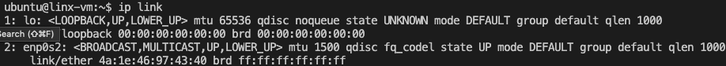
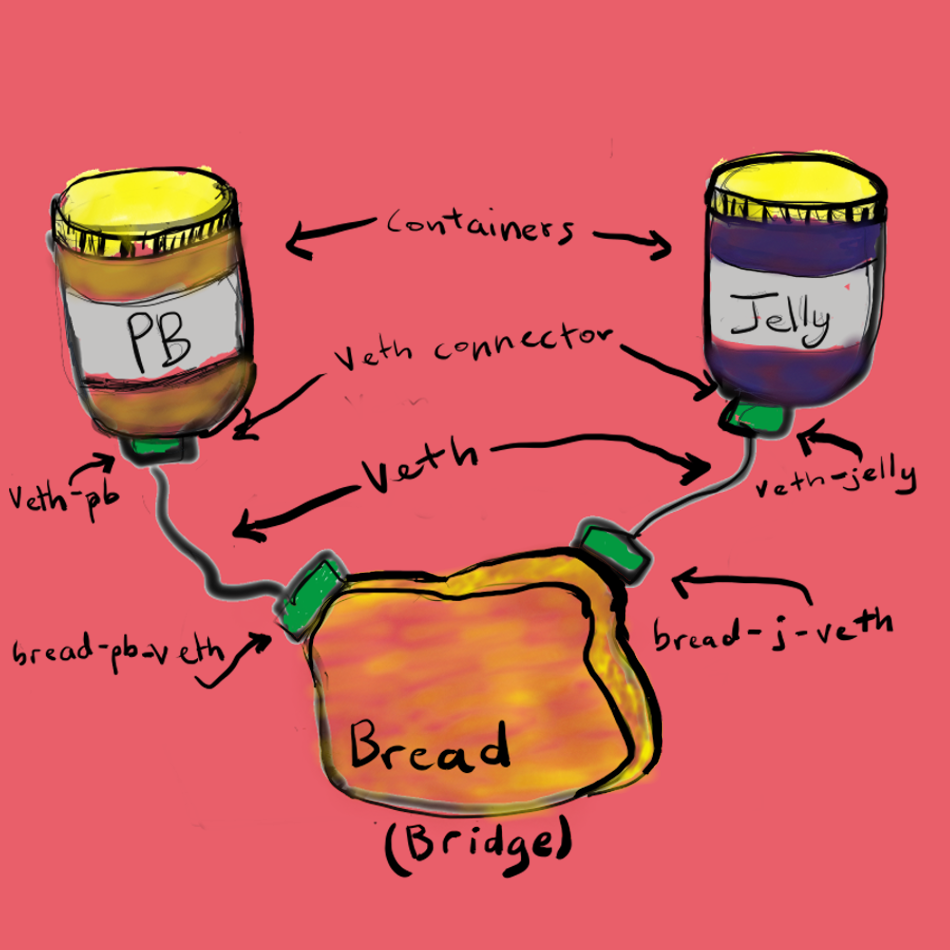

Understanding the way containers communicate will make your life easier in many ways. Technologies like Kubernetes and Docker abstract away details that make containers special, but can also abstract away intuition and understanding. Without that knowledge, challenges arise—educated problem-solving adds confidence to decision-making!   

In this post, we will demystify containers and cover some networking basics by explaining how to create two rudimentary containers and connecting them with a virtual network so they can talk to each other. The host machine, which is the machine where the network lives, views this network as if it were completely external. So, we will connect the network to the host. We’ve also included a bonus section about connecting the network to the internet so your containers can reach Google. You do not need a Linux machine to run through the exercises. 


## Containers and Networks: What Are They?

A container can be considered synonymous with a Linux network namespace. Keep this in mind. Essentially, a container **is** a namespace. 

Each container runtime uses a namespace differently. For example, containers in [Docker](https://docs.docker.com/get-started/overview/#the-underlying-technology) get their own namespace, while in CoreOS’ [rkt](https://coreos.com/rkt/docs/latest/networking/overview.html), groups of containers share namespaces, each of which is called a pod.

Containers are based on Linux networking, and so insights learned in either can be applied to both. You can apply these concepts to anything with Linux, including containers, VMs, computers, servers, the cloud, IoT, Raspberry Pi, and supercomputers. 

When you think of networking, you might think of applications communicating over HTTP, but actually a network refers more generally to a group of objects that communicate with each other by way of their unique addresses. The point is that networking refers to things communicating with things, and not necessarily an application or a container — it could be any device.

One way to connect two containers is to create a virtual network. One way to do this is by creating two namespaces and two virtual ethernet cables. Each cable should be attached to a namespace on one side, and on the opposite end be united by a bridge, to complete the network.   

Now that we have defined containers are Linux namespaces, let’s see how the two  go together like pb and jelly.

---


### View Interfaces on Your Host

If you do not have access to a Linux operating system or don’t want to use what is available, you can install Multipass to easily spin up a virtual machine (VM). It’s a decent solution for what we are doing. A lot of the commands below have sudo prepending them due to Multipass.


*   [Multipass MacOS Install](https://multipass.run/docs/installing-on-macos)
*   [Multipass MacOS Install](https://multipass.run/docs/installing-on-linux)
*   [Multipass Windows Install](https://multipass.run/docs/installing-on-windows)

To install using Homebrew:

```

brew cask install multipass

```

Now spin up a VM with the name ‘linux-vm’ with Ubuntu using the following command:

```

multipass launch -n linux-vm

```

To list the VMs in Multipass, use the command `multipass list`.

To enter into a shell in your VM, use the following:

```

multipass shell linux-vm

```

---


### View Interfaces on Your Host

To see the interfaces on your host, enter:

```

ip link list

```

This should print out the devices that are available; any networking device that has a driver loaded can be classified as an available device. In the output, you might see devices like `lo` and `enp0s2`. The `ip link` command will also output two lines for each device, the link status, and the characteristics.



### Create Your Namespaces

A network namespace is another copy of the network stack, with its own routes, firewall rules, and network devices. A process inherits its network namespace from its parent by default.	

Let’s create two network namespaces: `pb` and `jelly`.

```

sudo ip netns add pb

sudo ip netns add jelly

```

Once they are added you can view them with `ip netns list`.

You now have a very simple container that can’t do much at the moment. To get more functionality you can connect the namespaces using a veth device. 


### Create a Virtual Ethernet Cable for Each Namespace

A veth device is a virtual ethernet device that you can think of as a real ethernet cable connecting two other devices. Virtual ethernet devices act as tunnels between network namespaces. They create a bridge to a physical network device in another namespace. Virtual ethernets can also be used as standalone network devices as well. 

Veth devices are always created in interconnected pairs where packets transmitted on one device in the pair are immediately received on another device. When either device is down, the link state of the pair is down as well.

In our example, we are creating two veth pairs. The jelly namespace will connect to the veth-jelly end of the cable, and the other cable end should attach to a bridge that will create the network for our namespaces. We create the same cable and connect it to the bridge on the pb side.





To create both veth pairs, use the command:

```

sudo ip link add veth-pb type veth peer name bread-pb-veth

sudo ip link add veth-jelly type veth peer name bread-j-veth

```

Now when you look at the devices you will see your veth pairs on the host network.

```

ip link list

```


### Attach the Veth Cables to Their Respective Namespaces

Now that we have a veth pair in the host namespace, let's move the jelly and pb sides of the cables out into the jelly and pb namespaces. 

```

sudo ip link set veth-pb netns pb

sudo ip link set veth-jelly netns jelly

```

If you check `ip link list` you will no longer find `veth-pb` and `veth-jelly` since they aren’t in the host namespace.

To see the ends of the cable you created, run the `ip link` command within the namespaces:

```

sudo ip netns exec jelly \

ip link

sudo ip netns exec pb \

ip link

```


### Assign IP Addresses to Each Namespace

Since we keep using `ip` commands, you might be wondering what the IPv4 addresses are. Let's quickly retrace our steps to make sense of it all.  

You began by creating two namespaces, then a virtual ethernet cable. Then you connected the devices to the cable. 

Now, in order to create an IP address for the jelly namespace, use the `ip address add` command for the device jelly:

```

sudo ip netns exec jelly \

ip address add 192.168.0.55/24 dev veth-jelly

sudo ip netns exec jelly \

ip link set veth-jelly up

```

Similarly, assign an address to pb as well:

```

sudo ip netns exec pb \

ip address add 192.168.0.56/24 dev veth-pb

sudo ip netns exec pb \

ip link set veth-pb up

```

Check the interfaces in the namespaces. Verify if they are correct with the upcoming command. You are looking for the interfaces that you created:

- `veth-pb` 

- `veth-jelly`

Make sure they have the IP addresses that you set. 

```

sudo ip netns exec jelly \

ip addr

sudo ip netns exec pb \

ip addr

``` 


### Bridge the Gap Between Namespaces

You now have both the IPs and interfaces set, but you can’t establish communication with them.  That’s because there’s no interface in the default namespace that can send the traffic to those namespaces, and we didn’t configure addresses to the other side of the veth pairs or configure a bridge device. But with the creation of the bridge device, we’ll be able to provide the necessary routing to properly form the network.

So now, create your bridge. I called mine brd1, for the bread needed for our pb and jelly sandwich.

```

sudo ip link add name brd1 type bridge

# set the interface

sudo ip link set brd1 up

```

To check if the device was created, execute `ip link`.

With your bridge device set, it's time to connect the bridge side of the veth cable to the bridge.

```

sudo ip link set bread-pb-veth up

sudo ip link set bread-j-veth up

```

You can add the bread veth interfaces to the bridge by setting the bridge device as their master.

```

sudo ip link set bread-pb-veth master brd1

sudo ip link set bread-j-veth master brd1

```

To verify:

```

bridge link show brd1

```

Try pinging pb’s IP 192.168.0.56 from the jelly namespace. Use `ctrl + C` to exit.

```

sudo ip netns exec jelly \

ping 192.168.0.56

```

You have now united pb and jelly, the two “containers” you created. 


## Bonus: Connect Your Containers to the Host and the Internet

If you try to `ping 192.168.0.56` from the host it won't work because the namespace doesn't have visibility to the global scope. As far as the namespaces are concerned, they are isolated on their own machine. 

In order to access the namespaces directly from the host namespace, set the address of the bridge device bread

```

sudo ip addr add 192.168.0.60/24 brd + dev brd1

```

Now you can ping the namespaces directly from the host!

```

ping 192.168.0.56

```

If you try to reach the internet from one of the namespaces, however, it will not work.

```

ip netns exec pb \

ping 8.8.8.8

```

The connection to the internet doesn't work because we haven't set a default gateway. The default gateway is the node you send every network packet that doesn't have an explicit route. Without a default gateway, your network doesn't know what to do with the packets it receives. 

First, add a default gateway to the bridge:

```

sudo ip -all netns exec \

        ip route add default via 192.168.0.60

```

Now check how the routing table looks inside your namespaces:

```

sudo ip netns exec jelly \

        ip route

sudo ip netns exec pb \

        ip route

```

You can now connect to the internet, but can't send or receive packets. To receive packets, configure Network Address Translation (NAT) with Masquerade. Masquerading allows machines to invisibly access the Internet via the Masquerade gateway, whereas a NAT can hide private addresses from the internet.

Lets add a new `iptables` rule in the POSTROUTING chain of the NAT table to receive packets.

```

  sudo iptables \

                -t nat \

                -A POSTROUTING \

                -s 192.168.0.60/24 \

                -j MASQUERADE 

```

Here is a breakdown of the above flag:


*   -t marks the table commands should be directed to
*   -A specifies that we're appending a rule to the chain
*   -s specifies the source address 
*   -j is the action being performed

Now enable packet forwarding with IPv4 ip forwarding:

```

sudo sysctl -w net.ipv4.ip_forward=1

```

And now try to reach the internet from one of your namespaces:

```

sudo ip netns exec jelly \

ping 8.8.8.8

```

You should now have complete connectivity. The host can direct traffic to a namespace, and therefore microservices within, and vice-versa. And applications in the namespace can now communicate with each other and access the internet. 

You were able to create two containers and a virtual network from scratch! You have gained a more intuitive and intimate understanding of containers and Linux networking concepts, tools, and commands. Creating a container was as easy as one command ` ip netns add pb` to create your namespace. 

Keep a lookout on the VMware Tanzu Developer website for upcoming articles. A great resource to learn more about container networking is [the Container Network Interface](https://github.com/containernetworking/cni), where you can learn how the community is standardizing container networking standards. And if you are inspired you can contribute or create your own plugin!


## TL;DR or Troubleshooting help

If you just want to run a script and check the status after or get stuck check out this [script](https://github.com/everythingeverywhere/networking-basics).

### Sources:

[Image from @freddygthatsme](https://unsplash.com/photos/1i1zPbkQJNg)

[CNI Spec](https://github.com/containernetworking/cni/blob/master/SPEC.md) 

[Using network namespaces and a virtual switch to isolate servers](https://ops.tips/blog/using-network-namespaces-and-bridge-to-isolate-servers/)

[Linux Switching – Interconnecting Namespaces](https://www.opencloudblog.com/?p=66)

[Linux man pages online](https://www.man7.org/linux/man-pages)

[Intro to Container Networking](https://rancher.com/learning-paths/introduction-to-container-networking/)