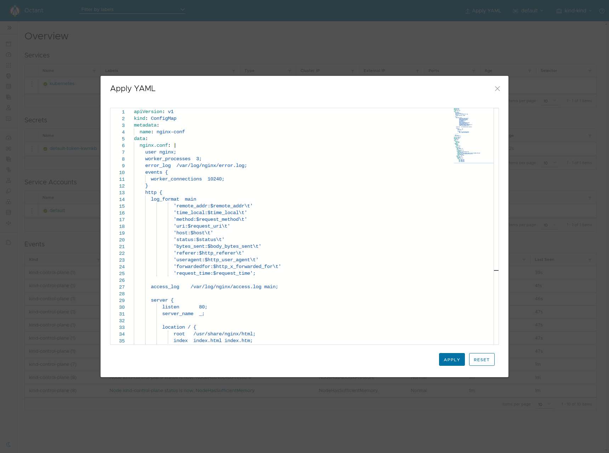
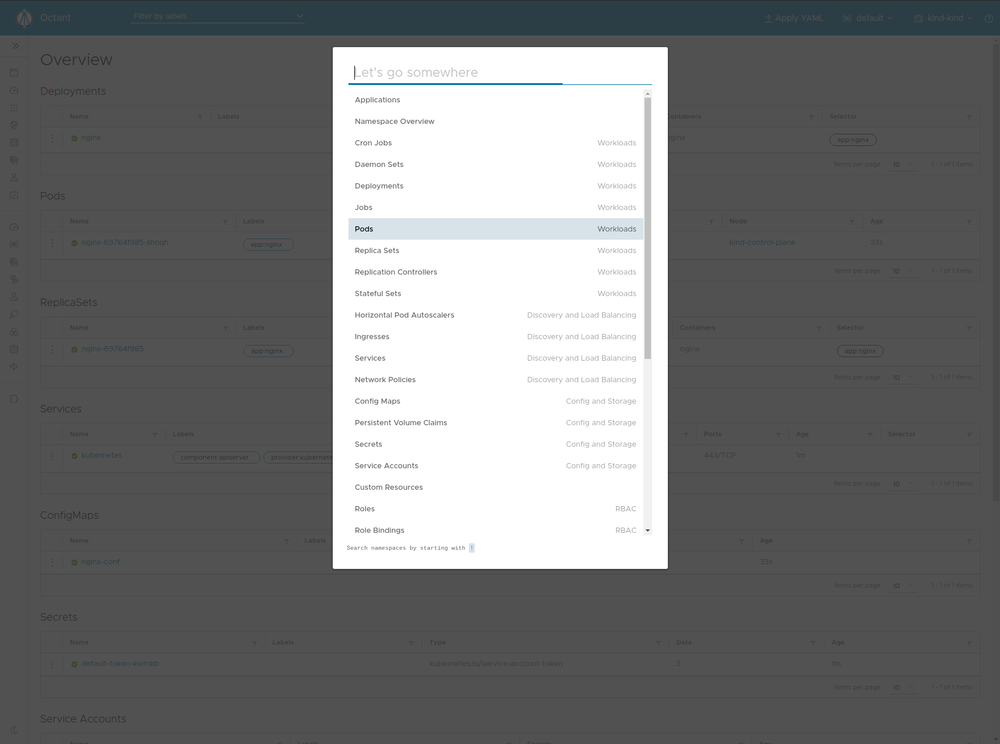
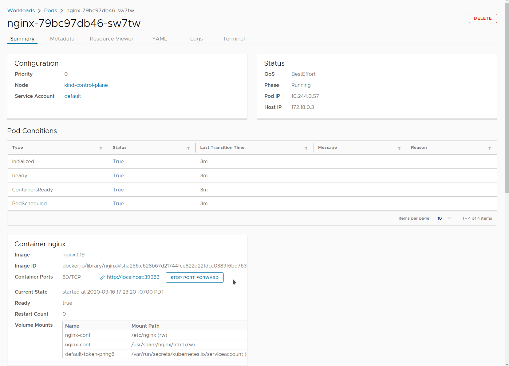
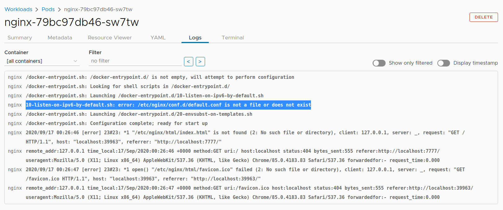
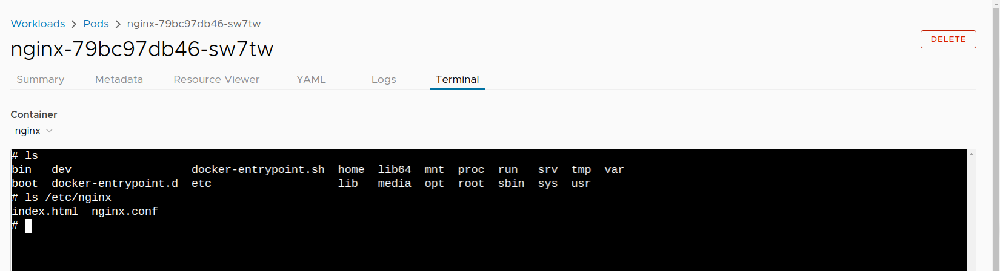
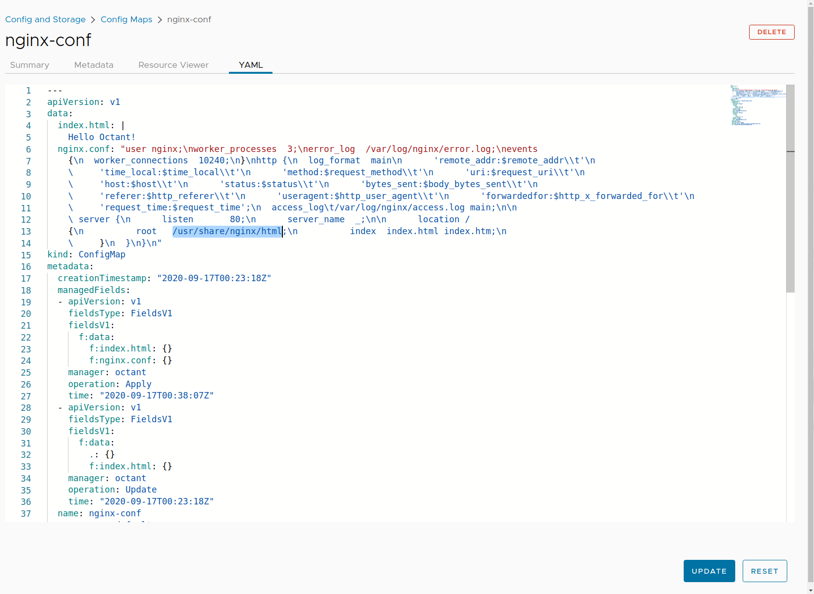
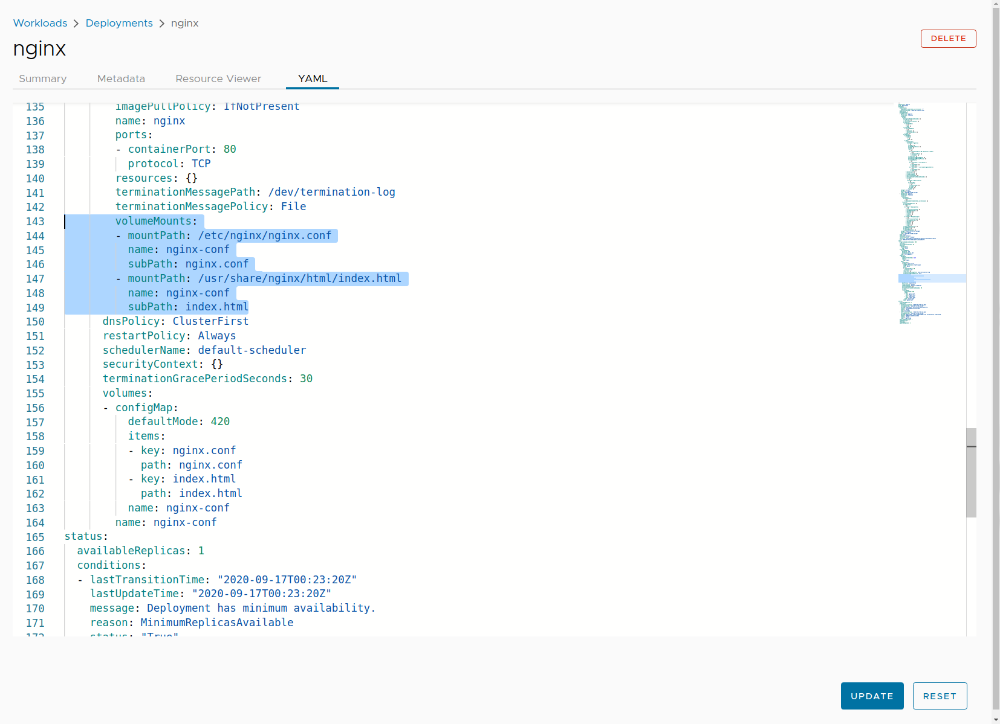
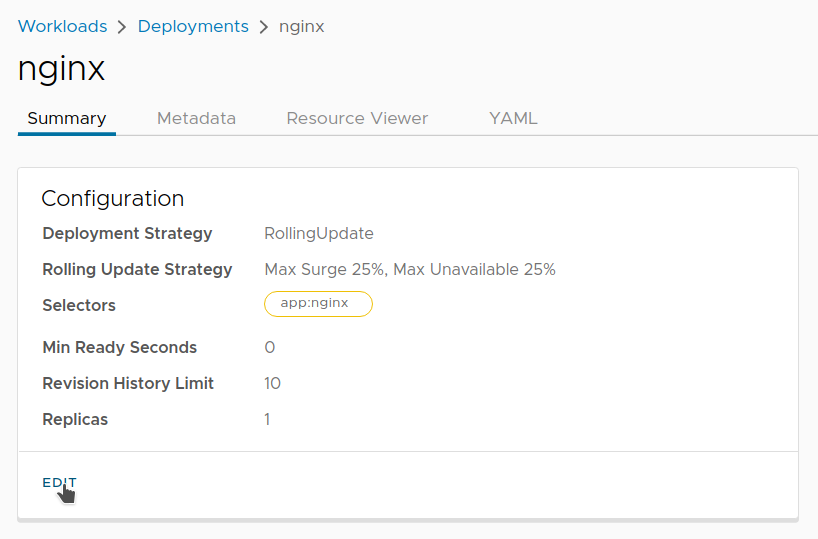

Octant is a tool designed to enable developers without a deep knowledge of Kubernetes to become productive as quickly as possible. This post will walk through an NGINX deployment with a faulty NGINX configuration to demonstrate how common pitfalls can be identified using Octant. 

## Before You Begin

Before you get started, here are the  tools you’ll need:

- An existing cluster through [KinD](https://kind.sigs.k8s.io/docs/user/quick-start/), [Minikube](https://kubernetes.io/docs/tasks/tools/install-minikube/), or a cloud provider
- An installation of [Octant](https://github.com/vmware-tanzu/octant/releases) 0.16.1 or above
- Some knowledge of NGINX  (helpful but not required)

## Create an NGINX Deployment

Let’s start with a ConfigMap containing a basic NGINX configuration and set the mount path to `/etc/nginx`. A deployment will mount the volume containing the NGINX configuration for the container. Copy the YAML below.

```yaml
apiVersion: v1
kind: ConfigMap
metadata:
  name: nginx-conf
data:
  nginx.conf: |
    user nginx;
    worker_processes  3;
    error_log  /var/log/nginx/error.log;
    events {
      worker_connections  10240;
    }
    http {
      log_format  main
          'remote_addr:$remote_addr\t'
          'time_local:$time_local\t'
          'method:$request_method\t'
          'uri:$request_uri\t'
          'host:$host\t'
          'status:$status\t'
          'bytes_sent:$body_bytes_sent\t'
          'referer:$http_referer\t'
          'useragent:$http_user_agent\t'
          'forwardedfor:$http_x_forwarded_for\t'
          'request_time:$request_time';
      access_log	/var/log/nginx/access.log main;

      server {
          listen       80;
          server_name  _;

          location / {
              root   html;
              index  index.html index.htm;
          }
      }
    }
  index.html: |
    Hello Octant!
---
apiVersion: apps/v1
kind: Deployment
metadata:
  name: nginx
spec:
  selector:
    matchLabels:
      app: nginx
  replicas: 1
  template:
    metadata:
      labels:
        app: nginx
    spec:
      containers:
      - name: nginx
        image: nginx:1.19
        ports:
        - containerPort: 80
        volumeMounts:
        - mountPath: /etc/nginx
          name: nginx-conf
        - mountPath: /usr/share/nginx/html
          name: nginx-conf
      volumes:
      - name: nginx-conf
        configMap:
          name: nginx-conf
          items:
            - key: nginx.conf
              path: nginx.conf
            - key: index.html
              path: index.html
```

Open Octant and press the "Apply YAML" button on the top menu. Paste the YAML into the editor and hit "Apply".



After the YAML is applied, press `Ctrl + Enter` to open the quick switcher. Type “pod,” then navigate to the list of pods by clicking the drop-down. This shortcut is also useful for navigating around various resources.

 

Upon initial inspection, the container is running. Click the name of the pod  for more information, including the volume mounts included above.

## Port Forward

The first step is to see if the NGINX landing page is visible, for which port forwarding provides a quick way to test. Click the port forward button, then click the generated link.

 

The port forward link leads to a 404 page. To see if the container logs provide any insight about that error, look under the "Logs" tab

## Logs


 
The logs show startup then the initial traffic as a result of port forwarding. And as they make clear, there are two issues with this configuration:

1. There appears to be a default configuration `default.conf` that does not exist.
2. The provided path for `index.html` is not correct.

An NGINX container would typically have all the necessary default configuration files. As to the second issue, NGINX by default has `index.html `located at `/usr/share/nginx/html`. The terminal tab provides a way to inspect the application on a lower level so as to understand some of the logging.

## Terminal

Click the Terminal tab to start a new terminal session and list the files in `/etc/nginx`.  As you’ll see, quite a few configuration files are missing from the expected [directory structure](https://wiki.debian.org/Nginx/DirectoryStructure).



The mount path overwrites the entire directory even though only a single configuration file needs to change. The [Kubernetes documentation](https://kubernetes.io/docs/tasks/configure-pod-container/configure-pod-configmap/#add-configmap-data-to-a-volume) describes this behavior. Overwrites can be avoided by specifying a [`subPath`](https://kubernetes.io/docs/concepts/storage/volumes/#using-subpath). This also prevents copying `index.html` to unnecessary places.

Navigate to the `nginx-conf` ConfigMap (remember the quick switcher shortcut). Then navigate to the YAML tab. Under `nginx.conf`, change `html` under “location” to `/usr/share/nginx/html`.



Navigate to the YAML of the `nginx` deployment. Edit the volume mounts to add `subPath` and update `mountPath` to the name of the configuration.



This updated deployment will automatically create a new pod. If you port forward this newly created pod, the expected homepage of `Hello Octant!` should be visible.

## Updating a ConfigMap

Let’s update `index.html` in the ConfigMap and apply the changes.

```yaml
...
  index.html: |
    Hello Octant v1!
...
```

A developer unfamiliar with Kubernetes might expect the deployment to use the new ConfigMap; however, this is not the case. We can verify the old `index.html` is in use if we port forward the existing pod. Try navigating into the `nginx` deployment, then edit the configuration to increase the number of replicas. The new pods created will use an updated ConfigMap, which can be confirmed via port forwarding.


 
Octant provides various features designed to be used together to understand workflows on a cluster. In this scenario, you’ve used a number of debugging features with minimal knowledge of `kubectl` as a way to understand potentially counterintuitive behaviors.

As you grow and add opinionated tooling into scope, Octant can continue providing value through an extensible plugin system as a toolbox for the growing ecosystem.