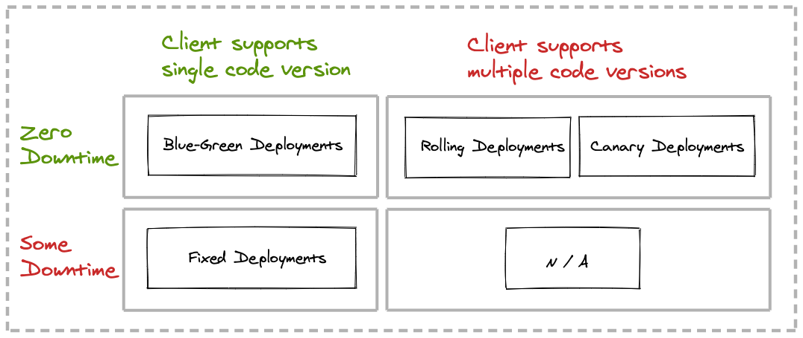
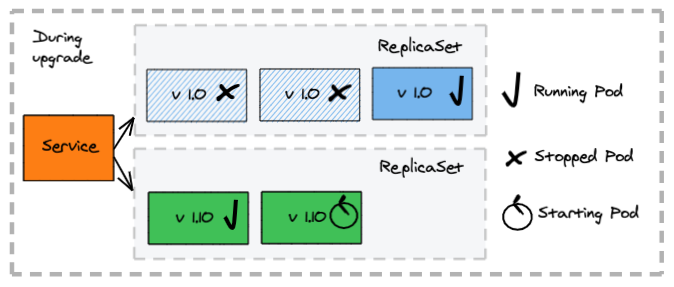
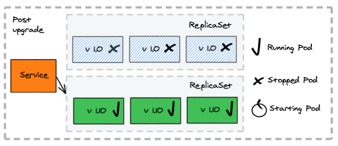
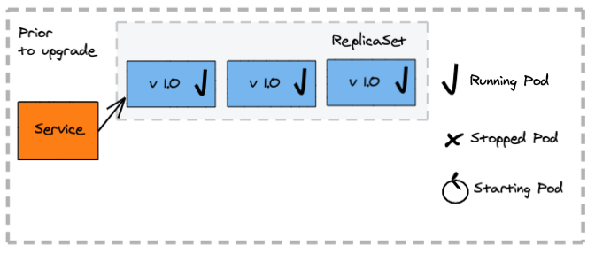
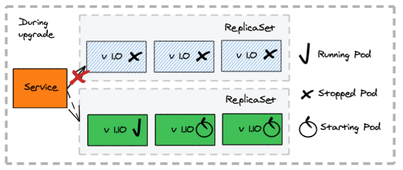
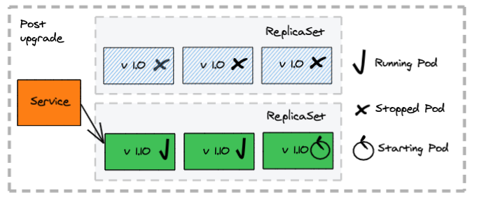
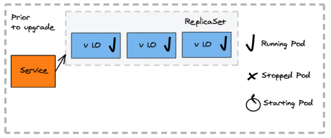
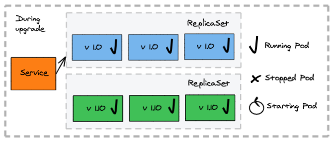
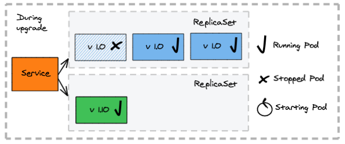

Your cloud-native application has been designed, built, and tested locally, and now you're taking the next step: deployment to Kubernetes.

Isolated environments can be provisioned as namespaces in a self-service manner with minimal human intervention through the Kubernetes scheduler. However, as the number of microservices increases, continually updating and replacing applications with newer versions, along with observing and monitoring the success/failure of deployments, becomes an increasing burden.

Deployment processes are performed while allowing for zero or some downtime, at the expense of increased resource consumption or support of concurrent app versions.

What options do you have to turn deployments into a predictable, repeatable, consistent, easy to observe process? Kubernetes  with declarative deployments.


## What Are Declarative Deployments in Kubernetes?

The concept of deployment in Kubernetes encapsulates the upgrade and rollback processes of a group of containers and makes its execution a repeatable and automated activity.

The declarative nature of a Kubernetes deployment allows you to specify how the deployed state should look, rather than the steps to get there. Declarative deployments allow us to describe how an application should be updated, leveraging different strategies while allowing for fine-tuning of the various aspects of the deployment process.

The core of the deployment is centered around its ability to start and stop pods in a predictable manner. In turn, containers respect cloud best practices and listen to and honor lifecycle events or provide health-check endpoints.


## How Do You Pick the Best Deployment Pattern for Your App?

As the number of microservices in the organization increases, so do the number of microservice clients e and the complexity of the interconnected services. The approach to be taken centers primarily on two discriminating factors:

- Can your application allow for any downtime?
- Can the clients of your application handle concurrent provider application versions?


Let's introduce a simple decision matrix for declarative deployments, then look at each of the patterns individually.

1. [Rolling deployments](#1)
2. [Fixed deployments](#2)
3. [Blue-green deployments](#3)
4. [Canary deployments](#4)



A sample application, including step-by-step instructions, source code, and Kubernetes deployment configurations for all four deployment patterns can be found on [GitHub](https://github.com/ddobrin/declarative-deployments-k8s).

## Rolling Deployments {#1}

#### Pros:
- Zero downtime during the update process
- Ability to control the rate of a new container rollout

#### Cons:
* During the update, two versions of the container are running at the same time

#### How does it work:
- Creates a new replica set and the respective pods
- Replaces the old containers with the previous application version with the new ones
- Allows you to control the range of available and excess pods


  


  

  

#### The deployment configuration
The deployment uses the `RollingUpdate` strategy and allows full control over how many instances of the `my-app` application can be unavailable at any given moment in time:

```yaml
kind: Deployment
metadata:
  name: my-app
spec:
  replicas: 3
  strategy:
    type: RollingUpdate
    rollingUpdate: 
      maxSurge: 1
      maxUnavailable: 1
  selector:
    matchLabels:
      app: my-app
  template:
    metadata:
      labels:
        app: my-app
...        
```

The service selects all nodes for the `my-app` application matching the label:

```yaml
kind: Service
metadata:
  labels:
    app: my-app
  name: my-servappice
  namespace: default
spec:
...
  selector:
    app: my-app
  type: NodePort
```

## Fixed Deployments {#2}

#### Pros:
- Single versions serve requests at any moment in time
- Simpler process for service consumers, as they do not have to handle multiple versions at the same time

#### Cons:
* Downtime while old containers are stopped and the new ones are starting

#### How does a fixed deployment work?
- Stop all containers deployed for the old application version first
- Clients experience an outage, as no application instance is available to process requests
- Create the new containers
- Client accesses requests serviced by the new application version


  

  

  

#### The deployment configuration
The deployment uses the `Recreate` strategy as it terminates all pods from a deployment before creating the pods for the new version of the `my-app` application:
```yaml
kind: Deployment
metadata:
  name: my-app
spec:
  replicas: 3
  strategy:
    type: Recreate
  selector:
    matchLabels:
      app: my-app
...        
```

The service selects all nodes for the `my-app` application matching the label:

```yaml
kind: Service
metadata:
  labels:
    app: my-app
  name: my-app
  namespace: default
spec:
...
  selector:
    app: my-app
  type: NodePort
```

## Blue-Green Deployments {#3}

#### Pros:
- Single application versions serve requests at any moment in time
- Zero downtime during the update
- Allow precise control of switching to the new application version


#### Cons:
- Require twice the capacity while both blue and green versions are up
- Manual intervention for switching versions

#### How does a blue-green deployment work?
- A second deployment is created manually for the new version (green)
- The new version (green) does not initially serve client requests  but can be tested internally to validate the deployment
- The service selector in K8s is updated to route traffic to the new version (green), followed by the removal of the old (blue) deployment


  

  

  

#### The deployment configuration
The deployment does not provide a specific strategy, as the service exposing the deployment is the K8s resource participating in the deployment process, which selects which pod instances are exposed to client requests. In this excerpt, two labels are used, `my-app` and `blue`:

```yaml
kind: Deployment
metadata:
  name: my-app-blue
spec:
  replicas: 3
  selector:
    matchLabels:
      app: my-app
  template:
    metadata:
      labels:
        app: my-app
        version: blue
...        
```

The service selects all nodes for the `my-app` application matching multiple labels: the app plus the version. This allows the selection of the pods matching a specific version. This excerpt has the service matching two labels `my-app` and 'blue’:

```yaml
kind: Service
metadata:
  labels:
    app: my-app
  name: my-app
  namespace: default
spec:
...
  selector:
    app: my-app
    version: blue
  type: NodePort
```

# Canary Deployments {#4}

#### Pros:
- Reduce the risk of a new service version by controlling access to the new version to a subset of consumers
- Allow precise control of full switch to the new version

#### Cons:
- Manual intervention for switch
- Consumers failing to handle multiple versions simultaneously see failures

#### How does a canary deployment work?
- A second deployment is created manually for the new application version (canary) with a small set of instances
- Some of the client requests get redirected to the canary application version
- Once there is confidence that the canary version works as expected, traffic is fully scaled up for the canary application version and scaled to zero for the old one


  

  

  

#### The deployment configuration
The deployment does not provide a specific strategy, as the service exposing the deployment is the K8s resource participating in the deployment process, which selects which pod instances are exposed to client requests. In this excerpt, two labels are used, `my-app` and `1.0`, the canary deployment will use `my-app` and `canary`, which will allow the service to match pods by a single label `my-app`:

```yaml
# initial deployment
kind: Deployment
metadata:
  name: my-app
spec:
  replicas: 3
  selector:
    matchLabels:
      app: my-app
  template:
    metadata:
      labels:
        app: my-app
        version: "1.0"
...        
# canary deployment
kind: Deployment
metadata:
  name: my-app-canary
spec:
  replicas: 1
  selector:
    matchLabels:
      app: my-app
  template:
    metadata:
      labels:
        app: my-app
        version: canary
...
```

The service selects all nodes for the my-app matching the labels for the app:

```yaml
kind: Service
metadata:
  labels:
    app: my-app
  name: my-app
  namespace: default
spec:
...
  selector:
    app: my-app
  type: NodePort
```

## Thinking Ahead

You should now understand the different deployment patterns available to you in Kubernetes after having built cloud-native applications. Use a simple decision process based on the resources available to you and the client tolerance for multiple versions of your application before deploying any new application to production.

As conditions change, you retain full flexibility to change your approach to deploying your applications to Kubernetes!