## Introduction

[VMware Tanzu Application Platform](https://tanzu.vmware.com/application-platform) is a modular, application-aware platform that provides a rich set of developer tooling and a prepaved path to production to build and deploy software quickly in a consistent, scalable, and secure way.

Tanzu Application Platform automates the process of taking the application code and deploying it to production with the help of [supply chain choreography](https://cartographer.sh/).

Tanzu Application Platform installation comes with three versions of the Out-of-the-Box (OOTB) Supply Chain to promote code to production: 

* OOTB Basic (Default)
* OOTB Testing
* OOTB Testing and Scanning 

In this post, we’ll take a closer look at the OOTB Testing and Scanning Supply Chain. The Out-of-the-Box Testing and Scanning Supply Chain contains all of the same elements as the Out-of-the-Box Testing Supply Chain, but it also includes integrations with the secure scanning components of Tanzu Application Platform.

A few different custom resource definitions (CRDs) make up the supply chain choreography. Please note that the below list only covers the objects that are part of the OOTB Supply Chains.

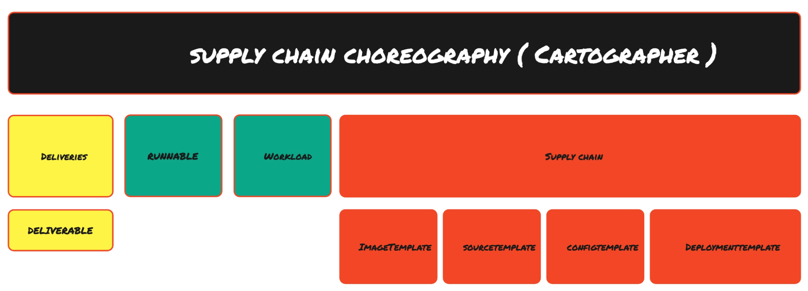

ClusterSupplyChain – A graph of interconnected Kubernetes resources with the shared purpose of producing deployable Kubernetes configuration 

Delivery – A graph of interconnected Kubernetes resources with the shared purpose of deploying Kubernetes configuration 

Runnable – Cartographer’s equivalent of a Kubernetes Job Resource, responsible for submitting and managing job-like resources

Workload – Manifest submitted by developers that flows through the supply chain 

Deliverable – Manifest that flows through the delivery

Let's dissect the OOTB Testing and Scanning Supply Chain and take a look at the different components it is made of.

## Source provider

The source provider step is the first step in the OOTB Supply Chain. As the name implies, this step polls for any changes or commits that may get pushed into the git repository. 

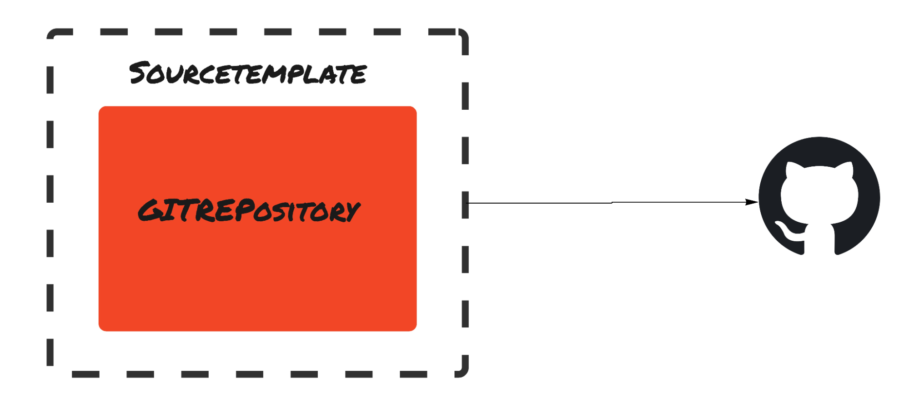

The CRDs that are involved as part of the source provider step are: 

**SourceTemplate**– This is a top-level Cartographer-based CRD that wraps the `GitRepository` CRD

**GitRepository** – This is a `FluxCD`-based CRD that polls for any changes happening in the source code repository

## Deliverable

The deliverable step creates the deliverable object that flows through the delivery. A delivery is similar to a supply chain that gets installed as part of Tanzu Application Platform. A deliverable-type annotation is passed on to the deliverable object. The delivery is chosen based on the deliverable-type annotation.

The different CRDs that are involved as part of the deliverable step are: 

**ClusterTemplate** – A `ClusterTemplate` is the Cartographer-level CRD that wraps the existing Kubernetes resources, ensuring that objects conform to one of the standard template interfaces

**Deliverable** – The deliverable is the unit of work that will flow through a delivery. The respective delivery is picked based on the deliverable-type annotation passed to the deliverable object

The source of the deliverable could be a git repository or an image repository. These values are configured during the installation of Tanzu Application Platform from the tap-values.yml file.

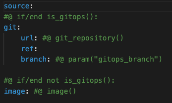

## SourceTester

The source tester step runs the test cases defined within the source code. The OOTB Supply Chain is shipped with the Tekton CI tool. The runnable object is wrapped by the Cartographer-level `SourceTemplate` CRD. 

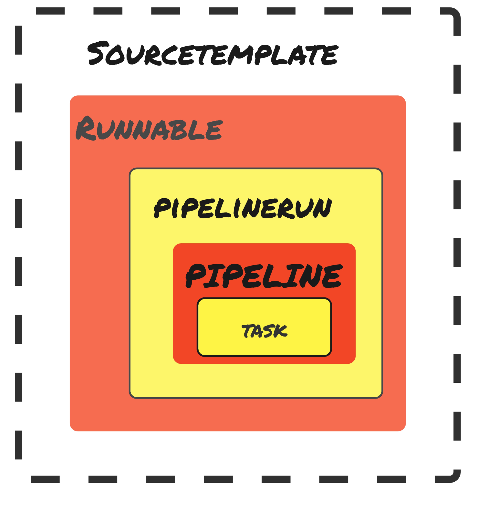

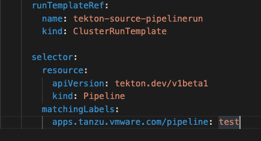

The `RunTemplateRef` defines which `PipelineRun` template is picked for running the test cases. The `Pipeline` is selected based on the label selector. From the above screenshot, the pipeline with the label of  `apps.tanzu.vmware.com/pipeline: test` will be picked to be run. 

The different Tekton-based CRDs used in this process are: 

**PipelineRun** – A `PipelineRun` allows you to instantiate and execute a <code>[Pipeline](https://tekton.dev/docs/pipelines/pipelines/)</code> on-cluster

**Pipeline** – A `Pipeline` specifies one or more `Tasks` in the desired order of execution

**Task** – A `Task` is a collection of `Steps` that you define and arrange in a specific order of execution as part of your continuous integration flow. A `Task` executes as a pod on your Kubernetes cluster. A `Task` is available within a specific namespace, while a `ClusterTask` is available across the entire cluster.

## Source-Scanner/Image-Scanner

The Source-Scanner/Image Scanner step scans the source code and the image using the Grype Scanning Tool that comes embedded in the OOTB Supply Chain.

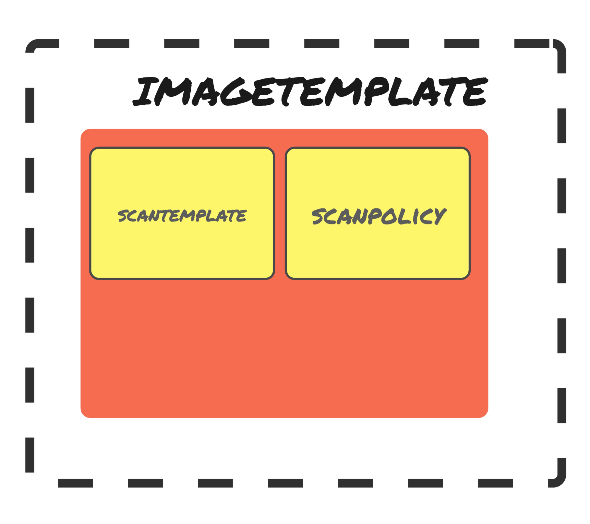

ScanPolicy defines the different vulnerabilities to be captured and blocked before the code is deployed to production. 

➜  kubectl get scanpolicy scan-policy -oyaml 

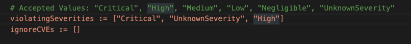

In the above case, any vulnerabilities that are classified as `Critical`, `High`, or `UnknownSeverity` will be blocked and the supply chain will be forced to error, preventing the code from being deployed into the respective environment.

### Where are scan results stored?

Scan results are streamed as the pod logs from the scan pod and stored in the metadata store database. The data can be queried from the metadata store database using the [insight CLI](https://docs.vmware.com/en/Tanzu-Application-Platform/1.1/tap/GUID-cli-plugins-insight-cli-overview.html).

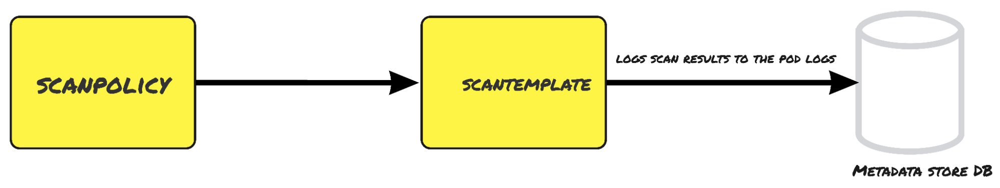

The CRDs used in this scan process are: 

**ScanPolicy** – ScanPolicy defines the different vulnerabilities to be captured and blocked before the code is deployed to production 

**ScanTemplate** – ScanTemplate defines the script that needs to be executed to complete the scan process 

## Image-Builder

The image builder step converts the source code into a deployable image automatically with the help of [Tanzu Build Service](https://tanzu.vmware.com/build-service), which is installed into the Tanzu Application Platform cluster by default.

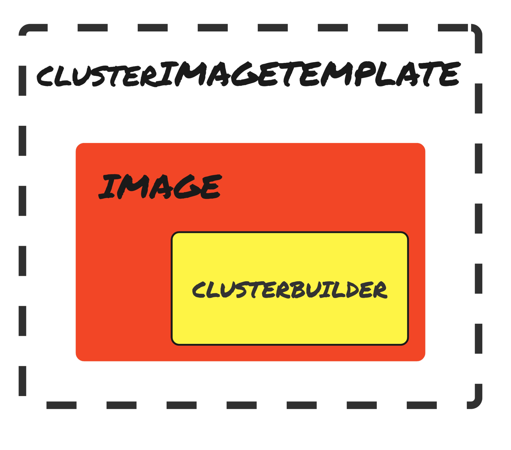

The different CRDs used in this process are: 

**ClusterImageTemplate** – ClusterImageTemplate is the top-level Cartographer object that instructs how the supply chain should instantiate an object responsible for supplying container images, for instance, one that takes source code, builds a container image out of it, and presents under its .status the reference to that produced image.

**Image** – This is the kpack-level CRD that takes in the source code input and converts it into a deployable container image. Image references Builders/ClusterBuilders, which contain the buildpacks that are required to convert source code into a deployable image automatically.

**Builder/ClusterBuilder** – Define and create [Cloud Native Buildpacks builders](https://buildpacks.io/docs/using-pack/working-with-builders/) all within the kpack API. This allows granular control of how stacks, buildpacks, and buildpack versions are utilized and updated.

## Config-Provider

Config-provider calls the [convention services](https://docs.vmware.com/en/Tanzu-Application-Platform/1.1/tap/GUID-developer-conventions-about.html), which enables people in operational roles to  efficiently apply their expertise. Convention services specify the runtime best practices, policies, and conventions of the respective organization to workloads as they are created on the platform.

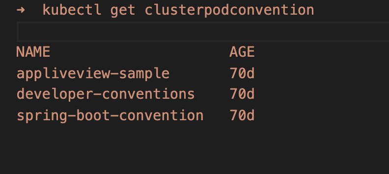

In the above case, there are three pod conventions that every workload goes through. Every pod convention is assigned a priority number, and the conventions are applied based on the priority. If all conventions have the same priority number, the conventions are applied based on the alphabetical order of the name. 

For every workload, a PodIntent is created and, once the conventions are applied, the PodIntent annotations will contain all of the conventions under the applied convention section.

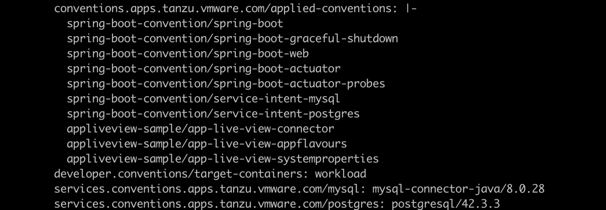

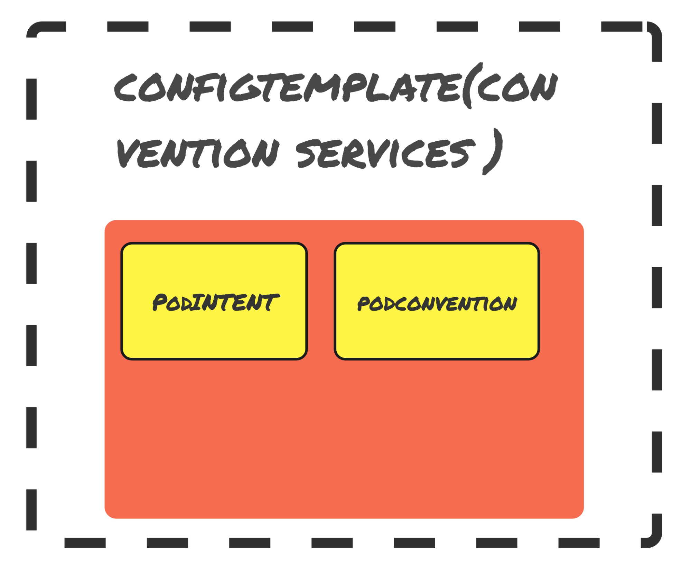

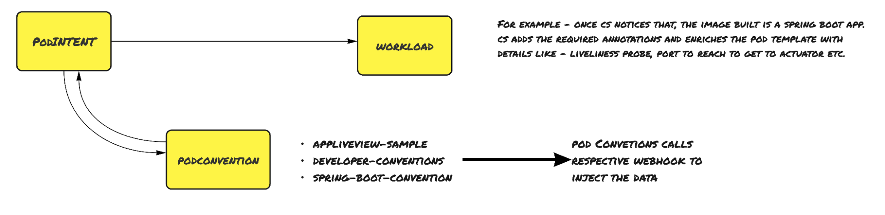

The different CRDs involved in the Config-Provider step are: 

**PodIntent** – PodIntent applies conventions to a workload  

**ClusterPodConvention** –  Pod Convention defines the different conventions present in the cluster and it references back to the webhook’s service

## App-Config

The App-Config step creates the Knative serving, service binding, resource claims, and a Kubernetes configmap.

**Knative serving **– Knative is the abstraction that's used on top of the Kubernetes cluster to deploy the application on to the cluster

**Service binding **–** **If any service references has been passed to the workload, a service binding object is created alone with a **ResourceClaim** 

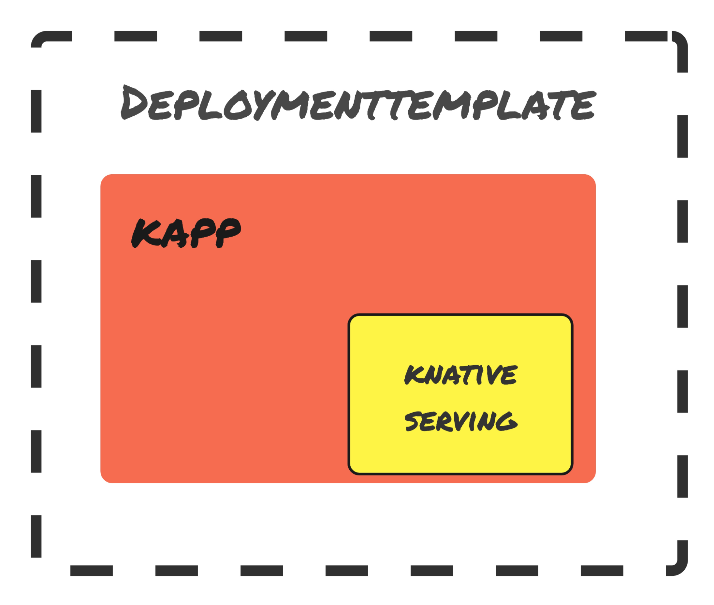

## Config-Writer

The Config-Writer step uses the Tekton task to run a task based on how Tanzu Application Platform is configured during the installation of the platform. If GitOps has been configured, the config files get written to the configured git repository using the git-writer task. By default, the config files are written to the image-repository using the image-writer task.

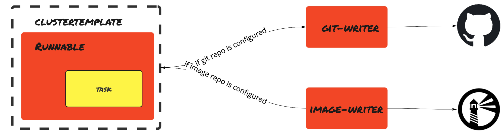

The different CRDs used in this step are **ClusterTemplate**, **Runnable**, and **Task** (Tekton task).

## Summary

Tying all steps together, from source-provider to Config-Writer, the OOTB Testing and Scanning Supply Chain includes all components that are required to take the application source code and deploy to a Tanzu Application Platform cluster in a secure, scable, and consistent way.

