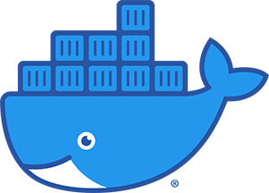
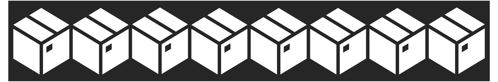
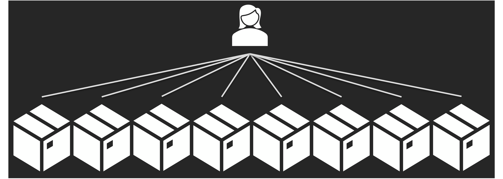
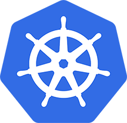
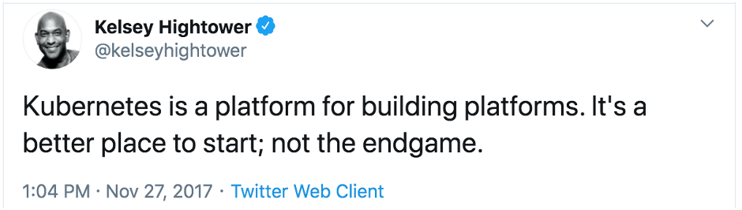
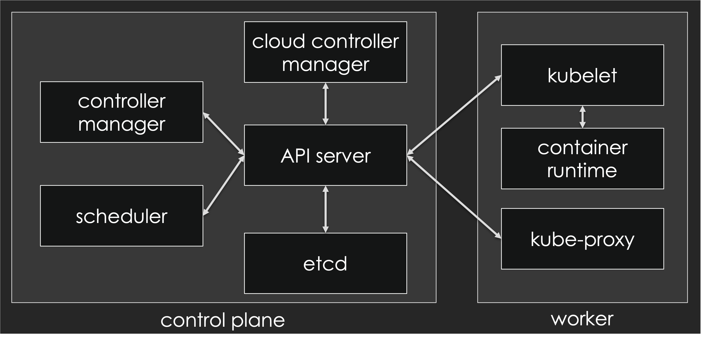
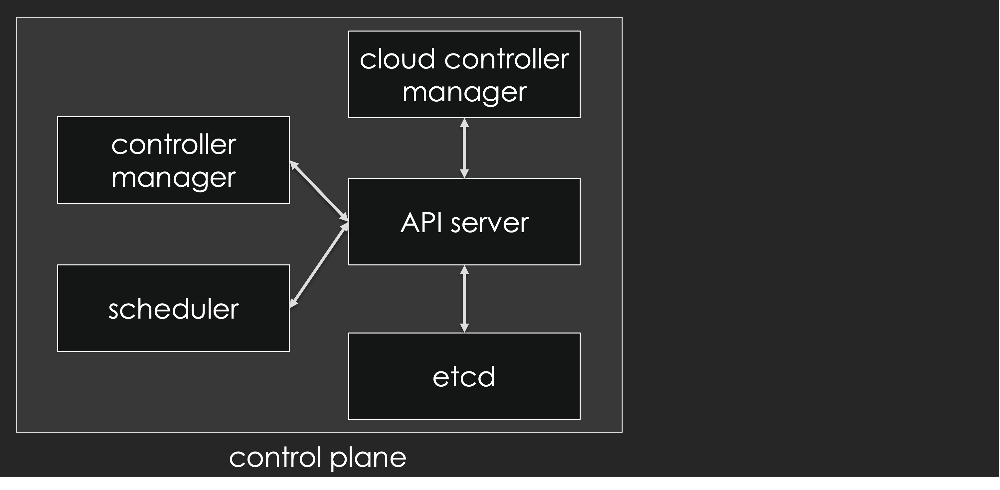
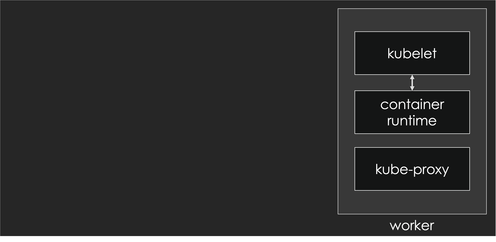

## Docker



In 2013, Docker came along and changed the container's space. People began taking their giant monolithic applications, breaking them down into smaller components, and running them in containers.
 
Generally the container image, which encapsulates everything you need to run your application, is stored in a small, light-weight image that can be run on nearly any machine in a repeatable way.
 
With the packaging and distribution comes a simple way to run immutable infrastructure where you can scale up or down based on requirements.

## Containerizing



**Containers made it easy to build and scale cloud-native applications**.

Generally the container image, which has everything you need to run your app, can be run on nearly any machine and is therefore easily scaled
As containers started to become more popular people started to deploy them at scale, and at scale there were more and more machines and more containers running on them. 



## Kubernetes
 


Kubernetes was created to fill this gap. It helps users focus on their applications instead of worrying about building cluster management software. And managed Kubernetes services simplify things further.

At its core, Kubernetes is an open-source container management platform. It’s built to help you run your containers at scale and comes equipped with features and functions to build proper distributed applications using the [12-factor app](https://12factor.net/) pattern. If you’re unfamiliar, the 12-factor app is a methodology for building software-as-a-service apps.



One of the strengths of Kubernetes is that it can run anywhere: in the cloud; on premises (on virtual machines or bare metal servers); on your local machine. In some cases, this can help with the portability of applications, because it abstracts some of the differences between environments or cloud providers. (Of course, it can't do miracles either: if your code leverages S3, it won't magically use GCS if you migrate from AWS to GCP!)

This versatility is one of the reasons why many customers use Kubernetes today. Some people start in the cloud right away. Other folks prefer to leverage their existing on premises infrastructure today, move legacy apps  into containers, build new apps in a cloud native way, run all of this in Kubernetes and eventually move these applications onto the cloud if they wish to do so - orchestrating all these workloads with the same framework across multiple environments. 


## Cluster Components
The base point when using Kubernetes is a cluster. A cluster consists of:
- a number of *nodes* (also called *workers*), which are machines (physical or virtual) to run our applications
- the *control plane*, a collection of components that collectively form the "brains" of the cluster.

The control plane is our interface with the cluster (specifically, through the *Kubernetes API server*) and it controls everything happening on the cluster: which workloads get deployed where; what to do when a node becomes unresponsive or has some other problem; autoscaling things when the load increases; etc.



Let’s take a look at each of these components. 



Depending on the circumstances, the control plane can:
- run entirely in a single place (that's the case with most local development clusters like minikube, KinD, Rancher Desktop…),
- be distributed across multiple machines (to achieve high availability of the control plane),
- run inside Kubernetes itself (that's the case when installing with tools like kubeadm),
- … or outside Kubernetes (that's the case with most managed Kubernetes clusters like AKS, EKS, GKE, Kapsule…)

The Kubernetes control plane makes sure that the actual state of the cluster matches the *desired state* that we define. For instance, we tell the control plane, "I would like two containers running NGINX!" and the control plane will make it happen: create containers if there are less than two; delete containers if there are more than two; do nothing if there are already exactly two containers matching our request. ("Well, actually!" we don't directly request "two containers", but Pods, generally controlled by e.g. a ReplicaSet or Deployment; but we'll get to all that soon enough!)

The **API server** exposes the Kubernetes API. It's the front end of the Kubernetes control plane.  And as you can see in the diagram above, everything else communicates with it.

The **scheduler** watches newly created pods that don’t have a node assigned yet and selects a node to run on.

At a high level, the **controller manager** runs a bunch of controllers. Each controller is responsible for implementing the behavior and features of a particular type of object. For instance, there is the ReplicaSet controller, that manages ReplicaSets; the Deployment controller, that manages Deployments; and so on.

The **cloud controller manager** runs another bunch of controllers. It is optional, and typically only found in cloud-based deployment, to implement cloud-specific features (for instance, LoadBalancer services; or adding appropriate labels on Nodes to indicate in which regions/zones/etc they're located).

**etcd** stores the desired state of the clusters. Conceptually, it's like a big bulletin board which is constantly watched by the aforementioned controllers. Whenever we want to do anything on the cluster, we actually update that bulletin board, and the corresponding controllers will notice our change and react to it - often updating the bulletin board themselves to report status or carry further actions. There is a twist: we never access [etcd](https://etcd.io/) directly, but only through the API server, which is the one enforcing data consistency, constraints, permissions, versioning… Technically, etcd is a highly-available key/value store implemented through the [Raft](http://thesecretlivesofdata.com/raft/) protocol. 



The worker node(s) host the pods that you run. Notable components running on nodes include:

- **kubelet**, the agent that registers the node with the control plane, regularly updates the control plane with the status of the node (and of the containers running on it), and picks up the node's desired state (meaning: which containers should be running on the node at any given point);
- a **container runtime**, responsible for running containers and receiving its instructions from kubelet; the original container runtime was Docker, but it's now being superseded by simpler, leaner engines like [containerd](https://containerd.io/) or [CRI-O](https://cri-o.io/);
- **CNI plugins**, implementing network communication between containers;
- another network component (typically **kube-proxy**) implementing load balancing for both internal and external traffic.


## Objects
*Kubernetes objects* are persistent entities in the Kubernetes system. Kubernetes uses these entities to represent the state of your cluster.

First, we have **Pods**. Pods are the smallest and simplest unit in the Kubernetes object model that you can create or deploy. They can be used to run a single container or multiple containers that need to work together. You can think about the containers as whales (because well, Docker), and a pod is a group of these. When a pod is run standalone, if it finishes for any reason, it will not be started again.

One way to run pods that can restart on failure is to use a **Deployment**. Deployments are given the number of pod replicas to deploy. Each deployment watches a **ReplicaSet**, which ensures that the right number of pods are always running.

**StatefulSets** manage pods that are based on an identical container spec, like a deployment. But unlike a deployment, a stateful set maintains a sticky identity for each of their pods. In other words, though they’re created from the same spec, they’re not interchangeable.

Now say there is a pod that you want to run on every worker node. That’s where a **DaemonSet** comes in.

**Jobs** will run your pod or pods until completion

And **CronJobs** are useful for creating periodic and recurring tasks. They can also schedule individual tasks for a specific time.

 
## Services
Services are used to access your application outside of the pod itself. They give us a stable endpoint to connect to a pod or group of pods. They map a fixed IP address to a logical group of pods.

Some of the different types are `ClusterIP`, `NodePort`, and `LoadBalancer`. There are more kinds and flavors of services, but we won’t get into those here.	

`ClusterIP` is the default service type. Since the IP address you are allocated is private, you are only able to reach it from within your cluster.

`NodePort`, unlike cluster IP, can be reached outside of the cluster. You use the external IP from any of the Nodes and the given port. You may have to change some security settings for what ports are open if you’re using a cloud provider.

And for `LoadBalancer`, an external load balancer is allocated for the service. This typically is a cloud load balancer such as ELB on AWS, GLB on GCE etc. Each service of this type will typically cost a little bit of money.


## Networking
### Kubernetes Network Model
The short version is that everything in Kubernetes is one big, giant flat network. There is one big subnet everything is in it: the nodes, the pods, everything.

Think of a big castle, with tall walls and a moat around it. If you’re inside everything can communicate together, and in this case pods and nodes. But if you are outside, you can only get in through specific ways such as drawbridges, or in this case by using NodePort and LoadBalancer services.

In detail:
- all nodes must be able to reach each other, without NAT
- all pods must be able to reach each other, without NAT
- pods and nodes must be able to reach each other, without NAT
- each pod is aware of its IP address (no NAT)

Kubernetes doesn't mandate any other particular implementation.

### Container Network Interface (CNI)
The [CNI](https://www.cni.dev/) defines a way for the kubelet to interact with network plugins. CNI plugins are just binary programs that can take care of IP allocation and setting up the network in containers.

When kubelet creates a pod, it calls one or a sequence of CNI plugins that do their job one after another like an assembly line.

Typically, our CNI configuration will leverage one or multiple CNI plugins to:
- allocate an IP address (by calling an IPAM plugin)
- add a network interface into the pod's network namespace
- configure the interface as well as required routes etc.


## Security
Sometimes, we say that the best way to deliver bad news is to sandwich it between good (or at least better) news.

**Good news:** You don't need to learn all the things about Cloud Native security to be able to deploy your first app on Kubernetes, because its security has been designed to be relatively unobtrusive.

**Bad news:** Since Kubernetes is a complex platform with many features, it won't be possible to tell you all about them in a short paragraph in an introductory blog post. If you deploy large-scale apps handling sensitive user information (and in the age of GDPR, even email addresses can be considered sensitive information), you - or someone in your team or organization - will have to learn more about Cloud Native security.

For instance,  **Role-based access control (RBAC)** with **service accounts** to give users and programs varying fine-grained permissions. These could for instance be full access to a specific namespace.

**Secrets** will let you segregate sensitive data so that application code can access it, without disclosing it to developers or operators.

**Network policies** can isolate workloads from each other from a network perspective.

**Good news:** I have further blogs that go into far more depth on Cloud Native Security:

[Cloud Native Security For the Rest of Us: Part 1](/blog/cloud-native-security-for-the-rest-of-us-p1/)

[Cloud Native Security For the Rest of Us: Part 2](/blog/cloud-native-security-for-the-rest-of-us-p2/)

Check them out if you want to learn more about these topics!

## Communication with the Kubernetes API
Now that we’ve covered a bunch of information, it’s time to actually interact with Kubernetes.

When interfacing with the Kubernetes API, the primary tool used is the `kubectl` CLI.
The [`kubeconfig`](https://kubernetes.io/docs/concepts/configuration/organize-cluster-access-kubeconfig/) file contains all the information Kubernetes needs to securely access your cluster.

Deploying a first "hello world" style app and exposing it to the outside world can be achieved with a couple of commands. Assuming that you have access to a Kubernetes cluster (either a local development cluster like minikube, or a "real" cluster with multiple nodes in a cloud or datacenter), you can try the following commands:

```
kubectl create deployment helloworld --image=nginx
kubectl expose deployment helloworld --port=80 --type=LoadBalancer
kubectl scale deployment helloworld --replicas=2
```

Wait for the deployment to be ready:
```
kubectl get deployment helloworld -w
```
Run `ctrl-c` when it’s done.

```
kubectl port-forward service/helloworld 1234:80
```

If you connect to [http://localhost:1234](http://localhost:1234), you should see a "Welcome to NGINX" page, served by an NGINX container within a Pod, itself a member of a ReplicaSet with two identical Pods in total (ensuring higher availability in case of e.g. node failure).

And if you did this on a cloud-based cluster (or, at least, one with a functioning implementation of LoadBalancer Services), you can run `kubectl get services helloworld`, and you should see a public IP address in the EXTERNAL-IP column. That IP address gives you (as you might guess from the name of the column!) an IP address that can be used to connect to that container from outside the cluster!

Clean up:

Run `ctrl-c` to terminate the port-forwarding.
```
kubectl delete service helloworld
kubectl delete deployment helloworld
```


## Where to go next?

Of course, there is a long way to go from "running an NGINX container serving a single HTML static page" to "deploying a large-scale app with millions of users". Let's not sugarcoat it: yes, Kubernetes is a big, complex system; *but* you don't have to know the ins and outs of every single API group, resource type, or obscure spec field or command-line flag to implement what you need. In fact, our experience shows that the amount of concepts and tools that one has to learn to deploy their apps on Kubernetes is comparable (and in some cases, even smaller!) to what it takes to deploy on comparable systems (e.g. cloud-specific platforms like ECS+CloudFormation). Furthermore, it's quite possible to get started with a very reasonable set of features (e.g. Pods, Deployments, Services, Namespaces) and grow it progressively as your needs evolve!