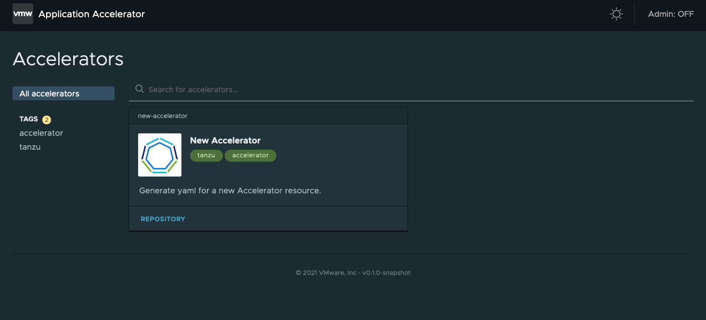

By now you may have seen the [announcement](https://tanzu.vmware.com/content/vmware-tanzu-application-platform-resources/announcing-vmware-tanzu-application-platform) at the recent [SpringOne](https://springone.io) conference for VMware's new [Tanzu Application Platform](https://tanzu.vmware.com/application-platform). You understand the power a platform like this can bring to your production environments, but have you considered what it can do for your [inner loop development](https://thenewstack.io/kubernetes-infrastructure-know-the-inner-dev-loop/)? Not every commit goes to production. That’s why you need a way to locally deploy and test your changes locally before going to production. 

You also need a way to locally evaluate and use the Tanzu Application Platform. You want to understand how it works, and what it can do for your organization before a potential deployment. If this sounds like you, I have a 2-part series on installing and using Tanzu Application Platform Beta 1 locally, using [KIND](https://kind.sigs.k8s.io).

  * [Part 1](/guides/kubernetes/getting-started-with-vmware-tanzu-application-platform-beta-1-on-kind-part-2/), shows you how to install all the necessary components of the Tanzu Application Platform onto a KIND Kubernetes Cluster. 
  * [Part 2](/guides/gs-tap-on-kind-final-pt2/), shows you how to access and utilize the Tanzu Application Platform to deploy a sample application. 

    Both of these guides will heavily leverage the existing [install documentation](https://docs.vmware.com/en/VMware-Tanzu-Application-Platform/0.1/tap-0-1/GUID-install.html) for Tanzu Application Platform, although heavily modified for this specific use case (i.e. deploying in KIND). For the definitive guide to installing Tanzu Application Platform on any supported platform, see [docs](https://docs.vmware.com/en/VMware-Tanzu-Application-Platform/0.1/tap-0-1/GUID-install.html). 

But before you get to the install, keep reading to find out what Tanzu Application Platform is, and the value it can bring to developer workflows.

## What is the Tanzu Application Platform?

If you are reading this, and this is your first introduction to Tanzu Application Platform, consider spending some time reading through the VMware [product pages](https://tanzu.vmware.com/application-platform) where you can get a better idea of the value that this platform can bring to your development flow. There, you will find blog posts, demo videos, and more. The product pages will help you understand how Tanzu Application Platform works, how its architecture works, and if you are interested in deploying it as a Beta. Additional resources are available at the bottom of this post. 

### Tanzu Application Platform High-Level Introduction

Tanzu Application Platform is an opinionated grouping of separate components that collectively unlock and automate some of the more difficult outcomes when it comes to running applications on Kubernetes. From a developer's perspective, once plumbed together with an application under management, any changes to that application which are pushed to a configurable monitored branch are automatically built, tested, and deployed on Kubernetes.

## No Really, What Is It?

Okay, so maybe you want to go a little deeper than the values statements provided here, or in the product pages. Maybe you want to know exactly what it is you going to install? How do all these components work together? And, what does each component do independently? Let's get into that here.

### Application Accelerator for VMware Tanzu

[Application Accelerator for VMware Tanzu](https://docs.vmware.com/en/Application-Accelerator-for-VMware-Tanzu/index.html) provides developers an easy way to bootstrap  projects within their organization. Accelerators are embedded with best practices, security, and compliance guidelines and are typically defined by enterprise architects or operations teams. 

In this way, developers who are starting a new project do not need to start from a blank page. Instead, much as is the case with [start.spring.io](https://start.spring.io), developers can select from a list of existing accelerators, and go from there. 

It is also fairly straight forward to [build a new accelerator](https://docs.vmware.com/en/Application-Accelerator-for-VMware-Tanzu/0.2/acc-docs/GUID-creating-accelerators-index.html). Trying this out will gain you familiarity with these processes and how they work. All accelerators are maintained as code repositories in GitHub, and integrated into Application Accelerator for Tanzu with small YAML templates. 

Basically, an accelerator could be a small starter application, embedded with necessary libraries, security practices, metadata, and the like. This gives developers a quick way to get started building additional services on top of them. 

### Application Live View for VMware Tanzu

[Application Live View for VMware Tanzu](https://docs.vmware.com/en/Application-Live-View-for-VMware-Tanzu/0.1/docs/GUID-index.html) is a diagnostic tool for developers looking to monitor or troubleshoot applications, or the application pipeline. Much in the same way the [Application Accelerator for Tanzu](https://docs.vmware.com/en/Application-Accelerator-for-VMware-Tanzu/index.html) builds upon the learnings from [start.spring.io](https://start.spring.io) to allow developers a quicker way to get started building new projects, Application Live View for VMware Tanzu also takes notes from the Spring Framework. 

For example, [Spring Boot Actuator](https://docs.spring.io/spring-boot/docs/current/reference/html/actuator.html) gives developers an easy and modular way to include application monitoring as part of the application. Application Live View for VMware Tanzu does the same.

Application Live View for VMware Tanzu automatically embeds monitoring into containerized applications deployed with Tanzu Application Platform. This provides developers and operations teams with a predictable set of run-time metrics, with a Kubernetes-native look and feel. 

### Cloud Native Runtimes for VMware Tanzu

[Cloud Native Runtimes for VMware Tanzu](https://docs.vmware.com/en/Cloud-Native-Runtimes-for-VMware-Tanzu/1.0/tanzu-cloud-native-runtimes-1-0/GUID-cnr-overview.html) is an application runtime currently based on [knative](/tags/knative/). This runtime, while currently based on a serverless framework, provides developers with a further abstraction for running applications on top of Kubernetes. Not necessarily just for serverless applications. 

This component helps developers further realize the power of Kubernetes without the need to manage individual workloads. Cloud Native Runtimes for Tanzu handles workloads and scaling automatically based on configurable policies. 

Cloud Native Runtimes for Tanzu also allows developers to easily create event-based application architectures. Workloads don't always have to be running. Instead, they can be listening for events, and spin up only as needed. 

### VMware Tanzu Build Service

[VMware Tanzu Build Service](https://docs.pivotal.io/build-service/) is a better way to build applications into runnable containers. Using [Cloud Native Buildpacks](https://buildpacks.io), developers simply update their code, push it to a configurable target, and Tanzu Build Service takes over. 

Tanzu Build Service automatically discovers the correct buildpacks to use, compiles the application layers in a base operating system, and places the runnable container into your container repository, ready to be deployed. 

Operations teams using Tanzu Build Service are also given a centralized location to keep application dependencies up to date. When a vulnerability is discovered, simply upload the new packages, and Tanzu Build Service takes over. All applications configured to use those dependencies will be automatically [rebased](https://buildpacks.io/docs/concepts/operations/rebase/) and a new container version uploaded to your container repository. Again, ready to be deployed. 

### All Together Now...

It's great to understand the individual components and what they do. But within the Tanzu Application Platform, these individual components are brought together and configured in such a way as to bring more value than simply the sum of the parts. And additional components, and thus additional value, are being worked on currently to be brought to the Tanzu Application Platform. 

Here, you can see how all the components work together transparently to create a repeatable and secure pipeline for your applications, to production. 

From development, to operations, to security, a primary goal of Tanzu Application Platform is to ensure all these parties' goals are met. In this way, compliance policies, updates, and new features are automatically configured together from the very beginning, rather than as an afterthought. 

Keep reading to [Part 1](/guides/kubernetes/gs-tap-on-kind-pt1/) of my guide to deploying Tanzu Application Platform on KIND to find out how to locally install Tanzu Application Platform on KIND. 

## Resources
- [VMware Tanzu Application Platform Product Page](https://tanzu.vmware.com/application-platform) -- Links to additional resources and information around Tanzu Application Platform.
- [VMware Tanzu Application Platform install docs](https://docs.vmware.com/en/VMware-Tanzu-Application-Platform/0.1/tap-0-1/GUID-install.html) -- The official install documentation for Tanzu Application Platform, on which much of the _installing_ guide (part 2) is based on.
- [VMware Tanzu Application Platform demo video](https://www.youtube.com/watch?v=9oupRtKT_JM) -- Watch Aaron Torgerson give a 5 minute demo of Tanzu Application Platform in action before you try it for yourself. 
- This post will be broken up into three parts:
- [Tanzu Application Platform on KIND, Part 1](/guides/kubernetes/gs-tap-on-kind-pt1/) -- Installing Tanzu Application Platform Beta 1 locally on KIND as part of an inner development loop.
- [Tanzu Application Platform on KIND, Part 2](/guides/gs-tap-on-kind-final-pt2/) -- Using Tanzu Application Platform to deploy a sample application and see the parts in action. 

