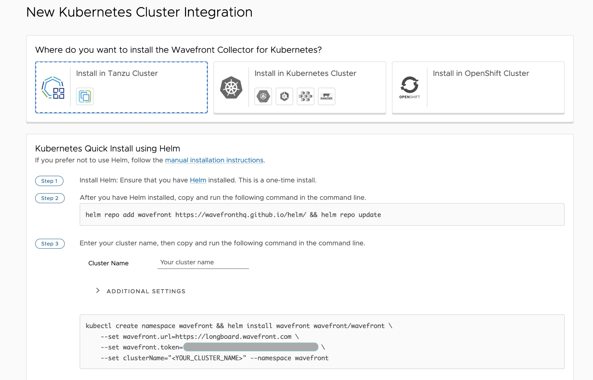

Tanzu Observability enables you to monitor your Kubernetes infrastructure metrics (e.g., containers, pods, etc.) from Wavefront dashboards, as well as create alerts from those dashboards. You can also automatically collect metrics from applications and workloads using built-in plug-ins such as Prometheus, Telegraf, etc. 

Tanzu Observability recognizes Tanzu Kubernetes Grid (TKG) clusters just like any other Kubernetes cluster. For more information, read this [documentation](https://docs.wavefront.com/wavefront_kubernetes.html).

Within the product, installing Kubernetes integration is as simple as deploying a Helm chart (seen below). The Helm is customized for different types of Kubernetes. 

If you do not have a Tanzu Observability license you can start a free trial [here](https://tanzu.vmware.com/observability) 

Once the integration is flowing metrics, usually within just a few minutes, you can use the dashboards provided with the integration to start observing your clusters.

Tanzu Observability has something for everyone. If you’re a Spring developer, [instrumenting your application](/guides/spring-wavefront-gs/) is a breeze. If you’re a Kubernetes operator, [Tanzu Observability has you covered as well](/guides/monitoring-at-scale-wavefront/)!

It’s that simple to instrument your TKG clusters with VMware Tanzu Observability by Wavefront. Happy observing! 
