In a [previous post](/blog/data-science-with-python-jupyterhub-on-kubernetes-part-1), we discussed the advantages of running JupyterHub on Kubernetes. We also showed you how to install a local Kubernetes cluster using kind on your Mac, as well as how to install the JupyterHub Helm chart on a Kubernetes cluster. 

In this post, we will focus on the experience of the developers, who are going to be leveraging our service to develop new models using `scikit-learn` or perform calculations and transformations of large datasets using pandas. To illustrate the value that Jupyter Notebooks and JupyterHub provide in a multiuser environment, we will clone a Git repository containing two example Jupyter Notebooks that we can work with.

## Using JupyterHub

Each user that accesses JupyterHub will have their own workspace complete with a single-user Jupyter Notebook server, which uses the JupyterLab Interface. To demonstrate the capabilities of JupyterHub and Python, we will check out the following sample notebooks that we have written and executed:

- **industry-revenue-analysis.ipynb** – Analysis of historical financial data organized by industry that leverages the pandas library
- **ml-stock-predictor-knn-v4.ipynb** – Machine learning (ML) based on revenue data from public financial statements that leverages the `scikit-learn` library for Python

{}
**Note**: Each time a user logs into the JupyterHub web page, an additional pod will be instantiated for that user and a 10GB persistent volume will be mapped to the user’s home directory.  
{}


1. In [Part 1](/blog/data-science-with-python-jupyterhub-on-kubernetes-part-1), we showed you how to expose the JupyterHub proxy-public Kubernetes service locally on your Mac using port forwarding. If you have not already done this, execute the following command:

```bash
❯ kubectl port-forward -n jupyter svc/proxy-public 8080:80 &
[2] 39859
Forwarding from 127.0.0.1:8080 -> 8000                                                     
Forwarding from [::1]:8080 -> 8000
```

2. To access the JupyterHub web UI, from your Mac you would use a web browser and enter the localhost IP (127.0.0.1) or localhost with the port specified above (8080), so http://localhost:8080/. JupyterHub is running with a default dummy authenticator, so entering any username and password combination will let you enter the hub.

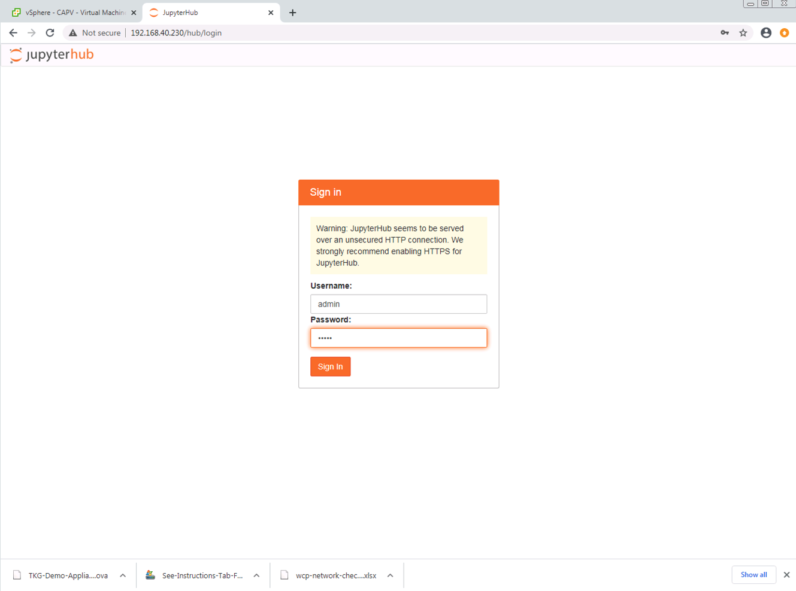

Once you are authenticated, you will be brought to the workspaces screen, which will allow you to open a local terminal inside the container, run interactive Python in a console, or create a new Python3 Jupyter notebook. You can also get interactive help or browse the local container’s directory structure.  

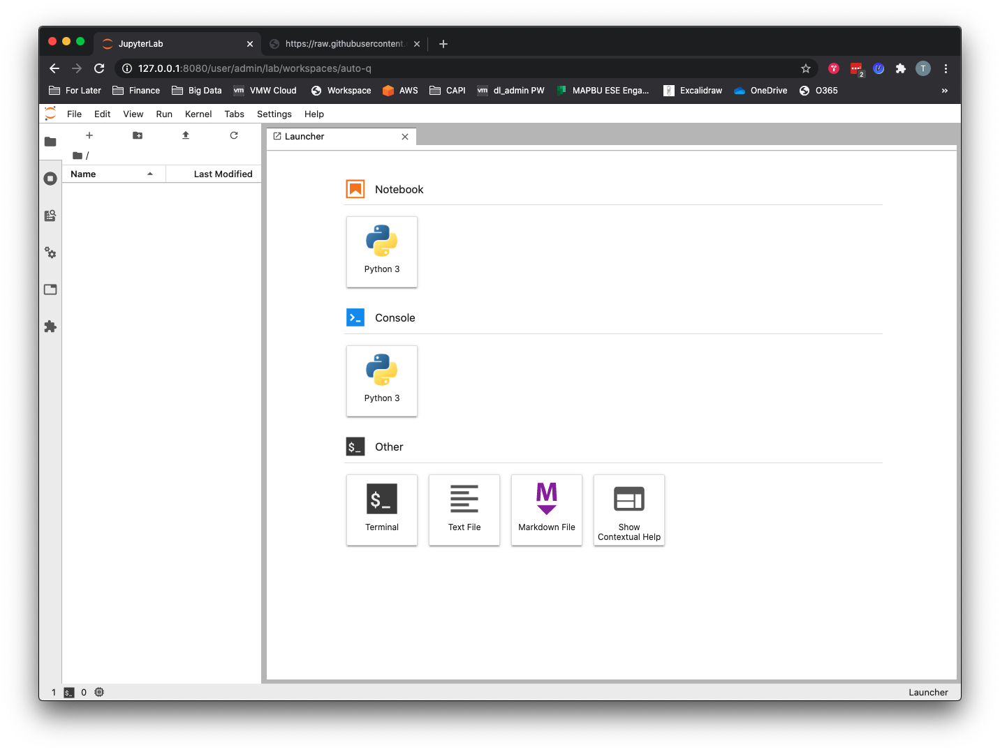

3. Click the Terminal button under Other on the main workspace screen.
At the Terminal prompt, type the following command:

```bash
git clone https://github.com/tkrausjr/data-science-demos.git data-science
```

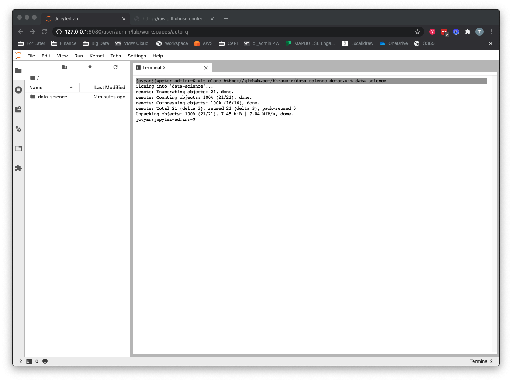

## Running the Machine Learning Notebook

To jumpstart your data science learning, two sample notebooks are in the data science directory created by your git clone operation in the previous step. The repos and sample datasets are here: https://github.com/tkrausjr/finance-analysis.git.
 
1. Open the `/data-science/jupyter-hub` directory.  

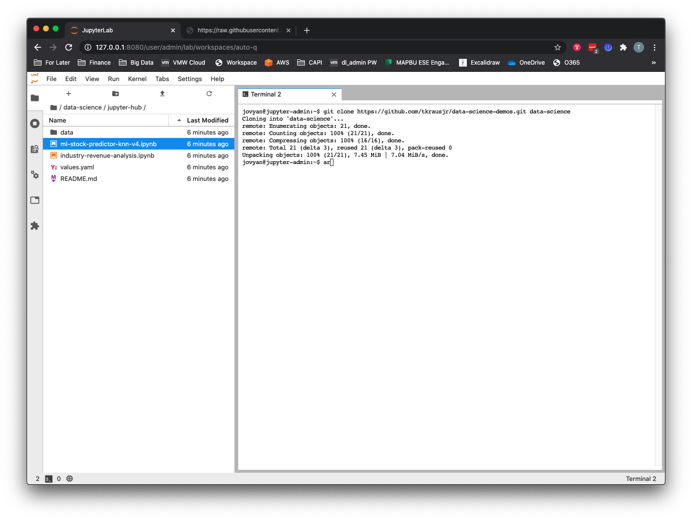

2. To run the machine learning notebook, double-click the `ml-stock-predictor-knn-v4.ipynb` file. You can run each cell individually by clicking in the cell and then hitting the `>| Run` button or using keyboard shortcut **Shift + Enter**. To run all cells from top to bottom (in other words, the entire program) you can go to **Menu --> Run --> Run All Cells**.  

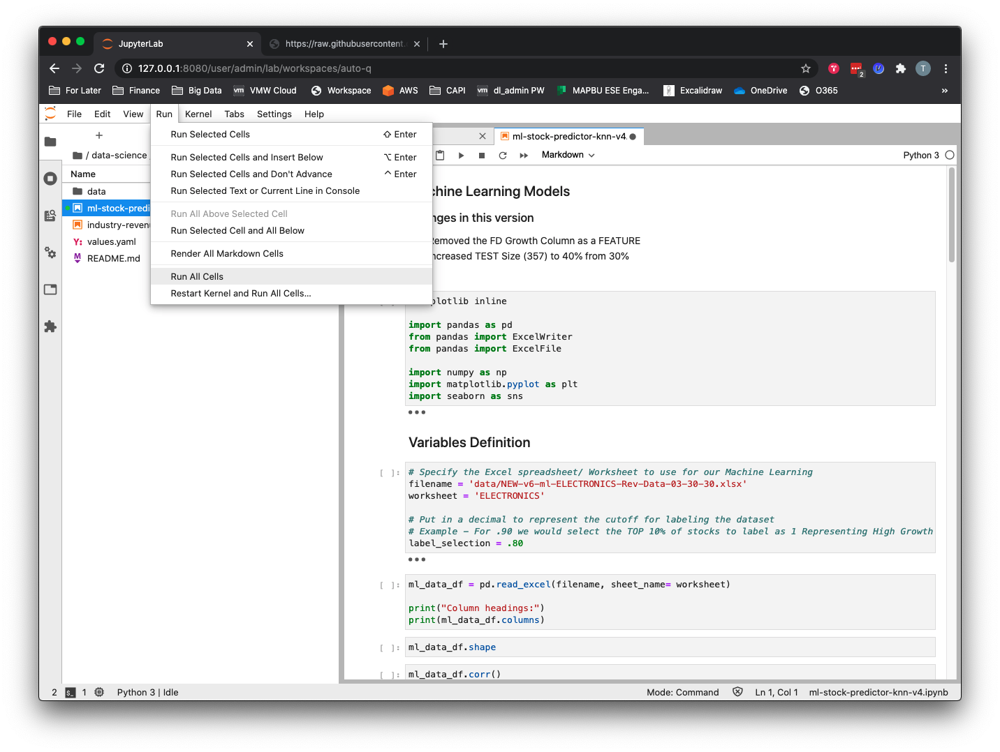

This notebook aims to classify companies as high growth or low growth according to their historical annual revenue growth, using supervised learning with the k-nearest neighbor (KNN) classification algorithm. As such, it will:
- Using the pandas library, create a data frame from a CSV containing real public companies’ annual sales figures and stock price data. 
- Clean up the data frame and calculate and create new columns representing year-over-year sales growth. In our classification problem, the annual revenue growth becomes the features or attributes that will be put into our ML model.
- Filter out the highest-growth companies by labeling them with a 0 or 1 to represent low growth or high growth, respectively. In supervised learning we have to label our data so the algorithm can determine upon which answers it should base its learning.
- Visualize and explore the data with the pandas and seaborn libraries.
- Train, test, and split the data with the `scikit-learn` library.
- Run a KNN ML model against the dataset and evaluate it using the `scikit-learn` library. 

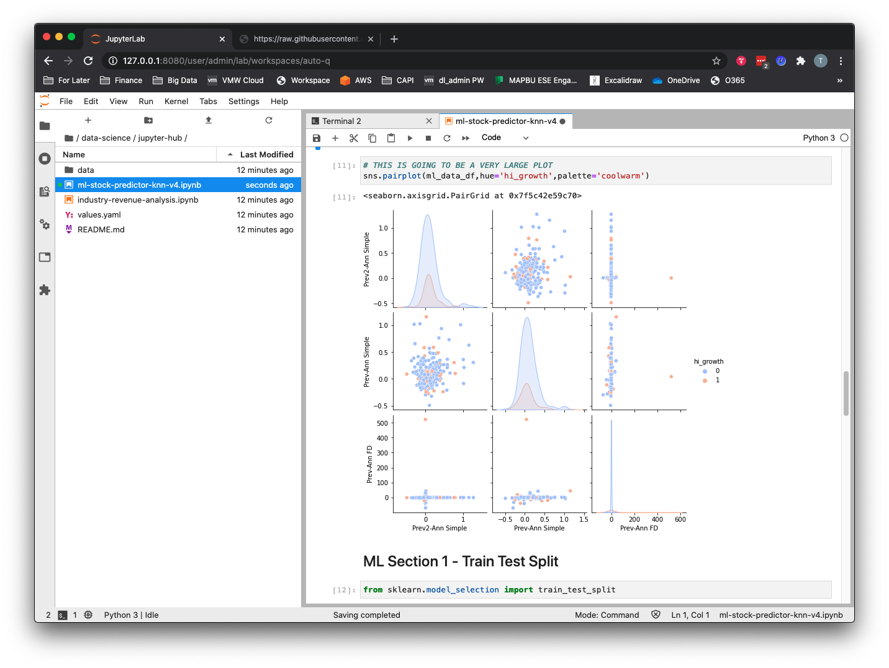

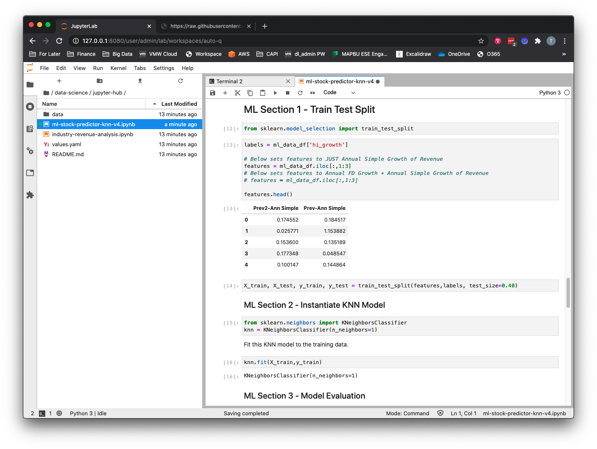

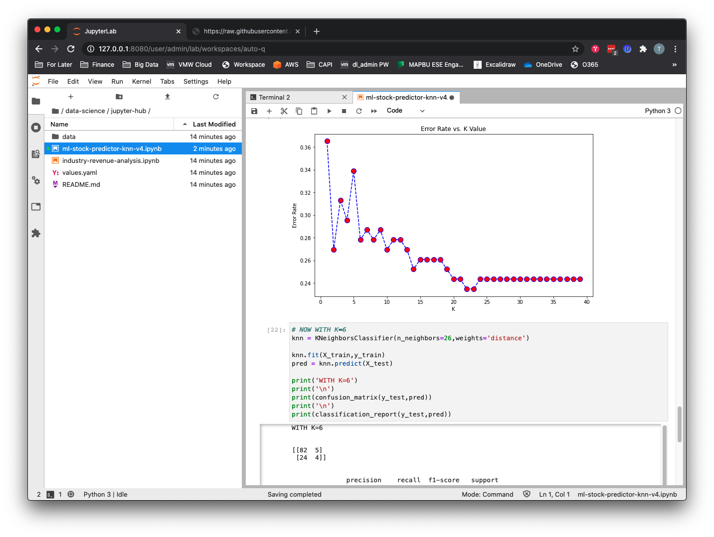

The output of the classification report in cell 36 shows us that although the model seems to be working, it is actually just choosing the value for the majority class, which is “0” every time. To make this model work as a classification problem, we would need to do some additional work, namely to undersample from the majority class or oversample from the minority class in order to create a more balanced dataset.

## Running the Data Analytics Notebook

To run the pandas data analysis notebook, double-click the `industry-revenue-analysis.ipynb` file. You can run each cell individually by clicking in the cell and then hitting the `>| Run` button or using keyboard shortcut **Shift + Enter**. To run all cells from top to bottom (in other words, the entire program) you can go to **Menu --> Run --> Run All Cells**.  

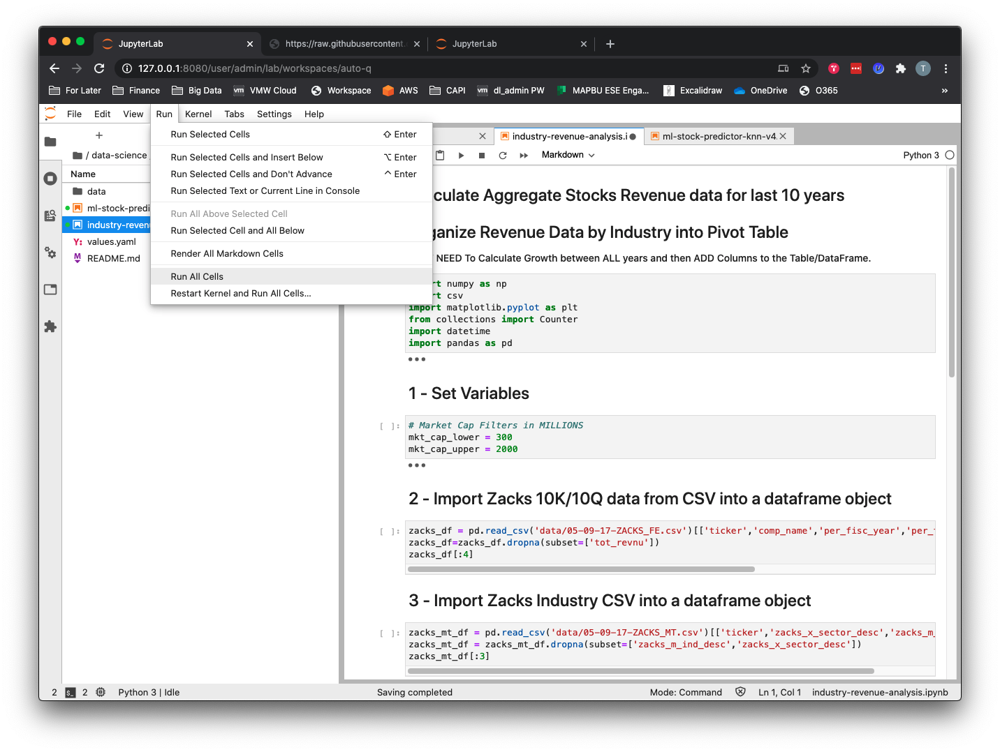

This notebook will do the following:
- Using the pandas library, create two data frames from two separate CSVs containing real public companies’ annual sales figures and industry sector data. 
- Merge the two data frames using “ticker” as the key value.
- Aggregate the historical revenue data by industry and year and create a pandas pivot table.
- Calculate the annual percentage change in revenue per industry and sort from highest to lowest for the most recent period. 

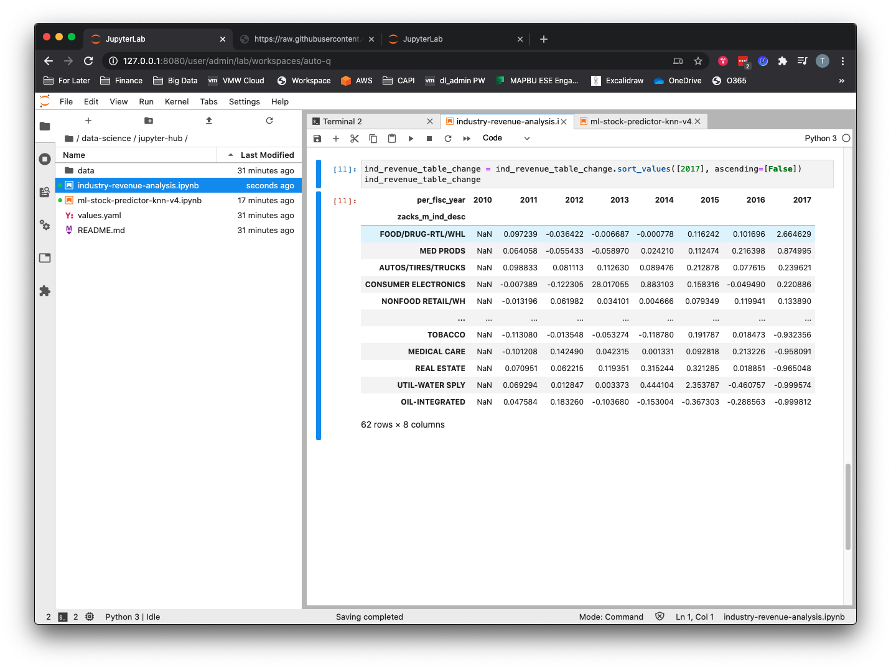

## Multiuser Support

When another data scientist wants to use the platform, they just need to login to JupyterHub and it will take care of the rest.

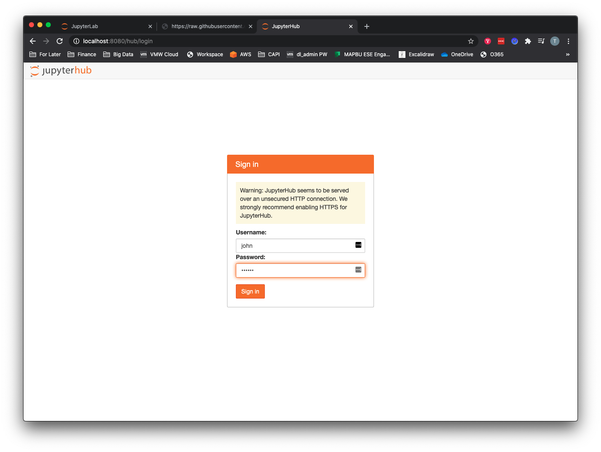


When a second data scientist (in this case, myself, Thomas) logs into JupyterHub, a second persistent volume claim, persistent volume, and pod will be provisioned for the new user.

```bash
$ kubectl get pvc -n jupyter                    
NAME                  STATUS   VOLUME                                     CAPACITY   ACCESS MODES   STORAGECLASS   AGE
claim-admin           Bound    pvc-6e02d65b-c47a-4cf4-a1ad-489dc7cc49de   10Gi       RWO            standard       45m
claim-john            Bound    pvc-3c1ee9a3-68ab-4d71-a1f4-8cf8c04fb975   10Gi       RWO            standard       109s
hub-db-dir            Bound    pvc-b0a0657d-a9f8-4a17-9002-2a3c8f2cade6   3Gi        RWO            standard       88m


$ kubectl get po -n jupyter -l component=singleuser-server            
NAME            READY   STATUS    RESTARTS   AGE
jupyter-admin   1/1     Running   0          73m
jupyter-john    1/1     Running   0          2m15s
```

## Summary

In this post, we have shown how deploying JupyterHub on top of Kubernetes provides various benefits, including:
- An isolated workspace where each data scientist will have their own dedicated CPU and memory guaranteed instance of a Jupyter Notebook server that will be spawned on demand and run on a shared Kubernetes platform.
- Efficient usage of resources, including the culling of unused Jupyter instances with the ability to shut down (defaults to an hour) unused Jupyter instances and autosave any additions or changes that have been made to running Notebooks. Users can log back in and be reconnected to their Jupyter Notebook instance with all their previous work thanks to the persistent volumes allocated to each Jupyter pod.
- Data persistence for data scientists’ work to be persisted to a dynamically created persistent volume so they either can log out and back in to JupyterHub and resume where they left off or have their work survive a pod failure.
- A way to provide data scientists with a lower-cost alternative to more expensive compute options for certain tasks, such as data cleanup, exploration, and model development.

Hopefully you now better understand how a JupyterHub implementation running on Kubernetes can provide a scalable, simple, and powerful platform for data science teams to work with. If you are new to Jupyter Notebooks in general, I would recommend experimenting with the sample notebooks used in this post or walking through a Jupyter Notebook tutorial that goes into more detail on developing in Jupyter Notebooks with `pandas`, `numpy`, or `scikit-learn`.