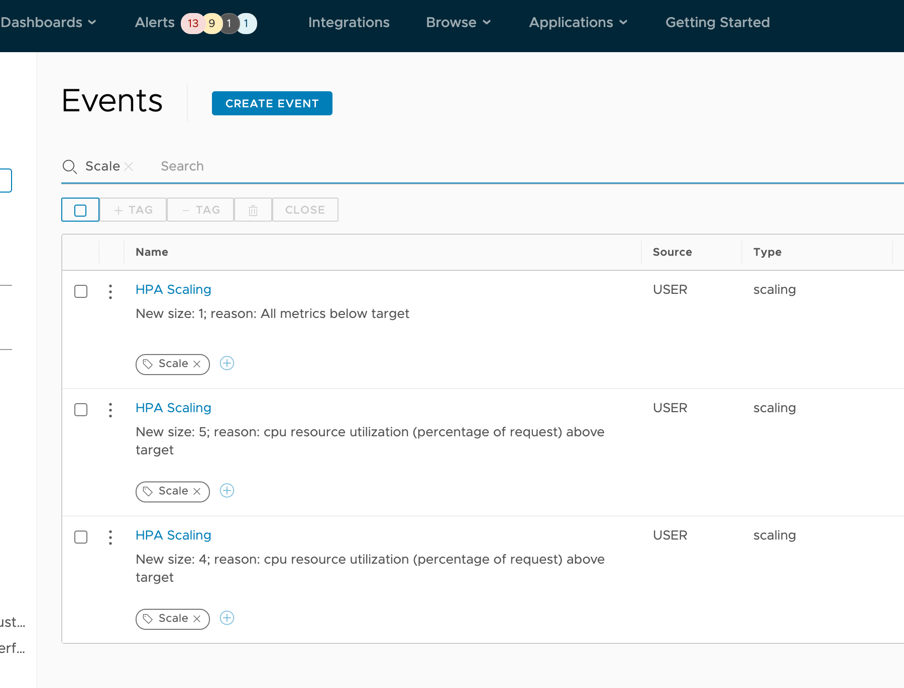

If you’re using one of the great observability tools out there, you probably already mark your data with important events that may affect it—deployments, configuration changes, code commits, and more. But what about changes Kubernetes makes on its own, like autoscaling events?

[Knative](https://knative.dev) is a Kubernetes-based platform used to deploy and manage serverless workloads. It has two components: serving and eventing, both of which can be deployed independently. In this post, we’re going to focus on eventing here, which can automatically mark events in your data or trigger other events based on your needs.

### Knative Eventing

The eventing component of Knative is a loosely coupled system of event producers and consumers that allows for multiple modes of usage and event transformation.

Among the other components in this system are the [broker](https://knative.dev/docs/eventing/broker/), which routes the events over [channels](https://knative.dev/docs/eventing/channels/), and [triggers](https://knative.dev/docs/eventing/triggers/), which subscribe specific consumers to events. For our example, we’re going to keep things very simple, with a single broker using a single[ in-memory channel, ](https://github.com/knative/eventing/blob/release-0.20/config/channels/in-memory-channel/README.md)which itself is not to be used in production.

### Kubernetes Events

If we want Kubernetes events as a source, we can use the [API server source](https://knative.dev/docs/eventing/samples/kubernetes-event-source/) as an event producer. This will publish any changes seen by the API server to the channel we’re using, and we can consume that event with a small golang application and forward to the observability tool of our choice.

In this case, we’re going to specifically watch for horizontal pod autoscaler (HPA) messages. Anytime the HPA scales our example app up or down, we’ll send a API call to mark an event.

### Eventing in Action

We’re going to use Kind to deploy a Knative eventing setup and then deploy a sample application with an autoscaler so we can see when it scales up or down. To do this, we will need to:

- Have [Kind](https://kind.sigs.k8s.io) installed
- Clone this repo [https://github.com/tybritten/hpa-sender](https://github.com/tybritten/hpa-sender) \

The first thing we need to do is create the Kind cluster. If you’re not comfortable with curling to bash, you can download it first and inspect it:

```bash
curl -sL https://raw.githubusercontent.com/csantanapr/knative-kind/master/01-kind.sh | bash
```

Next, we need to install all the Knative eventing components, starting with the CRD and core components:

```bash
kubectl apply -f https://github.com/knative/eventing/releases/download/v0.19.0/eventing-crds.yaml
kubectl apply -f https://github.com/knative/eventing/releases/download/v0.19.0/eventing-core.yaml
```

As mentioned earlier, we need a channel; we’re going to use the simple in-memory channel and corresponding broker:

```bash
kubectl apply -f https://github.com/knative/eventing/releases/download/v0.19.0/in-memory-channel.yaml
kubectl apply -f https://github.com/knative/eventing/releases/download/v0.19.0/mt-channel-broker.yaml
```

Lastly, we need to install the metrics server (and apply a patch) for the HPA:

```bash
kubectl apply -f https://github.com/kubernetes-sigs/metrics-server/releases/download/v0.3.6/components.yaml
kubectl patch deployment metrics-server -n kube-system -p '{"spec":{"template":{"spec":{"containers":[{"name":"metrics-server","args":["--cert-dir=/tmp", "--secure-port=4443", "--kubelet-insecure-tls","--kubelet-preferred-address-types=InternalIP"]}]}}}}'
```

Let’s check to make sure everything is up and running:

```bash
kubectl get all -n knative-eventing
NAME                                        READY   STATUS    RESTARTS   AGE
pod/eventing-controller-66c877b879-vx6dp    1/1     Running   0          7m15s
pod/eventing-webhook-644c5c7667-pr5x7       1/1     Running   0          7m15s
pod/imc-controller-587f98f97d-l6s9r         1/1     Running   0          6m56s
pod/imc-dispatcher-6db95d7857-n6249         1/1     Running   0          6m56s
pod/mt-broker-controller-76b65f7c96-tpktv   1/1     Running   0          6m51s
pod/mt-broker-filter-6bd64f8c65-wd7hm       1/1     Running   0          6m51s
pod/mt-broker-ingress-7d8595d747-77n77      1/1     Running   0          6m51s

NAME                       TYPE        CLUSTER-IP      EXTERNAL-IP   PORT(S)           AGE
service/broker-filter      ClusterIP   10.96.126.148   <none>        80/TCP,9092/TCP   6m51s
service/broker-ingress     ClusterIP   10.96.98.183    <none>        80/TCP,9092/TCP   6m51s
service/eventing-webhook   ClusterIP   10.96.211.233   <none>        443/TCP           7m15s
service/imc-dispatcher     ClusterIP   10.96.72.204    <none>        80/TCP            6m56s

NAME                                    READY   UP-TO-DATE   AVAILABLE   AGE
deployment.apps/eventing-controller     1/1     1            1           7m15s
deployment.apps/eventing-webhook        1/1     1            1           7m15s
deployment.apps/imc-controller          1/1     1            1           6m56s
deployment.apps/imc-dispatcher          1/1     1            1           6m56s
deployment.apps/mt-broker-controller    1/1     1            1           6m51s
deployment.apps/mt-broker-filter        1/1     1            1           6m51s
deployment.apps/mt-broker-ingress       1/1     1            1           6m51s
deployment.apps/pingsource-mt-adapter   0/0     0            0           7m15s

NAME                                               DESIRED   CURRENT   READY   AGE
replicaset.apps/eventing-controller-66c877b879     1         1         1       7m15s
replicaset.apps/eventing-webhook-644c5c7667        1         1         1       7m15s
replicaset.apps/imc-controller-587f98f97d          1         1         1       6m56s
replicaset.apps/imc-dispatcher-6db95d7857          1         1         1       6m56s
replicaset.apps/mt-broker-controller-76b65f7c96    1         1         1       6m51s
replicaset.apps/mt-broker-filter-6bd64f8c65        1         1         1       6m51s
replicaset.apps/mt-broker-ingress-7d8595d747       1         1         1       6m51s
replicaset.apps/pingsource-mt-adapter-5d85796c74   0         0         0       7m15s

NAME                                                     REFERENCE                      TARGETS   MINPODS   MAXPODS   REPLICAS   AGE
horizontalpodautoscaler.autoscaling/broker-filter-hpa    Deployment/mt-broker-filter    2%/70%    1         10        1          6m51s
horizontalpodautoscaler.autoscaling/broker-ingress-hpa   Deployment/mt-broker-ingress   2%/70%    1         10        1          6m51s
```

Now we want to add the API event sender. First we need a broker in the default namespace where the application will be:

```yaml
apiVersion: eventing.knative.dev/v1
kind: broker
metadata:
  name: default
  namespace: knative-eventing
```

We then need a service account (with a cluster role and role binding) for the API source to use:

```yaml
---
apiVersion: v1
kind: ServiceAccount
metadata:
  name: events-sa
  namespace: default

---
apiVersion: rbac.authorization.k8s.io/v1
kind: ClusterRole
metadata:
  name: event-watcher
rules:
  - apiGroups:
      - ""
    resources:
      - events
    verbs:
      - get
      - list
      - watch

---
apiVersion: rbac.authorization.k8s.io/v1
kind: ClusterRoleBinding
metadata:
  name: k8s-ra-event-watcher
roleRef:
  apiGroup: rbac.authorization.k8s.io
  kind: ClusterRole
  name: event-watcher
subjects:
  - kind: ServiceAccount
    name: events-sa
    namespace: default
```

Now we need our API server source:

```yaml
apiVersion: sources.knative.dev/v1
kind: ApiServerSource
metadata:
  name: testevents
  namespace: default
spec:
  serviceAccountName: events-sa
  mode: Resource
  resources:
    - apiVersion: v1
      kind: Event
  sink:
    ref:
      apiVersion: eventing.knative.dev/v1
      kind: Broker
      name: default
      namespace: knative-eventing
```

We can apply these all together from a file in the `kind-example` folder in the repo:

```bash
kubectl apply -f k8s-events.yaml
```

We now have an API source and a broker reader for an event consumer:

```bash
kubectl get all
NAME                                                                  READY   STATUS    RESTARTS   AGE
pod/apiserversource-testevents-bbeb355d-72a6-4e81-b0a8-02d9b0dtq8gn   1/1     Running   0          6s

NAME                 TYPE        CLUSTER-IP   EXTERNAL-IP   PORT(S)   AGE
service/kubernetes   ClusterIP   10.96.0.1    <none>        443/TCP   42m

NAME                                                                              READY   UP-TO-DATE   AVAILABLE   AGE
deployment.apps/apiserversource-testevents-bbeb355d-72a6-4e81-b0a8-02d9b0d31525   1/1     1            1           6s

NAME                                                                                        DESIRED   CURRENT   READY   AGE
replicaset.apps/apiserversource-testevents-bbeb355d-72a6-4e81-b0a8-02d9b0d31525-7685c896c   1         1         1       6s

NAME                                                              TYPE                                    SOURCE                  SCHEMA   BROKER    DESCRIPTION   READY   REASON
eventtype.eventing.knative.dev/2c7c2c1b3399bde6269acf3b7fe28c3a   dev.knative.apiserver.resource.add      https://10.96.0.1:443            default                 False   BrokerDoesNotExist
eventtype.eventing.knative.dev/5c1186d11f693b2c331a9c31246588e0   dev.knative.apiserver.resource.delete   https://10.96.0.1:443            default                 False   BrokerDoesNotExist
eventtype.eventing.knative.dev/b6426fa883a42e3e23ace1cebabfdd5e   dev.knative.apiserver.resource.update   https://10.96.0.1:443            default                 False   BrokerDoesNotExist

NAME                                             SINK                                                                                AGE   READY   REASON
apiserversource.sources.knative.dev/testevents   http://broker-ingress.knative-eventing.svc.cluster.local/knative-eventing/default   7s    True
```

We can now use any number of consumers, the most simple being the Knative event-display container (`gcr.io/knative-releases/knative.dev/eventing-contrib/cmd/event_display)`.

For this example, I’ve created and published a container using the code in the repo. We’re going to deploy it along with another role that gives it access to the horizontal pod autoscalers, as well as a trigger to send the events to the container:

```yaml
apiVersion: v1
kind: ServiceAccount
metadata:
  name: hpa-sender
  namespace: knative-eventing
---
apiVersion: rbac.authorization.k8s.io/v1
kind: ClusterRole
metadata:
  name: hpa-sender
rules:
  - apiGroups: ["", "autoscaling"] # "" indicates the core API group
    resources: ["secrets", "horizontalpodautoscalers"]
    verbs: ["get", "watch", "list"]

---
apiVersion: rbac.authorization.k8s.io/v1
kind: ClusterRoleBinding
metadata:
  name: hpa-sender
roleRef:
  apiGroup: rbac.authorization.k8s.io
  kind: ClusterRole
  name: hpa-sender
subjects:
  - kind: ServiceAccount
    name: hpa-sender
    namespace: knative-eventing
---
apiVersion: apps/v1
kind: Deployment
metadata:
  name: hpa-sender
  namespace: knative-eventing
  labels:
    app: hpa-sender
spec:
  replicas: 1
  selector:
    matchLabels:
      app: hpa-sender
  template:
    metadata:
      labels:
        app: hpa-sender
    spec:
      serviceAccountName: hpa-sender
      containers:
        - name: hpa-sender
          image: vmtyler/hpa-sender
          ports:
            - containerPort: 8080

---
apiVersion: v1
kind: Service
metadata:
  name: hpa-sender
  namespace: knative-eventing
spec:
  selector:
    app: hpa-sender
  ports:
    - protocol: TCP
      port: 80
      targetPort: 8080
---
apiVersion: eventing.knative.dev/v1
kind: Trigger
metadata:
  name: hpa-sender-trigger
  namespace: knative-eventing
spec:
  broker: default
  subscriber:
    uri: http://hpa-sender.knative-eventing.svc.cluster.local
```

We can apply these all together from a file:

```bash
kubectl apply -f hpa-sender-deployment.yaml
```

#### HPA-Sender Configuration

The way the hpa-sender container works is pretty simple; it:

- Watches the API server events related to HPAs
- Retrieves the specific HPA referenced in the event from the API server
- Checks if the HPA has an annotation for hpa-sender with a secret location as namespace/secretname
- Retrieves the secret, which includes configuration for where to send the event, if it has the annotation

So to use this app, we need a secret with the configuration necessary for our event destination, and we have to annotate our HPA.

#### Sample App and HPA Secret

The first thing we need to do is create the secret with the necessary configuration. (There are some sample ones in the repo.) We’re going to use [VMware Tanzu Observability by Wavefront](https://tanzu.vmware.com/observability) as our destination:

```yaml
apiVersion: v1
kind: Secret
metadata:
  name: php-apache-hpe
  namespace: default
type: Opaque
stringData:
  url: https://WAVEFRONTHOSTNAME/api/v2/event
  headers: >
    {
      "Authorization": "Bearer <wavefront_api_token>"
    }
  body: >
    {
      "name": "HPA Scaling",
      "annotations": {
        "severity": "info",
        "type": "scaling",
        "details": "_message_"
      },
      "tags" : [
        "Scale"
      ],
      "startTime": 0,
      "endTime": 0
    }
```

We’ll put our WaveFront host name in there along with our API token. In the body, you’ll see a _message_, which is what hpa-sender will replace with the actual HPA message.

For our sample app, we’ll use a basic php-apache image:

```yaml
apiVersion: apps/v1
kind: Deployment
metadata:
  name: php-apache
  namespace: default
spec:
  selector:
    matchLabels:
      run: php-apache
  replicas: 1
  template:
    metadata:
      labels:
        run: php-apache
    spec:
      containers:
        - name: php-apache
          image: k8s.gcr.io/hpa-example
          ports:
            - containerPort: 80
          resources:
            limits:
              cpu: 500m
            requests:
              cpu: 200m
---
apiVersion: v1
kind: Service
metadata:
  name: php-apache
  namespace: default
  labels:
    run: php-apache
spec:
  ports:
    - port: 80
  selector:
    run: php-apache

---
apiVersion: autoscaling/v1
kind: HorizontalPodAutoscaler
metadata:
  annotations:
    hpa-event: default/php-apache-hpe
  name: php-apache
  namespace: default
spec:
  maxReplicas: 5
  minReplicas: 1
  scaleTargetRef:
    apiVersion: apps/v1
    kind: Deployment
    name: php-apache
  targetCPUUtilizationPercentage: 50
status:
  currentCPUUtilizationPercentage: 0
  currentReplicas: 1
  desiredReplicas: 1
```

You will see on the HPA that it has an annotation of `hpa-event: default/php-apache-hpe `enabling the hpa-sender and pointing to the secret with the configuration.

We can apply these all together from a single file:

```bash
kubectl apply -f hpa-app.yaml
```

To check on the app and the HPA, we can run:

```bash
$ kubectl get pods
NAME                                                              READY   STATUS    RESTARTS   AGE
apiserversource-testevents-bbeb355d-72a6-4e81-b0a8-02d9b0dtq8gn   1/1     Running   0          74m
php-apache-d4cf67d68-crmsr

$ kubectl get hpa
NAME         REFERENCE               TARGETS         MINPODS   MAXPODS   REPLICAS   AGE
php-apache   Deployment/php-apache   <unknown>/50%   1         5         1          47s
```

Now we can cause the load to go up or down by following [these instructions](https://unofficial-kubernetes.readthedocs.io/en/latest/tasks/run-application/horizontal-pod-autoscale-walkthrough/).

```bash
$ kubectl run -i --tty load-generator --image=busybox /bin/sh

Hit enter for command prompt

$ while true; do wget -q -O- http://php-apache.default.svc.cluster.local; done
```

This will trigger events to our URL:



Now we have events marking these scaling occurrences on our application’s performance charts.

This is just one use case for Knative eventing with the Kubernetes API Source, but you can imagine the possibilities enabled by this very customizable, pluggable framework. We didn’t even need to deploy the Knative serving component to do it! If you want to see me go through these steps in more detail, and also walk through how the HPA-Sender works, watch this episode of Tanzu.TV:
