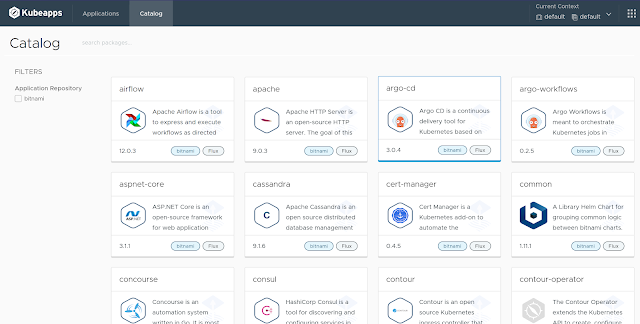
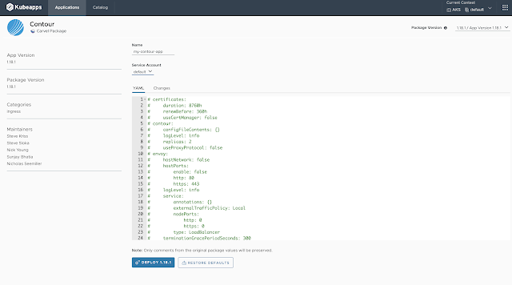
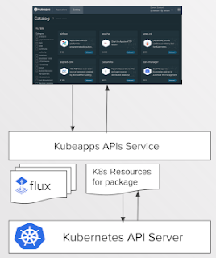
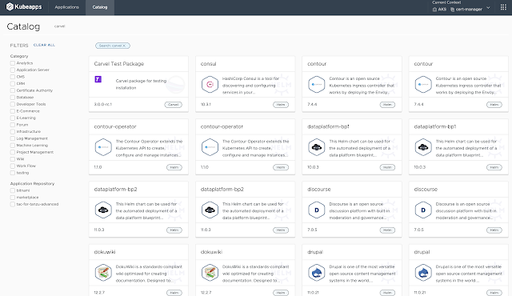
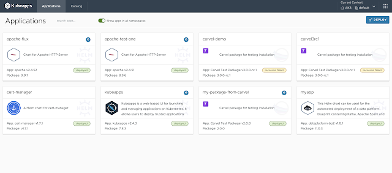
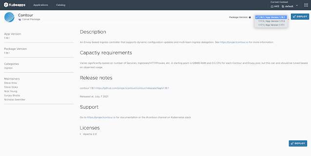
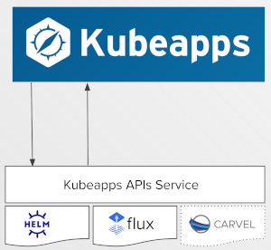
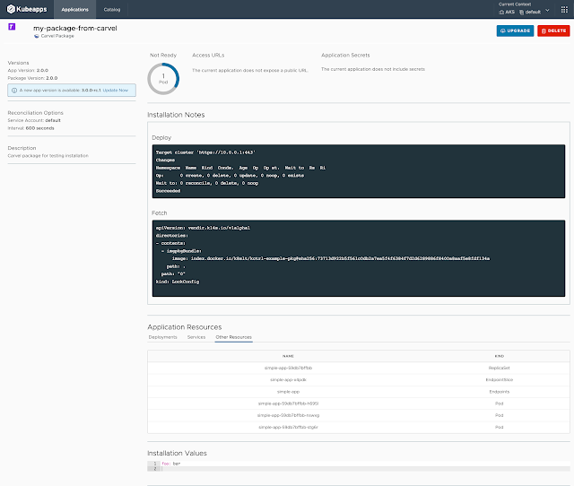
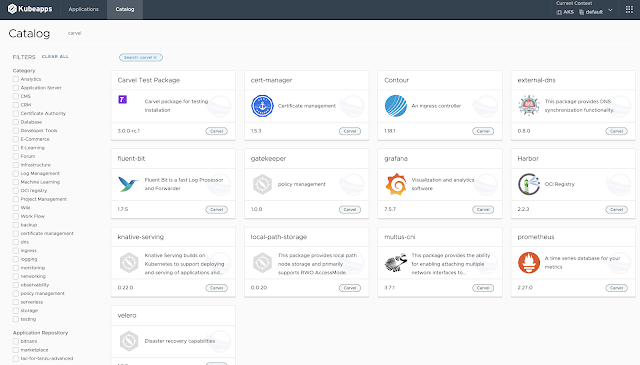
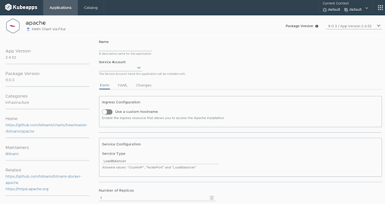

{}
Originally published on the [Bitnami blog](https://blog.bitnami.com/2022/03/kubeapps-243-now-supports-for-carvel-and-flux.html)
{}

A new release of Kubeapps is out, and it introduces major changes that mark a milestone in the history of this tool. We are thrilled to announce that the support of different Kubernetes packages has now become a reality with the implementation of the Kubeapps API service. Helm charts are no longer the only option to choose from, as now Kubeapps users can deploy Carvel and Flux packages as well! 

In addition to this new capability, the Kubeapps team has solved a long-standing security issue by removing the reverse proxy to the Kubernetes API server. 

Keep reading to learn more about how the team has implemented a pluggable architecture that allows users to discover new implementations that make Kubeapps a robust and secure way to deploy applications on Kubernetes infrastructure. 

We will also cover how to deploy and manage Carvel and Flux packages from the Kubeapps user interface (UI). 

### Kubeapps APIs: A Pluggable System Supporting Different Kubernetes Packages 

The design of the Kubeapps APIs server solves two main goals for Kubeapps. 

**Enables pluggable support for presenting catalogs of different Kubernetes packaging formats for installation.**

Kubeapps coupled with Helm prior to this release and was tied closely to the Helm packaging API for listing, installing, and updating Helm charts. The team has abstracted the functionality for listing, installing, and updating packages so that it can be applied to other packaging formats apart from Helm charts. 

Each format is supported by a plug-in that implements a core gRPC protocol for package interactions. Since each plug-in implements the same packages protocol, Kubeapps can present the results from multiple plug-ins in the UI, so that, for example, both Helm and Carvel packages can be seen in the catalog together. 

**Removes the long-standing requirement for the Kubeapps UI to talk directly with the Kubernetes API server.**

Kubeapps UI gathers data via the resources plug-in. Similarly, prior to this release, the Kubeapps UI needed to communicate directly with the Kubernetes API server and as a result, Kubeapps forwarded requests from the Kubeapps UI through to the Kubernetes API server. The team has now encapsulated the functionality required by the Kubeapps UI into a separate Kubernetes Resources plug-in, which allows the Kubeapps UI to, for example, fetch or watch resources created by a specific installed package (if the authenticated user has access to those resources). 

With this change, only a very limited subset of the functionality of the Kubernetes API server is available to the Kubeapps UI. 

A side effect of these changes is that the client code in the Kubeapps UI can be simplified significantly, which is not only easier to maintain but also opens the possibility for other Kubeapps clients. 

For more details about the implementation of the Kubeapps APIs service, read [Kubeapps APIs: A pluggable system supporting different Kubernetes packages](https://liveandletlearn.net/post/kubeapps-apis-kubernetes-packages/). 

### New Package Types Discoverable through the Kubeapps UI 

This new release comes with new features and capabilities that provide cluster administrators and operators more flexibility when deploying applications on their Kubernetes environments. Let’s deep dive into them! 

Update your Helm repositories to ensure that you have the latest Kubeapps version. Refer to the Get Started guide to learn how to deploy Kubeapps for your cluster. 

Once you have made some configurations in your cluster and set up Kubeapps to enable Carvel and Flux packages, you will be able to find packages labeled as Helm, Carvel, and Flux when navigating to the “Catalog” section. 

The process of deploying Carvel and/or Flux packages from the Kubeapps UI and managing applications is similar to the processes followed for a Helm chart, but there are some requirements that your cluster must carry out to make sure that the deployment of these new packaging formats will work. 

#### Deploy and Manage Carvel Packages with Kubeapps 

_Check out this step-by-step guide tolearn how to [manage Carvel packages with Kubeapps](https://github.com/vmware-tanzu/kubeapps/blob/main/docs/tutorials/managing-carvel-packages.md)._

[Carvel](https://carvel.dev/) offers a set of tools that help you build and configure applications for their deployment on Kubernetes. To enable the consumption of Carvel packages from the Kubeapps UI, you must make some configurations first. 

These are the prerequisite steps to follow to make sure that both your cluster and Kubeapps deployment are ready to work with Carvel packages: 

1. [Install kapp-controller in your cluster ](https://github.com/vmware-tanzu/kubeapps/blob/main/docs/tutorials/managing-carvel-packages.md#installing-kapp-controller-in-your-cluster)
2. [Configure Kubeapps to support Carvel packages ](https://github.com/vmware-tanzu/kubeapps/blob/main/docs/tutorials/managing-carvel-packages.md#configuring-kubeapps-to-support-carvel-packages)
3. [Install a package repository ](https://github.com/vmware-tanzu/kubeapps/blob/main/docs/tutorials/managing-carvel-packages.md#installing-a-package-repository)
4. [Create a service account in your namespace ](https://github.com/vmware-tanzu/kubeapps/blob/main/docs/tutorials/managing-carvel-packages.md#creating-a-service-account)

Once everything is arranged, you’ll be ready to pick packages to deploy on the Kubeapps UI by navigating to the “Catalog” section. 

* Log in to Kubeapps and navigate to the “Catalog” section. Search for Carvel packages. 

* Pick an application to deploy. This blog post uses Contour as an example, but you can choose any other application from your catalog. (You will find detailed information about the package you’re about to deploy such as the requirements, release notes, where to find support, licenses, or the maintainers of the image.) 
* Select the version you want to deploy. Click “Deploy” to continue.

* In the resulting screen, add a name for your deployment, select the service account, and make changes to the YAML file if applicable. Click “Deploy” to finish the process. 

* Navigate to the “Applications” section. If the deployment went smoothly, your application will show a green label saying that the package was installed successfully in your cluster. 
* Click on “Show apps in all namespaces” to get an overview of the applications running in your cluster regardless of the namespace. 

* Look at the deployment details by clicking on the application you just deployed. (In the resulting screen, you will have access to meaningful information such as the number of pods deployed, access URLs, secrets, installation notes, and application resources. Note that from this page, you can also upgrade your application to the next version available or delete it from your cluster.)

#### Deploy and Manage Flux Packages with Kubeapps 

_Check out this step-by-step guide to learnhow to[ manage Flux V2 packages with Kubeapps](https://github.com/vmware-tanzu/kubeapps/blob/main/docs/tutorials/managing-flux-packages.md)._

[Flux](https://fluxcd.io/) is a set of continuous and progressive delivery solutions for Kubernetes that are open and extensible. The latest version of Kubeapps allows you to manage Helm releases declaratively with Kubernetes manifests via Flux V2. Similar to Carvel packages, there are some previous configurations that you must perform in your cluster, as well as Kubeapps installation to fully activate Flux packaging support. 

These are the prerequisite steps to follow to ensure that both your cluster and Kubeapps deployment are ready to work with Carvel packages: 

1. [Install Flux controllers in your cluster ](https://github.com/vmware-tanzu/kubeapps/blob/main/docs/tutorials/managing-flux-packages.md#installing-the-flux-controllers-in-your-cluster)
2. [Configure Kubeapps to support Flux Helm release](https://github.com/vmware-tanzu/kubeapps/blob/main/docs/tutorials/managing-flux-packages.md#configuring-kubeapps-to-support-flux-helm-releases)s 
3. [Install a Flux Helm repository ](https://github.com/vmware-tanzu/kubeapps/blob/main/docs/tutorials/managing-flux-packages.md#installing-a-helm-repository)
4. [Create a service account in your namespace ](https://github.com/vmware-tanzu/kubeapps/blob/main/docs/tutorials/managing-flux-packages.md#creating-a-service-account)

Now everything is ready for the deployment of Helm packages via Flux. 

* Log in to Kubeapps and navigate to the “Catalog” section. Search for Flux packages.

* Pick the package you want to install. In the example shown, Apache is used.

Enter the configuration parameters for your deployment. Note that for Flux, you must enter a Service Account to be used for installing the package. Apart from that, the process for deploying and managing Flux packages is similar to those for any other packages available in Kubeapps.  

#### Laying Down the Foundation for Future Improvements 

Thanks to the implementation of the Kubeapps API service, we will be able to move forward and support different packaging formats in the future as the Kubernetes landscape and the needs of users will evolve. The current release lays down the foundation for making Kubeapps a more inclusive and secure path for Kubernetes deployments. 

#### Support and Resources  

Since Kubeapps is an open source software project, support for this version of Kubeapps will be provided on a best-effort basis. To get a resolution on issues such as deployment support, operational support, and bug fixes, please [open an issue in the Kubeapps GitHub repository](https://github.com/kubeapps/kubeapps/issues). A markdown template is provided by default to open new issues, with certain information requested to help us prioritize and respond as soon as possible. Also, if you want to contribute to the project, feel free to[ send us a pull request](https://github.com/kubeapps/kubeapps/pulls), and the team will guide you in the process for a successful merge. 

In addition, you can reach out to Kubeapps developers at [#kubeapps ](https://kubernetes.slack.com/messages/kubeapps)on Kubernetes Slack (click[ here](http://slack.k8s.io/) to sign up). 

For more information about the topics discussed in this blog post, refer to the following links: 

* [Get Started with Kubeapps ](https://github.com/kubeapps/kubeapps/blob/main/docs/user/getting-started.md)
* [Managing Carvel Packages with Kubeapps ](https://github.com/vmware-tanzu/kubeapps/blob/main/docs/tutorials/managing-flux-packages.md)
* [Managing Flux V2 Packages with Kubeapps ](https://github.com/vmware-tanzu/kubeapps/blob/main/docs/tutorials/managing-flux-packages.md)
* [Bitnami Application Catalog documentation for Helm charts ](https://docs.bitnami.com/kubernetes/apps/)
* [Bitnami documentation for Kubernetes deployments ](https://docs.bitnami.com/tutorials/)