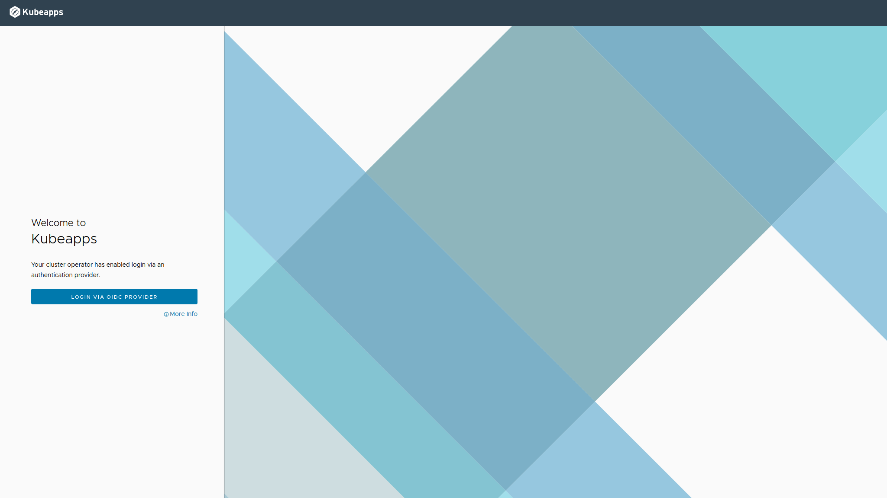

_Special thanks to Antonio Gamez and Michael Nelson, members of the VMware Kubeapps Team_

The latest version of [Kubeapps (v.2.3.2)](https://github.com/kubeapps/kubeapps/releases/tag/v2.3.2) is now available for deployment on VMware Tanzu™ Kubernetes Grid™ (TKG) workload clusters. VMware Tanzu users already benefit from deploying Kubeapps in several environments and, now with a little configuration Kubeapps can be integrated with your TKG workload cluster.

In addition to this capability,  Kubeapps also features full compatibility with the latest versions of [Pinniped](https://pinniped.dev/) which means that it can be used with [any OIDC provider for your TKG clusters and even in managed clusters](https://github.com/kubeapps/kubeapps/blob/7aa7c579251e0fb5b446ab71a67d8d847d6ce843/docs/user/using-an-OIDC-provider-with-pinniped.md#enabling-oidc-login-in-managed-clusters) such as Azure Kubernetes Service (AKS) and Google Kubernetes Engine (GKE).

Want to know more? Keep reading to discover the latest capabilities of Kubeapps that will enable developers and admin clusters to deploy and manage trusted open-source content in TKG clusters.

## A bit of History: What is Kubeapps?

Kubeapps is an in-cluster web-based application that enables users with a one-time installation to deploy, manage, and upgrade applications on a Kubernetes cluster.

This past year, the Kubeapps team has added key new features to support different use cases and scenarios. Firstly, we added [support for private Helm and Docker registries](https://blog.bitnami.com/2020/05/kubeapps-now-supports-private-docker-registries.html) and later, in [Kubeapps version 2.0](https://blog.bitnami.com/2020/10/Kubeapps-2.0.html), we built support to run Kubeapps on various VMware Tanzu ™ platforms such as Tanzu ™ Mission Control, vSphere and Tanzu ™ Kubernetes Grid.

With Kubeapps you can:

*   Customize deployments through an intuitive, form-based user interface
*   Inspect, upgrade and delete applications installed in the cluster
*   Browse and deploy from public or private chart repositories including VMware Marketplace™ and Bitnami Application Catalog
*   Secure authentication to Kubeapps using an OAuth2/OIDC provider such as the VMware Cloud Service Portal
*   Secure authorization based on Kubernetes role-based access control

##  Key Features of Kubeapps 2.3.2

In this Kubeapps release, we have focused on delivering key user experience features including the capability to enable Tanzu users to deploy Kubeapps directly as a Helm chart in TKG workload clusters. This version is tested and validated on the latest version of TKG (v1.3.1)

Once Kubeapps is up and running, cluster admins will benefit from having :

*   SSO for Authentication with TKG using Pinniped by configuring an OIDC provider
*   Ability to configure VMware Tanzu™ Application Catalog (TAC) as a private Chart repository;
*   Capability to configure VMware Marketplace ™ Catalog and the Bitnami Application Catalog as public chart repositories;
*   A customized user interface adapted to the Tanzu look and feel.

_Kubeapps support for SSO Authentication_

All these new capabilities are designed to offer a seamless experience between Kubeapps and Tanzu Kubernetes Grid clusters. 

## How can I configure Kubeapps to run in my TKG clusters?

Tanzu users can execute these simple steps to gain the maximum advantage with this new version of Kubeapps:

1. Configure your cluster to enable SSO for Authentication with TKG using Pinniped and integrate Kubeapps with the identity management provider
2. Adjust the Kubeapps user interface to get a customized look and feel
3. Configure role-based access control in Kubeapps (RBAC) to manage roles and permissions among the teams in your organization
4. Deploy Kubeapps in the cluster
5. Add public and private repositories to Kubeapps: the public VMware Marketplace™ repository and your private [VMware Tanzu Application Catalog](https://tanzu.vmware.com/application-catalog) for [Tanzu Advanced](https://tanzu.vmware.com/tanzu/advanced) repository

At this point your development team can start deploying, listing, removing and managing applications in your TKG clusters from the Kubeapps user interface with total confidence!

Refer to the Kubeapps documentation to learn how to [deploy and configure Kubeapps on VMware Tanzu Kubernetes Grid.](https://github.com/kubeapps/kubeapps/tree/master/docs/step-by-step/kubeapps-on-tkg)

## Support and Resources

Since Kubeapps is an OSS project, support for this version of Kubeapps will be provided on a best-effort basis. 

For solving the problems you may have (including deployment support, operational support and bug fixes), please [open an issue in the Kubeapps GitHub repository.](https://github.com/kubeapps/kubeapps/issues) A markdown template is provided by default to open new issues with the information requested to prioritize and respond to them as soon as possible.

Also, if you want to contribute to the project, feel free to [send us a pull request,](https://github.com/kubeapps/kubeapps/pulls) and the team will check it and guide you in the process for a successful merge.

[The Kubeapps documentation section](https://github.com/kubeapps/kubeapps/tree/master/docs) is full of useful resources to help you get the best of the chart.

Check out the step-by-step guide for [deploying and configuring Kubeapps on VMware Tanzu™ Kubernetes Grid™](https://github.com/kubeapps/kubeapps/tree/master/docs/step-by-step/kubeapps-on-tkg) and the [Bitnami documentation tutorials site](https://docs.bitnami.com/tutorials/) for improving your Kubernetes skills.

For more information on VMware Tanzu Kubernetes Grid, refer to [its documentation page](https://docs.vmware.com/en/VMware-Tanzu-Kubernetes-Grid/index.html)  where you will find handy information on managing your Kubernetes clusters.
