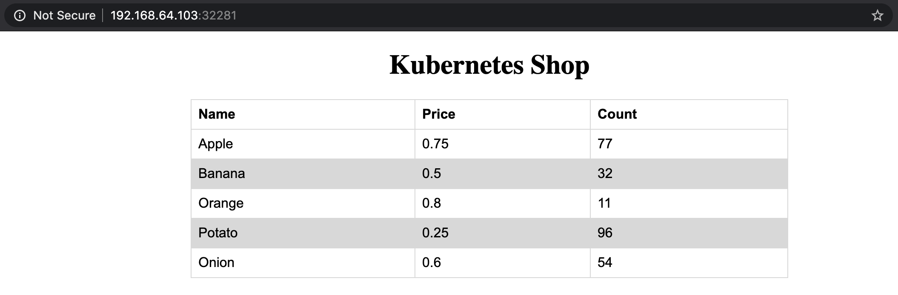

When you’re first learning how Kubernetes works, or are developing code that leverages Kubernetes, you’re likely to find yourself looking to one of the many options available to run it locally. As with almost anything in technology, there are more options than you probably know what to do with,  which can leave you   asking yourself which one you should use. Minikube? Kind? Microk8s? Even Docker Desktop ships with the ability to spin up Kubernetes.

Consider a scenario in which you need to develop and test on Kubernetes locally. For example, [Spring Cloud Kubernetes](https://spring.io/projects/spring-cloud-kubernetes) gives you tools such as service discovery, which enables you to look up Kubernetes services, as well as the ability to set properties in your code using ConfigurationMaps. This post will use a simple two-tier application that has a frontend (written in Spring) that looks up where the backend service is (also written in Spring) by looking up the service name that exposes it. The backend service presents a REST API that reports inventory information about an imaginary grocery store, and the frontend application visualizes it.

Since the whole point is to develop locally, you’ll deploy the backend, then get a shell into another pod that mounts a volume from your local machine containing the frontend code. This will allow you to rapidly iterate changes to the code without building and deploying a new container every time.

The code for all of the examples can be found on [GitHub](https://github.com/BrianMMcClain/local-k8s-demo). Since in this post we will be creating a volume mounted into a pod from your local machine, go ahead and clone this code. 

## Minikube

[Minikube](https://minikube.sigs.k8s.io/docs/) might  be the solution you’re most familiar with. For a while, it was the method for running Kubernetes locally. One thing that makes Minikube stand out from other options is the flexibility it gives for how it runs Kubernetes by using different [drivers](https://minikube.sigs.k8s.io/docs/drivers/). You can run it in a VM by using the [VirtualBox](https://minikube.sigs.k8s.io/docs/drivers/virtualbox/), [HyperKit](https://minikube.sigs.k8s.io/docs/drivers/hyperkit/) or [VMware](https://minikube.sigs.k8s.io/docs/drivers/vmware/) driver, or you can run it in a container using the [Docker driver](https://minikube.sigs.k8s.io/docs/drivers/docker/). You can even run it on [bare metal](https://minikube.sigs.k8s.io/docs/drivers/none/), albeit with some work. For this example, we’ll use the HyperKit driver, and assume you already have Minikube and HyperKit installed. Minikube allows you to easily set up Kubernetes in a single command:

```bash
minikube start --driver=hyperkit
```

Once it’s ready to go, your `kubectl` context will automatically be updated to point to Minikube. Next, deploy the backend service just as you would any other Kubernetes deployment:

```bash
kubectl apply -f https://raw.githubusercontent.com/BrianMMcClain/local-k8s-demo/main/apps/backend-deployment.yaml
```

This will create a deployment for the backend application, as well as a service of type `ClusterIP` named `k8s-shop-backend-service` so that our frontend can access the application.

To mount the local directory into a pod, Minikube provides a handy command. The `minikube mount` command mounts your local directory into the Kubernetes host. From the `local-k8s-demo` root directory, run the following:

```bash
minikube mount ./apps/k8s-shop-frontend:/node-mount
```

> NOTE: You’ll need to leave this process running in a separate shell to keep this directory mounted.

While this command mounts the directory from your local machine into the Kubernetes host, you’ll still need to mount the directory from the host into a pod. To do this, you can rely on standard Kubernetes features by defining a volume using the `hostPath` configuration option, then mounting that volume in a pod. Consider the following pod definition:

```yaml
apiVersion: apps/v1
kind: Deployment
metadata:
  name: mount-demo
  labels:
    app: mount-demo
spec:
  replicas: 1
  selector:
    matchLabels:
      app: mount-demo
  template:
    metadata:
      labels:
        app: mount-demo
    spec:
      serviceAccountName: mount-demo-user
      containers:
      - name: mount-demo
        image: adoptopenjdk:11.0.7_10-jdk-hotspot-bionic
        ports:
        - containerPort: 8080
        args:
        - bash
        stdin: true
        stdinOnce: true
        tty: true
        workingDir: /pod-mount
        volumeMounts:
        - name: node-mount
          mountPath: /pod-mount
      volumes:
      - name: node-mount
        hostPath:
          path: /node-mount
```

You can see near the end that a volume named `node-mount` is defined, with the `hostPath` option pointing to the `/node-mount` directory that we defined previously. Above it, in the `volumeMounts` section, mount that volume at the `/pod-mount` path in the container. The rest of the pod spec gives you everything you need to build and run Spring applications by using the [adoptopenjdk container image](https://hub.docker.com/_/adoptopenjdk). The YAML in GitHub defines a few other things, including a service account that our application will need in order to access the Kubernetes API. Apply this YAML as well:

```bash
kubectl apply -f https://raw.githubusercontent.com/BrianMMcClain/local-k8s-demo/main/jdk-pod.yaml
```

After a few moments, you’ll see a new pod running named `mount-demo`:

```bash
$ kubectl get pods
NAME                                READY   STATUS    RESTARTS   AGE
k8s-shop-backend-665555747f-g4gxs   1/1     Running   0          3m42s
mount-demo-6bd44544d-gd9m6          1/1     Running   0          54s
```

Note the name of the pod, and get a running shell inside of it:

```bash
$ kubectl exec -it mount-demo-6bd44544d-gd9m6 -- /bin/bash

root@mount-demo-6bd44544d-gd9m6:/pod-mount#
```

Great! You now have a shell in the running container, and you’re automatically dropped into the `/pod-mount` directory (thanks to the `workingDir` option in the deployment spec). If you look at the files of this directory, you’ll notice that these match the files in the `apps/k8s-shop-frontend` directory in the demo repository!

```bash
$ ls
HELP.md  mvnw  mvnw.cmd  pom.xml  src  target
```

These files are a direct link back to your local machine. Any changes you make on your machine are reflected in the pod and vice-versa; it’s not a copy. You can run this application as you would any other Spring application:

```bash
$ ./mvnw spring-boot:run
…
2020-07-14 20:33:10.319  INFO 65 --- [  restartedMain] o.s.b.w.embedded.tomcat.TomcatWebServer  : Tomcat started on port(s): 8080 (http) with context path ''
```

There’s one final thing you need to do to access this application, and that’s expose the service from Minikube to your machine. The YAML that you last applied created a service, which you can see running:

```bash
$ kubectl get service mount-demo-service
NAME                 TYPE           CLUSTER-IP      EXTERNAL-IP   PORT(S)          AGE
mount-demo-service   LoadBalancer   10.107.92.243   <pending>     8080:32281/TCP   8m32s
```

Minikube provides another handy command, which allows you to easily connect the bridge between Minikube and your machine just by passing it the service name:

```bash
$ minikube service mount-demo-service

|-----------|--------------------|-------------|-----------------------------|
| NAMESPACE |        NAME        | TARGET PORT |             URL             |
|-----------|--------------------|-------------|-----------------------------|
| default   | mount-demo-service |        8080 | http://192.168.64.103:32281 |
|-----------|--------------------|-------------|-----------------------------|
🎉  Opening service default/mount-demo-service in default browser...
```

After running the command, the Minikube CLI will open up your default browser and point it to this service automatically, showing you your very own Kubernetes Shop!



Try modifying the code and re-running the Spring application, and you will see these changes reflected in your pod. This gives you a great way to rapidly try changes to code that directly relies on Kubernetes, in this case testing the code that queries the Kubernetes API to find the backend service. When you’re down, you can tear down your Minikube environment:

```bash
minikube delete
```

## kind

kind is quickly gaining popularity over Minikube. Short for “Kubernetes in Docker,” kind takes a somewhat different approach to running Kubernetes than Minikube. As the name suggests, kind only runs Kubernetes inside of Docker, yet provides options more closely related to its original purpose: testing Kubernetes. This makes it a great fit for both running Kubernetes in CI environments and locally in a development environment.

Let’s look at the same scenario that we worked though with Kubernetes, and assume that you already have kind and Docker installed. If we were only standing up a standard, single-node Kubernetes instance with no custom configuration, you would be able to get going with a single command. But in order to mount our local development directory into the Kubernetes node, we’ll need to provide it a config, which you can find at [`kind/kind.yaml`](https://github.com/BrianMMcClain/local-k8s-demo/blob/main/kind/kind.yaml) in the demo repository. Take a quick look at what this file contains:

```yaml
kind: Cluster
apiVersion: kind.x-k8s.io/v1alpha4
nodes:
- role: control-plane
  extraMounts:
  - hostPath: ./apps/k8s-shop-frontend
    containerPath: /node-mount
```

Here we’ve defined that we want one node of type `control-plane` (which will also run pods). We and mount the `apps/k8s-shop-frontend` directory on the node at `/node-mount`, just as we did in Minikube. With this configuration ready, you can tell kind to create a cluster:

```bash
$ kind create cluster --config kind/kind.yaml

Creating cluster "kind" ...
 ✓ Ensuring node image (kindest/node:v1.18.2) 🖼
 ✓ Preparing nodes 📦
 ✓ Writing configuration 📜
 ✓ Starting control-plane 🕹️
 ✓ Installing CNI 🔌
 ✓ Installing StorageClass 💾
Set kubectl context to "kind-kind"

You can now use your cluster with:

kubectl cluster-info --context kind-kind
```

As we also saw with Kubernetes, our `kubectl` context is already updated. Let’s deploy the backend as well as the development pod as we did last time:

```bash
$ kubectl apply -f https://raw.githubusercontent.com/BrianMMcClain/local-k8s-demo/main/apps/backend-deployment.yaml

deployment.apps/k8s-shop-backend created
service/k8s-shop-backend-service created

$ kubectl apply -f https://raw.githubusercontent.com/BrianMMcClain/local-k8s-demo/main/jdk-pod.yaml

serviceaccount/mount-demo-user created
clusterrolebinding.rbac.authorization.k8s.io/mount-demo-binding created
deployment.apps/mount-demo created
service/mount-demo-service created
```

Likewise, we’ll get the `mount-demo` pod name and get a running shell into it:

```bash
$ kubectl get pods
NAME                                READY   STATUS    RESTARTS   AGE
k8s-shop-backend-665555747f-6xgd2   1/1     Running   0          111s
mount-demo-6bd44544d-mcl65          1/1     Running   0          66s

$ kubectl exec -it mount-demo-6bd44544d-mcl65 -- /bin/bash

root@mount-demo-6bd44544d-mcl65:/pod-mount#
```

If you poke around, you’ll see once again that the local directory on your machine is accessible in the pod. The difference this time is that the mount between your machine and kind had to be provided when creating your cluster in the configuration YAML, rather than as a separate command. Again, start the Spring application:

```bash
$ ./mvnw spring-boot:run
...
2020-07-14 21:02:50.344  INFO 64 --- [  restartedMain] o.s.b.w.embedded.tomcat.TomcatWebServer  : Tomcat started on port(s): 8080 (http) with context path ''
```

All that remains is getting access to this frontend on our local machine. Kind has a [few options for ingress](https://kind.sigs.k8s.io/docs/user/ingress/), but to keep things simple, we’ll instead forward a local port into the Kubernetes cluster using a standard `kubectl` command:

```bash
$ kubectl port-forward service/mount-demo-service 8080:8080
Forwarding from 127.0.0.1:8080 -> 8080
```

Leaving this shell open, you can now access the application at [http://127.0.0.1:8080](http://127.0.0.1:8080)! Again, try changing the code on your local machine and re-starting the app, and you’ll see these changes reflected. Once you’re done, you can delete the kind cluster with the following command:

```bash
kind delete cluster
```

## Docker Desktop

The advantage that [Docker Desktop](https://www.docker.com/products/docker-desktop) provides is that if you already have it installed, there’s nothing else you need to download to get started. You can simply [enable Kubernetes](https://www.docker.com/blog/kubernetes-is-now-available-in-docker-desktop-stable-channel/) and set `kubectl` to the `docker-desktop` context:

```bash
kubectl config use-context docker-desktop
```

That’s it; you’re all set! Let’s once again run through the same scenario that we did for Minikube and kind, starting by deploying the backend applications:

```bash
kubectl apply -f https://raw.githubusercontent.com/BrianMMcClain/local-k8s-demo/main/apps/backend-deployment.yaml
```

There’s one important difference for the pod specification for the frontend application, however. Since [much of your local filesystem is shared with Docker by default](https://docs.docker.com/docker-for-mac/#file-sharing), we are effectively the “host” in the `hostPath`, albeit indirectly. That means the volume definition will need to point at the absolute path on your local machine, not to some intermediate path. This makes sharing it a bit more tricky, but with some command-line magic, we can keep it relatively simple. First, let’s take a look at the difference in the volume definition:

```yaml
volumes:
- name: node-mount
  hostPath:
    path: LOCAL_DIR/apps/k8s-shop-frontend
```

Here, we’re using `LOCAL_DIR` as a placeholder that will be replaced when we apply this YAML, which we can do by using `sed`. From the root of the `local-k8s-demo` directory, run the following command:

```bash
wget -O - https://raw.githubusercontent.com/BrianMMcClain/local-k8s-demo/main/docker-desktop/jdk-pod.yaml | sed -e "s,LOCAL_DIR,`pwd | tr -d '\n'`," | kubectl apply -f -
```

This string of commands will get the contents of the YAML for the pod spec, replace `LOCAL_DIR` with the output of `pwd` (with the `tr` command helping with some formatting to remove a trailing newline), then send all of that to `kubectl apply`. As usual, in just a few moments you’ll see a `mount-demo` pod up and running, into which you can get a running shell and start the app like you did before:

```bash
$ kubectl get pods

NAME                                READY   STATUS    RESTARTS   AGE
k8s-shop-backend-86468bf989-sqrpg   1/1     Running   0          45m
mount-demo-847d555974-8wgmz         1/1     Running   0          99s

$ kubectl exec -it mount-demo-847d555974-8wgmz -- /bin/bash

root@mount-demo-847d555974-8wgmz:/pod-mount# ./mvnw spring-boot:run
…
2020-07-15 15:57:38.129  INFO 63 --- [  restartedMain] o.s.b.w.embedded.tomcat.TomcatWebServer  : Tomcat started on port(s): 8080 (http) with context path ''
```

Just as you did with kind, you can forward a local port to the `mount-demo-service` and access the running application at [http://localhost:8080](http://localhost:8080)

```
$ kubectl port-forward service/mount-demo-service 8080:8080

Forwarding from 127.0.0.1:8080 -> 8080
```

Again, you’ll see the frontend application running from the mounted directory from your local machine.

## Thinking Ahead

You’ve now learned three different ways to accomplish the same goal: Develop code that relies on the Kubernetes API locally. Although each solution takes a slightly different approach—some providing helping tools baked in their own solution,  others choosing not to deviate from the standard toolkit of Kubernetes—each one allows you to iterate and test your code easily and quickly. Give them a try and see which one best fits your needs!

> Acknowledgement: This blog was inspired by research done by Denny Herbrich. Denny is a part of the Platform Engineering team at VMware, and you can find him on [LinkedIn](https://www.linkedin.com/in/denny-herbrich/) as well as [Medium](https://medium.com/@denny.herbrich).