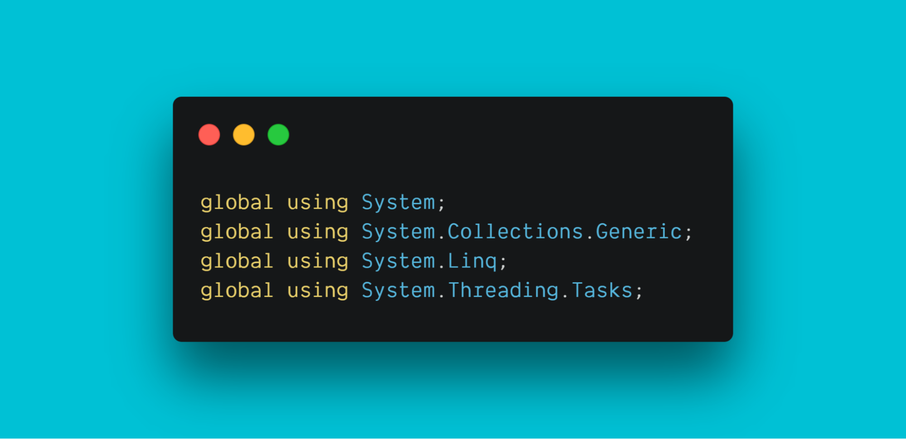

If you’re a C# developer, you’ll recognise the oftentimes extensive list of using directives at the top of a `.cs` or `.razor` file. You’ll have also most likely considered a way to obfuscate them - maybe in a `#REGION`, maybe a setting in an IDE. Many are duplicated across multiple files; I’m looking at you, `System`, and all your little derivatives! 

Although there is nothing inherently wrong with this, it’s been a convention since 2002, it just takes up a lot of screen space at the top of every file.

With C# and .NET 6, however, all that can change...


## Introducing the new Global Using Directive!

Before you can start making use of [Global Using Directive](https://docs.microsoft.com/en-us/dotnet/csharp/whats-new/csharp-10#global-using-directives), you will need:

- The [.NET 6 SDK](https://dotnet.microsoft.com/download/dotnet/6.0) installed
- An IDE of your choice as long as it supports .NET 6

## Creating a global usings file

Many of the most common using directives will already be in a global format out of the box, known as “implicit using directives”, but I find this obfuscation a little confusing.

Implicit using directives will mean the compiler automatically adds a set of using directives based on the project type, meaning the most common libraries will be available out-of-the-box. For example, in a console application, the following directives are implicitly included in the application:

```c#
using System;
using System.IO;
using System.Collections.Generic;
using System.Linq;
using System.Net.Http;
using System.Threading;
using System.Threading.Tasks;
```


I prefer to be explicit and add all of the global usings to a new file in the root of every project. 

To disable the implicit using directive feature, add `<ImplicitUsings>disable</ImplicitUsings>` to the `.csproj` file.

What you call your file is up to you. I like to call it `usings.cs`, but I have seen `.usings` used also.

Now, rather than repeatedly adding the many duplicated usings to each and every file, we can add them just once to the `usings.cs` file, prefixed with the keyword `global`.

```c#
global usings System;
global using static System.Math;
global using json = System.Text.Json;
```



The keyword `static` can still be used to access static members of a type without having to qualify the access with the type name, as well as global aliases.

## Add all the things… Not quite!

If we think about the reason why we have usings on a per-file basis, we would think “scope.”

Scope refers to the visibility of variables and methods in one part of a program, compared to another part of that program. Commonly, we would scope code on a per-file basis, or locally.

If we start to have all of the code globally scoped, we may come up against naming conflicts or even some unexpected behaviour. Before blindly extracting every using directive out to the new usings file, consider the following:

- Is it only used in this file? If so, then it doesn’t make sense to globally scope the API.
- Is there a naming conflict? If so, does aliasing the namespace make sense?

If it really doesn’t make sense to extract these using directives to the global usings file, then don’t. Only extract the using directives that are shared across multiple files.

Now, whether or not you put these locally scoped using statements inside or outside the namespace statement is an entirely different question. Check out this [Stack Overflow](https://stackoverflow.com/questions/125319/should-using-directives-be-inside-or-outside-the-namespace) question and make up your own mind 😉.

This post was part of the [C# Advent Calendar](https://csadvent.christmas) 🎄.

Thanks for reading. If you have any thoughts or ideas, please say hello on any of the channels below:

Email: laylap@vmware.com  
Twitter: [@LaylaCodesIt](http://twitter.com/laylacodesit)  
GitHub: [layla-p](https://github.com/Layla-P)  
Twitch: [LaylaCodesIt](https://www.twitch.tv/laylacodesit/)