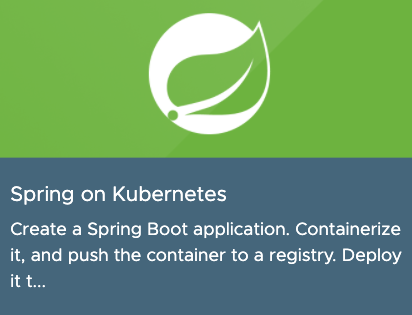
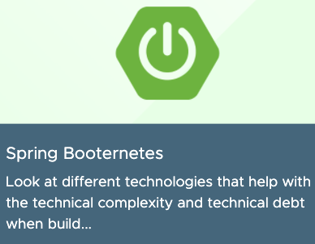
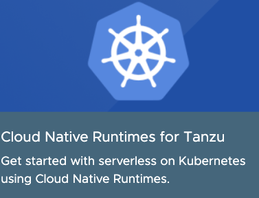

## Interactive labs with real containers, on real K8s clusters on the latest Spring open source and Tanzu + open source

Photo by [Nicole Wolf](https://unsplash.com/@joeel56?utm_source=unsplash&utm_medium=referral&utm_content=creditCopyText) on [Unsplash](https://unsplash.com/s/photos/dev?utm_source=unsplash&utm_medium=referral&utm_content=creditCopyText)

[SpringOne](https://springone.io) is the leading conference for the most popular and beloved Java framework, Spring. This year’s conference, held September 1–2, was packed with useful information and exciting announcements. In addition to the keynotes and breakout sessions, the self-paced labs had in-depth training on the latest breakthroughs in Spring and related technologies. The labs are made for all skill levels and can be completed even with little Spring knowledge, all within a real environment. Best of all, they are free, and now they will be hosted at the [VMware Tanzu Developer Center](https://tanzu.vmware.com/developer/)! 

Learning with the labs in the [Tanzu Developer Center](https://tanzu.vmware.com/developer/) is a shortcut to leveling up your coding skills and trying new technologies. The labs are responsive and provide a real environment designed to reduce student errors. Your environment exposes containers and real Kubernetes clusters and includes the required packages and tools while avoiding the hassle of setting up a new environment. The labs include an integrated code editor, terminals, and easy-to-follow instructions. This is a big time saver, saving you the trouble of deleting and uninstalling software and tearing down an environment. The SpringOne labs give you the opportunity to test new tech without having to invest your own resources or wasting time. Just spin up an environment and get coding!

### What the labs are about

Kubernetes is widely praised for its amazing capabilities, one of which is how applications are treated using cloud native principles—a specialty of Spring Boot that has been perfected over the years. This year’s SpringOne conference showed us that developers are excited to learn about Kubernetes and Spring Boot working together, two complementary technologies that fit tightly together. Our most popular labs this year were on ... you guessed it, [Spring on Kubernetes](https://tanzu.vmware.com/developer/workshops/spring-on-kubernetes/) and [Spring Booternetes](https://tanzu.vmware.com/developer/workshops/lab-spring-booternetes/). 

I remember [Spring on Kubernetes](https://tanzu.vmware.com/developer/workshops/spring-on-kubernetes/) going viral within VMware, seemingly appearing on every Slack channel, when it originally was released on [hackmd.io](https://hackmd.io/@ryanjbaxter/spring-on-k8s-workshop#Spring-on-Kubernetes) by Ryan Baxter and Dave Syer, two Spring engineers. This is the perfect lab if you are interested in either Spring or Kubernetes. [Spring on Kubernetes](https://tanzu.vmware.com/developer/workshops/spring-on-kubernetes/) is special for being incredibly comprehensive and close to real development. You can build a Spring Boot application, containerize it, and interact with it. Then, you’ll learn how to deploy your app to Kubernetes in several ways and even add a MySQL database. 

Additionally, you will learn how to test your application and use development tools like Skaffold and Kustomize. In all, the experience is very similar to iterating on a real Spring Boot application where you would externalize your configuration and program service discovery, finally deploying to Kubernetes. I personally have taken this lab dozens of times, learning something new each time, and I regularly come back to it for reference.

This year we had a special surprise, a lab presented by the renowned Josh Long (@starbuxman)! He contributed his [Spring Booternetes](https://tanzu.vmware.com/developer/workshops/lab-spring-booternetes/) lab to teach about reducing the complexity and technical debt involved in building a distributed system, then deploying it to Kubernetes. This lab is also made for people at all levels. Beginners can be introduced to concepts like reading and writing to a database, while intermediate-level Spring Boot developers might get the most out of the more-advanced concepts that are covered. Josh’s lab is also fun and will keep you engaged with its provocative writing, while being stuffed to the brim with knowledge—much like he is. Expect lessons about reactive streams, Spring Cloud Gateway, Micrometer, Spring Boot Actuator, Cloud Native Buildpacks, and of course deploying to Kubernetes. Try his lab for lots of microservice goodness and modern patterns and infrastructure.

This year also featured [Cloud Native Runtimes for Tanzu,](https://tanzu.vmware.com/developer/workshops/lab-cnr-serving/) where you get to deploy a Spring Petclinic application to Kubernetes using serverless technology. Petclinic is almost a “Hello world” for Spring and is used in many demos. That said, Petclinic is already several years old and not as modern as it once was, even with its updates. Still, cutting edge serverless technology allows you to deploy this app into your Kubernetes cluster.

The [Cloud Native Runtimes ](https://tanzu.vmware.com/developer/workshops/lab-cnr-serving/)lab is a quick experience that you can finish in as little as 10 or 15 minutes. In that time you will learn how to distribute traffic across different versions of your application as you roll them out onto your own Kubernetes cluster. Since [Cloud Native Runtimes ](https://tanzu.vmware.com/developer/workshops/lab-cnr-serving/)is based on Knative, this knowledge coexists with the open source solution. 

If you are looking to acquire knowledge that you can use now and apply regardless of technology, I recommend the series on cloud native development. These two labs, [Building and Deploying a Cloud Native Application](https://tanzu.vmware.com/developer/workshops/cnd-deploy-practices/) and [Configuring a Cloud Native Application, ](https://tanzu.vmware.com/developer/workshops/cnd-config-practices/)focus on cloud native principles, architecture, and techniques. Both labs use Spring and Kubernetes to show these concepts, but knowledge in those subjects is not required as it’s not meant to teach those subjects. Instead, they teach the concepts needed to build truly cloud native apps and how to configure them, concepts that can be used everywhere. 

## Beginner Spring Boot Labs

If you are brand new to Spring Boot, we have a few labs that will give you a jumpstart. In the [Building a Spring Boot Application](https://tanzu.vmware.com/developer/workshops/cnd-config-practices/) lab, you will build an application and add services to it to get an idea of what Spring Boot is about and what makes it special. It even includes some basic testing. The [Spring Cloud Gateway](https://tanzu.vmware.com/developer/workshops/lab-spring-gateway/) lab will help you build an API gateway with Spring with a few lines of code. Last but not least, the [Spring Microservices](https://tanzu.vmware.com/developer/workshops/lab-microservice/) lab is about building a simple microservice using Spring. All of the beginner labs are shorter than most, so you can take them in 15 to 30 minutes to get started on your journey with Spring. Even if you are not a developer, these beginner labs can help you understand the Spring framework.

### Coming soon: Building an NFT Digital Asset Exchange Using Spring and Blockchain

One of the most requested labs at SpringOne was Building an NFT Digital Asset Exchange Using Spring and Blockchain. This lab is exciting because you get to build a Spring Boot application and learn about VMware Blockchain. The Spring Boot application you build uses `Web3j` to interact with Ethereum running on VMware Blockchain. After that, you create REST services to interact with a sample `Ethereum ERC-721` smart contract. Finally, you deploy a "Poem NFT Marketplace" and create, then transfer a Poem as an NFT digital asset.

We hope these labs help you develop your own development skills. For more, [sign up for our newsletter](https://tanzu.vmware.com/developer/community/) to be part of our community to stay informed about new labs, guides, workshops, blogs, videos, and other helpful resources from industry and community experts. If you sign up, you will also be informed about special events like [SpringOne Tour](https://tanzu.vmware.com/developer/tv/springone-tour/), where we have given away one-of-a-kind Spring swag. You can also visit the direct link [here](https://tanzu.vmware.com/developer/workshops/) to take one of the labs and to see the full list of available labs. If you missed SpringOne and want to catch up or rewatch a talk, visit this [link](https://springone.io).
