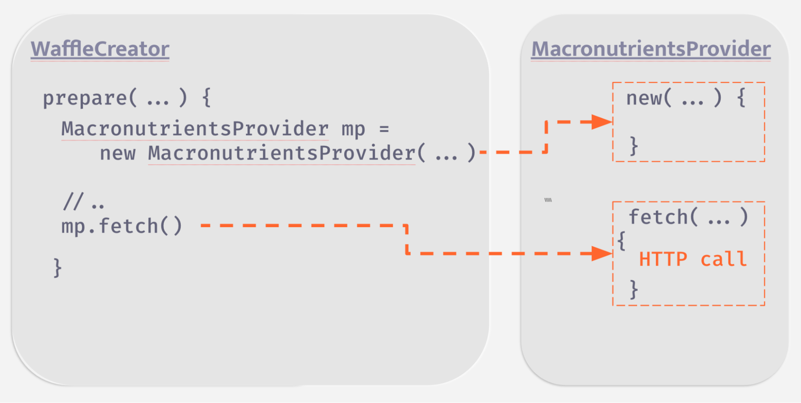
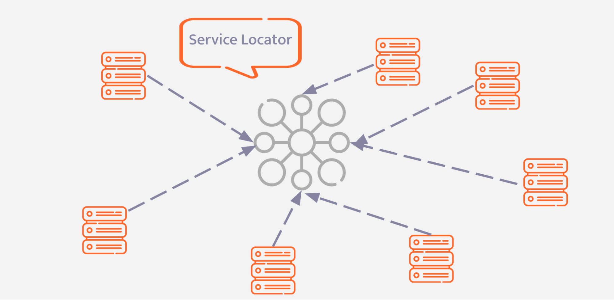
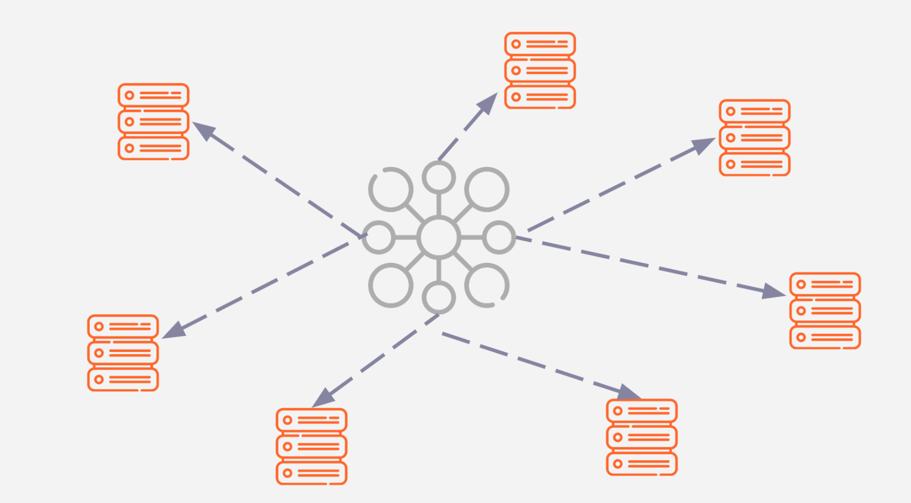

---
date: 2022-08-23
description:
team:
- Jakub Pilimon
- Layla Porter
title: "Write More Maintainable, Testable Code with Dependency Injection"
---

Nowadays, web developers seem to be mainly focused on the cloud, microservices, containers, and scale. In reality, some just work with an old legacy system, struggling with it from one day to the next. Defining “legacy” is probably a post in itself, but for the sake of this post consider this  one assumption:

> The deployment strategy does not constitute a legacy system. It’s all about the structure of the codebase. 

The structure of a system can be improved with the use of established software design patterns. This post aims to give an overview of two such patterns, Dependency Injection (DI) and Inversion of Control (IoC).
An understanding of object-oriented programming (OOP) is beneficial for this post, along with some knowledge of Java, although not essential.


## A lack of extensibility and testability

I have created a small demo application (waffle app) that creates waffle orders with this program flow: 
A request to create a waffle gets handled by the `WaffleCreator`’s prepare method
`WaffleCreator` creates the `MacronutrientsProvider`
`WaffleCreator’ uses the `MacronutrientsProvider`

The code for this demo is as follows:

```java
class WaffleCreator {

    Waffle prepare(String name, Waffle.Type type) {
        if (type == Waffle.Type.LOW_SUGAR) {
            MacronutrientsProvider ingredientsProvider
                    = new MacronutrientsProvider("http://nosugar.com");
            Macronutrients macro = ingredientsProvider.fetch();
            if (macro.isLowSugar()) {
                return new Waffle(name, macro);
            }
            throw new HighSugarWaffle();
        }
        if (type == Waffle.Type.HIGH_SUGAR) {
            //omitted
        }
        return new Waffle(name, new Macronutrients(0, 0, 0));
    }
}

class MacronutrientsProvider {
    private final String url;

    MacronutrientsProvider(String url) {
        this.url = url;
    }

    Macronutrients fetch() {
        //do http call...
    }
}
```

The `MacronutrientsProvider` has a dependency on a third-party system, in this case, an API.

Even though the code looks simple and concise, it contains problems that are easily relatable to those of larger systems from the real world. There is an object, `WaffleCreator` that interacts with an instance of `MacronutrientsProvider`. One can say this is Object-Oriented Programming. Objects exchanging messages with other objects. 

In the real world, cooperation between people is not that different.  When you want to send a parcel, we talk to a courier. In this collaboration, we assume two things:
1. In the set of people we know and can collaborate with, there is a courier
2.  We know, thanks to our life experience, how to collaborate with a courier (what messages to send)

However, we don’t need to know how to teach a courier to be a courier. We can just rely on a delivery service. Imagine a world where we couldn't do that! We would have to possess a very broad knowledge of courier systems and have to update it frequently as these various professions evolve. 

Yet, this is sometimes the case with software. 

In the case of the waffle app, `WaffleCreator` not only needs to know how to collaborate with the `MacronutrientsProvider` – by calling its `fetch`method, line 7, in the method `create` in the previous code snippet  – but it is also fully aware of how to create/shape a `MacronutrientsProvider`, by *newing* it up, line 6.

That means that `WaffleCreator` is [coupled](https://en.wikipedia.org/wiki/Coupling_(computer_programming)) to `MacronutrientsProvider` in two completely different ways:
- It knows how to create its collaborator (coupling to creation)
- It knows how to use its collaborator (coupling to usage)



This creates at least two problems. 

**Testability** is the first one. 
How can one test `WaffleCreator` in isolation? Since the [system under test](https://en.wikipedia.org/wiki/System_under_test),`WaffleCreator`, is hardcoded with “how to create the dependency”, the problematic *HTTP-based* `MacronutrientsProvider` will make the test somewhat flaky. It will be randomly red, depending on the stability of the dependency.

By the same token, there is no easy way of swapping that dependency without affecting  `WaffleCreator`. Let’s say you want to have a provider that sometimes communicates via HTTP, sometimes talks to a file system, and sometimes uses the internal cache. The current design lacks this kind of **extensibility** - the second problem.
 
In this instance, tight coupling might be a major contributing factor to poor maintainability. 

> Coupling itself is a very broad topic since there are many types of it, but there is a universal truth: the less of it, the better. 

So why not eliminate just *some* of the coupling from the system? 
The knowledge of “how to use the dependency” seems inevitable for the `WaffleCreator`, but one can delegate the knowledge of “how to create the collaborator” somewhere else.

## Introducing the Service Locator pattern

> "Every problem in computer science might be solved by introducing another layer of indirection"
Butler Lampson

There is much truth in the popular phrase above. 

What if one took advantage of it in waffle app? 
In this case, a central registry of dependencies might act as this additional layer. Thus,  `WaffleCreator` would call this new registry and transfer the knowledge of “how to create the dependency” to the registry. The registry can be seen in the following example:

```java
class MacronutrientsProviderLocator {

    static Map<String, MacronutrientsProvider> providers = new HashMap<>();

    static void put(String name, MacronutrientsProvider provider) {
        providers.put(name, provider);
    }

    static MacronutrientsProvider get(String name) {
        return providers.get(name);
    }
}
```

And that is how a dependency can be received:

```java
class WaffleCreator {

    Waffle prepare(String name, Waffle.Type type) {
        //..
        MacronutrientsProvider ingredientsProvider
                = MacronutrientsProviderLocator.get("nosugar");
        //..
        return new Waffle(name, new Macronutrients(0, 0, 0));
    }
}
```

This way, `WaffleCreator` does not need to know how to create its required dependencies. The coupling is removed to the `ServiceLocator` class. Now, there are two different components, each containing different pieces of knowledge.

The newly created `ServiceLocator` class can be populated with different types of providers. For instance, a stubbed version for testing purposes. One is fully in control of how the dependency is created and this control is outside of the `WaffleCreator`. This can be seen in the following example: 

```java
class Config {
     void init() {
         MacronutrientsProviderLocator
                 .put("nosugar", new MacronutrientsProvider("nosugar.com"));
         MacronutrientsProviderLocator
                 .put("gimmeSugar", new MacronutrientsProvider("gimmeSugar.com"));
     }
}
```
For the sake of testing, we can register a stubbed version:

```java
class WaffleCreatorTest {

    WaffleCreator waffleCreator = new WaffleCreator();

    @Test
    void canCreateLowSugarWaffle() {
        //given
        MacronutrientsProvider stubbed = mock(MacronutrientsProvider.class);
        MacronutrientsProviderLocator.put("nosugar", stubbed);

        //when
        Waffle lowSugarBar = waffleCreator.prepare("PROTEIN BAR", Waffle.Type.LOW_SUGAR);

        //then
        assertThat(lowSugarBar.isLowSugar()).isTrue();

    }

}
```


This registry is actually a well-known and established design pattern called the ["Service Locator Pattern"](https://en.wikipedia.org/wiki/Service_locator_pattern).

In a real application, one would have more than one type of dependency. But it is not difficult to implement a type-agnostic service locator such as the following: 

```java
class ServiceLocator {

    static Map<Class, List<DepDefinition>> providers = new HashMap<>();

    static void put(String name, Object object) {
        put(name, object, object.getClass());
    }

    public static void put(String name, Object object, Class cls) {
        List<DepDefinition> deps = providers.getOrDefault(cls, new ArrayList<>());
        deps.add(new DepDefinition(name, object));
        providers.put(cls, deps);
    }

    static <T> T get(Class<T> cls) {
        List<DepDefinition> deps = providers.get(cls);
        if (deps.size() == 1) {
            return cls.cast(deps.get(0));
        }
        throw new NoUniqueDepDefinitionException();
    }

    static <T> T get(Class<T> cls, String name) {
        return providers.getOrDefault(cls, new ArrayList<>())
                .stream()
                .filter(dep -> dep.name.equals(name))
                .map(dep -> cls.cast(dep.dep))
                .findFirst()
                .orElseThrow(NoSuchDepDefinitionException::new);
    }
}
```

Asking for a specific dependency now requires passing a dependency *type* also:

```java
class WaffleCreator {

    Waffle prepare(String name, Waffle.Type type) {
        //..
        MacronutrientsProvider ingredientsProvider =
                ServiceLocator.get(MacronutrientsProvider.class, "nosugar");
        //..
    }
}
```

There still must be a place in the codebase where the `ServiceLocator` class is populated with all known objects:

```java
class Config {
    
    void init() {
         ServiceLocator
             .put("nosugar", new MacronutrientsProvider("nosugar.com"));
        ServiceLocator
             .put("gimmeSugar", new MacronutrientsProvider("gimmeSugar.com"));
    }
}
```

To summarise, before introducing the "Service Locator Pattern", the flow of the program looked like this:
1. A request to create a waffle gets handled by `WaffleCreator`’s prepare method
2. `WaffleCreator` creates the `MacronutrientsProvider`
3. `WaffleCreator’ uses the `MacronutrientsProvider`

After introducing  the `ServiceLocator` class, the flow looks like this:
1. Config class creates `MacronutrientsProvider` and puts it into the `ServiceLocator` class
2. A request to create a waffle gets handled by the `prepare` method in `WaffleCreator`
3. `WaffleCreator` uses the` MacronutrientsProvider`provided by the `ServiceLocator`

Now, the creation of the `MacronutrientsProvider` happens before any request to create a waffle. The flow of the program has been *inverted*. 
Step one in our original flow has been swapped with step two. Also, the control of *newing* up the dependency has been inverted, meaning `WaffleCreator` no longer needs to do this. 

## Inversion of Control

In software engineering, **this practice is called Inversion of Control (IoC)**. The "Service Locator Pattern" is just one implementation technique to achieve IoC. 

Here are some different ways to control the flow of a program:
1. *[Eventing](https://en.wikipedia.org/wiki/Event-driven_programming)* -  an architectural approach useful when a long method controls many different aspects of the business flow. The method can be refactored to emit an *event*. Multiple classes can act as *subscribers* and take over some responsibilities. The control has now been moved to those *subscribers*
2. *[Strategy Pattern](https://en.wikipedia.org/wiki/Strategy_pattern)* -  a design pattern that allows the program to choose a behaviour at run-time. Thanks to this pattern, the control over this decision has been moved outside the consuming class and the concrete strategy is injected, instead of a class deciding which behaviour to choose. 
3. *Dependency Injection* - a design pattern in which a dependency is injected into the object via a framework, instead of an object requesting that dependency (by calling a global registry or *newing* it up. 


Dependency injection will be the focus for the rest of this article. 

## Hidden information and Single Point of Failure

It would seem that, thanks to the addition of the  *service locator*, some problems have been solved. However, refactoring to the *service locator pattern* has created some new problems.

Take a look at the `WaffleCreator` constructor below and its only method - `prepare`.

```java
class WaffleCreator {

   //default constructor
   WaffleCreator() { }

   Waffle prepare(String name, Waffle.Type type) {
       //..
   }
}
```

Consider the perspective of a developer trying to understand this class. Currently, it is not obvious that there is a hidden dependency on the `MacronutrientsProvider` via the `ServiceLocator` class. 
One might say that one can just examine the method, but that is not always a reasonable assumption. 
Imagine not being an author of this class and trying to test it. From the class’ API perspective, the following snippet is a valid usage:

```java
    WaffleCreator wc = new WaffleCreator();
    wc.prepare(...);
```
    
Yet, during tests, and not only then, but the above will also fail. This is due to the hidden dependency on `MacronutrientsProvider`. In other words, this solution lacks [encapsulation](https://en.wikipedia.org/wiki/Encapsulation_(computer_programming)). As a developer, one needs to know:
how the class obtains certain dependencies
how to prepare them and put them into the ‘ServiceLocator’.

If any dependency or feature of ‘ServiceLocator’ changes, the production code and tests need to change too.

Imagine adding  a new dependency to the `prepare` method. First, it  needs to be put into the ’ServiceLocator’. This might imply questions like: 
- “Is the dependency already there?”, 
- “How is it cleaned up?”, 
- “Can it handle duplicates?”, 
- "If I break the service locator, how does it affect the rest of the system?”, 
- “Does it behave the same way in production as in tests?” 

and many more. 

The global registry becomes a *single point of failure* that the entire system relies on. This forces the developers to be aware of how the system is structured as a whole. 



The "service locator pattern" is not always the wrong choice. A hammer is an appropriate choice when you need to hit something. It is not, when all you need is to tighten a screw. 

A *service locator* might be useful in a dynamic environment when your dependency tree is not fixed and changes at runtime. 
Regardless of the dependency tree being fixed or not, the problems with hidden dependencies and having a single point of failure still exist. However, as already mentioned, this is where dependency injection might be of help.

## Dependency Injection

>What if dependencies weren't hidden? What if they were explicit and in the contract of our class? 

An example of this is *constructor injection*, as shown below:

```java
WaffleCreator(
       MacronutrientsProvider lowSugarProvider {
   this.lowSugar = lowSugarProvider;
}
```

Now, if a new dependency is added, only the constructor and tests need to change. This means the code is now *extendable*, and adheres to the [open/close principle](https://en.wikipedia.org/wiki/Open%E2%80%93closed_principle).

There aren't any hidden dependencies. In fact, testing also becomes easier, because we do not need to rely on a global service locator. 
The constructor can be called and the required dependencies provided. The additional complexity of the service locator is now gone. Like so:

```java
    @Test
    void canCreateFitWaffle() {
        //given
        MacronutrientsProvider lowSugarProvider = mock(MacronutrientsProvider.class);
        Mockito.when(lowSugarProvider.fetch()).thenReturn(new Macronutrients(5, 50, 10));
        WaffleCreator waffleCreator = new WaffleCreator(lowSugarProvider);

        //when
        Waffle proteinBar = waffleCreator.prepare("PROTEIN BAR", Waffle.Type.LOW_SUGAR);

        //then
        assertThat(proteinBar.isLowSugar()).isTrue();
    }
```

Previously, the service locator was populated in the `Config` class and then every class was responsible for locating its dependencies. 

>What if this flow was inverted? 

The system can have a container of dependencies that *injects the required dependencies* when a specific object is obtained. This is why this pattern is called *dependency injection*. The flow is literally inverted, hence it’s a form of inversion of control. 

Typically this container is called an *IoC container*. The injection can be done via constructor, method or field and if you want to know why the constructor injection is preferred, read this [article](http://pillopl.github.io/constructor-injection/).

Not only is the flow of object creation inverted, but now only the IoC container needs awareness of the registered objects. Classes are no longer coupled to the *service locator*.

However, some issues are still unresolved. 

Previously raised questions such as “how is it cleaned up?” or “can it handle duplicates?” are still valid.

If you use an IoC framework (which you don’t always have to!), all of this is taken care of. In fact, Spring Framework  has an [IoC container](https://docs.spring.io/spring-framework/docs/6.0.x/reference/html/core.html#beans-introduction) in its core.



## Dependency Injection in Spring Framework

The core of the Spring’s IoC container is implemented in the following packages: "org.springframework.context" and "org.springframework.beans". One of the most relevant classes is called `BeanFactory`:

```java
public interface BeanFactory {
    Object getBean(String name) throws BeansException;

   <T> T getBean(String name, Class<T> requiredType) throws BeansException;

    Object getBean(String name, Object... args) throws BeansException;
   //..
}
```

`BeanFactory` looks very similar to the type-agnostic container that was mentioned earlier:

```java
class ServiceLocator {
    
    public static void put(String name, Object object, Class cls) {
        //..
    }

    static <T> T get(Class<T> cls) {
       //..
    }

    static <T> T get(String name, Class<T> cls) {
        //..
    }
}
```

Both `BeanFactory` and the type-agnostic service locator serve as containers for dependencies. `ServiceLocator` was called by the application code whereas `BeanFactory` calls the code. Once again, the program flow is inverted.
 
In fact, the "BeanFactory API" provides the underlying code for Spring’s IoC functionality.

In Spring, objects that form the backbone of your application and are managed by the Spring IoC container are called *beans*. A *bean* is simply one of many objects in your application and is instantiated, assembled and then disposed of by the Spring IoC container. 

With `ServiceLocator`, dependencies were registered in the `Config` class. The `Config` class  was used for declaring what possible dependencies are available. There is an equivalent mechanism in the Spring’s IoC container and is called "bean registration". 

There are three options to register a *bean* in Spring:

1. **XML-based configuration** - *beans* are declared in a `<bean/>` element with an identifier and corresponding class as follows:

```xml
<beans>
    <bean id="lowSugarProvider" class="com.example.demo.MacronutrientsProvider"/>
</beans>
```

2. **Java-based configuration** -  *beans* are defined externally to the application using Java classes and annotations such as `@Configuration` and `@Bean` rather than XML as follows:

```java
@Configuration
public class MyJavaConfig {

    @Bean
    public MacronutrientsProvider lowSugarProvider() {
        return new MacronutrientsProvider();
    }
}
```

3. **Annotation-based configuration** -  configuration is moved to the dependency itself by using annotations on the relevant class, method, or field declaration. One can use annotations like  `@Repository`, `@Service` or `@Component` depending on the role of the dependency as shown below:

```java
@Service
public class MacronutrientsProvider {

    //..
}
```


As the [Spring documentation](https://docs.spring.io/spring-framework/docs/6.0.x/reference/html/core.html#beans-annotation-config) states, each approach has its pros and cons. 

Sometimes it is preferable to have the configuration close to the source. Some would argue that annotated classes are no longer *POJOs* and, furthermore, there is no single place with a centralized configuration, making the code harder to maintain. 

It is worth mentioning that the styles can be mixed together.

This article has covered dependency injection in the context of Spring and solved a common problem; that an object which wants to use a given dependency should not construct those services. It should receive its dependencies from an external place, thus improving the testability and extensibility of your software.

I hope you enjoyed this overview of dependency inversion. If you have any thoughts or ideas please say hello on any of the channels below:

Email: jpilimon@vmware.com  
Twitter: [@jakubpilimon](https://twitter.com/JakubPilimon)  
GitHub: [pillopl](https://github.com/pilloPl)
