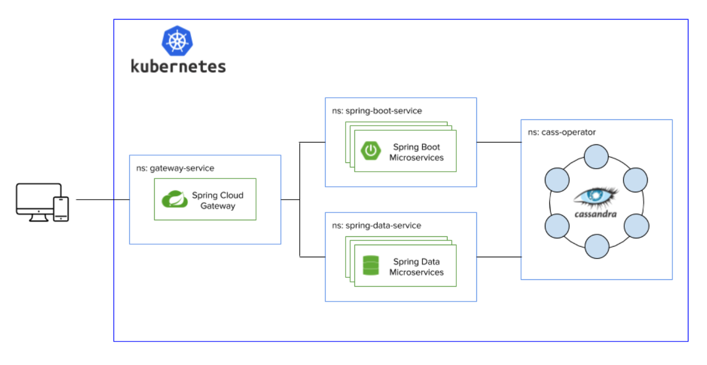

You can start to build modern, cloud native apps today using the latest innovations from Spring, Cassandra and Kubernetes. This blog will show you code samples and a fully working demo to get you up to speed in minutes with these open-source technologies.

## Context

There's no shortage of buzzwords, such as "digital transformation", "cloud native" and "serverless," being thrown around the internet. Peeling back a layer of the buzzword onion, we do see significant changes in the technology world that have inspired these terms. First, most companies are becoming technology companies as having a presence in the digital space grows as a requirement for survival. Second, the mad dash to the cloud is showing no signs of slowing down. Third, time to market for new applications matters more than ever.

So, how has this affected technology practitioners? Well, the developer population is multiplying rapidly and the pressures for faster delivery of these new digital experiences are getting more extreme by the day. It's now a fundamental expectation that applications will be there whenever, wherever and however users want to engage. The cloud movement is creating complex architectures that span on-premises and cloud environments, not to mention the pure amount of data coming through these services is exploding. Sounds fun!

Open-source technology to the rescue. These factors have given rise to technologies such as Spring Boot to boost developer productivity, Apache Cassandra to deal with the volumes of distributed data and Kubernetes to manage containerized workloads across environments. 

## Stack Overview

### Spring

There are many handy utilities in [Spring](https://spring.io/) that take care of the boilerplate required to build microservices with Kubernetes and Cassandra. In this blog post, we use the following modules:

- [Spring Boot](https://spring.io/projects/spring-boot) to package our dependencies
- [Spring Data Cassandra](https://spring.io/projects/spring-data-cassandra) for access to the Cassandra database
- [Spring Data REST](https://spring.io/projects/spring-data-rest) for the API on top of the Spring Data Cassandra microservice
- [Spring Boot Actuator](https://docs.spring.io/spring-boot/docs/current/reference/html/production-ready-features.html) for health checks, liveness and readiness probes
- [Spring Web](https://docs.spring.io/spring/docs/current/spring-framework-reference/web.html#spring-web) to build our REST interface for the Spring Boot microservice
- [Spring Cloud Kubernetes](https://spring.io/projects/spring-cloud-kubernetes) to pass application configuration via ConfigMaps

In May 2020, the Spring engineering teams released [Spring Boot 2.3.0](https://spring.io/blog/2020/05/15/spring-boot-2-3-0-available-now) and [Spring Data Neumann](https://spring.io/blog/2020/05/18/what-s-new-in-spring-data-klara-dan-von-neumann), which brought an upgrade to the latest version 4.x of the [Cassandra Java driver](https://docs.datastax.com/en/developer/java-driver/latest/). This driver upgrade provides full support for the newest major version of Cassandra 4.0, which we'll showcase throughout the blog. The Spring and Cassandra communities continue to work together to provide tighter integrations.

### Cassandra

The Cassandra community is [nearing the release of version 4.0](https://www.zdnet.com/article/faster-than-ever-apache-cassandra-4-0-beta-is-on-its-way/), which features extensive stability improvements, faster scaling for elastic architectures, enterprise security features such as audit logging, Java 11 support and more. Momentum is also brewing in the Cassandra community around a [project-backed Kubernetes operator](https://cwiki.apache.org/confluence/display/CASSANDRA/Cassandra+Kubernetes+Operator+SIG). There are many in the ecosystem today, and in this blog we use DataStax's open-source Kubernetes Operator called [cass-operator](https://github.com/datastax/cass-operator) with a Cassandra 4.0 pre-release build. 

### Kubernetes

The [Kubernetes](https://kubernetes.io/) wave is changing the paradigm for how applications are built, deployed and scaled. In this blog post, we'll get into the details of tricky parts of Kubernetes-based applications and how to use Spring libraries to quickly develop microservice applications on Kubernetes.

## Let's See It in Action

In the next sections, we'll walk through an inventory application of Products and Orders that ties all of these technologies together. If you want to skip the details and go straight to hands on, head over to the GitHub repository at [`DataStax-Examples/spring-k8s-cassandra-microservices`](https://github.com/DataStax-Examples/spring-k8s-cassandra-microservices) to hit the ground running. 

At a glance, the architecture of the application looks as follows. Each portion of the stack is deployed in Kubernetes in its own namespace to have clear separation of duties and isolation between services, simulating different teams working on separate parts of a single application.



We'll use [Minikube](https://kubernetes.io/docs/tasks/tools/install-minikube/) as we walk through deploying this stack locally. All of these commands can be translated to [Kind](https://kind.sigs.k8s.io/) alternatives, and there are step-by-step details for setting up Cassandra with Kind over on the [DataStax Academy GitHub](https://github.com/DataStax-Academy/kubernetes-workshop-online). You will need to install [Docker](https://www.docker.com/products/docker-desktop), [kubectl](https://kubernetes.io/docs/tasks/tools/install-kubectl/), [Maven](https://maven.apache.org/install.html) and [Java 11+](https://adoptopenjdk.net/) as prerequisites for this demo. And with that, let's get this thing going.

```bash
# start minikube and the dashboard
minikube start --driver=docker --extra-config=apiserver.authorization-mode=RBAC,Node
minikube dashboard

# tell minikube to use the local docker environment
eval `minikube docker-env`

# clone the example repository
git clone https://github.com/DataStax-Examples/spring-k8s-cassandra-microservices
```

### Start Cassandra

Working from the bottom up, let’s first get the database deployed and ready to serve data to our APIs. When deploying microservices, it is common to have a database per service to have isolation all the way down to the data tier. Since we're running locally, for demonstration purposes we'll keep it light and start a single Cassandra 4.0 node for both of our services. 

```bash
# create namespace
kubectl create ns cass-operator

# create the storage class for the database
kubectl -n cass-operator apply -f deploy/storage-class.yml

# apply the operator manifest, wait until complete
kubectl -n cass-operator apply -f https://raw.githubusercontent.com/DataStax-Academy/kubernetes-workshop-online/master/1-cassandra/11-install-cass-operator-v1.1.yaml

# start a single C* 4.0 node
kubectl -n cass-operator apply -f deploy/cassandra-4.0.0-1node.yml 

# check that everything started successfully
kubectl -n cass-operator get pods
```

Five simple commands and we have Cassandra running in Kubernetes—pretty cool. One thing that you'll quickly notice is that this database has security enabled by default. We can browse the [Kubernetes Secret](https://kubernetes.io/docs/tasks/inject-data-application/distribute-credentials-secure/) and you should see something that resembles an encoded username and password in the output. 

```bash
kubectl -n cass-operator get secret cluster1-superuser -o yaml

apiVersion: v1
data:
  password: OE92MzB2MWlDRF90ZWtVYzAyRFNpN3RtZkJ0LVpUVjlicDNxaFRDc3h1RzhYN3BKNW10ZjZ3
  username: Y2x1c3RlcjEtc3VwZXJ1c2Vy
kind: Secret
```

To decode these we use the following commands.

```bash
echo Y2x1c3RlcjEtc3VwZXJ1c2Vy | base64 -D && echo ""
cluster1-superuser

echo OE92MzB2MWlDRF90ZWtVYzAyRFNpN3RtZkJ0LVpUVjlicDNxaFRDc3h1RzhYN3BKNW10ZjZ3 | base64 -D && echo ""
8Ov30v1iCD_tekUc02DSi7tmfBt-ZTV9bp3qhTCsxuG8X7pJ5mtf6w
```

Go ahead and save the decoded values off for later because we'll need them to allow our services to access the database.

### Spring Boot Microservice

Next let's have a look at the Spring Boot service that is responsible for the Products portion of our microservices application. This module uses the Cassandra Java driver directly, and we are handling configuration, query execution and API endpoint definition explicitly in our service compared to the boilerplate abstraction that we will show in the next section with Spring Data Cassandra and Spring Data REST.

#### Configuration

One convenient feature of Spring Cloud Kubernetes is that it allows for the loading of sensitive information like this through Kubernetes Secrets. We'll create a namespace for our service and then add the secrets using the database credentials that we decoded above.

```bash
kubectl create ns spring-boot-service
kubectl -n spring-boot-service create secret generic db-secret --from-literal=username=cluster1-superuser --from-literal=password=8Ov30v1iCD_tekUc02DSi7tmfBt-ZTV9bp3qhTCsxuG8X7pJ5mtf6w
```

We define our configuration in the application using the `@Configuration` annotation, and this class specifies the database credentials and connection details. For example, we define our database username and password with environment variables and the `@Value` annotation. 

```java
@Value("${DB_USERNAME:cassandra}")
private String username;
@Value("${DB_PASSWORD:cassandra}")
private String password;
```

The last piece to pass the database credentials to the application running in Kubernetes is defined in the [Deployment YAML](https://github.com/DataStax-Examples/spring-k8s-cassandra-microservices/blob/master/deploy/spring-boot/spring-boot-deployment.yml) for our service. This exposes the Secret username and password as `DB_USERNAME` and `DB_PASSWORD` environment variables, which our application will consume.

```yaml
 template:
   spec:
     containers:
       - env:
           - name: DB_USERNAME
             valueFrom:
               secretKeyRef:
                 name: db-secret
                 key: username
           - name: DB_PASSWORD
             valueFrom:
               secretKeyRef:
                 name: db-secret
                 key: password
```

We can further customize the connection to the database with `@Beans` that hook into Spring Boot's auto-configuration. You'll see that we have different switches for whether we are connecting to [DataStax Astra](https://astra.datastax.com/register), a Cassandra as-a-Service database or whether we are connecting to a self-managed Cassandra deployment. Any Cassandra Java driver [configuration option](https://docs.datastax.com/en/developer/java-driver/latest/manual/core/configuration/reference/) can be customized through these hooks.

```java
@Bean
public CqlSessionBuilderCustomizer sessionBuilderCustomizer() {
   if (!astraSecureConnectBundle.equals("none")) {
       return builder -> builder
               .withCloudSecureConnectBundle(Paths.get(this.astraSecureConnectBundle))
               .withAuthCredentials(this.username, this.password);
   }
   else {
       return builder -> builder
               .addContactPoint(new InetSocketAddress(this.contactPoints, this.port))
               .withLocalDatacenter(this.localDataCenter)
               .withAuthCredentials(this.username, this.password);
   }
}

@Bean
public DriverConfigLoaderBuilderCustomizer driverConfigLoaderBuilderCustomizer() {
   if (!astraSecureConnectBundle.equals("none")) {
       return builder -> builder.without(DefaultDriverOption.CONTACT_POINTS);
   }
   return builder -> builder
           .withString(DefaultDriverOption.SESSION_KEYSPACE, this.keyspace);
}
```

With Spring Cloud Kubernetes, we can also load configuration directly from Kubernetes ConfigMaps. In this application, we show how to load the database connection information using this technique. Our simple ConfigMap for the Spring Boot service is shown below.

```yaml
apiVersion: v1
kind: ConfigMap
metadata:
 name: spring-boot-service
data:
 application.yml: |-
   cassandra.contact-points: cluster1-dc1-service.cass-operator
   cassandra.keyspace: betterbotz
   cassandra.local-datacenter: dc1
   cassandra.port: 9042
```

#### Controller

Thanks to Spring Boot, defining an HTTP interface for our application is a breeze with the `@Controller` stereotype and the standard request helpers in Spring Web. With these utilities we expose the following APIs for our Spring Boot-based Products service.

- `/api/products/add`: Add a new product
- `/api/products/search/{name}`: Search products by name
- `/api/products/search/{name}/{id}`: Search products by name and id
- `/api/products/delete/{name}`: Delete products by name
- `/api/products/delete/{name}/{id}`: Delete product by name and id

#### Data Service

The persistence layer of our application is handled by three classes. Note: the [Cassandra Java Object Mapper](https://docs.datastax.com/en/developer/java-driver/latest/manual/mapper/) is another option that could have been used for the Entity and DAO definition.

- POJO ([Product.java](https://github.com/DataStax-Examples/spring-k8s-cassandra-microservices/blob/master/microservice-spring-boot/src/main/java/com/datastax/examples/product/Product.java)): Standard object definition with getters and setters
- DAO ([ProductDao.java](https://github.com/DataStax-Examples/spring-k8s-cassandra-microservices/blob/master/microservice-spring-boot/src/main/java/com/datastax/examples/product/ProductDao.java)): Contains the CQL queries and database access logic
- Service ([ProductService.java](https://github.com/DataStax-Examples/spring-k8s-cassandra-microservices/blob/master/microservice-spring-boot/src/main/java/com/datastax/examples/product/ProductService.java)): Interfaces between the DAO and the Controller

#### Deployment

We package our application in a jar file and then build a local docker image to prepare for deployment to Kubernetes. If you prefer to avoid hitting a remote registry, `` run eval `minikube docker-env` `` so that Kubernetes can find the image. Once the service is deployed, Kubernetes ensures that it starts and remains healthy by using the liveness and readiness that come out-of-the-box with Spring Actuator. That's right, just include Actuator on your classpath and sit back! See this [blog post](https://spring.io/blog/2020/03/25/liveness-and-readiness-probes-with-spring-boot) for details on customization of the liveness and readiness probes. We use a minimal configuration in our [Deployment YAML](https://github.com/DataStax-Examples/spring-k8s-cassandra-microservices/blob/master/deploy/spring-boot/spring-boot-deployment.yml) as seen below, though we could have leveraged the [Cassandra-specific health check](https://docs.spring.io/spring-boot/docs/current/api/org/springframework/boot/actuate/cassandra/CassandraHealthIndicator.html) as well.

```yaml
livenessProbe:
 httpGet:
   path: /actuator/health
   port: actuator
 initialDelaySeconds: 120
readinessProbe:
 httpGet:
   path: /actuator/health
   port: actuator
```

Now we will go ahead and start our Spring Boot service.

```bash
# from the spring-k8s-cassandra-microservices root directory, build each module
mvn package

# from the spring-k8s-cassandra-microservices/microservice-spring-boot directory

# build docker image
docker build -t csplinter/spring-boot-service:1.0.0-SNAPSHOT .

# deploy the service 
kubectl apply -n spring-boot-service -f ../deploy/spring-boot

# check that the pod is running
kubectl -n spring-boot-service get pods
```

To test out the endpoints exposed by the service, we can expose the target port of the service and then hit the endpoints. Note that these same endpoints are exposed through the [Gateway Service](https://github.com/DataStax-Examples/spring-k8s-cassandra-microservices/tree/master/gateway-service), which would typically handle all traffic.

```bash
kubectl -n spring-boot-service get pods
kubectl -n spring-boot-service port-forward <pod-name> 8083:8083
```
```bash
# Add products
curl -X POST -H "Content-Type: application/json" -d '{"name": "mobile", "id":"123e4567-e89b-12d3-a456-556642440000", "description":"iPhone", "price":"500.00"}' http://localhost:8083/api/products/add

curl -X POST -H "Content-Type: application/json" -d '{"name": "mobile", "id":"123e4567-e89b-12d3-a456-556642440001", "description":"Android", "price":"600.00"}' http://localhost:8083/api/products/add

# Get products with name = mobile
curl http://localhost:8083/api/products/search/mobile

# Get products with name = mobile and id = 123e4567-e89b-12d3-a456-556642440001
curl http://localhost:8083/api/products/search/mobile/123e4567-e89b-12d3-a456-556642440001

# Delete product with name = mobile and id = 123e4567-e89b-12d3-a456-556642440001
curl -X DELETE http://localhost:8083/api/products/delete/mobile/123e4567-e89b-12d3-a456-556642440001
```

Just like that we have a Spring Boot service running in Kubernetes with our Cassandra 4.0 deployment to write, read and delete Products from the database. We see that the benefits of Spring Boot, Spring Cloud and Spring Web make it easy to quickly build cloud native applications with Kubernetes and Cassandra. The complete source code for this service can be found in the [`microservice-spring-boot`](https://github.com/DataStax-Examples/spring-k8s-cassandra-microservices/tree/master/microservice-spring-boot) module in GitHub.

### Spring Data Microservice

Now that we covered our Spring Boot Products service, let's compare that to Spring Data Cassandra and Spring Data REST with our Orders service in the [`microservice-spring-data`](https://github.com/DataStax-Examples/spring-k8s-cassandra-microservices/tree/master/microservice-spring-data) module. One of the key differences is the boilerplate that is provided by the Spring Data libraries that abstracts our development experience from the lower-level controls. This gives a lot of value for getting things done quickly, as we no longer have to spend the time writing what is otherwise already taken care of for us.

#### Configuration

Spring Data Cassandra takes care of the majority of default configuration for the connection to Cassandra. In this demo, we are extending [`AbstractCassandraConfiguration`](https://docs.spring.io/spring-data/cassandra/docs/current/api/org/springframework/data/cassandra/config/AbstractCassandraConfiguration.html) so the driver customization looks slightly different than the Spring Boot example. We are using the `@Configuration` annotation as well as the `@EnableConfigurationProperties(CassandraProperties.class)` so that we do not lose the auto-configuration capabilities that Spring Boot provides for this module. 

```java
@Override
protected SessionBuilderConfigurer getSessionBuilderConfigurer() {
   return new SessionBuilderConfigurer() {
       @Override
       public CqlSessionBuilder configure(CqlSessionBuilder cqlSessionBuilder) {
           if (!astraSecureConnectBundle.equals("none")) {
               return cqlSessionBuilder
                       .withCloudSecureConnectBundle(Paths.get(astraSecureConnectBundle))
                       .withAuthCredentials(username, password);
           }
           else{
               return cqlSessionBuilder
                       .addContactPoint(new InetSocketAddress(
                               cassandraProperties.getContactPoints().get(0),
                               cassandraProperties.getPort()))
                       .withAuthCredentials(username, password);
           }
       }
   };
}
```

We extend `AbstractCassandraConfiguration` to leverage the automatic schema generation methods built into Spring Data Cassandra, though this is not a requirement for many applications. Here we specify the keyspace that we want to create upon initialization of the connection as well as the table definition that we read from a file in the resources directory.

```java
@Override
protected List<CreateKeyspaceSpecification> getKeyspaceCreations() {
   if (!astraSecureConnectBundle.equals("none")) {
       return Arrays.asList(CreateKeyspaceSpecification
               .createKeyspace(getKeyspaceName())
               .ifNotExists(true)
               .withNetworkReplication(DataCenterReplication.of(getLocalDataCenter(), 1))
               .with(KeyspaceOption.DURABLE_WRITES));
   }
   return Arrays.asList();
}

@Override
protected KeyspacePopulator keyspacePopulator() {
   ResourceKeyspacePopulator keyspacePopulate = new ResourceKeyspacePopulator();
   keyspacePopulate.setSeparator(";");
   keyspacePopulate.setScripts(new ClassPathResource("orders-schema.cql"));
   return keyspacePopulate;
}
```

You'll see in the code that we do the same thing here as in our Spring Boot service, where we are loading the database username and password from environment variables that are stored in Kubernetes Secrets. Since Secrets are bound to a namespace, we have to make sure that we also create these secrets in our spring-data-service namespace.

```bash
kubectl create ns spring-data-service

kubectl -n spring-data-service create secret generic db-secret --from-literal=username=cluster1-superuser --from-literal=password=8Ov30v1iCD_tekUc02DSi7tmfBt-ZTV9bp3qhTCsxuG8X7pJ5mtf6w
```

#### Controller

We use a controller in our service to customize the API endpoints for our Spring Data Orders service so that they match the pattern of the Spring Boot service. If we did not provide a controller, Spring Data REST would have generated the endpoints for us through simply annotating our `OrderRepository` with `@RepositoryRestResource`. In our case, we use `@RestResource(exported = false)` in the repository to tell Spring Data REST that we wanted to handle these endpoints ourselves, which correspond to the methods in the controller. The following APIs are exposed for our Order service.

- `/api/orders/add`: Add a new order
- `/api/orders/search/order-by-id?{orderId}`: Search orders by id
- `/api/products/search/order-by-product-id?{orderId}&{productId}`: Search orders by `orderid` and `productid`
- `/api/orders/search/name-and-price-only?{orderId}`: Search orders by id and only return product name and price
- `/api/products/delete/order?{orderId}`: Delete orders by id
- `/api/products/delete/product-from-order?{orderId}&{productId}`: Delete product from order

#### Data Service

The persistence layer of our Spring Data application is handled by our models/entities and the repository.

- POJOs ([Order.java](https://github.com/DataStax-Examples/spring-k8s-cassandra-microservices/blob/master/microservice-spring-data/src/main/java/com/datastax/examples/order/Order.java), [OrderPrimaryKey.java](https://github.com/DataStax-Examples/spring-k8s-cassandra-microservices/blob/master/microservice-spring-data/src/main/java/com/datastax/examples/order/OrderPrimaryKey.java)): Standard object definition with getters and setters. These are interpreted by Spring Data Cassandra as database types with the `@Table` annotation for Order and the `@PrimaryKeyClass` for `OrderPrimaryKey`. The latter is required when using clustering keys in Cassandra.
- Projection ([ProductNameAndPriceOnly.java](https://github.com/DataStax-Examples/spring-k8s-cassandra-microservices/blob/master/microservice-spring-data/src/main/java/com/datastax/examples/order/ProductNameAndPriceOnly.java)): This class is used by Spring Data to limit the results that are returned from the database. We use this in conjunction with a custom `@Query` in our `OrderRepository` to demonstrate how to return results with a subset of columns from the database.
- Repository ([OrderRepository.java](https://github.com/DataStax-Examples/spring-k8s-cassandra-microservices/blob/master/microservice-spring-data/src/main/java/com/datastax/examples/order/OrderRepository.java)): Extends Spring Data's `CassandraRepository` and defines the methods that are translated automatically under the hood to database queries. Note that the naming of these methods is specific to the Spring Data spec. For example, `findByKeyOrderIdAndKeyProductId` is required to tell Spring Data that we wish to query by the `OrderId` and `ProductId` portions of our Primary Key.

#### Deployment

Similar to our Spring Boot service, we get the same liveness and readiness probes with our Spring Data service. These are configured in the exact same manner and are enabled simply by having Actuator on the classpath. To build and deploy our service to Kubernetes, we execute the following commands.

```bash
# (optional if performed above) tell minikube to use the local docker environment
eval `minikube docker-env`

# (optional if performed above) from the spring-k8s-cassandra-microservices root directory, build each module
mvn package

# from the spring-k8s-cassandra-microservices/microservice-spring-data directory

# build docker image
docker build -t csplinter/spring-data-service:1.0.0-SNAPSHOT .

# deploy the service 
kubectl apply -n spring-data-service -f ../deploy/spring-data

# check that the pod is running
kubectl -n spring-data-service get pods
```

To test out the endpoints exposed by the service, we can expose the Service port and then hit the endpoints. 

```bash
kubectl -n spring-data-service get pods

kubectl -n spring-data-service port-forward <pod-name> 8081:8081
```

```bash
# Add orders
curl -H "Content-Type: application/json" -d '{"key": {"orderId":"123e4567-e89b-12d3-a456-556642440000", "productId":"123e4567-e89b-12d3-a456-556642440000"}, "productName":"iPhone", "productPrice":"500.00", "productQuantity":1, "addedToOrderTimestamp": "2020-04-12T11:21:59.001+0000"}' http://localhost:8081/api/orders/add

curl -H "Content-Type: application/json"  -d '{"key": {"orderId":"123e4567-e89b-12d3-a456-556642440000", "productId":"123e4567-e89b-12d3-a456-556642440001"}, "productName":"Android", "productPrice":"600.00", "productQuantity":1, "addedToOrderTimestamp": "2020-04-12T11:22:59.001+0000"}' http://localhost:8081/api/orders/add

# Get orders with order_id = 123e4567-e89b-12d3-a456-556642440000
curl http://localhost:8081/api/orders/search/order-by-id?orderId=123e4567-e89b-12d3-a456-556642440000

# Get order with order_id = 123e4567-e89b-12d3-a456-556642440000 and product_id = 123e4567-e89b-12d3-a456-556642440000
curl "http://localhost:8081/api/orders/search/order-by-product-id?orderId=123e4567-e89b-12d3-a456-556642440000&productId=123e4567-e89b-12d3-a456-556642440000"

# Shows how to use a projection with Spring Data REST
curl http://localhost:8081/api/orders/search/name-and-price-only?orderId=123e4567-e89b-12d3-a456-556642440000
curl "http://localhost:8081/api/orders/search/name-and-price-only?orderId=123e4567-e89b-12d3-a456-556642440000&projection=product-name-and-price"

# Delete order with order_id = 123e4567-e89b-12d3-a456-556642440000 and product_id = 123e4567-e89b-12d3-a456-556642440000
curl -X DELETE "http://localhost:8081/api/orders/delete/product-from-order?orderId=123e4567-e89b-12d3-a456-556642440000&productId=123e4567-e89b-12d3-a456-556642440000"

# Delete order with order_id = 123e4567-e89b-12d3-a456-556642440000
curl -X DELETE "http://localhost:8081/api/orders/delete/order?orderId=123e4567-e89b-12d3-a456-556642440000"
```

### Gateway Service

There are many options for federating external access to a Kubernetes cluster. A common solution when building Spring applications is to use the Spring Cloud Gateway project as the broker to handle the routing of traffic to back-end services. This also comes with automatic discovery of other services in the cluster using Kubernetes resources, and a simple implementation that routes traffic to our two microservices is found in the [gateway-service](https://github.com/DataStax-Examples/spring-k8s-cassandra-microservices/tree/master/gateway-service) module of the demo app. 

We can start this Gateway Service to act as the router to our Spring Boot and Spring Data downstream services.

```bash
kubectl create ns gateway-service

# from the spring-k8s-cassandra-microservices/gateway-service directory
docker build -t csplinter/gateway-service:1.0.0-SNAPSHOT .
kubectl apply -n gateway-service -f ../deploy/gateway

kubectl -n gateway-service get pods
kubectl -n gateway-service port-forward <pod-name> 8080:8080
```

We test this by executing the same curl commands above, but now with the port 8080. You should see the exact same result as before demonstrating that the gateway is working properly!

### Wrap-Up

We hope that this blog post provides relevant hands-on material that you can take and apply to your own development experience. As the challenges facing developers are rising, powerful tools must keep pace in order to exceed the expectations of users, and Spring, Kubernetes and Cassandra are among those to level up your stack. We encourage you to join us on this collective journey, and we look forward to seeing you in the Spring, Kubernetes or Cassandra communities.

- [Join the Spring community](https://spring.io/community)
- [Join the Cassandra mailing list and Slack](https://cassandra.apache.org/community/)
- [Ask questions](https://community.datastax.com/)
- [Run Cassandra in the cloud](http://astra.datastax.com/)

> This blog was written by Chris Splinter who works for DataStax, focusing on open source solutions in the Apache Cassandra ecosystem. As a former automation engineer, Chris is focused on developers and making it easier to build applications through APIs, frameworks, and tools. You can find him on [LinkedIn](https://www.linkedin.com/in/csplinter/).