SpringOne 2020 just wrapped, and the self-paced workshops were a complete success! Moreover, all of your requests to continue providing these workshops beyond the conference have been heard. Their future home will be the [Tanzu Developer Center](https://tanzu.vmware.com/developer/). _UPDATE: These workshops are available to [try out now](/workshops)!_

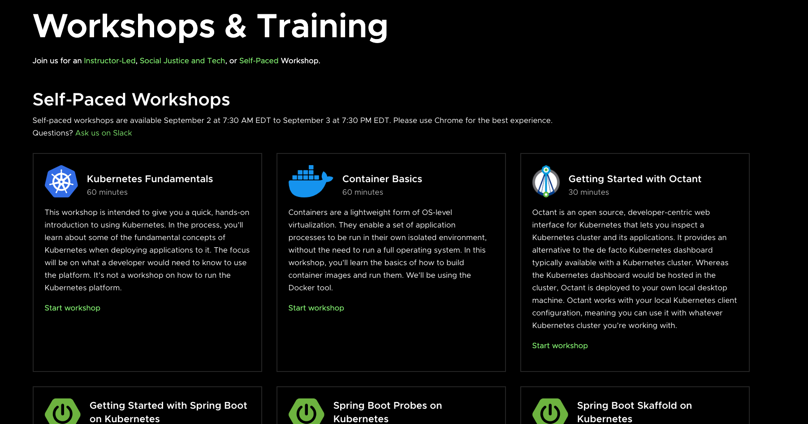

For those that missed SpringOne 2020, we’ll quickly recap what the workshops focused on and what they accomplished. Feel free to jump around if you need to; the recap is meant to be a quick read with plenty of pictures.

A total of 10 self-paced workshops covering a range of open source technology—from CI/CD with Tekton, several Spring technologies, and infrastructure technology like Kubernetes, Octant, and Carvel—were available at SpringOne 2020:

*   Kubernetes Fundamentals
*   Container Basics
*   Getting Started with Octant
*   Getting Started with Spring Boot on Kubernetes
*   Spring Boot Probes on Kubernetes
*   Spring Boot Skaffold on Kubernetes
*   Spring Microservices
*   Getting Started with Spring Cloud Gateway
*   Getting Started with Carvel (formerly k14s)
*   Tekton Fundamentals

Each of these workshops has an environment prepared and ready, which is quite refreshing when you are accustomed to spending 15-30 minutes setting up to follow a tutorial. The workshop environment is also native to the technology being used. For example, you can interact with actual Kubernetes clusters in a Kubernetes workshop or work in a real Java 11 environment in Spring workshops. Finally, all the tools you need are built into the workshop, such as an IDE or Kubernetes tools like Octant to name a few.

In this screenshot from Getting Started with Spring Boot on Kubernetes, you can see the code editor utilized in it and some of the other workshops.

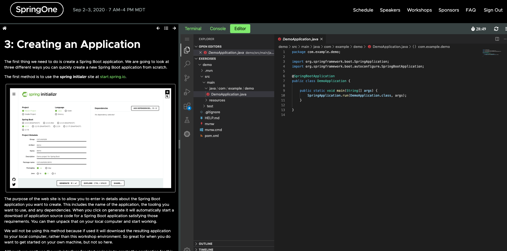

In Getting Started with Octant, you use the open-source Kubernetes tool Octant to inspect your Kubernetes cluster. Many developers use [Octant](https://octant.dev/) to reveal the objects running in their Kubernetes clusters.

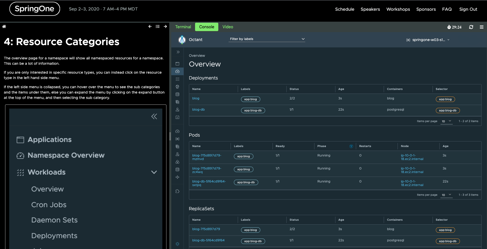

## Kubernetes Fundamentals

We designed the workshops so you can mouse-click to automate manual steps that are prone to error. For example, you can click to execute terminal commands, create files, precisely insert lines of code, and more. We also designed them to eliminate errors, like small typos that can interrupt your learning progress. Our goal was to enable you to focus on learning theory and any related concepts rather than on procedural steps you can review later, like commands and code blocks. 

The screenshot below from the Kubernetes Fundamentals workshop provides an example of the click automation capability we provided. In the instructions on the left, you click the command `kubectl apply -f database/` which is then executed in the appropriate terminal on the right.

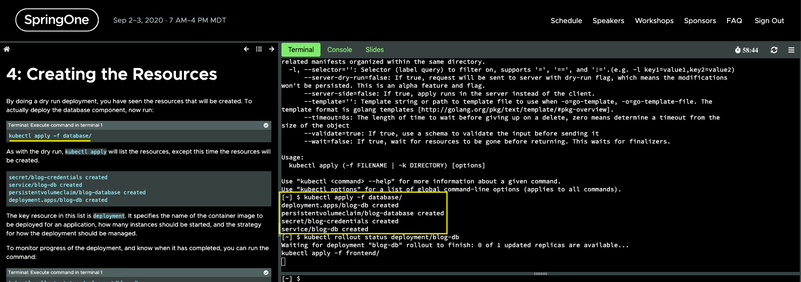

The Kubernetes Fundamentals workshop, a hands-on introduction to using Kubernetes, was by far the most popular workshop at SpringOne 2020. It not only provides you with a real Kubernetes cluster to interact with, but access to the Kubernetes Dashboard!

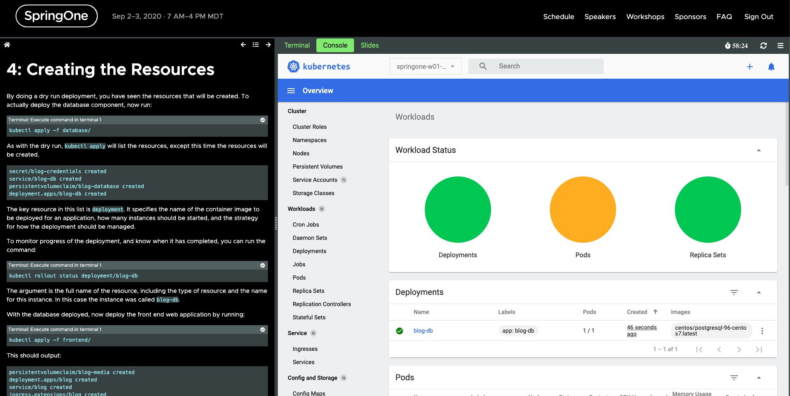
  

By the second step, you are already deploying a blog application to your Kubernetes cluster!

Kubernetes Fundamentals covers many other concepts, such as service networking and exposing those services, as well as linking a database, persistent volumes, and even application health. You’ll even learn best practices for deployments with ReplicaSets.

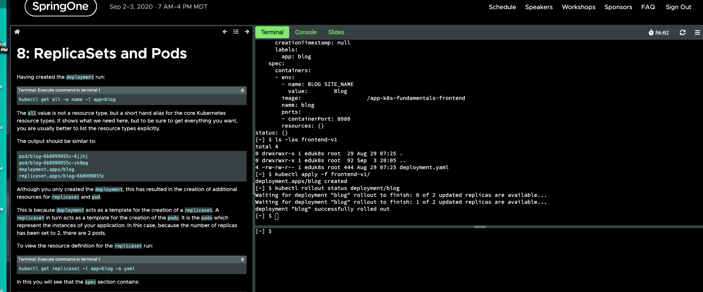

## Container Basics 

The Container Basics workshop, while introductory, goes into details that are typically omitted from container tutorials, like how to inspect layers.

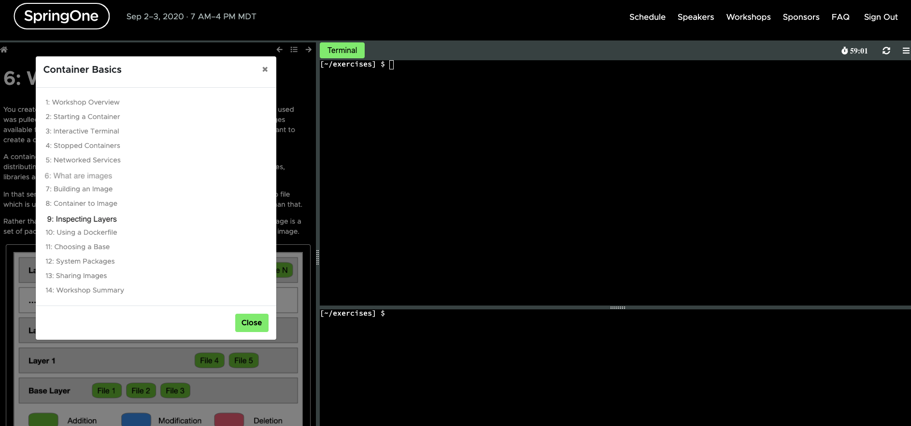

## Getting Started with Spring Boot on Kubernetes

It wouldn’t be a Spring conference without at least a few Spring workshops. Of those we offered at Spring 2020, Getting Started with Spring Boot on Kubernetes was the most heavily attended. It shows you how to build a Spring Boot application with no fuss--—and no YAML—--in a handful of steps. Leave it to Spring to make Kubernetes easy! 

You might recognize the terminal art in the following screenshot; it is of a Spring application being built.

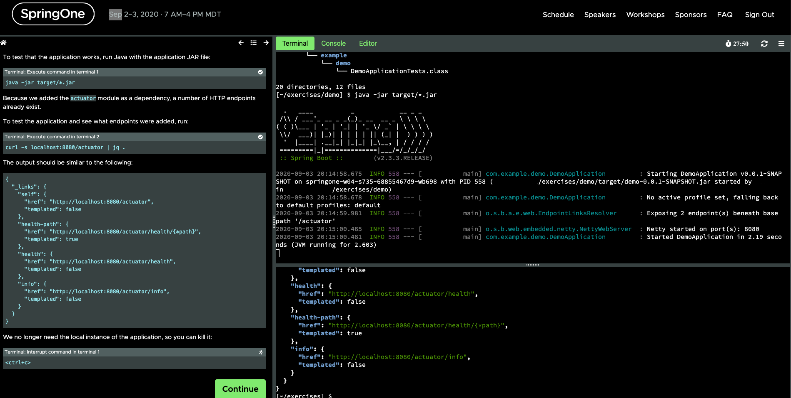

Once the Spring Boot application is built, you deploy it to Kubernetes from your very own image registry! 

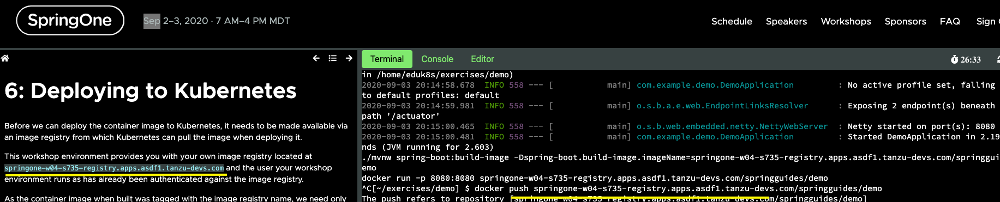

There were so many amazing workshops from SpringOne. New and hot technologies like [Carvel](https://k14s.io/) and [Tekton](https://cloud.google.com/tekton) stood out as they are gaining traction in the industry. 

All of the Spring Boot Kubernetes workshops where surprisingly painless and quick to run through. After Getting Started with Spring Boot on Kubernetes, Spring Boot Skaffold on Kubernetes is my favorite. With [Skaffold](https://skaffold.dev/) Kubernetes development becomes dynamic, eliminating tedious commands and overall speeding up your work. 

For those brand new to Spring or [Microservices](https://spring.io/microservices), the Spring Microservices workshop is a good introduction that could be completed in 10 minutes or less due to the magic of the Spring Framework. 

Using very similar code to the Spring Microservices workshop in Getting Started with Spring Cloud Gateway you build your own [API Gateway](https://spring.io/projects/spring-cloud-gateway).

Here is a full rundown of the self-paced workshops featured at SpringOne 2020: 

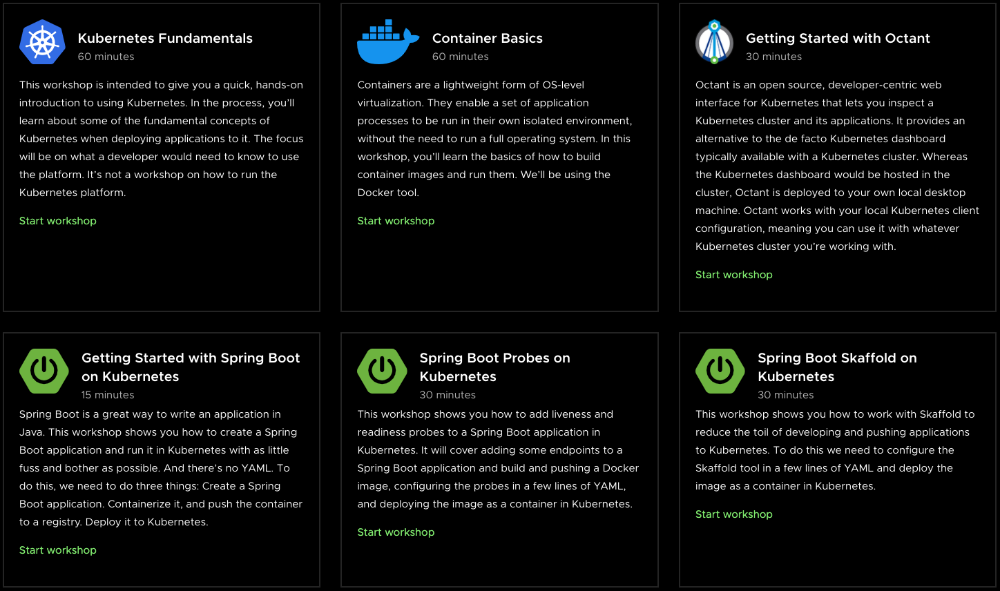
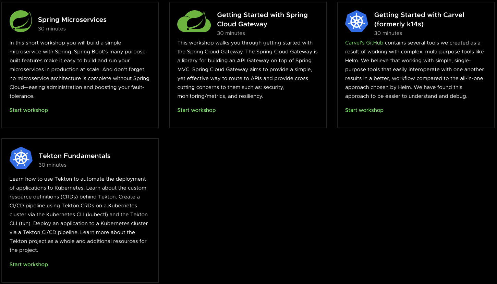

## Self-Paced Workshops Are Coming to Tanzu Developer Center!

Now that SpringOne 2020 has come and gone, the SpringOne self-paced workshops are being moved to their new home at [Tanzu Developer Center](https://tanzu.vmware.com/developer/)! It is a perfect fit. As its name implies, [Tanzu Developer Center](https://tanzu.vmware.com/developer/) is developer-focused (no marketing jargon allowed); its sole purpose is to train developers and enable them on their journey forward. The [Tanzu Developer Center](https://tanzu.vmware.com/developer/) already has blogs, videos, an integrated community, and a learning portal, and features weekly live streams and recordings via [Tanzu.TV](/tv/). 

Not only are you getting the workshops from SpringOne 2020, but more workshops are being made as we speak! 

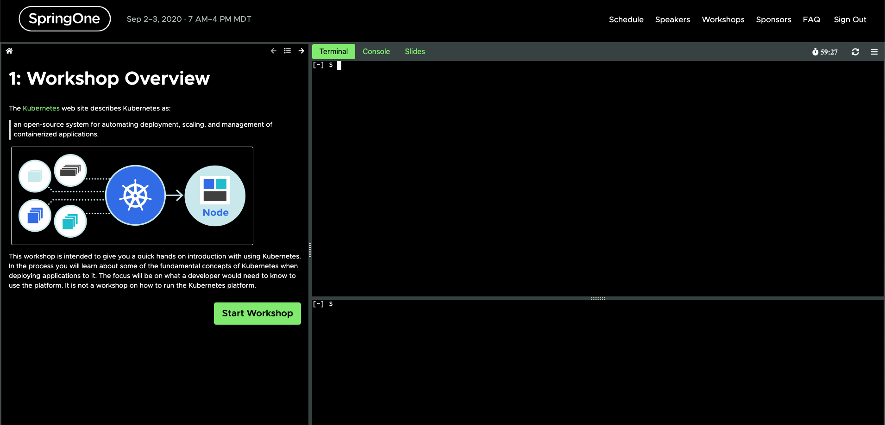

To be notified as soon as the workshops are made available, [subscribe to Tanzu Developer Newsletter.](/community/) 

_UPDATE: These workshops are available to [try out now](/workshops)!_