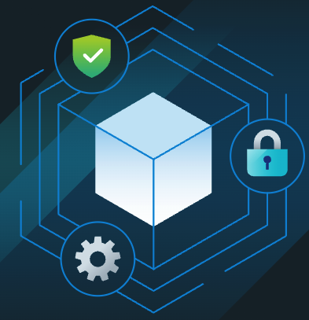

## What Is Tanzu Build Service?

Tanzu Build Service, TBS for short, is a tool that will take a code source whether it be a local file system, a blob store (eg S3) or a git repository and build that code into a runnable OCI image. Behind the scenes it uses [Cloud Native Buildpacks](https://buildpacks.io/) to build a runnable artifact (jar, exe, etc) of your code and a custom resources called `builders` to define the image that will host your code. To manage all this it also uses the open source tool [Kpack](https://github.com/pivotal/kpack). If you want a more in depth look please check out the [official page](https://tanzu.vmware.com/build-service).

## Why in the "Public Sector"

Just for some quick background here, I'm currently a Software Architect in VMware's public sector division, I came here from having a long background working with satellites and their associated ground systems that control them. While there are quite a few interesting commercial satellite starts up that have popped up over the past few years, most of this work is still with government agencies. Thus most of the time when I'm working on a system it can't connect to the internet which makes working with todays tools quite challenging and in rare cases impossible. I've had to setup TBS at a few places with these hurtles in place and want to post about what we found out and how we solved the challenges we had. Note that this isn't a how to use TBS in all cases as there's easier ways to handle some of the issues we ran into when you have more control over your environment.

## Why use Tanzu Build Service?

As I mostly work with application development teams one of the questions I get the most while trying to work through these issues is "Why are we spending time trying to set this up? There are a bunch of other tools that will create an image from our code.". And from a developer perspective I get it, I can just use something like Jib for Java and run a single command line command to create an image, why go through the trouble of setting up all the things needed for TBS? That answer is that down the line when you have 137 services up and running on your production cluster using `SomeMadeUpLinuxDistro 15.4` and a Cat 1 CVE is found and you have to upgrade to `SomeMadeUpLinuxDistro 15.5` how are you going to go about it? Do you know every image in prod that's running v15.4 or less? Once you track all those down how would you go about updating the images, at best i'd image changing a template and then manually kicking off however many pipelines to rebuild them. At worse maybe every service has it's own dockerfile that you need to update, how long would that take your team, for 10 services, for 50? This is where TBS more than pays for itself, instead of tracking down every service on the old OS you would update a build resource and TBS knowing all the images it has built would be able to rebuild them all with the new OS. And with a little automation help once these are built, deployment could happen automatically, even all the way to prod assuming everything with the new OS passes all the tests.

## A quick note before digging in

While this is a setup I have used, I would highly recommend that if you have the ability to install Kpack on whatever CI client/runner you happen to be using, then run the `kp image save .... --wait` command in the pipeline rather than this method. Running `kp` in the pipeline will make everything easier going forward as the image build is a fully contained step inside your pipeline and you can then have only one pipeline for your app(s) as opposed to the two that will be needed for this setup. Again this path that was taken here was due to limits put on us with how things were setup.

## Setting up Tanzu Build Service and our pipeline

As an application architect I haven't installed the TBS app myself as that's something that our platform architects usually take care of, however if you are interested in that aspect the [VMware docs](https://docs.vmware.com/en/VMware-Tanzu-Build-Service/index.html) provide a good guide to installing TBS on an air gapped system. Since we use Spring Boot for most of our developments Maven is usually picked as our build tool of choice. While we usually go with Maven over Gradle since we don't need the extra capabilities of Gradle for microservices, most of the following also holds true for Gradle with some slight differences that should be easy to find documentation on. Since we are using Maven we'll want to create a `settings.xml` file that points to our internal artifact server as by default it will attempt to reach out to `repo.maven` which when dealing with an air gapped environment will never reach and it will break our build. If you would like to understand how to do this, here is a [link](https://maven.apache.org/guides/mini/guide-mirror-settings.html) to the official documentation. As mentioned above TBS uses buildpacks to compile our code, and by default as of this writing it uses the [Paketo Maven build pack] (https://github.com/paketo-buildpacks/maven), this buildpack comes with support for service bindings. With these service bindings it is possible to specify a `settings.xml` service binding that the buildpack will pick up when compiling the code, [here is some documentation](https://github.com/pivotal/kpack/blob/main/docs/servicebindings.md) on how to set this up. The key points here are that it is just a kubernetes secret with some special items; the `type` needs to be `service.binding/maven`, the data then needs the following: `type: maven`, `setting.xml: <your settings.xml files>`, `provider: <any value currently>`. It doesn't matter what you name the secret but you will need that name for the next part. With that setup we where ready to move onto creating an image resource, this is the kubernetes resource that TBS uses to know what to create an image from as well as what to name the outputting image. This is done via a command line call, `kp image create .....`, however this is where we ran into our first real challenge of simply following the basic guide. At the time of writing this Kpack does not support adding service binds via the command line tool so you have to create the image resource with `kubectl`. The simplest way we found was to pipe the output of `kp image create our-app --dry-run --output yaml` into a file then add the following:

```yml
spec:
    build:
        services:
            - name: <name of secret created>
              kind: Secret
              apiVersion: v1
```

That file was able to be applied the normal way with `kubectl` and TBS was able to pick it up and build our Spring Boot using our local Nexus server and then build an image from it. One more issue happened here, if you are running an earlier version of Kpack/TBS it's possible for the system to quietly remove your service binding. The only way I've found to get around this without an upgrade is to use the `kubectl edit` function and manually update the yml and add the above after it's created. Once we have TBS all setup to create out image is where we run into a tricky part of incorporating this of our pipeline. TBS will append a unique hash to the image, however this isn't the hash from git, it's a TBS hash. This presents a problem in that there isn't a good way to line up which image goes with which pipeline run which lead to us setting up a listener service that would receive a webhook call from Harbor, our image repository, when a new image was uploaded. This service would then re-tag that image with the semantic version of that service before then calling our second gitlab pipeline that would then deploy the image to our cluster. This meant we had to keep out listener service in sync with all the services in the system so that it new the proper version to tag each image with.

## Wrap up

There was lots of trial and error to get this up and running, especially when the old version was quietly eating our service binding, however it was smooth sailing once we did. Hopefully this will provide you with a blueprint if you ever need to setup TBS in an air-gapped environment or one in which you can't add Kpack to the build runner. Also this should give you a heads ups on where some of the possible pain points could be if you have to go a similar route with your install.
