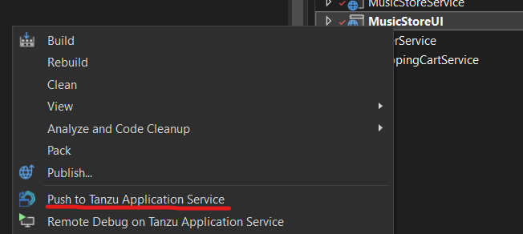
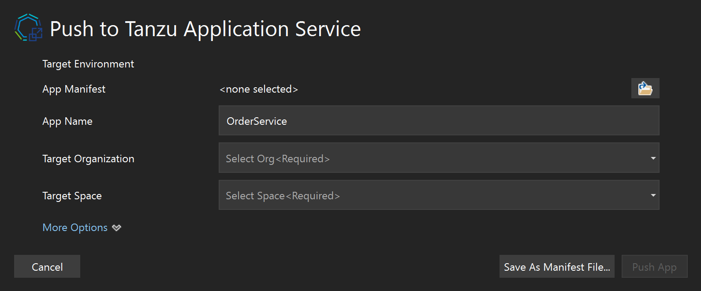
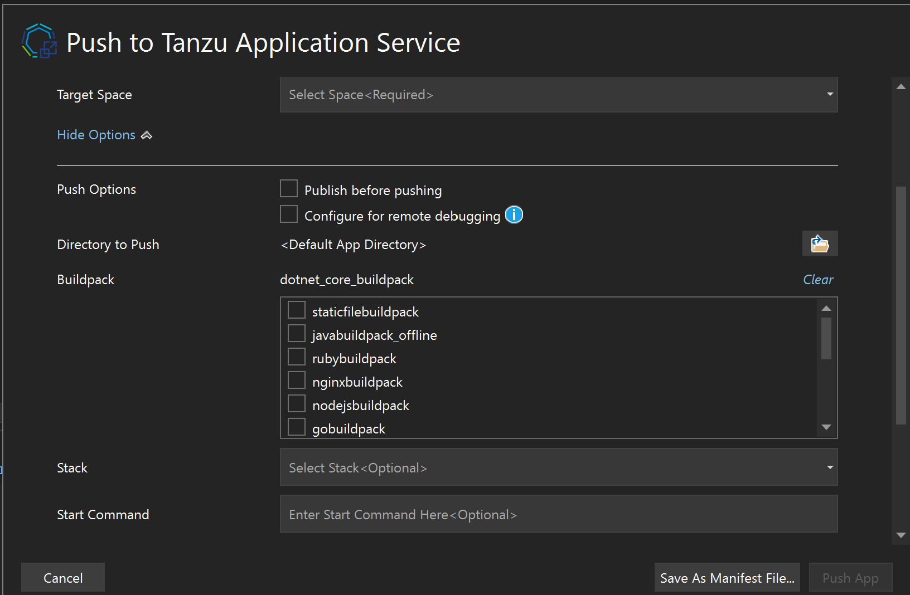
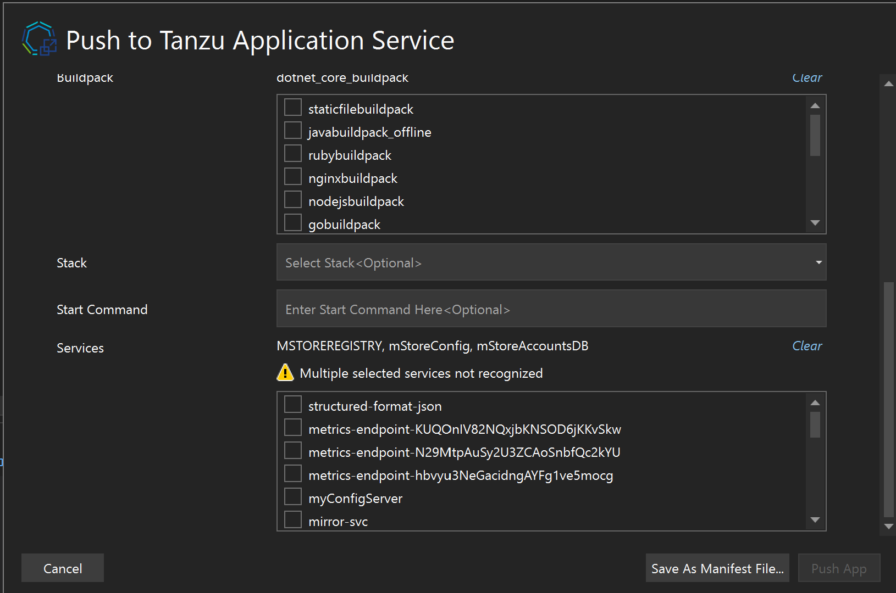
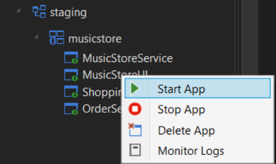
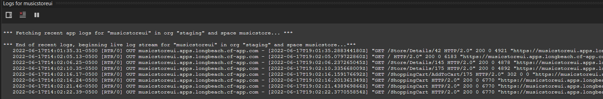
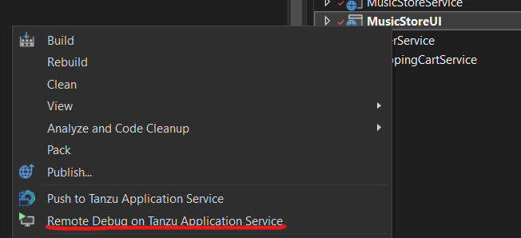
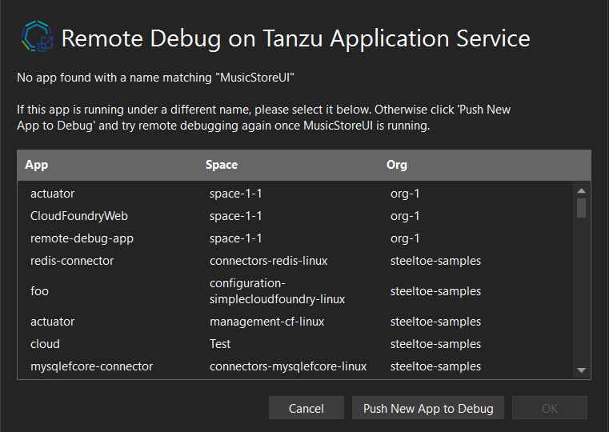
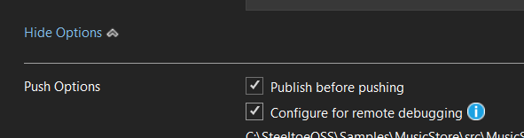
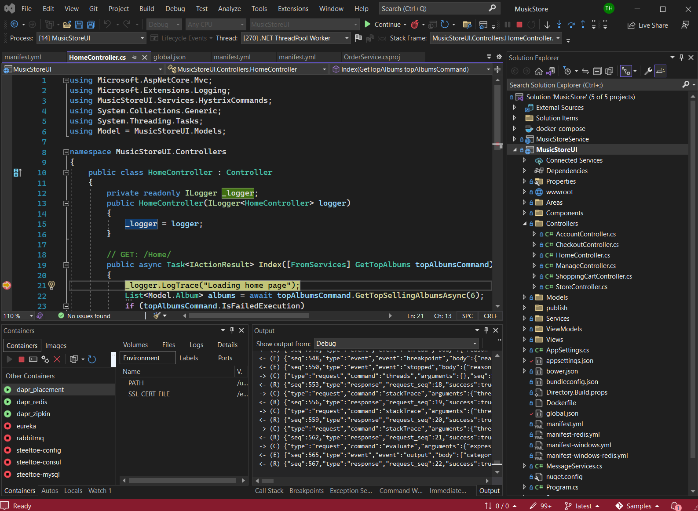

We're pleased to announce that the Tanzu Toolkit for Visual Studio is now generally available. [Tanzu Toolkit for Visual Studio](https://github.com/vmware-tanzu/tanzu-toolkit-for-visual-studio) is an extension for Visual Studio 2019 and 2022 that enables users of Tanzu Application Service ("TAS") or other Cloud Foundry distributions to manage applications directly from within Visual Studio IDE.

## Why release this extension?

Tanzu Application Service continues to be an excellent place to run cloud native applications, particularly those that are written in .NET.

While some features provided by this extension are already available in [Tanzu Apps Manager](https://docs.pivotal.io/application-service/2-13/console/dev-console.html), bringing them into Visual Studio reduces the impact of context switching and makes it easier to navigate directly to the correct application instance. Other features of the extension also simplify otherwise complicated tasks.

## What can it do?

Cloud native application developers need to be able to accomplish a few things in order to be productive:

* Build an application within some guidelines (that are implemented in a way that makes life easier, like marketplace offerings and service bindings)
* Perform some basic administrative tasks within the context of that application (at least in pre-production environments)
* Step through the code when something goes wrong (ideally regardless of where that code is running)

This extension provides those capabilities within an IDE used by many .NET developers. The extension provides the ability to quickly see, stop, start and delete apps running on Tanzu Application Service. You’ll also be able to push new apps to TAS and troubleshoot apps already running in TAS when things go wrong, and even step through their code line by line.

### Deploying Applications

Love it or hate it, Right Click -> Publish has been a hot topic in Visual Studio for a very long time due to the simplicity of quickly getting an application into an environment with minimal process. This extension includes a similar interface for deploying from an existing app manifest, or – if you’d prefer not to worry about YAML formatting or remembering all the keywords exactly correctly – just selecting the most important settings on the fly to ensure that your application deploys as expected.

Start the deployment process by right-clicking on the project you want to deploy and select "Push to Tanzu Application Service"

Notice you also have the option of specifying the stack (generally Windows or Linux, but this dropdown list is populated by what is present in your environment) or start command if those need to be specified as well.

Additionally, your service references are validated before deployment so there aren’t any surprises there, and you can add other bindings while deploying as-needed:

[Read more about deploying applications with the extension in the wiki](https://github.com/vmware-tanzu/tanzu-toolkit-for-visual-studio/wiki/App-Deployment-Window).

### Tanzu Application Service Explorer

Another very useful tool within the Tanzu Toolkit for Visual Studio is the Tanzu Application Service Explorer.
This tool window provides a nested view of orgs, spaces and the applications within each space. Right clicking on an application in this window allows you to start, stop, delete, and access the application logs.

This extension will retrieve recent logs for an application and connect to the log stream from within Visual Studio. You'll have options to clear the output window, pause and restart the stream and even toggle whether or not the window automatically scrolls as new logs come in.

[Read more about the Tanzu Application Service Explorer in the wiki](https://github.com/vmware-tanzu/tanzu-toolkit-for-visual-studio/wiki/Tanzu-Application-Service-Explorer).

### Remote Debugging Applications on Tanzu Application Service

One of the big challenges when working with cloud native applications is understanding what goes wrong in your application.  Often the best way to figure out what’s going on is by stepping through the code. There has been [a relatively involved way](/cookbooks/dotnet/core/remote-debug/) to do this for a while, but Tanzu Toolkit for Visual Studio provides a much more streamlined experience that enables you to step through code while your application is running in a remote TAS environment with only a few mouse clicks.

Start the remote debug process by right-clicking on the project you want to deploy and select "Remote Debug on Tanzu Application Service"

The extension will attempt to find your application automatically. If it is unable to locate it, you will be prompted to either select it from your environment, or push it.

If the application instance you select was not pushed with the debugging agent, or if you have not previously pushed the app at all, you need to deploy the application with "Publish before pushing" and "Configure for remote debugging" selected. These options (shown below) will ensure that the appropriate debugging agent is available for the extension to attach to and are automatically selected when clicking "Push New App to Debug" from the app selection window shown above.

While the application is publishing, pushing and attaching the debugger, be sure to set a breakpoint in your code. Once the attachment process is complete and the breakpoint is hit you'll be able to step forward from there with all the context needed to find out what's going wrong in your application!

[Read more about remote debugging in the wiki](https://github.com/vmware-tanzu/tanzu-toolkit-for-visual-studio/wiki/Remote-Debugging-TAS-Apps).

## How can I install it?

To install Tanzu Toolkit for Visual Studio from within Visual Studio, click Extensions -> Manage Extensions and search for “Tanzu”. You should see one option that is the correct option for the version of Visual Studio you’re searching from.

Alternatively, use one of the links below to download the extension more directly:

* [Tanzu Toolkit for Visual Studio's Github releases page](https://github.com/vmware-tanzu/tanzu-toolkit-for-visual-studio/releases)
* [Tanzu Toolkit for Visual Studio 2022 in the Visual Studio Marketplace](https://marketplace.visualstudio.com/items?itemName=TanzuNETExperience.TanzuToolkitForVisualStudio2022)
* [Tanzu Toolkit for Visual Studio 2019 in the Visual Studio Marketplace](https://marketplace.visualstudio.com/items?itemName=TanzuNETExperience.TanzuToolkitForVisualStudio2019)

To learn more about Tanzu Toolkit for Visual Studio, visit the wiki, or send us an email at [tas-vs-extension@vmware.com](mailto:tas-vs-extension@vmware.com)
