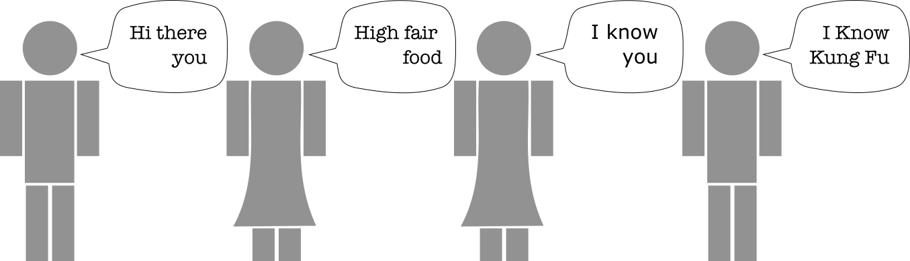

Good communication is one of the hardest things to be effective at. In relationships, in business, in teams, communication has and continues to be at the top of the list when it comes to what makes them good or bad.  Core to communication in general, is the ability to speak the same language.  On a software team, this can be accomplished by speaking a language that is **_ubiquitous_**.  

> # **Ubiquitous**
> [yoo-**bik**-wi-_tuhs_] *adjective*
> 
> present, appearing, or **found everywhere**

How can a "ubiquitous" language help how you talk to your teams, your users, and the business (stakeholders and end-users)?  What do you need to do to discover it, and how should it be used to be most effective?  Before you dive into the answers to these questions, let's start with the basics.

## What is ubiquitous language?
Ubiquitous language is a set of unambiguous vocabulary shared by all members and stakeholders of a product team.  Eric Evans talks about "Ubiquitous Language" in his book [Domain Driven Design: Tackling Complexity in the Heart of Software](https://www.amazon.com/gp/product/0321125215). 

> Ubiquitous Language is modeled within a Limited context, where the terms and concepts of the business domain are identified, and there should be no ambiguity.

For those working on a [balanced team](https://tanzu.vmware.com/developer/learningpaths/application-development/balanced-teams/), this means that the product manager(s), designer(s), and engineer(s) use the same terminology to talk about their product, but _**more importantly**_, the same language that is used to talk to the business.  What makes this language ubiquitous is that it is truly **found everywhere**, from communications with the end-users and the stories derived from those conversations, all the way down to the objects and code that is written as a result. According to Evans, the language should align with your [domain model](https://martinfowler.com/eaaCatalog/domainModel.html), the structure of the interconnected objects and their associated methods defining a business process, of the software itself.  

Software code, by necessity, is very structured and unambiguous.  For example, the same word in the same context in a block of code cannot have two different meanings because the compiler would be unable to determine how to compile the code to be understood by the computer.  However, language (especially English) can be highly ambiguous.  Take the following sentence for example.  

> The ball would have hit the bat if it were two inches higher.

The word "bat" in this sentence could have referred to a bat with wings or a bat made of wood.  The sentence is correct either way, and absent any additional context, you do not know the true meaning.

By maintaining a one-to-one correlation between the language you use to describe the software you are building, with the actual software, you can utilize the unambiguous nature of the code to drive more ambiguity out of the language you use to describe it.  If you are able to create a way of communicating that is not ambiguous, your process of defining and building software can become a lot more efficient.  This can be accomplished by removing the need to ask questions like "what do you mean by that?", or "do you mean..." as frequently.  It also spares you the embarrassment of getting all the way from a user interview, to a user story, to code and then realizing, "Oh!  You meant this...".

Some other characteristics of ubiquitous language are:
 
* terms have a single meaning within a given context (no exceptions)
* agreed upon by stakeholders, but not unilaterally defined by them
* evolves over time
* consists of domain terms, not technical ones 
  *  ("linked list", "hashmap", and "singleton" don't generally appear in a ubiquitous language)

There are a lot of "rules", so to speak, to defining and maintaining a ubiquitous language.  You may be asking yourself, "Why go through the effort?" In order to answer that question lets dig into how this could help you and your team deliver better outcomes to the businesses you support.

## The importance
So why is it important that you all speak the same language?  For decades, huge organizations have adopted the "waterfall" mentality of distilling a business domain into a set of requirements by requirements writers, which were then translated by architects into high level architectures, which were then translated by senior software engineers into lower level software designs, which were then translated and implemented by software engineers on a number of teams throughout the organization.  Ultimately turning the software development process into a huge game of telephone.



Some domain terms may have made it from the requirements into the software, but a large majority didn't.  This model primarily breaks down when there is an expectation of bidirectional, or skip-level, communication.  The reality is that software development isn't as simple as requirements to architecture to design to code. In order to build software, especially in an "agile" or "lean" manner, especially on a balanced team, you empower all roles to engage with the business. It isn't just the PMs responsibility to learn and understand the business context, but everyone's. For this to happen effectively, individuals must communicate.  That communication goes a lot more smoothly if the words that the engineers are using have the same meaning as those translating the business domain to write stories.

Let's use an example to illustrate what we are talking about.  Say that your team is writing a shopping application and your product manager has a user interview with someone from the business and write a single story that says something along the lines of:

> As a customer, I want to add products to my shopping cart, so that I can continue shopping until I'm ready to check out.

The architect may then make some high-level architecture decisions:
* A shopping cart should be implemented as a list of items that are comprised of a product and quantity
* A customer is an authenticated user
* Once the customer checks out, the items in the shopping cart should be removed

Now, being in the hands of the developer, they write something like this:

```java
class Item {
    Product product;
    int quantity;
}

class ItemList {
    List<Item> itemList;
    
    void add(Item item) {
        //add to list
    }
    
    void remove(Item item) {
        //remove from list
    }
    
    void removeAll() {
        //removes all items from list
    }
}
```

Although the implementation is technically correct, the terminology they used when writing the code has now given the developers a different vocabulary than other members of the team.  Now you have introduced some translations that need to happen:

* Product <--> Item
* Cart <--> ItemList
* ??? <--> Product
* "Checkout" <--> "Remove all items from cart"

What has been created here is a translation layer between the PM and the engineers, and worse, between engineers and the business. Requiring these translations will reduce the efficiency of conversation, increase cognitive load, and possibly even break down trust between the engineering team and stakeholders.

To streamline this communication as much as possible you need to remove all unnecessary translations.  Remember, the word ubiquitous means "found everywhere", so let's see how this should best be accomplished in a software product on a balanced team.

## Usage
For this language to be **found everywhere** it's important that it is defined and understood **by everyone**.  The best and easiest way to accomplish this is to ensure that all disciplines are involved in as much user-facing communication, especially ones that involve a conversation about the business domain.  It's not necessary for the entire development team to sit in every single user interview, but at least one representative per discipline sitting in on each interview helps remove language barriers.  Translation and context sharing has a cost that should not be ignored.  Engineers, especially the more senior ones, should know the business domain just as well as the PM and designers.

### Product
Product Managers (PMs) and designers _generally_ interface with the end-users and stakeholders on a more regular basis than with engineering.  As advocates of those individuals, PMs generally tend to "speak the same language" as them.  Their ability to remain fluent in the business language can be relatively simple, however, the business language isn't necessarily the same as the ubiquitous language for the team.  Since the ubiquitous language is an agreement with the entire team including the business, there are a few things they must do to remain good stewards of the ubiquitous language for the team.

The first is prematurely translating terms or meanings so their team "understands it better".  At the end of the day, it will be better for a PM to take the time to explain the business domain, terms, and meanings to every member of the team than to try to spare them.  Words mean things. They also often mean different things to different people with different perspectives.  Using the same terminology as the business, at least at first, will ensure that all perspectives have the same understanding of the underlying meaning of it prior to agreeing upon the correct term or meaning for that thing.

The second thing PMs should avoid doing is being authoritative about the ubiquitous language.  In order for the language to be ubiquitous, _everyone_ must agree on the meaning, the business, product, design, and engineering.  This means that there is room for negotiation on the terms being used.  Every term in the ubiquitous language will have a clear meaning to the business, but that does not mean that it will have a 1:1 correlation (every time) with the terms used in the business.  For example, the user of the online shopping business may use the word "shopping cart" consistently, however, the team may determine for one reason or another to use the term "cart" instead.  As long as the business clearly understands that "cart" is the same as "shopping cart" with no ambiguity, then it can be used in place of "shopping cart" in the ubiquitous language.  The shortening of terms in the language like this one is a good example of how your ubiquitous language may change over time.  As long as the whole team is understanding the business and shares that understanding with everyone, they can work together to settle on what is ubiquitous for them.

When producing their artifacts, generally in the form of user stories, they should use ubiquitous language continuously and consistently.  An examples story may what you saw earlier:

> As a customer, I want to add products to my shopping cart, so that I can continue shopping until I'm ready to check out

Let's now explore how this user story may make its way into the designs for this application.

### Design

As a frequent communicator with the business, being good stewards of the ubiquitous and business languages applies to design the same way it does to product.  One of their primary roles is to generate visual designs and insights from synthesized research to be used by the team.

For both artifacts, it is important to stay consistent with the ubiquitous language terminology.  By using this language these two artifacts are uniquely positioned to be one of the best methods to iterate and refine the ubiquitous language.  At the end of the day, the designs produced are consumed by both the business and the engineering team.  They are consumed by the business when validating user flows and UI designs, and they are used by the engineering team when reviewing, prepping for, and ultimately implementing the UI and the associated backend development tasks.  Because it is consumed by and influenced by both of these groups of people, it provides a great opportunity to validate the ubiquitous language as well.  

If engineers have questions about the terminology used in the design, they may try to make sense of things they see in the design using different terminology or concepts.  It's important that these terms and concepts are deconflicted with designs, so you don't create a translation layer.  Similarly, as the user interviews are happening, if the users are saying things like "this term doesn't make sense here", or "I would have expected this to be labeled x" it's a sign that the ubiquitous language being used isn't valid, and should be iterated upon. All this to say, **use designs as a mechanism to talk about and validate your ubiquitous language**.

If this validation is done effectively, it has a lot more power than just improving communication between members of the team.  It has validated the UI design and flow but also, to some extent, the software design of the domain objects.

So you have created a design and validated the ubiquitous language you are going to be using through several interviews, now how does that become working code?

### Engineering
The largest and most important artifact generated by engineering is code.  Code is also sometimes the hardest place to become comfortable using an increasing amount of business language.  You might hear an engineer say...

>The concepts of this business domain are very similar to many others.  If we implement it generically, then we can easily expand this use case into other business domains.

Although this is often a valid statement, going down this path may result in inefficiencies and poor communication with the business domains you are currently supporting.  Like in software architecture, it is important to make these types of decisions at the latest responsible moment. It's OK to generalize language to a point, if it still maintains meaning to the business.  If it gets generalized to the point of having no meaning to the businesses you currently support, it may be an indication that you are drifting into a different [bounded context](https://martinfowler.com/bliki/BoundedContext.html), and greater engineering and architecture decisions may need to be made.  Unfortunately, that is too big of a concept to cover in this blog, however, some resources on domain-driven design mentioned at the end of this post goes to great lengths on that subject. 

In addition to the over-generalization of terms, it's important to steer clear of technical jargon when it comes to your domain model and ubiquitous language.  As much as a developer would love to think everyone knows what a singleton or linked list is, the unfortunate truth is that many do not.  So when it comes to naming major objects in your domain, it's important to stay away from these terms.

Let's refactor the example shown earlier to show what a _more_ correct solution would be when it comes to the use of ubiquitous language.  

```java
class ShoppingCart {
    List<Pair<Product, Integer>> products;
    
    void add(Item item) {
        //add to list
    }
    
    void remove(Item item) {
        //remove from list
    }
    
    void checkout() {
        //removes all items from list
    }
}
```
Now the mapping looks like this

* Shopping Cart <--> Cart
* Product <--> Product
* "Checkout" <--> "Checkout"

There may not always be a one-to-one correlation between terms that are used in the business on a day-to-day basis, but the words that do make it into a ubiquitous language need to at least be unambiguously understood by the business. This language is essentially a contract between the business and all members of the team, and everyone should agree with that contract.  

Remember, Evans states in his book that ubiquitous language should be based on the domain model of a business process.  So what are some methods you can use to identify the domain model and the ubiquitous language for a business?

## Discovery and definition

Like any language, ubiquitous language will naturally evolve over time.  New words will be introduced, some will change, and others will disappear, never to be seen, heard or uttered again.  No matter the means of discovery, it is important to constantly validate the language.  If at any point, members of the team or the business believe that the language is incorrect or incomplete, it should be addressed to ensure that the team remains on the same page.  If it is determined that a change is required, it should be addressed everywhere.

One of the most effective ways to discover a business process' terminology is through an exercise called _Event Storming_.  The purpose of an event storm is to rapidly model a business process using business language.  The outputs of an event storm can be used with other Domain Driven Design tools to build a domain model, the thing your ubiquitous language is based on, for that business process.  Event storming starts by getting a wide variety of perspectives together to discuss a business process.  Historically when I have facilitated these, that may consist of folks from multiple parts of the business, engineers, designers, etc.  All the individuals will then begin to create a picture of the process by generating events (past tense actions) that occur in the process.  Events like "product added to cart", "checked out", or "paid" make their way onto a sticky and then onto a whiteboard.  It is surprising how much is modeled in a short period of time.  It's also surprising how many questions arise about terminology.  Questions like, "What do you mean by 'archived'?" Sometimes, due to the varied perspectives of the participants, two sticky notes have nearly the same words on them but have dramatically different meanings.  This exercise is the time to have those conversations about the nuance of the words being used, ultimately deciding on the one true way that things should be described.  Having those conversations early during the inception of a product is much cheaper than having them after that terminology and understanding have made it into the minds of the developers and code of the application.

A full event storm is a time investment.  Given a moderately large business domain, it can take a week or more.  There are different variants of event storming including [Swift](https://www.swiftbird.us/) which take less time.  I will be exploring the different event storm exercises, their purposes and their benefits in a future blog.

If you don't have the time to devote to an event storm, there is already an exercise on Tanzu Developer Center for discovering a Ubiquitous language, [you can find it here](https://tanzu.vmware.com/developer/practices/ubiquitous-language/).

## Language maintenance

Natural languages have dictionaries, thesauruses, and many other texts to capture and maintain the language.  They also must be used consistently to stay alive.  A ubiquitous language for a product team is no different.  It must be used by everyone, **everywhere**.  To that end, it's not a bad idea to document it as well for new members of the team, or business, to get up to speed more quickly.  Glossaries within markdown files in a repo, an associated wiki, or a separate documentation website or resource are all good ways to record this unique language.  Like any good documentation, it should be kept up to date.  The cost of this, no matter the investment, is far less than the time that will be saved by communicating precisely and effectively with stakeholders, users, and your product team.

## Additional resources

* [Domain Driven Design - Eric Evans](https://www.amazon.com/gp/product/0321125215)
  * Great for software engineers looking to learn about DDD from the expert
* [Learning Domain Driven Design (Aligning Software Architecture and Business Strategy) - Vlad Khononov](https://www.amazon.com/Learning-Domain-Driven-Design-Aligning-Architecture/dp/1098100131)
  * Distilled version of Eric Evans book that talks about and advocates for ubiquitous language
* [Event Storming](https://www.eventstorming.com/)
  * Website with resources for understanding event storming from the person who invented it
