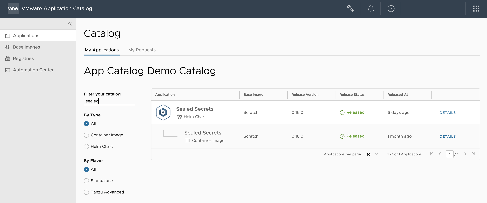
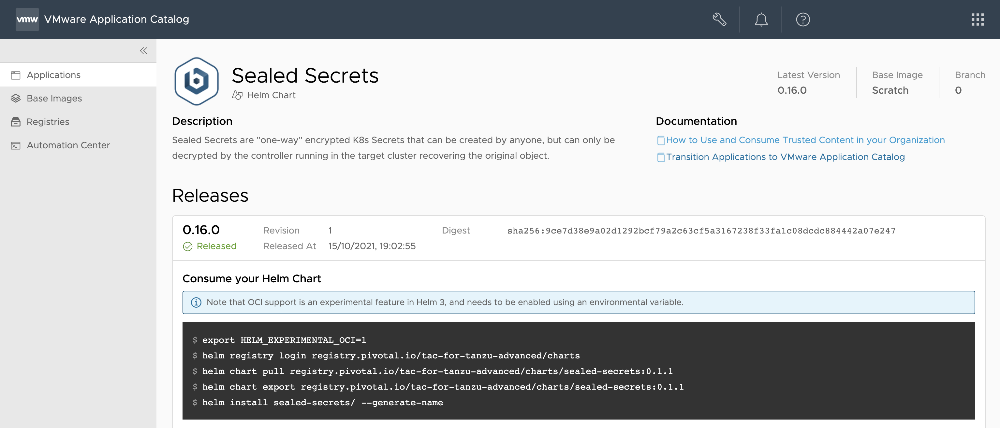
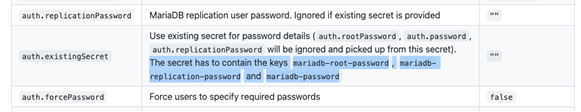
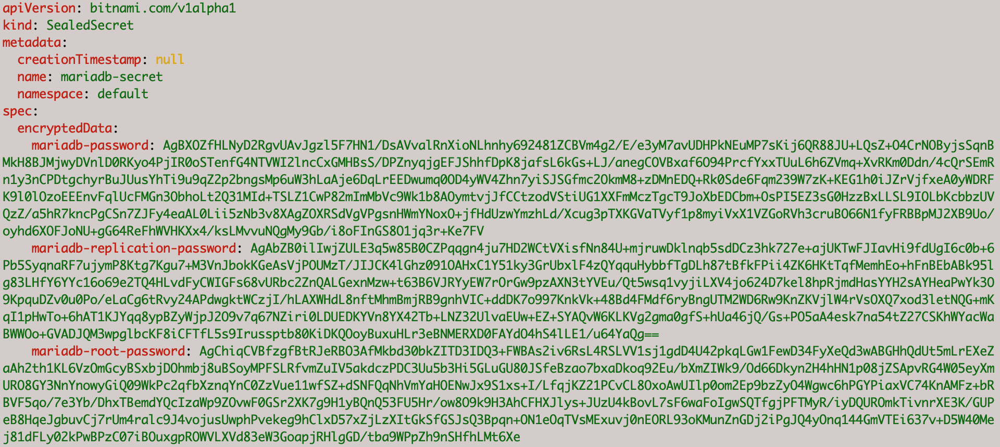

{} First published on [https://blog.bitnami.com/2021/11/deploy-applications-with-confidence-vmware-application.html](https://blog.bitnami.com/2021/11/deploy-applications-with-confidence-vmware-application-catalog.html). {}

As more organizations adopt Kubernetes as the preferred infrastructure for running their IT resources, enterprise SRE teams tend to adopt a GitOps mindset.  

The GitOps approach consists of embracing different practices that manage infrastructure configuration as a code. This means that Git becomes the single source of truth and as such, all operations are tracked via commits and pull requests. Thus, every action performed on the infrastructure will leave a trace and can be reverted, if needed.  

These practices bring a lot of benefits to IT admins, since automation and ease of managing Kubernetes configurations are extremely important to them. 

Despite this, there's a high probability of discovering security risks when managing the access to the applications running in a Kubernetes cluster. This is where Sealed Secrets comes in. Sealed Secrets is a Kubernetes controller and a tool for one-way encrypted secrets.  

## Why Should Every Cluster Controller Use Sealed Secrets to Protect Their Deployments?  

When cluster operators and administrators follow the GitOps approach, they find that they can manage all Kubernetes configurations through Git except for secrets. Sealed Secrets solves this problem by encrypting the secret into a new Kubernetes object called “SealedSecret” which is safe to store even in public repositories.  

Sealed Secrets is a popular Open-Source project led by Bitnami that helps Kubernetes operators and administrators keep their deployments safe and under control. Sealed Secrets can only be decrypted by those who have access to the sealing private key. This is usually the role of the cluster administrator who is responsible to ensure that nobody else, including the original author, is able to obtain the secret given in a Sealed Secret manifest file. 

Sealed Secrets is now available as a Helm chart in the VMware Application Catalog (*formerly known as Tanzu Application Catalog*)! VMware Application Catalog is a customizable selection of trusted, prepackaged open-source application components that are continuously maintained and verifiably tested for use in enterprise production environments. It is the ideal option to procure secure application building blocks.  

Depending on your requirements, you can either navigate to the ongoing Open-Source project located in the Bitnami GitHub repository and [download the tool](https://github.com/bitnami-labs/sealed-secrets) to test it out. Or, if your organization requires a more stable, secure, and compliant image, you can deploy Sealed Secrets on your cluster through VMware Application Catalog.  

## Prerequisites for Deploying Sealed Secrets on Kubernetes

The following prerequisites must be met before you can deploy Sealed Secrets on Kubernetes through VMware Application Catalog: 

* Sealed Secrets and MariaDB are in your VMware Application Catalog 
* [Kubeseal](https://github.com/bitnami-labs/sealed-secrets#overview) is installed on your computer. 

### Deploy Sealed Secrets on Kubernetes through VMware Application Catalog 

The following steps describe how to navigate to [VMware Application Catalog](https://tanzu.vmware.com/content/blog/announcing-evolution-vmware-application-catalog) and deploy Sealed Secrets in your cluster. Once installed, you can deploy any application. For example, this blog post uses MariaDB, but you can pick another solution in your catalog, and encrypt its secrets using a Sealed Secret.  

1. Navigate to [app-catalog.vmware.com](https://app-catalog.vmware.com) and sign in to your catalog with your VMware account. 

2. In My Applications section, search for **Sealed Secrets Helm chart**. Click **Details**.

   On the next screen, you will find the instructions for deploying the chart on your cluster. Make sure that your cluster is up and running.

   

3. Execute **kubectl cluster-info**, then run the commands in the **Consume your Helm Chart** section.

   

4. Once you have installed the Sealed Secrets chart, encrypt the required secrets to manage the MariaDB credentials. Fortunately, the MariaDB Helm chart supports retrieving the credentials from an existing secret. 

   In order to use encryption feature, you need to find out what the expected format is for the MariaDB secret. To find this out, go to the "Common Parameters" section in the MariaDB chart's README file. 

    

5. Run the following command to use [kubeseal](https://github.com/bitnami-labs/sealed-secrets#overview) to create a Sealed Secret with encrypted credentials for MariaDB based on this information. 

   ```bash
   kubectl create secret generic mariadb-secret --dry-run=client \ 
     --from-literal=mariadb-root-password=ROOT_PASSWORD \ 
     --from-literal=mariadb-replication-password=REPLICATION_PASSWORD \ 
     --from-literal=mariadb-password=SOME_PASSWORD \ 
     -o yaml | kubeseal --controller-name=CONTROLLER_NAME \ 
     --controller-name=CONTROLLER_NAMESPACE \ 
     --format yaml > mariadb-sealedsecret.yaml 
   ```
   {} Remember to replace the `ROOT_PASSWORD`, `REPLICATION_PASSWORD` and `SOME_PASSWORD` placeholders with the passwords that you want to use to configure MariaDB. Also, replace the `CONTROLLER_NAME` and `CONTROLLER_NAMESPACE` with the name and namespace of your Sealed Secrets controller, respectively. This information is available in the `NOTES` section when installing the Sealed Secret chart. {}
   
   The above command also creates a new `.yaml` file named `mariadb-sealedsecret.yaml`. It contains the encrypted MariaDB credentials. The file displays as follows:  

   

6. Add this file to your Git repository.

7. Once you have a Sealed Secret manifest, run the following command to deploy it in your Kubernetes cluster: 

   ```bash
   kubectl create -f mariadb-sealedsecret.yaml 
   ```

8. Run the following command to verify that the Sealed Secret, and the associated secret was successfully created: 

   ```bash
   kubectl get sealedsecret mariadb-secret 
   kubectl get secret mariadb-secret  
   ```

9. Deploy the MariaDB Helm chart and retrieve the credentials from the existing "mariadb-secret" secret.

   a. Go back to VMware Application Catalog.
   b. Search for the MariaDB details page
   c. Once the page is found, execute the command in the "Consume your Helm Chart" by appending the following flag: 

      ```bash
      --set auth.existingSecret=mariadb-secret 
      ```

   Once the chart is installed, you can start to operate your MariaDB database, as described in its installation notes. 

8. Obtain the chart installation values. Save them in a file using the following command:

   ```bash
   helm get values MARIADB_RELEASE > mariadb-values.yaml 
   ```

   {} NOTE: Remember to replace the `MARIADB_RELEASE` placeholder with the name you used for your MariaDB release. {}

9. Add `mariadb-values.yaml` to your Git repository.  

   By committing both this and the `mariadb-sealedsecret.yaml` file in your repository, you can record the status of your infrastructure in a reproducible manner, allowing to again embrace the GitOps mindset. Thanks to Sealed Secrets, you can also now publish your changes in any public repository, without exposing your database credentials. 

## Deploy Applications with Confidence and Control 

As this blog post proves, the combination of Sealed Secrets and VMware Application Catalog allows you to deploy applications in your cluster with complete confidence. Apart from keeping your applications automatically updated and monitored thanks to VMware Application Catalog, you can now rely on the efficiency of Sealed Secrets for keeping your deployments locked and safe against misuse.  

Learn more about VMware Application Catalog by checking its [product page on vmware.com](https://tanzu.vmware.com/application-catalog). You can also check out technical documentation for VMware Application catalog here. You can also contact the VMware Application Catalog team directly at vac@vmware.com  

If you are interested in contributing to the Sealed Secrets Open Source project, [check out the GitHub repository](https://github.com/bitnami-labs/sealed-secrets) and do not hesitate to [send us a pull request](https://github.com/bitnami-labs/sealed-secrets/pulls). The Bitnami engineering team will check it and guide you in the process for a successful merge.   
