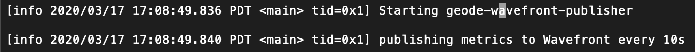
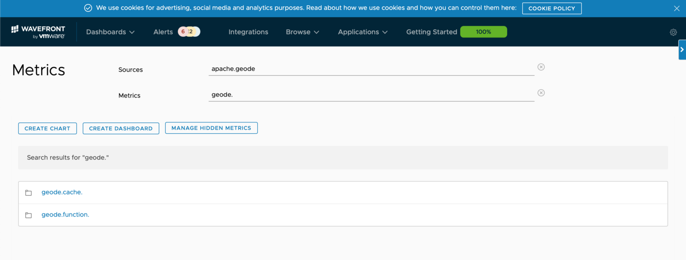
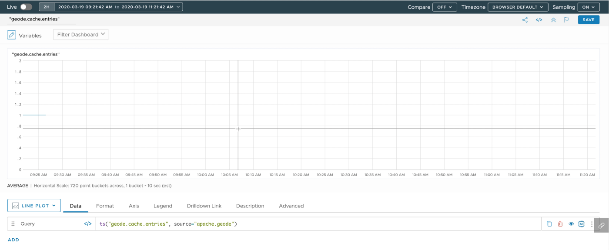
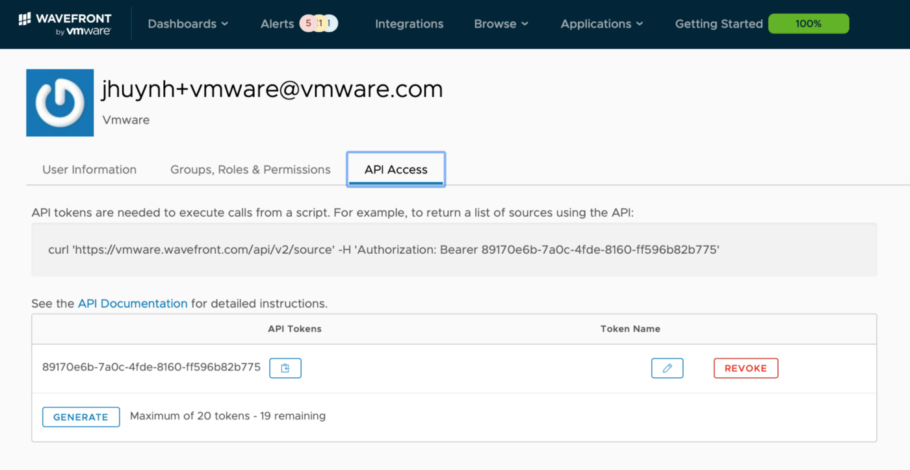

## Overview
Micrometer support was added to Apache Geode in version 1.10. Micrometer is a popular metrics gathering library and has integrations with numerous monitoring products. In this particular case, Micrometer provides a simple way to create a Micrometer registry for [Wavefront](https://www.wavefront.com/) and we’ll plug this registry into an implementation of Apache Geode’s MetricsPublishingService. This will allow our Apache Geode Cluster to publish metrics to Wavefront.

## Download the jar
Download the [geode-wavefront-publisher](https://bintray.com/jasonhuynh/jhuynh1-maven/download_file?file_path=com%2Fgithub%2Fjhuynh1%2Fgeode%2Fwavefront%2Fgeode-wavefront-publisher%2F1.0%2Fgeode-wavefront-publisher-1.0-all.jar) jar into a known location.

## Start up the Apache Geode Cluster
Now we are ready to start a locator, we will supply the configurable values with our GFSH command. For the wavefront-source parameter, we will use “apache.geode” so we can identify the stats when searching for them in Wavefront.
The default for the geode-wavefront-prefix is “wavefront” but we can configure this to whatever we choose. In this case I’ll use “wavefront.geode.jhuynh” to further distinguish my stats from others.

```
start locator --name=locator --classpath=/User/jhuynh/geode-wavefront-publisher-1.0-all.jar --J=-Dgeode-wavefront-api-token=fa954bae-69e4--4925–9a1b-2d001a306166  --J=-Dgeode-wavefront-prefix=wavefront.geode.jhuynh --J=-Dgeode-wavefront-source=apache.geode
```


Start the server, again we will supply the configurable values with our GFSH command

```
start server --name=server --classpath=/User/jhuynh/geode-wavefront-publisher-1.0-all.jar --J=-Dgeode-wavefront-api-token=fa954bae-69e4–4925–9a1b-2d001a306166 --J=-Dgeode-wavefront-prefix=wavefront.geode.jhuynh --J=-Dgeode-wavefront-source=apache.geode
```

Everything is up and running and pushing Apache Geode specific metrics into Wavefront!



Log output from Apache Geode server log


Let’s create a region, do a put and check the metrics in the Wavefront UI.

```
gfsh>create region --name=SomeRegion --type=PARTITION
Member | Status | Message
------ | ------ | ----------------------------------------
server | OK     | Region "/SomeRegion" created on "server"
Cluster configuration for group 'cluster' is updated.
gfsh>put --key="hello" --value="world" --region=SomeRegion
Result      : true
Key Class   : java.lang.String
Key         : hello
Value Class : java.lang.String
Old Value   : null
```

Now we can go to Wavefront and see some of the Apache Geode provided metrics!


</br>Apache Geode Metrics showing up in Wavefront!


We see the metric for the entry we put into SomeRegion

We’ll now go into detail to see how this was implemented so you can build your own or build a new MetricsPublishingService that connects to a different Micrometer supported platform.

## Implementation
We create a Java project that uses gradle as it’s build tool. We’ll also include a few imports in the build.gradle, the first being the Wavefront registry.

```groovy
implementation ‘io.micrometer:micrometer-registry-wavefront:latest.release’
```

And we’ll also import Apache Geode and for logging we’ll pull in log4j2

```groovy
implementation group: ‘org.apache.logging.log4j’, name: ‘log4j’, version: ‘2.13.1’, ext: ‘pom’
implementation group: ‘org.apache.geode’, name: ‘geode-core’, version: ‘1.1
```

## Creating a Wavefront registry
Below is the entire source for the Wavefront Registry. We create a WaveConfigObject, where we could have hard coded our values for api token, prefix and source. However, we tried to build this to be more generic and make it configurable when starting up the Geode Cluster. We end up using system properties that can be supplied via parameters in GFSH. There are other alternatives but this was one of the simplest. This allows anyone to simply get a prebuilt jar and be able to use it for their own deployments.

```java
private MeterRegistry createWavefrontRegistry() {
    WavefrontConfig config = new WavefrontConfig() {
        private final String prefix = System.getProperty("geode-wavefront-prefix", "wavefront.geode");
        private final String apiToken = System.getProperty("geode-wavefront-api-token");
        private final String source = System.getProperty("geode-wavefront-source", "apache.geode");
        @Override
        public String uri() {
            return "https://vmware.wavefront.com";
        }

        @Override
        public String apiToken() {
            //This is the key you can generate from your Wavefront account
            return apiToken;
        }

        @Override
        public String get(String key) {
            //Accept rest of Wavefront defaults by returning null
            return null;
        }

        @Override
        public String prefix() {
            return prefix;
        }

        @Override
        public String source() {
            return source;
        }
    };
    return new WavefrontMeterRegistry(config, Clock.SYSTEM);
}
```

## Wait, what’s my API token Key?
The API Token Key is provided by Wavefront. If you have access to Wavefront, you can generate your token key from your account.


</br> Generating an api token key

## Implementing a MetricsServicePublisher
The MetricsServicePublisher is pretty straightforward for this case. Below is the entire class, omitting the createWavefrontRegistry() method that we already covered.

```java
public class GeodeWavefrontPublisher implements MetricsPublishingService {
    final static Logger logger = LoggerFactory.getLogger(GeodeWavefrontPublisher.class);
    private volatile MeterRegistry registry;

    @Override
    public void start(MetricsSession session) {
        logger.info("Starting geode-wavefront-publisher");
        registry = createWavefrontRegistry();

        // add the Wavefront registry as a sub-registry to the cache's composite registry
        session.addSubregistry(registry);
    }

    @Override
    public void stop(MetricsSession session) {
        logger.info("Stopping geode-wavefront-publisher");
        session.removeSubregistry(registry);
    }
...
}
```

In the start method, we create the wavefront registry and add that as a subregistry to our MetricsSession object

```java
registry = createWavefrontRegistry();
session.addSubregistry(registry);
```

On stop we will unregister the meter.

```java
session.removeSubregistry(registry);
```

## What else do we need?
We create a file called *org.apache.geode.metrics.MetricsPublishingService* and place it in *META-INF/services* in the resource directory. The contents of this file is the path to our publisher. For this implementation it will be *com.github.jhuynh1.geode.wavefront.GeodeWavefrontPublisher*. This allows Geode to discover and use the publisher when the jar is included at start up.

## Creating an “uber”/shadow jar
We’ll be using the GFSH command line interface to include our publisher jar when starting up the cluster. To simplify the number of jars needed to be included on the classpath, we can build an “uber” jar which will include the required Micrometer Wavefront dependencies with our jar. The alternative obviously would have been to include all the jars independently on the classpath.
Modify the build to use the shadow plugin and allow it to build an “uber” jar.

```groovy
id ‘com.github.johnrengelman.shadow’ version ‘5.2.0
```

In this particular case, we know we’ll only need to add the micrometer-wavefront-registry along with our code. We don’t need to package up Apache Geode since we will be deploying this jar onto a Geode cluster. There are probably better ways to do this, but I just created a new configuration that we’ll explicitly call out which dependencies to include

```groovy
configurations {
    uberImplementation
}
shadowJar {
    project.configurations.uberImplementation.canBeResolved = true
    configurations = [project.configurations.uberImplementation]
}
```

And in the dependencies we end up duplicating a dependency to indicate one is for implementation and the other specifically for the uber jar

```groovy
dependencies {
  ...
  implementation 'io.micrometer:micrometer-registry-wavefront:latest.release'
  uberImplementation 'io.micrometer:micrometer-registry-wavefront:latest.release'
}
```

To build the “uber” jar use the following command

```
./gradlew shadowJar
```


</br>The contents will be in the build/libs directory

That’s all there is to it. If you haven’t already, just follow the instructions on Build and Deploy and you’ll be able to deploy your own implementation the same way.

## Grab the complete source

```
git clone https://github.com/jhuynh1/geode-wavefront-publisher.git
```

## What Else?
Also available is a [video walkthrough](https://www.youtube.com/watch?v=BDZh-FLkDTg)

Join the [Apache Geode Community](https://geode.apache.org/community/)!

[How to add more metrics to Apache Geodes implementation](https://cwiki.apache.org/confluence/display/GEODE/How+to+add+a+Meter)

Create and share your own MetricsPublishingService on the [user list](https://geode.apache.org/community/)

[Ingest, Store and Search JSON data with Apache Kafka and Apache Geode](/data/tanzu-gemfire/blog/apache-geode-apache-kafka)