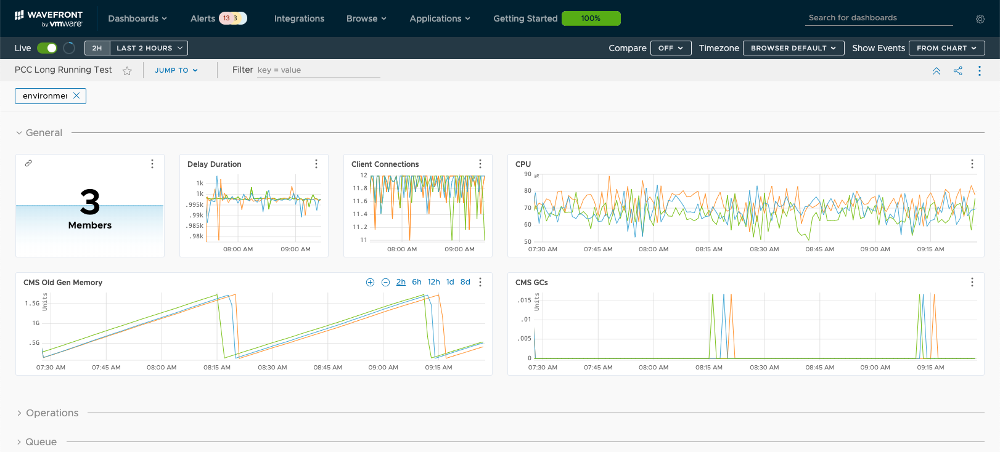
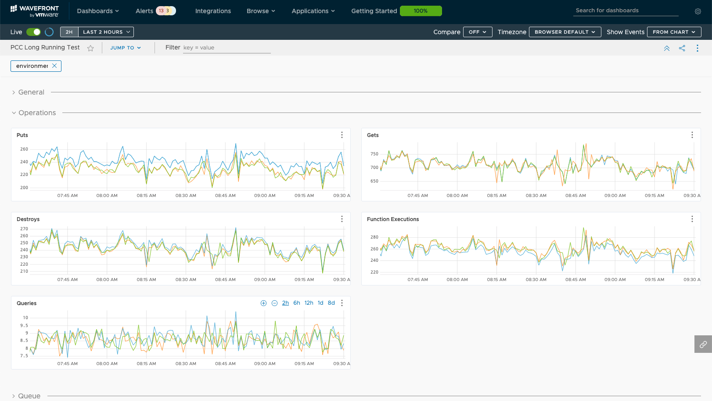

## Introduction
[Apache Geode](https://geode.apache.org/) provides many Statistics for monitoring the Distributed System including:
* Region Statistics (e.g. entries, creates, gets, updates, destroys)
* Cache Server Statistics (e.g. currentClientConnections, currentClients, putRequests, getRequests, threadQueueSize)
* Function Execution Statistics (e.g. functionExecutionCalls, functionExecutionsCompleted)
* Gateway Sender Statistics (e.g. eventQueueSize, batchesDistributed)
* Distribution Statistics (e.g. nodes, receivedBytes, sentBytes, receivers, sendersTO, functionExecutionQueueSize)
* Client Proxy Statistics (e.g. messageQueueSize, messagesProcessed)
* Sampler Statistics (e.g. delayDuration)

The Statistics have been used for both monitoring and troubleshooting a Distributed System. They are available as JMX attributes mainly for monitoring and also are written to files mainly for troubleshooting. Monitoring is done via Geode tools like Pulse or JMX tools like JProfiler. Troubleshooting is done via a tool like [vsd](https://gemtalksystems.com/products/vsd/) that reads and helps analyze the files.

Recently, some of the Statistics have also been made available as [Micrometer Meters](https://micrometer.io/docs/concepts#_meters) so that they can be monitored via tools like [Wavefront](https://www.wavefront.com/). Many Statistics are not currently available as Meters including some that have historically been very valuable especially when troubleshooting issues.

This article describes a way to convert all existing Geode Statistics to Micrometer Gauges and to push those Gauges to Wavefront using a [Spring Boot Micrometer Wavefront registry](https://docs.spring.io/spring-boot/docs/2.0.x/reference/html/production-ready-metrics.html#production-ready-metrics-export-wavefront).

## Implementation
All source code described in this article is available [here](https://github.com/boglesby/convert-statistics-to-gauges).

This article describes:
* a **GetAllMetricsFunction** that returns a server’s Statistics as a list of Metrics
* a Spring Boot client application defining a **MetricsProvider** that provides the Micrometer support

### GetAllMetricsFunction
The **GetAllMetricsFunction** is a Function that runs on each server.
    
The **GetAllMetricsFunction**:
* iterates all the existing Statistics
* for each one, converts it to a Metric
* returns the list of all Metrics

The Metric is a wrapper on statistic name, value, category and type (e.g. name=entries, value=100, category=CachePerfStats, type=RegionStats-partition-Trades). The value in this case is the cumulative value of the Statistic, not the difference from the previous value. This is why Gauges (as opposed to Counters) are created on the client.

The main part of the **GetAllMetricsFunction** execute method is:

```java
List<Metric> allMetrics = new ArrayList<>();
StatisticsManager statisticsManager = system.getStatisticsManager();
for (Statistics statistics : statisticsManager.getStatsList()) {
 StatisticsType statisticsType = statistics.getType();
 for (StatisticDescriptor descriptor : statisticsType.getStatistics()) {
  String statName = descriptor.getName();
  Metric metric = new Metric(statName, statistics.get(statName), statisticsType.getName(), statistics.getTextId());
  allMetrics.add(metric);
 }
}
```

### MetricsProvider
The **MetricsProvider** is a Spring Component instantiated with a Micrometer MeterRegistry when the client application starts.

The **MetricsProvider**:
* periodically executes the **GetAllMetricsFunction** on all servers
* for each returned Metric, creates and registers a Gauge in the MeterRegistry if one doesn’t already exist
* for each returned Metric, updates the current value of the Metric in its map of current values
* provides a method to get the latest value for each Metric
    
The above steps are facilitated by the updateServerMetrics method which is invoked every 5 seconds to create the Gauges and/or update their current values.

```
@Scheduled(fixedDelay = 5000)
protected void updateServerMetrics() {
 processServerMetrics((serverName, metric) -> updateServerMetric(serverName, metric));
}
```

### Process all Server Metrics
The processServerMetrics method gets the Metrics from each server by invoking the getAllMetrics function, and for each Metric, invokes the updateServerMetric method.

```java
public void processServerMetrics(MetricProcessor function) {
 Map<String,List<Metric>> allMetrics = (Map) this.adminFunctions.getAllMetrics();
 for (Map.Entry<String,List<Metric>> metrics : allMetrics.entrySet()) {
  String serverName = metrics.getKey();
  for (Metric metric : metrics.getValue()) {
   function.process(serverName, metric);
  }
 }
}
```

### Process SingleServer Metric
The updateServerMetric method is invoked for each server Metric. It:
* gets the current value stored in the client’s map of current values
* if no entry exists in the map, creates a Gauge for the Metric
* updates the current value appropriately

```java
private void updateServerMetric(String serverName, Metric metric) {
 Map<String,Number> metrics = this.serverMetrics.get(serverName);
 if (metrics == null) {
  createGauge(serverName, metric);
 } else {
  Number currentValue = metrics.get(metric.getMapName());
  if (currentValue == null) {
   createGauge(serverName, metric);
  } else {
   Number newValue = metric.getValue();
   if (newValue instanceof Integer && currentValue instanceof AtomicInteger) {
    AtomicInteger ai = (AtomicInteger) currentValue;
    Integer i = (Integer) newValue;
    ai.set(i);
   } else if (newValue instanceof Long && currentValue instanceof AtomicLong) {
    AtomicLong al = (AtomicLong) currentValue;
    Long l = (Long) newValue;
    al.set(l);
   } else if (newValue instanceof Double && currentValue instanceof AtomicLong) {
    AtomicLong al = (AtomicLong) currentValue;
    Long l = Double.doubleToLongBits((Double) newValue);
    al.set(l);
   }
  }
 }
}
```

### Create Gauge
The createGauge method creates and registers a Micrometer Gauge from the Metric with:
* a number of Tags including member, category and type
* a function to provide the current value for the Metric

The Tags categorize the Gauge by server name, category (e.g. CachePerfStats) and type (e.g. RegionStats-partition-Trades) and can be used to filter the data in Wavefront. The category and type correspond to vsd’s Type and Name columns, respectively.

```java
protected void createGauge(String serverName, Metric metric) {
 Tags tags = Tags
  .of(MEMBER, serverName)
  .and(CATEGORY, metric.getCategory())
  .and(TYPE, metric.getType());
 Gauge
  .builder(metric.getName(), this, provider -> provider.getServerMetric(serverName, metric))
  .tags(tags)
  .register(this.registry);
 addServerMetric(serverName, metric);
}
```

### Get Gauge Current Value

Once the Gauges have been registered in the MeterRegistry, they are available for any configured [Spring Boot Micrometer endpoint](https://docs.spring.io/spring-boot/docs/2.0.x/reference/html/production-ready-metrics.html) or registry. Whenever the endpoint is scraped or the registry is published, the getServerMetric method is invoked to provide each Gauge’s current value.

The getServerMetric method gets the current value for the server and metric name and converts the value to a double based on the atomic type.

```java
protected double getServerMetric(String serverName, Metric metric) {
 double currentValue = 0;
 Map<String,Number> metrics = this.serverMetrics.get(serverName);
 Number currentAtomicValue = metrics.get(metric.getMapName());
 if (currentAtomicValue instanceof AtomicInteger) {
  AtomicInteger ai = (AtomicInteger) currentAtomicValue;
  currentValue = ai.get();
 } else if (currentAtomicValue instanceof AtomicLong && metric.getValue() instanceof Long) {
  AtomicLong al = (AtomicLong) currentAtomicValue;
  currentValue = al.get();
 } else if (currentAtomicValue instanceof AtomicLong && metric.getValue() instanceof Double) {
  AtomicLong al = (AtomicLong) currentAtomicValue;
  currentValue = Double.longBitsToDouble(al.get());
 }
 return currentValue;
}
```

## Wavefront Integration
   
### Configuration
To add a Spring Boot Micrometer Wavefront registry, add the appropriate dependency to the configuration file of the Spring Boot client. In the gradle case, add this dependency to the build.gradle file:

```groovy
compile 'io.micrometer:micrometer-registry-wavefront:1.3.2'
```

In addition, set the properties below in the application.properties file. The last two are optional, but I was seeing intermittent timeouts, so I increased the defaults.
```
| Property          | Description     | Example     |
| ----------------- | ---------------- | --------------- | 
| management.metrics.export.wavefront.api-token | API token | Generate in your account |
| management.metrics.export.wavefront.uri | Wavefront URI | https://vmware.wavefront.com |
| management.metrics.export.wavefront.source | Application identifier | my.test.application |
| management.metrics.export.wavefront.connect-timeout | Connection timeout | 10s |
| management.metrics.export.wavefront.read-timeout | Read timeout | 60s |

```


### Sample Dashboard
Once the Spring Boot application containing the Micrometer Wavefront registry is running, the values of all the Geode server statistics are published to Wavefront. An example Wavefront dashboard is shown below. The queries used in this dashboard are all pretty basic, although the [Wavefront Query Language](https://docs.wavefront.com/query_language_reference.html) allows for much more complex queries. The JSON file containing this dashboard is available [here](https://github.com/boglesby/convert-statistics-to-gauges/blob/master/wavefront_dashboard.json).


</br>General Metrics (CPU, Old Gen Heap and GC, Client Connections, etc.)


</br>Operations Metrics (Puts, Gets, etc.)


</br>Queue Metrics (Queue Size and Messages Processed)

## Future
Creating and publishing all the Gauges from one application is convenient, and the fact that Spring Boot easily supports adding a Micrometer Wavefront registry makes a Spring Boot client application a natural place to do it. But, that adds a process into the flow that isn’t really necessary.

Instead of having a Spring Boot client application that gathers each server’s Statistics, converts them to Gauges and registers them in the MeterRegistry, this behavior could all be done on the server. A mechanism already exists for doing this using a [MetricsPublishingService](https://geode.apache.org/releases/latest/javadoc/org/apache/geode/metrics/MetricsPublishingService.html) that was described by **Jason Huynh** in [this article](/data/tanzu-gemfire/blog/apache-geode-metrics-wavefront). It would be nice to expand it to include all Geode Statistics.