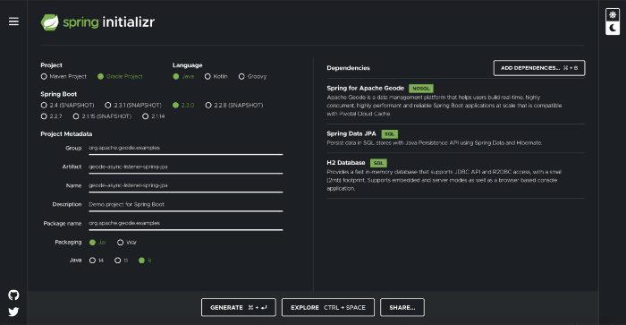

## Introduction
[Apache Geode](https://geode.apache.org/) is an in-memory data grid that provides real-time, consistent access to data-intensive applications throughout widely distributed cloud architectures. One of the most used features of Apache Geode is the *Write-Behind Cache Event Handling* which allows the user to keep external databases in sync with the data stored within an Apache Geode region(s).

[Spring Data JPA](https://spring.io/projects/spring-data-jpa), part of the larger [Spring Data](https://spring.io/projects/spring-data) family, allows the user to easily implement JPA based repositories. The module itself deals with enhanced support for JPA based data access layers and makes it easier to build Spring-powered applications that use data access technologies.

[Spring Boot Data Geode](https://docs.spring.io/spring-boot-data-geode-build/1.2.7.RELEASE/reference/html5/) provides the convenience of [Spring Boot’s](https://spring.io/projects/spring-boot) convention over configuration approach using auto-configuration with the Spring Framework’s powerful abstractions and highly consistent programming model to truly simplify the development of Apache Geode applications in a Spring context.

## Why?

Implementing a data access layer of an application is a cumbersome task, a lot of boilerplate code needs to be written and tested to execute simple queries, perform pagination, auditing, etc. Spring Data JPA allows the user to significantly improve the implementation of data access layers by reducing the effort to the amount that’s actually needed.

An [AsyncEventListener](https://github.com/apache/geode/blob/develop/geode-core/src/main/java/org/apache/geode/cache/asyncqueue/AsyncEventListener.java) is a simple Apache Geode callback that asynchronously processes batches of events after they have been applied to an Apache Geode *Region*. It’s widely used to implement a write-behind cache event handler to synchronize region updates with an external database. It’s, however, cumbersome to configure the *asynchronous-event-queue* and the region itself using plain Apache Geode configuration files or Java API. Spring Boot Data Geode makes the process easier, faster, and less error-prone, simplifying the configuration, development, testing, and deployment of the application.

Having those technologies out there in the open, why would we want to spend hours and resources in developing and testing the parts on our own?… Guess what, we don’t!; instead, we’re gonna build a small and simple project to show how an Apache Geode write-behind event handling can be easily implemented with the help of Spring Data JPA and Spring Boot Data Geode.

## How?

We will build an application that stores *Employee* POJOs (Plain Old Java Objects) within an in-memory-based database. We won’t store those objects manually, though, our application will only use an Apache Geode *Region* as the datastore, and we’ll leverage an *Asynchronous Event Queue* to synchronize our *Region* with the external database.

### Setting Things Up

The fastest and easiest way to set up a *Spring Application* from scratch is to use [Spring Initializr](https://start.spring.io/), which offers a fast way to pull in all the dependencies we need for an application and does a lot of the set up automatically.

This example needs the *H2 Database*, *Spring Data JPA*, and *Spring for Apache Geode dependencies*. The following image shows the *Initializr* set up for the sample project:



### Defining the Entity

In this example we store `Employee` objects, each annotated as a JPA entity, so let’s create that.

```java
package org.apache.geode.examples.model;


import java.io.Serializable;
import java.util.Objects;

import javax.persistence.Entity;
import javax.persistence.GeneratedValue;
import javax.persistence.GenerationType;
import javax.persistence.Id;

@Entity
public class Employee implements Serializable {
  @Id
  private Long id;
  private String name;
  private String surname;

  public Long getId() {
    return id;
  }

  public String getName() {
    return name;
  }

  public String getSurname() {
    return surname;
  }

  protected Employee() {}

  public Employee(Long id, String name, String surname) {
    this.id = id;
    this.name = name;
    this.surname = surname;
  }

  @Override
  public String toString() {
    return "Employee{" +
        "id=" + id +
        ", name='" + name + '\'' +
        ", surname='" + surname + '\'' +
        '}';
  }

  @Override
  public boolean equals(Object o) {
    if (this == o) {
      return true;
    }
    if (o == null || getClass() != o.getClass()) {
      return false;
    }

    Employee employee = (Employee) o;

    if (!Objects.equals(id, employee.id)) {
      return false;
    }
    if (!Objects.equals(name, employee.name)) {
      return false;
    }
    return Objects.equals(surname, employee.surname);
  }

  @Override
  public int hashCode() {
    int result = id != null ? id.hashCode() : 0;
    result = 31 * result + (name != null ? name.hashCode() : 0);
    result = 31 * result + (surname != null ? surname.hashCode() : 0);
    return result;
  }
}
```

Here we have an `Employee` class with three attributes: `id`, `name`, and `surname`. We also have two constructors: the default exists only for the sake of JPA, we will only use the other one to create instances of the `Employee` class.

The `Employee` class is annotated with `Entity`, indicating that it is a JPA entity. (Because no *Table* annotation exists, it is assumed that this entity is mapped to a table named `Employee`). The `Employee` object’s `id` property is annotated with `Id` so that JPA recognizes it as the object’s ID. The other two properties, `name`, and `surname`, are left unannotated, it is assumed that they are mapped to columns that share the same names as the properties themselves.

### Creating the Repository

Spring Data JPA focuses on using JPA to store data in a relational database, one of its “best features” is the ability to create repository implementations automatically from a repository interface (no boiler-plate code needed on our end, yay!).

We won’t be executing custom queries nor anything like that in our example, so we just need to create an empty repository interface that works with `Employee` entities and let Spring Data JPA do its magic for us.

```java
package org.apache.geode.examples.repository;

import org.springframework.data.repository.CrudRepository;

import org.apache.geode.examples.model.Employee;

public interface EmployeeRepository extends CrudRepository<Employee, Long> {
}
```

Our `EmployeeRepository` extends the `CrudRepository` interface; the type of entity and ID that it works with, `Employee` and `Long`, are specified in the generic parameters on `CrudRepository`. By extending `CrudRepository`, `EmployeeRepository` inherits several methods for working with `Employee` persistence, including methods for saving, deleting, and finding `Employee` entities.

### Implementing the AsyncEventListener

As stated before, an `AsyncEventListener` asynchronously processes batches of events after they have been applied to a *Region*.

```java
package org.apache.geode.examples.config;

import java.util.List;

import org.slf4j.Logger;
import org.slf4j.LoggerFactory;
import org.springframework.beans.factory.annotation.Autowired;
import org.springframework.stereotype.Component;

import org.apache.geode.cache.asyncqueue.AsyncEvent;
import org.apache.geode.cache.asyncqueue.AsyncEventListener;
import org.apache.geode.examples.model.Employee;
import org.apache.geode.examples.repository.EmployeeRepository;

@Component
public class EmployeeAsyncEventListener implements AsyncEventListener {
  private static final Logger logger = LoggerFactory.getLogger(EmployeeAsyncEventListener.class);
  private final EmployeeRepository employeeRepository;

  public EmployeeAsyncEventListener(EmployeeRepository employeeRepository) {
    this.employeeRepository = employeeRepository;
  }

  @Override
  public boolean processEvents(List<AsyncEvent> events) {
    events.forEach(asyncEvent -> {
      Employee employee = (Employee) asyncEvent.getDeserializedValue();
      logger.info("Processing Employee {}...", employee.toString());
      employeeRepository.save(employee);
      logger.info("Processing Employee {}... Done!", employee.toString());
    });

    return true;
  }
}
```

In our case, the *Region* contains `Employee` instances, and we just need to delegate to our `EmployeeRepository` in order to persist the entity in the external database (for the sake of simplicity, we won’t deal with errors nor transactional behavior right now).

The `Component` annotation indicates that the class should be considered by *Spring* as candidates for auto-detection when using annotation-based configuration and classpath scanning.

### Configuring the Apache Geode Region

At this point we just need to wire things up, that is, define a `GeodeConfiguration` class and annotate it with the `Configuration` annotation to tag it as a source of bean definitions for the application context.

```java
package org.apache.geode.examples.config;

import org.springframework.context.annotation.Bean;
import org.springframework.context.annotation.Configuration;
import org.springframework.data.gemfire.ReplicatedRegionFactoryBean;
import org.springframework.data.gemfire.wan.AsyncEventQueueFactoryBean;

import org.apache.geode.cache.Cache;
import org.apache.geode.cache.GemFireCache;
import org.apache.geode.cache.asyncqueue.AsyncEventQueue;
import org.apache.geode.examples.model.Employee;

@Configuration
public class GeodeConfiguration {

  @Bean
  AsyncEventQueueFactoryBean employeeAsyncEventQueue(GemFireCache cache, EmployeeAsyncEventListener asyncEventListener) {
    AsyncEventQueueFactoryBean queueFactoryBean = new AsyncEventQueueFactoryBean((Cache) cache);
    queueFactoryBean.setAsyncEventListener(asyncEventListener);

    return queueFactoryBean;
  }

  @Bean("Employees")
  ReplicatedRegionFactoryBean<Long, Employee> employeesRegion(GemFireCache cache, AsyncEventQueue asyncEventQueue) {
    ReplicatedRegionFactoryBean<Long, Employee> regionFactoryBean = new ReplicatedRegionFactoryBean<>();
    regionFactoryBean.setCache(cache);
    regionFactoryBean.setPersistent(false);
    regionFactoryBean.setAsyncEventQueues(new AsyncEventQueue[]{asyncEventQueue});

    return regionFactoryBean;
  }
}
```

The `employeeAsyncEventQueue()` method simply defines the Apache Geode *AsyncEventQueue* that we are going to use as the container for our `EmployeeAsyncEventListener`. The listener instance itself will be auto-magically instantiated and passed to our method by *Spring*.

The `employeesRegion()` method just defines and configures the Apache Geode *Region*, it attaches the *AsyncEventQueue* and sets the *Region* as non-persistent *Replicate*.

### Creating The Application Class

```java
package org.apache.geode.examples;

import org.springframework.boot.SpringApplication;
import org.springframework.boot.autoconfigure.SpringBootApplication;
import org.springframework.data.gemfire.config.annotation.CacheServerApplication;
import org.springframework.data.gemfire.config.annotation.EnableLogging;

@EnableLogging
@SpringBootApplication
@CacheServerApplication
public class JPAAsyncListenerApplication {

  public static void main(String[] args) {
    SpringApplication.run(JPAAsyncListenerApplication.class);
  }
}
```

The `SpringBootApplication` annotation is for convenience, it adds all of the following to our application:

   - *Configuration:* Tags the class as a source of bean definitions for the application context.
   
   - *ComponentScan:* Tells Spring to look for other components, configurations, and services in the `org.apache.geode.examples` package.
   
   - *EnableAutoConfiguration:* Tells Spring Boot to start adding beans based on classpath settings, other beans, and various property settings.
   
We also added some Spring Boot Data Geode annotations to customize the behavior of our Apache Geode *Cache*.
   
   - *EnableLogging:* Tells Spring Boot Data Geode to configure and enable Apache Geode system logging.
   
   - *CacheServerApplication:* Tells Spring Boot Data Geode to enable an embedded Apache Geode *CacheServer* instance. Moreover, this also implies an embedded peer *Cache* must exist and, therefore, will be configured, constructed, and initialized as a Spring bean in the application context.
   
### Running the Application

Believe it or not, the work is done!… with a handful set of classes and annotations (and, as you’ve noticed, almost no code written by us) we have a fully working and operational application, so let’s test it!.

```java
package org.apache.geode.examples;

import static org.assertj.core.api.Assertions.assertThat;
import static org.awaitility.Awaitility.await;

import java.util.ArrayList;
import java.util.List;

import javax.annotation.Resource;

import org.junit.jupiter.api.Test;
import org.slf4j.Logger;
import org.slf4j.LoggerFactory;
import org.springframework.beans.factory.annotation.Autowired;
import org.springframework.boot.test.context.SpringBootTest;

import org.apache.geode.cache.Region;
import org.apache.geode.cache.asyncqueue.AsyncEventQueue;
import org.apache.geode.examples.model.Employee;
import org.apache.geode.examples.repository.EmployeeRepository;

@SpringBootTest
public class JPAAsyncListenerApplicationTest {
  private static final Logger logger = LoggerFactory.getLogger(JPAAsyncListenerApplicationTest.class);

  @Autowired
  private EmployeeRepository repository;

  @Autowired
  private AsyncEventQueue asyncEventQueue;

  @Resource(name = "Employees")
  private Region<Long, Employee> employeesRegion;

  @Test
  public void jpaListenerTest() {
    List<Employee> employees = new ArrayList<>();
    employees.add(new Employee(1L, "Zell", "Dincht"));
    employees.add(new Employee(2L, "Quistis", "Trepe"));
    employees.add(new Employee(3L, "Irvine", "Kinneas"));
    employees.add(new Employee(4L, "Rinoa", "Heartilly"));
    employees.add(new Employee(5L, "Squall", "Leonhart"));

    // DB empty at the beginning.
    assertThat(repository.findAll()).isEmpty();
    logger.info("Employees found with findAll():");
    logger.info("-------------------------------");
    repository.findAll().forEach(employee -> logger.info(employee.toString()));
    logger.info("-------------------------------");
    logger.info("");

    // Insert some employees into the Geode Region
    employees.forEach(employee -> employeesRegion.put(employee.getId(), employee));

    // Wait for queues to drain (AsyncEventListener invoked).
    logger.info("Waiting for AsyncEventQueue to drain...");
    await().untilAsserted(() -> assertThat(asyncEventQueue.size()).isEqualTo(0));
    logger.info("Waiting for AsyncEventQueue to drain... Done!.");
    logger.info("");

    // DB should now have all the employees inserted through the AsyncEventListener.
    Iterable<Employee> employeeList = repository.findAll();
    assertThat(employeeList).hasSize(employees.size());
    employeeList.forEach(employee -> assertThat(employees.contains(employee)));
    logger.info("Employees found with findAll():");
    logger.info("-------------------------------");
    employeeList.forEach(employee -> logger.info(employee.toString()));
    logger.info("-------------------------------");
    logger.info("");
  }
}
```

The test is straightforward and simple: we check that the database is empty, insert some `Employee` instances into the Apache Geode *Region*, wait for the actual *Asynchronous Event Queue* to be empty (the `AsyncEventListener` processed all the events) and, at the very end, verify that the database contains exactly the `Employe` instances we inserted into the *Region*.

## What's next?

Check out the [geode-async-listener-spring-jpa](https://github.com/jujoramos/geode-async-listener-spring-jpa) project and play around with it, you can add Transaction Management and Error Handling to the AsyncEventListener, build a cluster, etc.

Check out [Spring Boot for Apache Geode](https://docs.spring.io/spring-boot-data-geode-build/current/reference/html5/), you can do way more things more easily and quickly, with just some extra annotations!.