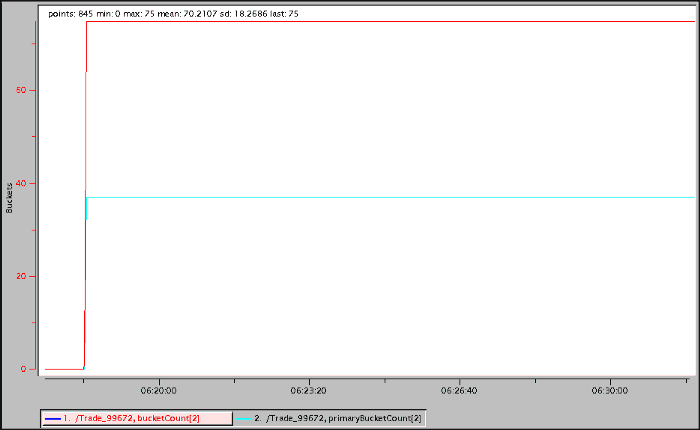
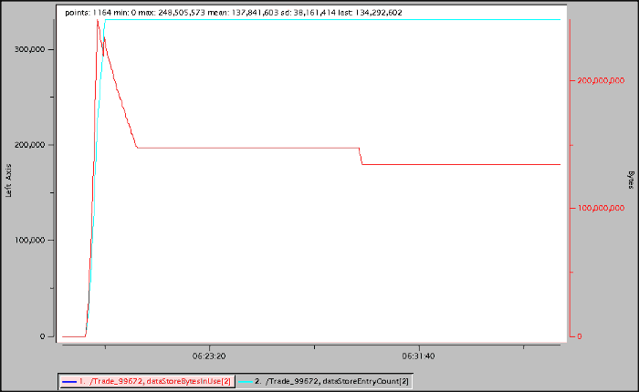
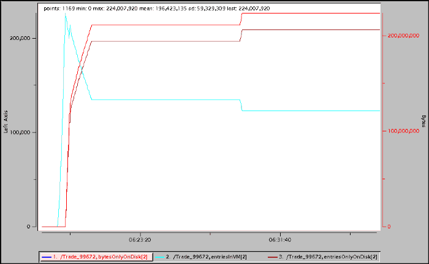

## Introduction
An Apache Geode [PartitionedRegion](https://geode.apache.org/docs/guide/112/developing/partitioned_regions/chapter_overview.html) is a Region that partitions its entries among all the servers that define it. The entries are stored in BucketRegions. Properties that affect the number and location of the BucketRegions include the [total number of buckets](https://geode.apache.org/docs/guide/112/developing/partitioned_regions/configuring_bucket_for_pr.html#configuring_total_buckets) and the [number of redundant copies](https://geode.apache.org/docs/guide/112/developing/partitioned_regions/set_pr_redundancy.html#set_pr_redundancy). The primary BucketRegion is hosted on one server, and if the number of redundant copies is greater than zero, the redundant BucketRegions are hosted on other servers. In addition, if [eviction](https://geode.apache.org/docs/guide/112/developing/eviction/chapter_overview.html) with overflow is configured, entry values are evicted to disk once the JVM’s used heap memory reaches a configured percentage of maximum.

Bucket and entry details available for the entire PartitionedRegion per member or across the DistributedSystem include:

* the number of buckets
* the number of primary buckets
* the number of bucket entries
* the number of bucket bytes
* the number of bucket entries in memory
* the number of bucket entries on disk
* the number of bucket bytes in memory
* the number of bucket bytes on disk

This article shows how to get similar details for each BucketRegion in the PartitionedRegion.


## Accessing Entry Details for the PartitionedRegion

Currently, the details listed above are available for the PartitionedRegion via either [Statistics](https://geode.apache.org/docs/guide/112/managing/statistics/chapter_overview.html) or [gfsh](https://geode.apache.org/docs/guide/112/tools_modules/gfsh/chapter_overview.html).

### Via Statistics
Bucket and entry details are provided by PartitionedRegionStats and DiskRegionStatistics.

A PartitionedRegionStats object is defined for each PartitionedRegion and includes:

* bucketCount — the number of buckets defined in the member
* primaryBucketCount — the number of primary buckets defined in the member
* dataStoreEntryCount — the number of entries in the member
* dataStoreBytesInUse — the number of bytes in memory in the member

A DiskRegionStatistics object is defined for each persistent or overflowed PartitionedRegion and includes:

* entriesInVM — the number of entries in memory
* entriesOnlyOnDisk — the number of entries on disk
* bytesOnlyOnDisk — the size of the entries on disk

This vsd chart shows the PartitionedRegionStats bucketCount (selected) and primaryBucketCount:



This vsd chart shows PartitionedRegionStats dataStoreBytesInUse (selected) and dataStoreEntryCount:



This vsd chart shows the DiskRegionStatistics bytesOnlyOnDisk (selected), entriesInVM and entriesOnlyOnDisk:



### Via gfsh

The gfsh show metrics command lists PartitionedRegion bucket count and entry size per member or across the DistributedSystem.

#### Per member:

```
gfsh>show metrics --region=/Trade --member=server-1
Category  |            Metric            | Value
--------- | ---------------------------- | ------
partition | bucketCount                  | 75
          | primaryBucketCount           | 37
          | totalBucketSize              | 331869
diskstore | totalEntriesOnlyOnDisk       | 134643
gfsh>show metrics --region=/Trade --member=server-2
Category  |            Metric            | Value
--------- | ---------------------------- | ------
partition | bucketCount                  | 75
          | primaryBucketCount           | 38
          | totalBucketSize              | 331862
diskstore | totalEntriesOnlyOnDisk       | 138806
gfsh>show metrics --region=/Trade --member=server-3
Category  |            Metric            | Value
--------- | ---------------------------- | ------
partition | bucketCount                  | 76
          | primaryBucketCount           | 38
          | totalBucketSize              | 336269
diskstore | totalEntriesOnlyOnDisk       | 141941
```

#### Across the Distributed System:

```
gfsh>show metrics --region=/Trade
Category  |            Metric            | Value
--------- | ---------------------------- | -------
partition | bucketCount                  | 226
          | primaryBucketCount           | 113
          | totalBucketSize              | 1000000
          | averageBucketSize            | 1474
diskstore | totalEntriesOnlyOnDisk       | 415390
```

## Implementation

All source code described in this article as well as an example usage is available [here](https://github.com/boglesby/log-partitioned-region-bucket-details).
 
 In order to get the bucket and entry details per BucketRegion, it is necessary to iterate the BucketRegions in each member. The **LogPartitionedRegionBucketDetailsFunction** and its supporting objects do that.
 
 The [LogPartitionedRegionBucketDetailsFunction](https://github.com/boglesby/log-partitioned-region-bucket-details/blob/master/server/src/main/java/example/PartitionedRegionDetails.java):
 
 * gets the PartitionedRegion
 * creates and logs a PartitionedRegionDetails
 
 The [PartitionedRegionDetails](https://github.com/boglesby/log-partitioned-region-bucket-details/blob/master/server/src/main/java/example/PartitionedRegionDetails.java) keeps track of the total number of:
 
 * primary and redundant buckets
 * bytes in memory and on disk
 * entries in memory and on disk
 
 It iterates the BucketRegions and for each:
 
 * creates a **BucketRegionDetails**
 * adds the **BucketRegionDetails** to the appropriate list (primary or redundant)
 * increments the appropriate entry totals
 
 Each [BucketRegionDetails](https://github.com/boglesby/log-partitioned-region-bucket-details/blob/master/server/src/main/java/example/BucketRegionDetails.java) encapsulates:
 
 * the number of bucket entries
 * the number of bucket entries in memory
 * the number of bucket entries on disk
 * the number of bucket bytes
 * the number of bucket bytes in memory
 * the number of bucket bytes on disk
 
 ### Execute LogPartitionedRegionBucketDetailsFunction
 
 The **LogPartitionedRegionBucketDetailsFunction** *execute* method gets the PartitionedRegion and creates and logs the **PartitionedRegionDetails** like:
 
 ```java
public void execute(FunctionContext context) {
  RegionFunctionContext rfc = (RegionFunctionContext) context;
  PartitionedRegion pr = (PartitionedRegion) rfc.getDataSet();

  // Create the PartitionedRegion details
  PartitionedRegionDetails prDetails = new PartitionedRegionDetails(pr);

  // Log the PartitionedRegion details
  context.getCache().getLogger().info(prDetails.toString());

  // Return the result
  context.getResultSender().lastResult(true);
}
```
 
### Initialize PartitionedRegionDetails
 The **PartitionedRegionDetails** is initialized by sorting the BucketRegions by bucket id, and, for each, updating the appropriate totals like:
 
 ```java
private void initialize(PartitionedRegion pr) {
  pr.getDataStore().getAllLocalBucketRegions()
    .stream()
    .sorted(Comparator.comparingInt(BucketRegion::getId))
    .forEach(
      br -> {
        BucketRegionDetails bri = new BucketRegionDetails(pr, br);
        initializeTotalDetails(bri);
        if (pr.getRegionAdvisor().isPrimaryForBucket(br.getId())) {
          initializeTotalPrimaryDetails(bri);
        } else {
          initializeTotalRedundantDetails(bri);
        }
      });
}
```
 
 The *initializeTotalDetails*, *initializeTotalPrimaryDetails* and *initializeTotalRedundantDetails* methods increment the appropriate entry and bytes totals.
 
### Initialize BucketRegionDetails
The BucketRegionDetails is initialized from various fields of the BucketRegion like:

```java
private void initialize(PartitionedRegion pr, BucketRegion br) {
  this.bucketId = br.getId();
  this.entries = br.size();
  this.entriesInMemory = br.getNumEntriesInVM();
  this.entriesOnDisk = br.getNumOverflowOnDisk();
  this.bytes = br.getTotalBytes();
  this.bytesInMemory = br.getBytesInMemory();
  this.bytesOnDisk = br.getNumOverflowBytesOnDisk();
}
```
 
 ## Server Logging Output
 
 Executing the **LogPartitionedRegionBucketDetailsFunction** will cause each server to log a message like this for the total, primary and redundant buckets:
 
 ```
[info 2020/09/10 06:33:05.292 HST <Function Execution Processor2> tid=0x39] Region /Trade Bucket Details:

  Total buckets=75; entries=331,829; entriesInMemory=203,252; entriesOnDisk=128,577; bytes=360,187,189; bytesInMemory=222,546,698; bytesOnDisk=137,640,491
  Primary buckets=38; entries=168,128; entriesInMemory=145,349; entriesOnDisk=22,779; bytes=183,513,535; bytesInMemory=159,144,094; bytesOnDisk=24,369,441
  Redundant buckets=37; entries=163,701; entriesInMemory=57,903; entriesOnDisk=105,798; bytes=176,673,654; bytesInMemory=63,402,604; bytesOnDisk=113,271,050

Primary Buckets:

  Bucket id=0; entries=4,424; entriesInMemory=3,824; entriesOnDisk=600; bytes=4,828,915; bytesInMemory=4,187,013; bytesOnDisk=641,902
  Bucket id=2; entries=4,427; entriesInMemory=3,827; entriesOnDisk=600; bytes=4,832,171; bytesInMemory=4,190,252; bytesOnDisk=641,919
  Bucket id=4; entries=4,428; entriesInMemory=3,828; entriesOnDisk=600; bytes=4,833,252; bytesInMemory=4,191,364; bytesOnDisk=641,888
  Bucket id=6; entries=4,424; entriesInMemory=3,824; entriesOnDisk=600; bytes=4,828,837; bytesInMemory=4,186,916; bytesOnDisk=641,921
  Bucket id=7; entries=4,423; entriesInMemory=3,823; entriesOnDisk=600; bytes=4,827,813; bytesInMemory=4,185,909; bytesOnDisk=641,904
  ...
  Bucket id=98; entries=4,433; entriesInMemory=3,833; entriesOnDisk=600; bytes=4,838,678; bytesInMemory=4,196,813; bytesOnDisk=641,865
  Bucket id=100; entries=4,432; entriesInMemory=3,832; entriesOnDisk=600; bytes=4,837,709; bytesInMemory=4,195,823; bytesOnDisk=641,886
  Bucket id=106; entries=4,429; entriesInMemory=3,829; entriesOnDisk=600; bytes=4,834,263; bytesInMemory=4,192,412; bytesOnDisk=641,851
  Bucket id=107; entries=4,427; entriesInMemory=3,828; entriesOnDisk=599; bytes=4,832,083; bytesInMemory=4,191,257; bytesOnDisk=640,826
  Bucket id=111; entries=4,422; entriesInMemory=3,824; entriesOnDisk=598; bytes=4,826,617; bytesInMemory=4,186,864; bytesOnDisk=639,753

Redundant Buckets:

  Bucket id=5; entries=4,427; entriesInMemory=1,816; entriesOnDisk=2,611; bytes=4,783,851; bytesInMemory=1,988,468; bytesOnDisk=2,795,383
  Bucket id=8; entries=4,423; entriesInMemory=836; entriesOnDisk=3,587; bytes=4,755,980; bytesInMemory=915,386; bytesOnDisk=3,840,594
  Bucket id=11; entries=4,419; entriesInMemory=1,617; entriesOnDisk=2,802; bytes=4,770,412; bytesInMemory=1,770,589; bytesOnDisk=2,999,823
  Bucket id=12; entries=4,421; entriesInMemory=1,613; entriesOnDisk=2,808; bytes=4,772,575; bytesInMemory=1,766,236; bytesOnDisk=3,006,339
  Bucket id=14; entries=4,415; entriesInMemory=1,455; entriesOnDisk=2,960; bytes=4,762,319; bytesInMemory=1,593,211; bytesOnDisk=3,169,108
  ...
  Bucket id=103; entries=4,425; entriesInMemory=1,489; entriesOnDisk=2,936; bytes=4,773,800; bytesInMemory=1,630,440; bytesOnDisk=3,143,360
  Bucket id=104; entries=4,427; entriesInMemory=1,112; entriesOnDisk=3,315; bytes=4,766,974; bytesInMemory=1,217,665; bytesOnDisk=3,549,309
  Bucket id=108; entries=4,424; entriesInMemory=1,192; entriesOnDisk=3,232; bytes=4,765,510; bytesInMemory=1,305,184; bytesOnDisk=3,460,326
  Bucket id=109; entries=4,425; entriesInMemory=1,812; entriesOnDisk=2,613; bytes=4,781,517; bytesInMemory=1,984,097; bytesOnDisk=2,797,420
  Bucket id=110; entries=4,423; entriesInMemory=1,660; entriesOnDisk=2,763; bytes=4,775,867; bytesInMemory=1,817,656; bytesOnDisk=2,958,211

```
 
 ## Future
 
 A gfsh command and API that provides these partitioned Region bucket details would be a useful addition to Apache Geode.