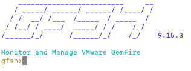

This guide walks you through setting up your local development environment using VMware GemFire and a *Hello, World!* client application.    

## What is VMware GemFire?

VMware GemFire is an enterprise-grade, high-speed, in-memory data and compute grid that serves a variety of use cases. From high-performance, low-latency applications where data must be processed with sub-millisecond delivery times, to caching and key-value stores, GemFire shines as an ultra-fast system of record.

In all GemFire use cases, data remains consistent, secure, and up to date. GemFire can be deployed and replicated across multiple data centers with unlimited scale and extremely fast performance. Plus, it can be deployed on-premises, in the public cloud, in virtual machines, containers, or even orchestrated via Kubernetes.

GemFire is used by customers in many real-world applications (e.g., banking, billing, insurance, inventory, logistics, etc.) to replace NoSQL databases, achieve massive parallel processing at incredibly fast speeds, and supercharge intelligent, modern applications.


## Starting VMware GemFire for Local Development

For this getting started locally guide, we will walk through the quickest way to get a GemFire cluster up and running for local development purposes.  For full installation instructions, please refer to the [GemFire Install documentation](https://docs.vmware.com/en/VMware-Tanzu-GemFire/9.15/tgf/GUID-getting_started-installation-install_intro.html). 

### Download the .tgz file from the Tanzu Network 

1. Download VMware GemFire .tgz from the [Tanzu Network](https://network.tanzu.vmware.com/products/pivotal-gemfire/).
2. Unzip or expand the file.
3. Open a terminal and navigate to the GemFire folder that was unzipped in Step 2.
4. In the terminal, navigate to the `bin` folder.
5. run the following command to start the GemFire SHell (GFSH)
    ```./gfsh```

6. You should see the GemFire Shell start with a version similar to the following image

   

---

## Set Up Your Local Environment

This section will guide you through testing a *Hello, World!* client app on your local machine to confirm that your local environment is set up correctly.


### What You'll Need
* The [Hello, World!](https://github.com/gemfire/spring-for-apache-geode-examples/tree/main/hello-world) example.
* JDK 8 or 11
* Spring Boot 2.6 or above
* Spring Boot for VMware GemFire
* GemFire 9.15.3+

### 1. Download the Hello, World! Example

Clone the *Hello, World!* app from the VMware GemFire [examples repo](https://github.com/gemfire/spring-for-apache-geode-examples). 

```
$ git clone https://github.com/gemfire/spring-for-apache-geode-examples.git
```

### 2. Start an VMware GemFire Cluster

{}
Make sure that you have downloaded and started VMware GemFire before proceeding.
{} 

The following steps will start a small local cluster for the *Hello, World!* app to connect.   

* In a terminal start the GemFire Shell (gfsh) if it is not currently running

    ```
    ./gfsh
    ```
* Start a **locator**.  [Locators](https://docs.vmware.com/en/VMware-Tanzu-GemFire/9.15/tgf/GUID-configuring-running-running_the_locator.html) provide both discovery and load balancing services. 

    ```
    start locator --name=hello-world-locator
    ```
* Start a server.  Servers are primarily used to store data in **regions** (similar to a table in a relational database. 

    ```
    start server --name=hello-world-server
    ```

* Once those commands have finished run the `list members` command 

  ```list members```

  You should see an output similar to the following
  
  
  ```
  Member Count : 2
  
         Name         | Id
  ------------------- | ---------------------------------------------------------------------------
  hello-world-locator | 192.168.1.14(hello-world-locator:33323:locator)<ec><v0>:41000 [Coordinator]
  hello-world-server  | 192.168.1.14(hello-world-server:33423)<v1>:41001
  ```


### 3. Build and Run the App

Open a different terminal session, navigate to the working directory of `spring-for-apache-geode-examples/hello-world`, and build the application

```
./gradlew build
```

then run the application

```
./gradlew bootRun
```

*We are running a Gradle task so you will most likely see the executing progress bar stop around 75% when the app is up and running.*

Now that the application has started, open a browser and go to **(http://localhost:8080)**.

You should see something similar to the below, which represents an artificial time delay simulating a database query.

> key: hello
>
>value: 2019-10-01T16:17:51.557 (this will be your current date & time)
>
>time to look up: 3057ms (quantity of time that it took to acquire the key-value pair).


**Refresh the page** and you should see something similar to

> key: hello
>
>value: 2019-10-01T16:17:51.557 (this will be your current date & time)
>
>time to look up: 6ms (quantity of time that it took to acquire the key-value pair).

Note that the ***time to look up*** has been significantly reduced. This represents the app getting the information from the cache (Apache Geode), instead of querying the database.

To confirm that your app is connected to your local cluster, in your **gfsh** terminal run the following commands

* List the regions
    ```
    list regions
    ```
    
    You should see something similar to this, which shows that a region with the name *Hello* was created.
    
    ```
    List of regions
    ---------------
    Hello
    ```

* Confirm the web page timestamp has the same value as that stored in your *Hello* region. Run the *gfsh* command

    ``
    get --key hello --region=/Hello
    ``
    
    You should see something similar to this, where the "Value" listed in your terminal should match the "value" shown on the web page. 
    
    **Response from the gfsh command**
    ```
    Result      : true
    Key Class   : java.lang.String
    Key         : hello
    Value Class : java.lang.String
    Value       : "2020-12-08T13:46:47.322"
    ```
    
    **Shown on the Page**
    ```
    key: hello
    value: 2020-12-08T13:46:47.322
    time to look up: 2ms
    ```

### 4. Stop the App and the VMware GemFire Cluster

* Stop the *Hello, World! app. 
* Then shutdown the VMware GemFire cluster - this will stop the locator and server, and **delete any data you may have in the cluster**. 

    In your gfsh terminal run the following command 

    ```
    shutdown --include-locators=true
    ```
* Exit gfsh by typing `exit`.

**Congratulations! Your local environment is set up and ready to develop with.**

---

 ## Learn More
 
 Now that you have successfully set up your local development environment, check out some other guides
  
 * Set up your [VMware GemFire service instance](/data/gemfire/guides/get-started-gf4vms-sbgf/) on the Tanzu Application Service. 

 * Set up [VMware GemFire for Kubernetes](/data/gemfire/guides/get-started-gf4k8s-sbdg/). 
  
 * Create an application that utilizes Spring Boot for Apache Geode and Spring Session for [session state caching](/data/gemfire/guides/session-state-cache-sbdg).