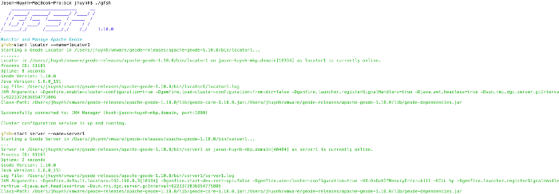
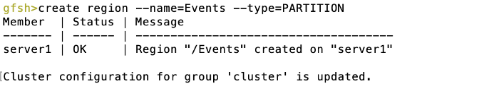
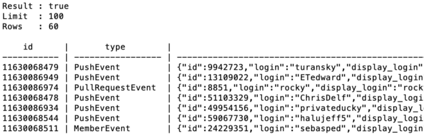
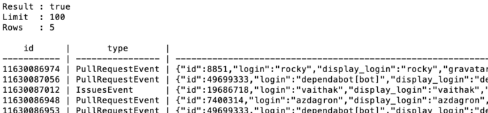

## Introduction
Apache Kafka is a popular solution for ingesting from various data sources and into Kafka topics. For use cases that require key look-ups or querying, traversing the topic for specific keys or devising a strategy for partitioning can be done. However, Kafka also provides the capability to sink, or offload, the data to other systems via Kafka Connect. The [geode-kafka-connector](https://github.com/apache/geode-kafka-connector) implements the Kafka Connect APIs and allows data to be pushed into Apache Geode, where key look-ups and querying are better suited.

[Apache Geode](https://geode.apache.org/) is a consistent, low latency in memory data store. For use cases where we want fast, consistent key look-ups, sinking data to Apache Geode makes a lot of sense. Apache Geode also allows secondary indexes to be built on the data, to be used by queries. The geode-kafka-connector provides a [JsonPdxConverter](https://github.com/apache/geode-kafka-connector/blob/d6651f1ed78c09a533f478ded239a52cd2ffaca3/src/main/java/org/apache/geode/kafka/converter/JsonPdxConverter.java#L27) that we will be using. This allows JSON objects to be converted into PDX ([Portable Data eXchange, an Apache Geode serialization format](https://geode.apache.org/docs/guide/111/developing/data_serialization/gemfire_pdx_serialization.html)), so that we can query any field and drill down into nested JSON Objects.


## Overview
We’ll be ingesting JSON data from a rest endpoint into a Kafka topic. We will sink the data into an Apache Geode region using the geode-kafka-connector and execute queries against the data. Secondary indexes will also be created to allow faster and more efficient query lookups.


(1) Ingest JSON, (2) Connector pulls JSON data from topic, (3) geode-kafka-connector converts to PDX and pushes to Apache Geode, (4) Query is executed in GFSH, (5) Results are returned


## Prerequisites:
* [Apache Geode installed](https://geode.apache.org/releases/) or use the [docker image](https://hub.docker.com/r/apachegeode/geode/)
* [Apache Kafka installed](https://kafka.apache.org/downloads)
* Download or build a [geode-kafka-connector jar](https://github.com/apache/geode-kafka-connector)
* Download the source for an example ingest web service: [https://github.com/jhuynh1/spring-kafka-JSON-ingest](https://github.com/jhuynh1/spring-kafka-JSON-ingest)


## Start Apache Geode Cluster
Execute gfsh from your Apache Geode Installation and start a locator and a server:
```
./gfsh 
 start locator --name=locator1
 start server --name=server1
```



gfsh output after creating locator and server


Create the region we want the data to end up in:

```
create region --name=’Events’ --type=PARTITION`
```



gfsh output after creating region

## Start Apache Kafka
We will follow the instructions from the Apache Kafka Quickstart. In the Apache Kafka install, run each command in a new terminal.

```
bin/zookeeper-server-start.sh config/zookeeper.properties
bin/kafka-server-start.sh config/server.properties
```

### Create a topic named ‘test’

```
bin/kafka-topics.sh --create --bootstrap-server localhost:9092 --replication-factor 1 --partitions 1 --topic test
```

## Creating the Sink Connector
We’ll now create a sink connector to flow data from Kafka to Geode. We will also configure the key and value converters. For the value converter we will explicitly use the JsonPdxConverter supplied by the geode-kafka-connector. For the key, we will use a String converter, where the example webapp will just populate with an arbitrary value.

### Configure connect-geode-sink.properties
Create a file called connect-geode-sink.properties with the following properties and place this file in the config directory of Apache Kafka. Notice we use the JsonPdxConverter for our value converter. We can also map any topics to any number of regions.

```
name=geode-kafka-sink
connector.class=GeodeKafkaSink
tasks.max=1
key.converter=org.apache.kafka.connect.storage.StringConverter
value.converter=org.apache.geode.kafka.converter.JsonPdxConverter
topic-to-regions=[test:Events]
locators=localHost[10334]
topics=test
```

### Modify config/connect-standalone.properties
Modify config/connect-standalone.properties to point Kafka to where the plugin is installed. For example:

```
plugin.path=/path/to/geode-kafka-connector/target/
```

## Run the Sink Connector
Now we are ready to run the sink connector, execute the following command:

```
bin/connect-standalone.sh config/connect-standalone.properties config/connect-geode-sink.properties
```

## Start up the Ingest Web Service
For ingesting data, we will use a simple Spring Boot application that exposes a rest endpoint that can be called to ingest JSON data (GitHub Events) and push the data into a Kafka topic.
Here is the relevant lines of code, we generate an arbitrary key in this example and place each JSON document as an event on the topic.

```java
@GetMapping(path = "/ingest/github/{topic}")
public List ingestGithub(RestTemplate restTemplate, @PathVariable String topic) {
    //We didn't model our json and will just pass them in as strings
    List events = restTemplate.getForObject(
            githubEventsUrl, List.class);
    for(Object event:events) {
        kafkaTemplate.send(topic, "" + System.currentTimeMillis() + ":" + event.hashCode(), event);
    }
    return events;
}
```
The web-service source is located at https://github.com/jhuynh1/spring-kafka-JSON-ingest and can be run either with ./gradlew bootRun or if you have a built jar, run the following:

```
java -jar restful-webservice-0.0.1-SNAPSHOT.jar
```

## Ingest Data
Hit the rest endpoint (note: if your topic wasn’t named test, you can simply change the topic name in the url)

```
curl localhost:8080/ingest/github/test
```

## Query the JSON data in Apache Geode!
Revisit gfsh and set a gfsh environment variable so we can see values with large fields.

```
set variable --name=APP_RESULT_VIEWER --value=external`
```

Now we will query the events region. We’ll first display all the events we ingested.

```
query --query=”select * from /Events”
```



Events made it into the region and we are able to query for them!

### Query nested fields
We can also issue a query on any of the JSON fields and nested fields as well. In this example we are actually going to drill down into a nested JSON field. We will find any event where the action field in the payload object is ‘opened’

```
query --query=”select * from /Events where payload.action=’opened’”
```



We are able to do a nested field lookup and filter for specific results

### Creating a secondary index
If there is are fields we plan on querying often or need faster performance on, we can create indexes on those fields. For this example we could create one on payload.action

## What next?
- Learn more about [OQL querying](https://geode.apache.org/docs/guide/111/developing/querying_basics/query_basics.html) or [PDX serialization](https://geode.apache.org/docs/guide/15/developing/data_serialization/gemfire_pdx_serialization.html) in Apache Geode

- Check out the other features in [geode-kafka-connector](https://github.com/apache/geode-kafka-connector)

- [Read how Apache Geode was used to simplify architecture and operations](https://www.pymma.com/index.php/blogs/data-analytic-apache-geode-a-successful-alternative-to-kafka-spark-and-storm)
Join the [Apache Geode Community](https://geode.apache.org/community/)