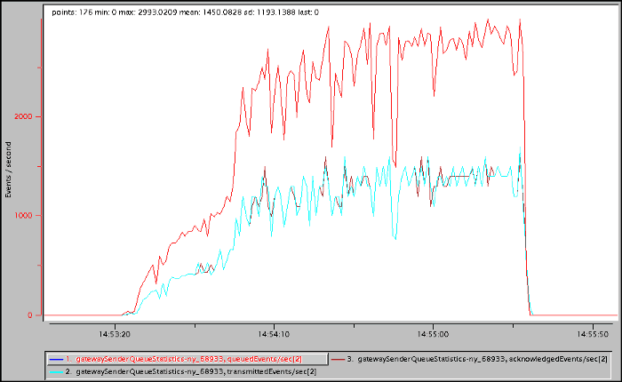
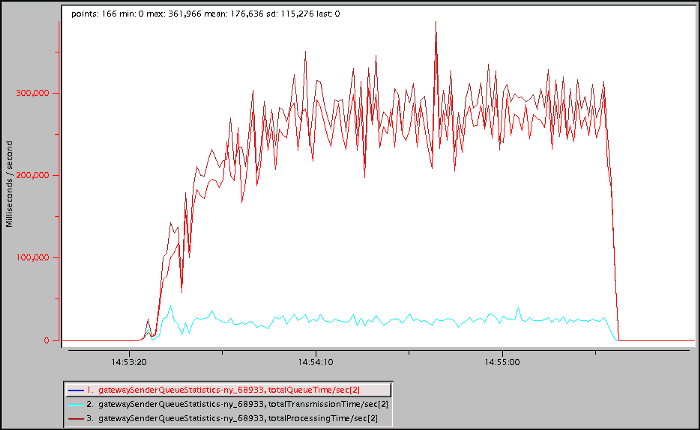

## Introduction
Calculating queue, transmission and total processing times for Apache Geode [GatewaySender](https://github.com/apache/geode/blob/develop/geode-core/src/main/java/org/apache/geode/cache/wan/GatewaySender.java) events can be helpful for WAN resource capacity planning like the amount of queue memory to allocate and the number of dispatcher threads to configure. Unfortunately, this data is not readily available in Apache Geode out-of-the-box.

This article describes how to implement a [GatewayEventFilter](https://github.com/apache/geode/blob/develop/geode-core/src/main/java/org/apache/geode/cache/wan/GatewayEventFilter.java) to calculate these times using a custom Apache Geode [Statistics](https://github.com/apache/geode/blob/develop/geode-core/src/main/java/org/apache/geode/Statistics.java) object readable via [vsd](https://gemtalksystems.com/products/vsd/).
## Implementation
All source code described in this article is available [here](https://github.com/boglesby/calculate-gateway-sender-event-times).

The [TimingGatewayEventFilter](https://github.com/boglesby/calculate-gateway-sender-event-times/blob/master/server/src/main/java/example/server/filter/TimingGatewayEventFilter.java) implements the GatewayEventFilter interface to calculate queue, transmission and total processing times for GatewaySender events. The interface defines three methods:

- **beforeEnqueue** is invoked before the [GatewayQueueEvent](https://github.com/apache/geode/blob/develop/geode-core/src/main/java/org/apache/geode/cache/wan/GatewayQueueEvent.java) is added to the queue
- **beforeTransmit** is invoked after the GatewayQueueEvent is removed from the queue but before it is transmitted to the remote site
- **afterAcknowledgement** is invoked after the GatewayQueueEvent acknowledgement is received from the remote site

The [GatewaySenderQueueStatistics](https://github.com/boglesby/calculate-gateway-sender-event-times/blob/master/server/src/main/java/example/server/statistics/GatewaySenderQueueStatistics.java) creates a custom Statistics object that defines the following statistics:

- **queuedEvents** — the number of events added to the GatewaySender’s queue
- **transmittedEvents** — the number of events transmitted to the remote site
- **acknowledgedEvents** — the number of events acknowledged by the remote site
- **minimumQueueTime** — the minimum time an event spent in the GatewaySender’s queue
- **maximumQueueTime** — the maximum time an event spent in the GatewaySender’s queue
- **totalQueueTime** — the total time events spent in the GatewaySender’s queue
- **minimumTransmissionTime** — the minimum time an event spent in transmission including processing time on the remote site
- **maximumTransmissionTime** — the maximum time an event spent in transmission including processing time on the remote site
- **totalTransmissionTime** — the total time events spent in transmission including processing time on the remote site
- **minimumProcessingTime** — the minimum time an event spent being processed including queue time on the local site, transmission time between sites and processing time on the remote site
- **maximumProcessingTime** — the maximum time an event spent being processed including queue time on the local site, transmission time between sites and processing time on the remote site
- **totalProcessingTime** — the total time events spent being processed including queue time on the local site, transmission time between sites and processing time on the remote site

Note: The **queuedEvents** statistic is the same as [GatewaySenderStatistics](https://github.com/apache/geode/blob/develop/geode-core/src/main/java/org/apache/geode/internal/cache/wan/GatewaySenderStats.java) eventsQueued, and the **transmittedEvents** statistic is the same as GatewaySenderStatistics eventsDistributed. They are included here for completeness.
### Before Enqueueing the GatewayQueueEvent
The **TimingGatewayEventFilter** beforeEnqueue method is invoked for each GatewayQueueEvent before it is added to the queue. It tracks the queue start time and invokes the **GatewaySenderQueueStatistics** beforeEnqueue method.

```java
public boolean beforeEnqueue(GatewayQueueEvent event) {
  // Increment the queued events
  this.queueStatistics.beforeEnqueue();

  // Set the queue start time for this event
  GatewaySenderEventImpl gsei = (GatewaySenderEventImpl) event;
  this.queueStartTimes.put(gsei.getShadowKey(), System.currentTimeMillis());

  return true;
}
```
The **GatewaySenderQueueStatistics** beforeEnqueue method increments the queued events.

```java
public void beforeEnqueue() {
  this.stats.incLong(queuedEventsId, 1);
}
```
### Before Transmitting the GatewayQueueEvent
The **TimingGatewayEventFilter** beforeTransmit method is invoked for each GatewayQueueEvent before it is transmitted to the remote site. It retrieves the queue start time, tracks the transmission start time and invokes the **GatewaySenderQueueStatistics** beforeTransmit method.

```java
public boolean beforeTransmit(GatewayQueueEvent event) {
  // This method can be called multiple times for the same batch if the remote site is
  // not connected.
  GatewaySenderEventImpl gsei = (GatewaySenderEventImpl) event;
  if (!this.transmissionStartTimes.containsKey(gsei.getShadowKey())) {
    // Get the current time and update the statistics
    long currentTime = System.currentTimeMillis();
    this.queueStatistics.beforeTransmit(this.queueStartTimes.get(gsei.getShadowKey()), currentTime);
    
    // Set the transmit start time for this event
    this.transmissionStartTimes.put(gsei.getShadowKey(), currentTime);
  }

  return true;
}
```
The **GatewaySenderQueueStatistics** beforeTransmit method increments the transmitted events and total, minimum and maximum time spent on the queue.

```java
public long beforeTransmit(long queueStartTime, long currentTime) {
  long queueTime = currentTime - queueStartTime;
  this.stats.incLong(transmittedEventsId, 1);
  
  // Update queue time statistics
  this.stats.incLong(totalQueueTimeId, queueTime);
  if (this.minimumQueueTimeNotSet.compareAndSet(false, true)
    || this.stats.getLong(minimumQueueTimeId) > queueTime) {
    this.stats.setLong(minimumQueueTimeId, queueTime);
  }
  if (this.stats.getLong(maximumQueueTimeId) < queueTime) {
    this.stats.setLong(maximumQueueTimeId, queueTime);
  }
  return currentTime;
}
```
### After Receiving the GatewayQueueEvent Acknowledgement
The **TimingGatewayEventFilter** afterAcknowledgement method is invoked for each GatewayQueueEvent after its acknowledgement has been received from the remote site. It retrieves the queue and transmission start times and invokes the **GatewaySenderQueueStatistics** afterAcknowledgement method.

```java
public void afterAcknowledgement(GatewayQueueEvent event) {
  // Get transmit start time for this event
  GatewaySenderEventImpl gsei = (GatewaySenderEventImpl) event;
  Long queueStartTime = this.queueStartTimes.remove(gsei.getShadowKey());
  Long transmissionStartTime = this.transmissionStartTimes.remove(gsei.getShadowKey());
  
  // If the event was not transmitted by this member, ignore it.
  // Only handle primary events.
  if (transmissionStartTime != null) {
    // Update the statistics
    this.queueStatistics.afterAcknowledgement(transmissionStartTime, queueStartTime);
  }
}
```
The **GatewaySenderQueueStatistics** afterAcknowledgement method increments the acknowledged events and total, minimum and maximum transmission time as well as the total, minimum and maximum processing time.

```java
public void afterAcknowledgement(long transmissionStartTime, long queueStartTime) {
  long currentTime = System.currentTimeMillis();
  long transmissionTime = currentTime - transmissionStartTime;
  long processTime = currentTime - queueStartTime;
  
  // Update acknowledged events
  this.stats.incLong(acknowledgedEventsId, 1);
  
  // Update transmission time statistics
  this.stats.incLong(totalTransmissionTimeId, transmissionTime);
  if (this.minimumTransmissionTimeNotSet.compareAndSet(false, true)
    || this.stats.getLong(minimumTransmissionTimeId) > transmissionTime) {
    this.stats.setLong(minimumTransmissionTimeId, transmissionTime);
  }
  if (this.stats.getLong(maximumTransmissionTimeId) < transmissionTime) {
    this.stats.setLong(maximumTransmissionTimeId, transmissionTime);
  }
  
  // Update processing time statistics
  this.stats.incLong(totalProcessingTimeId, processTime);
  if (this.minimumProcessingTimeNotSet.compareAndSet(false, true)
    || this.stats.getLong(minimumProcessingTimeId) > processTime) {
    this.stats.setLong(minimumProcessingTimeId, processTime);
  }
  if (this.stats.getLong(maximumProcessingTimeId) < processTime) {
    this.stats.setLong(maximumProcessingTimeId, processTime);
  }
}
```
## Statistics Output
Sample vsd charts for the statistics defined by the **GatewaySenderQueueStatistics** are shown below.
### Queued, Transmitted and Acknowledged Events
This chart shows the number of events queued, transmitted and acknowledged for the specific GatewaySender.


### Queue, Transmission and Processing Times
This chart shows total queue, transmission and processing times for all of the GatewaySender’s events.


## Future
GatewaySender event queue, transmission and processing time statistics like these available out-of-the-box would be a useful addition to Apache Geode.