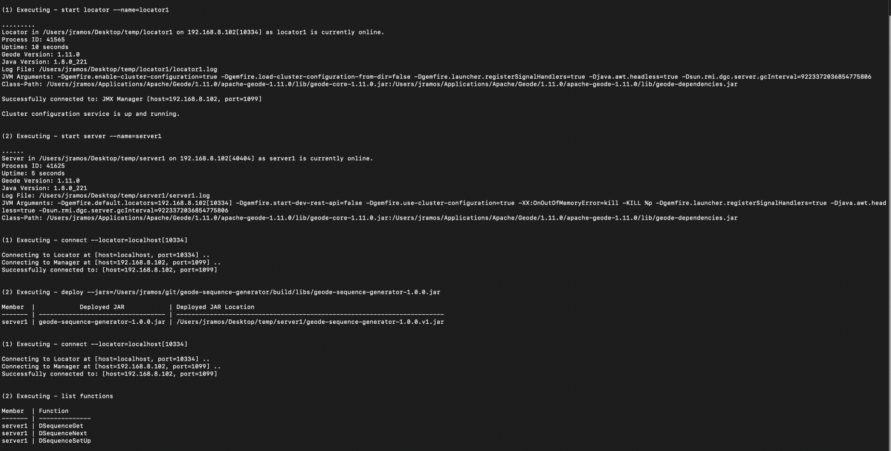

## Introduction
[Apache Geode](https://geode.apache.org/) is an in-memory data grid that provides real-time, consistent access to data-intensive applications throughout widely distributed cloud architectures. Its many features include fault-tolerance, high-availability, distributed locks and function execution (implement your business logic where the data is stored instead of moving the data to your application!).
A sequence, also known as a counter, is a feature supported by some database systems to produce unique values on demand, generally increasing the current value by 1 and returning the resulting value to the caller. These sequences are widely known and used, especially in legacy applications.

A sequence, also known as a counter, is a feature supported by some database systems to produce unique values on demand, generally increasing the current value by 1 and returning the resulting value to the caller. These sequences are widely known and used, especially in legacy applications.

## Why?
In order to move a step closer to cloud-native applications and a little away from legacy RDBMS, it would be nice to have distributed sequences/counters directly managed by [Apache Geode](https://geode.apache.org/).

## How?
The first thing we have to keep in mind is that, even though we can generate unique sequential distributed sequences with Geode, **we have to loosen the restriction about having no-gaps between the sequences.** If we don’t, there will always be a potential contention point (either while computing sequences or while sequentially executing the application work using the sequences) and, thus, fully parallel processing can not be truly achieved.
If you are willing to allow gaps, continue reading further, if you don’t… well, this tool is not for you, don’t waste any more of your time :-).

## The Solution
Instead of embedding the sequence generation within the real-time processing, use the [Geode Sequence Generator](https://github.com/jujoramos/geode-sequence-generator) and invoke the service occasionally to retrieve a big enough set of counters to work on.
Ideally, the service should be invoked during client startup and the batch requested should be big enough to avoid multiple calls to the service in real-time. The above alleviates the contention on the servers and maintains scalability, allowing several client applications to truly process batches of work in parallel using the set of assigned sequentially generated IDs.

## How Does it Work?
The tool primarily relies on `PERSISTENT` regions, the `Distributed Lock Service` and `Function Execution`.
There’s only one `Region` acting as the backing store, no matter how many different sequences are managed, and a `Distributed Lock` is acquired every time a sequence needs to be computed (thus the recommendation to avoid invoking the service multiple times in real-time and get a big enough batch of sequences to work on from the start).
To initialize the backing `Region`, the tool executes an initialization `Function` through the usage of `FunctionService.onServers`, allowing the user to choose exactly which servers will be used as the back end for the sequence generation (all by default).
To generate or retrieve a batch of sequences, the tool executes a `Function` through `FunctionService.onRegion`, guaranteeing that only the server hosting the primary copy of the data will be reached.

## Examples?
All right, time to write some code, finally!.

### Compile and Deploy
The first step is to download the tool, build it and deploy it to a running Apache Geode cluster. We list the functions at the very end just to verify that they have been correctly registered through the gfsh deploy command.



### Compute Sequences
Add the jar file to your application’s class path, initialize the `ClientCache`, initialize the `DistributedSequenceFactory` and start retrieving/computing the distributed counters!.

```java
public class TestClient {
  public static class Worker {
    private final Long ticketId;

    public Worker(Long ticketId) {
      this.ticketId = ticketId;
    }

    public String process() {
      // Do something useful here.
      return "Processed Ticket with Id: " + ticketId;
    }
  }

  public static void main(String[] args) throws ExecutionException, InterruptedException {
    ClientCache clientCache = new ClientCacheFactory().create();
    DistributedSequenceFactory.initialize(clientCache);
    ExecutorService executors = Executors.newCachedThreadPool();

    DistributedSequence distributedSequence = DistributedSequenceFactory.getSequence("ticketId");
    List<Long> sequences = distributedSequence.nextBatch(1000);
    List<Future<String>> processedTickets = new ArrayList<>();
    sequences.forEach(sequence -> processedTickets.add(executors.submit(() -> {
      Worker worker = new Worker(sequence);
      return worker.process();
    })));

    for (Future<String> future : processedTickets) {
      System.out.println(future.get());
    }

    System.exit(0);
  }
}
```

## What next?
Currently the tool must be downloaded and installed separately, the region is manually created and can be manually modified by client applications, which is a potential risk.
Write an [RFC](https://cwiki.apache.org/confluence/display/GEODE/Lightweight+RFC+Process) and discuss with the community to see whether it makes sense to have Distributed Sequences available in [Apache Geode](https://geode.apache.org/) out of the box.

## References
[Apache Geode Repository](https://github.com/apache/geode)

[Geode Sequence Generator Repository](https://github.com/jujoramos/geode-sequence-generator)