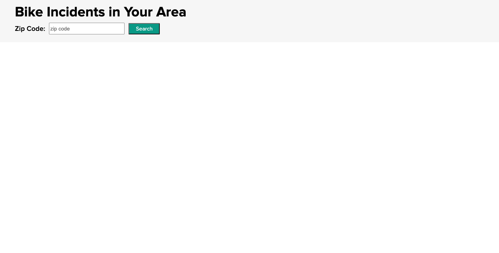
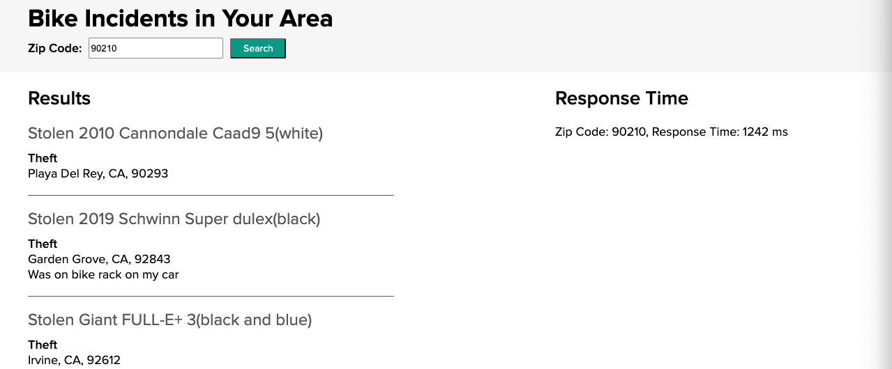
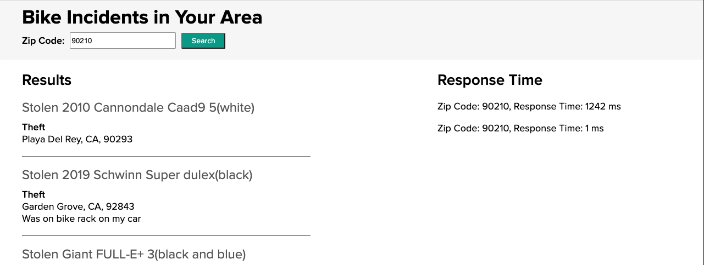

This guide walks you through how to implement the cache-aside pattern to your Spring Boot application using VMware Tanzu GemFire and [Spring Boot for Apache Geode](https://docs.spring.io/spring-boot-data-geode-build/current/reference/html5/).
## When should I use the cache-aside pattern?

The cache-aside pattern is a great candidate for data that doesn't change often and is frequently read. Some examples include:
* Front page for a website
* Healthcare policies, procedure codes, providers, and coverage.
* Promotional campaign information
* Product Catalog
* User profiles
* Movie listings
* etc.  

---
  
## How does the cache-aside pattern work?
With the cache-aside pattern, the application will request data from the cache. If the data **IS NOT** in the cache (**cache miss**), the application will request the data from the data store. Once the application receives the data, it will write that data to the cache (**cache write**).  


If the data **IS** in the cache (**cache hit**), your application will receive the requested data without needing to access the data store.  


---

## What you'll need
To complete this guide you need:

* The [Cache-Aside Cache example](https://github.com/gemfire/spring-for-apache-geode-examples/tree/main/cache-aside)
* Your favorite text editor or IDE
* JDK 8 or 11
* A Spring Boot application (using 2.3 or greater)
* The Spring Boot for Apache Geode dependency.

**If running on the Tanzu Application Service for VMs**
* A [Tanzu GemFire service instance](/data/tanzu-gemfire/guides/get-started-tgf4vms-sbdg/) on the Tanzu Application Service.

**If running on Kubernetes**
* A [Tanzu GemFire Cluster](/data/tanzu-gemfire/guides/get-started-tgf4k8s-sbdg/).

    For this example:
    * Our **namespace** is `tanzu-gemfire`
    * Our **GemFire cluster** is `cache-aside-gemfire-cluster` 
* [Docker](https://docs.docker.com/get-docker/) installed. 
* An image repository for the Cache-Aside Example (we used Docker Hub).


---

## Where do we begin?
This example begins with a Spring Boot application that is making a call to an external data source (in this case, the free [Bikewise API](https://www.bikewise.org/documentation/api_v2)), using a ZIP code as the search term. By implementing the cache-aside pattern you will speed up subsequent searches of that ZIP code.

In your application the external data source may be a call to a database, a different API, or another microservice.

You can download the complete application from the [Tanzu GemFire examples](https://github.com/gemfire/spring-for-apache-geode-examples) GitHub repository.

```
$ git clone https://github.com/gemfire/spring-for-apache-geode-examples.git
```

### Add the Spring Boot for Apache Geode Dependency
To allow the application to work with Tanzu GemFire and utilize the Spring Boot for Apache Geode dependency, add the following dependency information (for this example we have used Gradle)

**Gradle**
```groovy
ext {
  set('springGeodeVersion', "1.4.0")
}

dependencies {
  implementation 'org.springframework.geode:spring-geode-starter'
  testImplementation 'org.springframework.geode:spring-geode-starter-test'
  ...
}

dependencyManagement {
  imports {
    mavenBom "org.springframework.geode:spring-geode-bom:${springGeodeVersion}"
  }
}
```

**Maven**
```xml

<properties>
    ...
    <spring-geode.version>1.4.0</spring-geode.version>
    ...
</properties>

<dependencies>
    <dependency>
        <groupId>org.springframework.geode</groupId>
        <artifactId>spring-geode-starter</artifactId>
    </dependency>
    
    <dependency>
            <groupId>org.springframework.geode</groupId>
            <artifactId>spring-geode-starter-test</artifactId>
    </dependency>
</dependencies>

<dependencyManagement>
    <dependencies>
      <dependency>
        <groupId>org.springframework.geode</groupId>
        <artifactId>spring-geode-bom</artifactId>
        <version>${spring-geode.version}</version>
        <type>pom</type>
        <scope>import</scope>
      </dependency>
    </dependencies>
</dependencyManagement>
```
{}
Make sure that the minor version of Spring Boot you are using, matches the Spring Boot for Apache Geode version you declare in your dependency.
{} 


### Add Spring Boot for Apache Geode Annotations
Add the following annotations to either your application configuration class or your main application class

```java
import org.springframework.context.annotation.Configuration;
import org.springframework.data.gemfire.config.annotation.EnableCachingDefinedRegions;
import org.springframework.geode.config.annotation.EnableClusterAware;

@Configuration
@EnableCachingDefinedRegions
@EnableClusterAware
public class CacheAsideApplicationConfig {
    ...
}
```

[@EnableCachingDefinedRegions](https://docs.spring.io/spring-data/geode/docs/current/reference/html/#bootstrap-annotation-config-caching)
Inspects the Spring application for components annotated with [@Cacheable](https://docs.spring.io/spring/docs/current/spring-framework-reference/integration.html#cache-annotations) to identify the regions (caches) needed by the application at runtime.

[@EnableClusterAware](https://docs.spring.io/autorepo/docs/spring-boot-data-geode-build/current/reference/html5/#geode-configuration-declarative-annotations-productivity-enableclusteraware)
Allows the application to seamlessly switch between local-only (application running on local machine) and client/server (in a managed environment such as Tanzu Application Service). This annotation includes the [@EnableClusterConfiguration](https://docs.spring.io/autorepo/docs/spring-boot-data-geode-build/current/reference/html5/#geode-configuration-declarative-annotations-productivity-enableclusteraware) annotation, which dynamically creates regions if they do not exist already. Note that the @EnableClusterConfiguration annotation will only create Regions, it will not delete or update existing regions.

### Add the @Cacheable Annotation to Service Method
Finally, add the `@Cacheable` annotation to the service methods whose results will be cached.

```java
import org.springframework.cache.annotation.Cacheable;
    ...

@Service
public class BikeIncidentService {
    private final RestTemplate restTemplate;

    @Value("${bikewise.api.url}")
    private String API_URL;

    ...

    @Cacheable("BikeIncidentsByZip")
    public List<BikeIncident> getBikeIncidents(String zipCode) throws IOException {
        
        String jsonIncidents = restTemplate.getForObject(API_URL + zipCode, String.class);
    
        return convertJsonToBikeIncidents(jsonIncidents);
    }

    ...
}
```
Add the name of the region you wish to be created as an argument to the annotation. In the above example we have `@Cacheable(“BikeIncidentsByZip”)`, so a region with the name BikeIncidentsByZip will be used.

Remember that with the cache-aside pattern, the application will first check in the cache and if the value is found, the application will not run the logic in the annotated method.

### Testing Tip
 
 When unit testing during development, to verify caching, `@Autowire` a CacheManager and use it to obtain your named region and verify its contents.
 
 The [@DirtiesContext](https://docs.spring.io/spring/docs/current/javadoc-api/org/springframework/test/annotation/DirtiesContext.html) is used to destroy the test region and its data after the test is run. This prevents interference with other tests.
 
 In the cache-aside example, this looks like:
 
 ```java
import org.springframework.cache.CacheManager;
import org.springframework.test.annotation.DirtiesContext;

    ...
    
@Autowired
CacheManager cacheManager;

    ...
    
@Test
@DirtiesContext
public void getBikeIncidents_ShouldPullFromCache_AfterFirstResult() throws IOException {
    mockRestServer.expect(ExpectedCount.once(), requestTo(API_URL + ZIP_CODE_30306))
        .andRespond(withSuccess(mockIncidentsJsonForZipcode_30306, MediaType.APPLICATION_JSON));

    List<BikeIncident> resultsFor_30306_fromApi =
    bikeIncidentService.getBikeIncidents(ZIP_CODE_30306);
    List<BikeIncident> resultsFor_30306_fromCache =
    bikeIncidentService.getBikeIncidents(ZIP_CODE_30306);

    mockRestServer.verify();
    assertEquals(resultsFor_30306_fromApi,
    cacheManager.getCache("BikeIncidentsByZip").get(ZIP_CODE_30306).get());
    assertEquals(resultsFor_30306_fromApi, resultsFor_30306_fromCache);
}

```

---


## Run the App Locally

### Build the App
To run the app on your local machine, in a terminal, navigate to the root of the project and build the app  

**Gradle**
```
./gradlew clean build
```

 **Maven**
```
mvn clean package
``` 

### Start the Spring Boot App
Then run the Spring Boot command.

**Gradle**
```
./gradlew bootRun
```

 **Maven**
```
mvn spring-boot:run
``` 

When the app is running, open a browser and go to <http://localhost:8080>.  You should see this




Enter a ZIP code to search for bike incidents.




Notice the response time on the right side.  The application has now queried the Bikewise API with the entered ZIP code and stored the response in Tanzu GemFire.  

If you click the search button again with the same ZIP code, you will see that the response time is significantly faster, as the application is now retrieving the information from the Tanzu GemFire cache.




---

## Run the App on the Tanzu Application Service


       
{}
To deploy the Bike Incident application to Tanzu Application Service (TAS) make sure you have [created a Tanzu GemFire service instance](/data/tanzu-gemfire/guides/get-started-tgf4vms-sbdg/).
{} 
       

 
### Update the manifest.yaml file
 In the project root directory, open the `manifest.yml` file and replace  `<your-tanzu-gemfire-service>` with the name of your service instance.


### Push the app to your TAS space 
 Once the Tanzu GemFire service instance is running (you can check the status by running the `cf services` command), push your app to TAS with `cf push`.
 
 After the app has successfully been pushed, in the output find the `route`.  Then open a browser and copy and paste the route into the browser.  
 


---
 
 ## Run the App on Kubernetes
 

        
 {}
 To deploy the Bike Incident application on Kubernetes make sure you have [created a Tanzu GemFire cluster on Kubernetes](/data/tanzu-gemfire/guides/get-started-tgf4k8s-sbdg/).
 
 For this example:
 * Our **namespace** is `tanzu-gemfire`
 * Our **GemFire cluster** is `cache-aside-gemfire-cluster` 
 {} 
         
 
  
### Edit the `application.properties` file
* Navigate to the `spring-for-apache-geode-examples/cache-aside` directory. 
* Open the `application.properties`. 
* Uncomment the two listed properties.
* Replace the value for `spring.data.gemfire.pool.locators:` with your Tanzu GemFire cluster information, for each locator (in this example we only have one locator).  The information will follow the form:

   ```
   [GEMFIRE-CLUSTER-NAME]-locator-[LOCATOR-NUMBER].[GEMFIRE-CLUSTER-NAME]-locator.[NAMESPACE-NAME][10334]
   ```
    For our example the value looks like this:

    ```
    spring.data.gemfire.pool.locators: cache-aside-gemfire-cluster-locator-0.cache-aside-gemfire-cluster-locator.tanzu-gemfire[10334]
    ```
   * Replace `cache-aside-gemfire-cluster` with the name of your GemFire cluster if different.
   * Replace `tanzu-gemfire` with your namespace if different.
  
  
  
* Replace the value for `spring.data.gemfire.management.http.host:` with your Tanzu GemFire cluster information.  This will allow Spring Boot for Apache Geode to push your [initial cluster configuration](https://docs.spring.io/autorepo/docs/spring-boot-data-geode-build/current/reference/html5/#geode-configuration-declarative-annotations-productivity-enableclusteraware) to your Tanzu GemFire cluster.  The information follows a similar form as above:

   ```
   [GEMFIRE-CLUSTER-NAME]-locator-[LOCATOR-NUMBER].[GEMFIRE-CLUSTER-NAME]-locator.[NAMESPACE-NAME][GEMFIRE LOCATOR PORT]
   ```
    For our example the value looks like this:
    
     ```
      spring.data.gemfire.management.http.host: cache-aside-gemfire-cluster-locator-0.cache-aside-gemfire-cluster-locator.tanzu-gemfire
     ```
  
   * Replace `cache-aside-gemfire-cluster` with the name of your GemFire cluster if different.
   * Replace `tanzu-gemfire` with your namespace if different.
      
### Build a Docker Image with Gradle or Maven

Starting with Spring Boot 2.3, you can now customize and create an OCI image using Spring Boot. In this example we're using the [Gradle - packaging OCI images option](https://docs.spring.io/spring-boot/docs/current/gradle-plugin/reference/htmlsingle/#build-image).  If you are using Maven check out the instructions found [here](https://docs.spring.io/spring-boot/docs/current/maven-plugin/reference/htmlsingle/#build-image).

* In a terminal, navigate to the `cache-aside` directory.
* Build the application with ` ./gradlew clean build`
* Open the `build.gradle` file and update the `bootBuildImage` section, with your Docker repository information. This will build an image with the name `docker.io/[docker username]/bike-incidents:0.0.1-SNAPSHOT`.  
* Build the image with `./gradlew bootBuildImage`


### Push your Docker Image to Docker Hub

For this example, we're using Docker Hub as our registry. This will create a repository on Docker Hub called `bike-incidents` and push the image we created into that repository.

In a terminal
* Login to your Docker account
* Run the `docker push [IMAGE NAME HERE]`.  For this example it should be similar to this

    ```
    docker push docker.io/[YOUR DOCKER USERNAME]/bike-incidents:0.0.1-SNAPSHOT
    ```

### Create a deployment in your Kubernetes cluster

Create a Kubernetes deployment for your *Bike Incidents* app. This will create a deployment, replicaset, and pod using the image we created above.

   ```
     kubectl --namespace=tanzu-gemfire create deployment bike-incidents-deployment --image=docker.io/[YOUR DOCKER USERNAME]/bike-incidents:0.0.1-SNAPSHOT
   ```  
 * Replace `tanzu-gemfire` with your namespace if different.
 
If successful you should see `deployment.apps/bike-incidents-deployment created`

### Create a LoadBalancer to access the app
In order to access `Bike Incidents` app from a browser, we need to expose the deployment.

```
kubectl --namespace=tanzu-gemfire expose deployment/bike-incidents-deployment --type="LoadBalancer" --port=80 --target-port=8080
```

* Replace `tanzu-gemfire` with your namespace if different.

> If you're trying this locally with MiniKube, you will need to replace `LoadBalancer` with `NodePort`.

### Access the Bike Incidents App

Once the Load Balancer has been created, you can now access the *Bike Incidents* app using the `External IP` on the LoadBalancer service.

```
kubectl -n tanzu-gemfire get services
``` 
* Replace `tanzu-gemfire` with your namespace if different.

This should output something similar to (your *locator* and *server* names may be different).

```
NAME                                  TYPE           CLUSTER-IP     EXTERNAL-IP    PORT(S)              AGE
bike-incidents-deployment            LoadBalancer   10.0.227.199   20.62.226.18   80:31350/TCP         57s
cache-aside-gemfire-cluster-locator   ClusterIP      None           <none>         10334/TCP,4321/TCP   132m
cache-aside-gemfire-cluster-server    ClusterIP      None           <none>         40404/TCP,4321/TCP   131m
```

In your browser, go to the `EXTERNAL-IP` of the `bike-incidents-deployment` and you should see a working *Bike Incidents* app.

### Confirm your app is connected to your Tanzu GemFire cluster

* Open a terminal

* Start gfsh for kubernetes
    ```
    kubectl -n tanzu-gemfire exec -it GEMFIRE-CLUSTER-NAME-locator-0 -- gfsh
    ```  

  * Replace `tanzu-gemfire` with the name of your namespace, if it's different.
  * Replace `GEMFIRE-CLUSTER-NAME` with the name of your Tanzu GemFire cluster. 

* Once you see that `GFSH` has started, connect to your cluster with the `connect` command

    ```
    gfsh> connect
    ``` 
* Once connected run the `list regions` command

    ```
    gfsh> list regions
    ``` 

You should see something similar to

  ```
    List of regions
    ------------------
    BikeIncidentsByZip
  ```
This shows that the Spring Boot for Apache Geode app has connected to the Tanzu GemFire cluster and pushed the initial configuration (your region called `BikeIncidentsByZip`) to the cluster.

> If the `BikeIncidentsByZip` region IS NOT listed, the first item to check is the `application.properties` file.  Confirm that the spring data property values are set correctly.  If you need to update them, make sure you also increment your build number of your image.  This will force [Kubernetes to pull the new image](https://kubernetes.io/docs/concepts/containers/images/) (as opposed to using a cached version of the image).


**Congratulations! You have now deployed a simple Spring Boot for Apache Geode app that implements the cache-aside pattern**

---

## Learn More

 * Create an application that utilizes Spring Boot for Apache Geode and Spring Session for [session state caching](/data/tanzu-gemfire/guides/session-state-cache-sbdg).