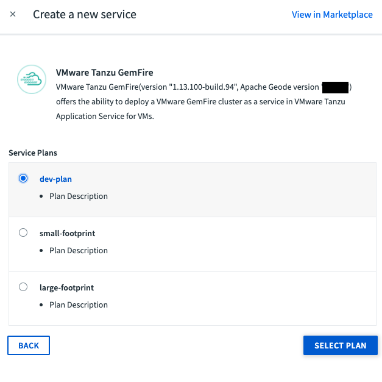

This guide walks you through creating a Tanzu GemFire service instance on the Tanzu Application Service using the `Book Service` example to confirm that it is working.

## Create A Tanzu GemFire Service Instance

### Option 1: Create the service instance using the cf CLI
Starting in a terminal

1. Run `cf login`, and create or target your organization’s space.

2. Run `cf marketplace -s p-cloudcache` to list your available VMware Tanzu GemFire plans. Take note of the `service plan` as this will be your `<PLAN-NAME>` in the following step. Note that Tanzu GemFire was previously called Pivotal Cloud Cache).

3. Create a Tanzu GemFire service instance within the space with the following command:
   
   `cf create-service p-cloudcache <PLAN-NAME> <SERVICE-INSTANCE-NAME>`
   
   * Replace `<PLAN-NAME>` with one the plan names from step 2.
   * Replace `<SERVICE-INSTANCE-NAME>` with your own custom name for your service instance.
    
    The `<SERVICE-INSTANCE-NAME>` can include alpha-numeric characters, hyphens, and underscores. This is also the name you will use in your `manifest.yml` to bind your client application to the service instance.
   
4.  If successful you will see 
    
    **OK**
    
    `Create in progress. Use 'cf services' or 'cf service <your-service-name>' to check operation status.`
   
5. Confirm the Tanzu GemFire service instance has been created by running  
   
   `$ cf services`
   
   This command outputs the current status of the service instance creation.  In the **last operation** column you will either see `create in progress` if it is still be created or `create succeeded` when it is ready to be used.
   
   **It can take several minutes for the service instance creation to complete.**
     
   
### Option 2: Create the service instance using Tanzu Application Service apps manager

&nbsp;

{}
[Apps Manager](https://docs.run.pivotal.io/console/dev-console.html) is a user interface that must be turned on by the operator of the foundation.
{} 

&nbsp;

1. Within your org, create a space or navigate to the space that will hold your Tanzu GemFire service instance.

&nbsp;

2. Click on the **Services** tab.
   

&nbsp;

3.  Click on the **ADD A SERVICE** button.
    

&nbsp;

4.  Click on ***Tanzu GemFire***.
    

&nbsp;

5. Choose one of the available plans and click ***SELECT PLAN***.
   

&nbsp;

6.  Fill in the **Instance Name** with a custom name for your service instance. The service instance name can include alpha-numeric characters, hyphens, and underscores. This is the name you will use in your `manifest.yml`.  (Alternatively, if you have already pushed your application to your space can select it in the "Bind to App" dropdown - however we prefer to bind our applications through a `manifest.yml` file)
    
    Click **CREATE**


7.  After clicking create you will see Tanzu GemFire service instance provisioning begin and in the **Last Operation** column it will say `create in progress`.

    

&nbsp;

**It can take several minutes for the service instance creation to complete.**

&nbsp;

8.  Once complete you will see `create succeeded` under the **Last Operation** column (you may need to refresh the page for the status to update).

    


 ---

## Set Up Your Tanzu Application Service Environment

This section will guide you through testing a `Book Service` client application on the Tanzu Application Service to confirm that your Tanzu GemFire service instance and node.js client are set up correctly.

 
### What You'll Need**

* The [Book Service](https://github.com/gemfire/node-examples/tree/master/book-service) example
* Node.js, version 10.16.3 or above
* The Tanzu GemFire Node.js client
* A running Tanzu GemFire service instance on the Tanzu Application Service

### 1. Clone the Book Service Example
 
 Clone the [node examples](https://github.com/gemfire/node-examples) from the GemFire Node Examples repository. 
 
 `$ git clone https://github.com/gemfire/node-examples.git`


### 2. Download Node.js for Tanzu GemFire
To run the `Book Service` example, you must download and install the Tanzu GemFire Node.js client library.

* Go to the [Tanzu GemFire](https://network.pivotal.io/products/p-cloudcache/) product page.
* In the "Releases" drop down, find and select the NodeJS-Client.
* Click on the file icon to download the tar file (.tgz.).
* Once downloaded, copy it to your `Book Service` project directory. Do not untar the tar file -- the npm command installs the Node.js API directly from the compressed .tgz archive.
 
### 3. Install the Tanzu GemFire Node.js Client
 
In a terminal, change your working directory to `node-examples/book-service`, and `npm install` the Tanzu GemFire Node.js client you downloaded above, into your project directory.

```bash
$ npm install /project/gemfire-nodejs-client-2.0.0.tgz 
$ npm update
```

### 4. Create a Tanzu GemFire Service Key

In order to connect to your Tanzu GemFire service instance and create the needed regions, you must first create a service key. 

In a terminal

* Run `cf login`, and create or target your organization’s space where your Tanzu GemFire service instance is running.

* Create a service key

    `$ cf create-service-key [YOUR-SERVICE INSTANCE-NAME] [SERVICE-NAME-service-key]`

* Output the service key:

    `$ cf service-key [YOUR-SERVICE INSTANCE-NAME] [SERVICE-NAME-service-key]`

* Copy the gfsh connect command labeled as `gfsh_login_string`. It will look something like this:

    `connect --url=https://TAS-name.cf-app.com/gemfire/v1 --user=cluster_operator_XXX --password=YYY --skip-ssl-validation`
   
### 5. Create the Region Used by the Book Service

Start the Tanzu GemFire CLI by typing `gfsh` in your terminal.

With `gfsh` running, Use the connect string from above to connect to the Tanzu GemFire service instance. Use the `return` key when prompted for the keystore and truststore values (in this example you don't need to enter any information in them).

```
gfsh>connect --url=https://TAS-name.cf-app.com/gemfire/v1 --user=cluster_operator_BhKM --password=xucZ --skip-ssl-validation
 key-store:
 key-store-password:
 key-store-type(default: JKS):
 trust-store:
 trust-store-password:
 trust-store-type(default: JKS):
 ssl-ciphers(default: any):
 ssl-protocols(default: any):
 ssl-enabled-components(default: all):
 Successfully connected to: GemFire Manager HTTP service @ https://TAS-name.cf-app.com/gemfire/v1
```

Once connected, create the region that the Book Service expects to find.

```
gfsh>create region --name=test --type=PARTITION
                 Member                      | Status | Message
    ---------------------------------------- | ------ | ------------------------------------------------
    cacheserver-a75d6fcc                     | OK     | Region "/test" created on "cacheserver-a75d6fcc"

    Cluster configuration for group 'cluster' is updated.
```

Type `exit` to quit GFSH.

### 6. Edit the `manifest.yaml` File

* Navigate to the project root directory. 
* Open the `manifest.yml file`. 
* Replace `PCC-TLS` with the name of your Tanzu GemFire service instance. If you're not sure of the instance name, run the `cf services` command.

### 7. Push your application to TAS

* In a terminal, navigate to the project root directory.
* Push the application to your TAS environment using `cf push`

The `cf push` operation will bind the *Book Service* app to the Tanzu GemFire service instance named in your `manifest.yaml` file  and then start the app.

### 8.  Interact with the Book Service

Once the BookService app is running, you can now add and look-up books.

#### Add a Book
To add a book to the data service, use a curl command similar to the one used when running with a local cluster, specifying the app route assigned in the `cf push` step.

**Mac and Linux**
```
$ curl -X PUT \
  'https://TAS-name.cf-app.com/book/put?isbn=0525565329' \
  -H 'Content-Type: application/json' \
  -d '{
  "FullTitle": "The Shining",
  "ISBN": "0525565329",
  "MSRP": "9.99",
  "Publisher": "Anchor",
  "Authors": "Stephen King"
}'
```

**Windows**
```
$ curl -X PUT "https://cloudcache-node-sample.apps.tas-name.cf-app.com/book/put?isbn=0525565329" -H "Content-Type: application/json" -d "{\"FullTitle\": \"The Shining\", \"ISBN\": \"0525565329\", \"MSRP\": \"9.99\", \"Publisher\": \"Anchor\", \"Authors\": \"Stephen King\"}"
```

The curl command responds with a confirmation: 

    `{"initialized":true}`
    
#### Look Up a Book
To look up a book in the data service, use a curl command similar to the one used when running with a local cluster, specifying the ISBN as a key:

    `$ curl -X GET \'https://cloudcache-node-sample.apps.tas-name.cf-app.com/book/get?isbn=0525565329'`
    
The curl command responds with the requested data:
`{"FullTitle":"The Shining","ISBN":"0525565329","MSRP":"9.99","Publisher":"Anchor","Authors":"Stephen King"}`

---

## Delete the app and the Service Instance

There are two ways to delete the app and the Tanzu GemFire service instance

### Option 1: Delete the app and service using the cf cli

* Stop the running app  

    ```cf stop cloudcache-node-sample```

* Delete the app and it's route 

    ```cf delete cloudcache-node-sample -r -f```

* If the Tanzu GemFire service instance is no longer needed, delete the service 
    ```
    $ cf delete-service <YOUR SERVICE NAME>
    Really delete the service <YOUR SERVICE NAME>?> y
    ```

### Option 2: Delete the app and service using Apps Manager

1. Navigate to the org and space that has your Tanzu GemFire service instance and click on the ***App*** tab.
2. Click on the name of the app.
3. Click on the ***Settings*** tab.
4. Click on ***DELETE APP*** (at the bottom of the page), and confirm that you want to delete the app.
5. Click on the ***Service*** tab.
6. Click on the name of your service instance.
7. Click on the ***Settings*** tab.
8. Click on the ***DELETE SERVICE INSTANCE*** button, and confirm the deletion.

Congratulations! You’re ready to start using Tanzu GemFire. You will need to create a new Tanzu GemFire Service Instance when working with your own application.