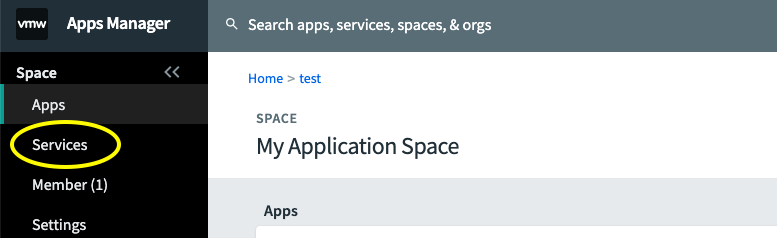
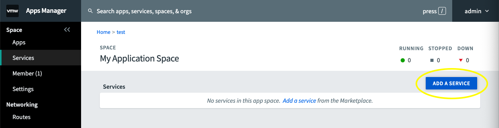
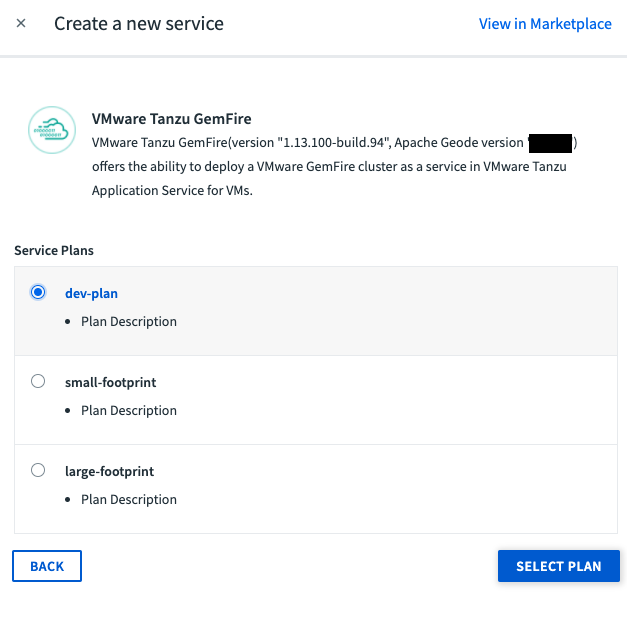
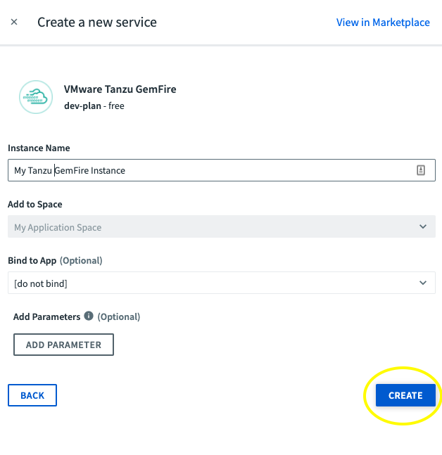
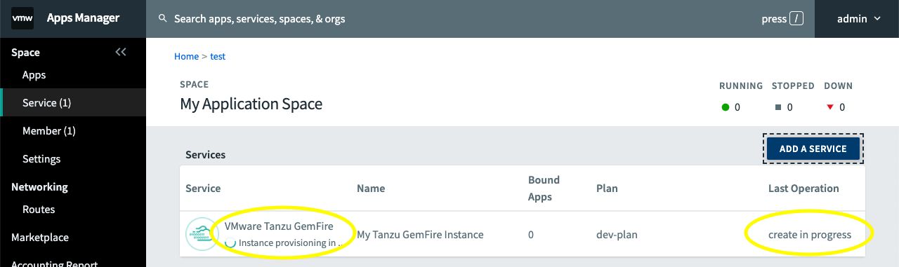
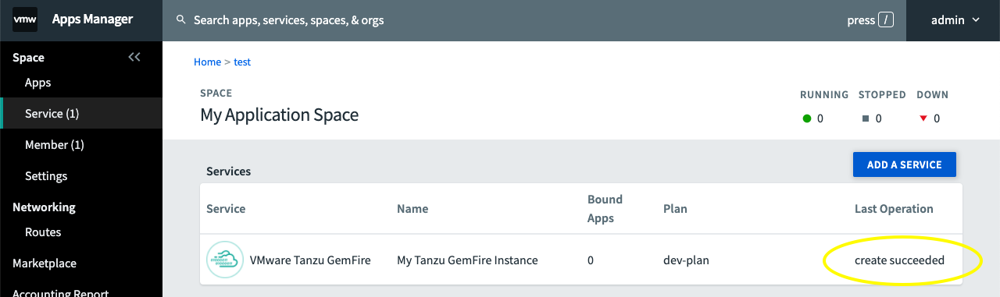

This guide will walk you through creating and testing a Tanzu GemFire service instance on the Tanzu Application Service (TAS) using a `Hello, World!` client application.


## Create A Tanzu GemFire Service Instance

### Option 1: Create the service instance using the cf CLI

Starting in a terminal

1. Run `cf login`, and create or target your organization’s space.

2. Run `cf marketplace -s p-cloudcache` to list your available VMware Tanzu GemFire plans. Take note of the `service plan` as this will be your `<PLAN-NAME>` in the following step. Note that Tanzu GemFire was previously called Pivotal Cloud Cache).

3. Create a Tanzu GemFire service instance within the space with the following command:
   
   `cf create-service p-cloudcache <PLAN-NAME> <SERVICE-INSTANCE-NAME>`
   
   * Replace `<PLAN-NAME>` with one the plan names from step 2.
   * Replace `<SERVICE-INSTANCE-NAME>` with your own custom name for your service instance.
    
    The `<SERVICE-INSTANCE-NAME>` can include alpha-numeric characters, hyphens, and underscores. This is also the name you will use in your `manifest.yml` to bind your client application to the service instance.
   
4.  If successful you will see 
    
    **OK**
    
    `Create in progress. Use 'cf services' or 'cf service <your-service-name>' to check operation status.`
   
5. Confirm the Tanzu GemFire service instance has been created by running  
   
   `$ cf services`
   
   This command outputs the current status of the service instance creation.  In the **last operation** column you will either see `create in progress` if it is still be created or `create succeeded` when it is ready to be used.
   
   **It can take several minutes for the service instance creation to complete.**
     
   
### Option 2: Create the service instance using Tanzu Application Service apps manager


{}
[Apps Manager](https://docs.run.pivotal.io/console/dev-console.html) is a user interface that must be turned on by the operator of the foundation.
{} 


1. Within your org, create a space or navigate to the space that will hold your Tanzu GemFire service instance.


2. Click on the **Services** tab.
    


3.  Click on the **ADD A SERVICE** button.
    


4.  Click on ***Tanzu GemFire***.
    


5. Choose one of the available plans and click ***SELECT PLAN***.
     


6.  Fill in the **Instance Name** with a custom name for your service instance. The service instance name can include alpha-numeric characters, hyphens, and underscores. This is the name you will use in your `manifest.yml`.  (Alternatively, if you have already pushed your application to your space can select it in the "Bind to App" dropdown - however we prefer to bind our applications through a `manifest.yml` file)
    
    Click **CREATE**
    
    


7.  After clicking create you will see Tanzu GemFire service instance provisioning begin and in the **Last Operation** column it will say `create in progress`.
    
     


**It can take several minutes for the service instance creation to complete.**


8.  Once complete you will see `create succeeded` under the **Last Operation** column (you may need to refresh the page for the status to update).

    

---

## Set Up Your Tanzu Application Service Environment

This section will guide you through testing a `Hello, World!` client application on the Tanzu Application Service to confirm that your Tanzu GemFire service instance is set up correctly.

### What You'll Need

* The [Hello, World!](https://github.com/gemfire/spring-for-apache-geode-examples/tree/main/hello-world) example.
* JDK 8 or 11
* Spring Boot 2.1 or above
* Spring Boot for Apache Geode
* A running Tanzu GemFire service instance on TAS

###  1. Download the Hello, World! Example

Clone the Hello, World! app from the [examples repo](https://github.com/gemfire/spring-for-apache-geode-examples). 

```
$ git clone https://github.com/gemfire/spring-for-apache-geode-examples.git
```

### 2. Edit the `manifest.yaml` File

* Navigate to the `spring-for-apache-geode-examples/hello-world` directory. 
* Open the `manifest.yml file`. 
* Replace the string `<your-tanzu-gemfire-service>` with the name of your Tanzu GemFire service instance. If you're not sure of the instance name, run the `cf services` command.


### 3. Push your application to TAS

* In a terminal, navigate to the `hello-world` directory.
* Build the application with `./gradlew build`
* Push the application to your TAS environment using `cf push`

The `cf push` operation will bind the Hello,World! app to the Tanzu GemFire service instance named in your `manifest.yaml` file  and then start the app.

 When the app is up and running, the `cf push` command should output information about the app in the terminal.  One the fields listed will be the `route`.  In a browser copy and paste the `[route from cf push]/hello`.
 
 You should see something similar to the below, which represents an artificial time delay simulating a database query.
 
> key: hello
>
>value: 2019-10-01T16:17:51.557 (this will be your current date & time)
>
>time to look up: 3057ms (quantity of time that it took to acquire the key-value pair).  


**Refresh the page** and you should see something similar to

> key: hello
>
>value: 2019-10-01T16:17:51.557 (this will be your current date & time)
>
>time to look up: 6ms (quantity of time that it took to acquire the key-value pair).

Note that the ***time to look up*** has been significantly reduced. This represents the app getting the information from the cache, Tanzu GemFire, instead of querying the database.

## Delete the app and the Service Instance

There are two ways to delete the app and the Tanzu GemFire service instance

### Option 1: Delete the app and service using the cf cli

* Delete the app first, so that the Tanzu GemFire service instance does not have any app bound to it with `cf delete helloworld -r -f`
* Delete the service by running the `cf delete-service <SERVICE-INSTANCE-NAME>` command. Make sure to replace `<SERVICE-INSTANCE-NAME>` with the name of your service instance. 
* Answer *yes* when prompted

### Option 2: Delete the app and service using Apps Manager

1. Navigate to the org and space that has your Tanzu GemFire service instance and click on the ***App*** tab.
2. Click on the name of the app.
3. Click on the ***Settings*** tab.
4. Click on ***DELETE APP*** (at the bottom of the page), and confirm that you want to delete the app.
5. Click on the ***Service*** tab.
6. Click on the name of your service instance.
7. Click on the ***Settings*** tab.
8. Click on the ***DELETE SERVICE INSTANCE*** button, and confirm the deletion.

Congratulations! You’re ready to start using Tanzu GemFire. You will need to create a new Tanzu GemFire Service Instance when working with your own application.

---

 ## Learn More
 
 Now that you have successfully created a running Tanzu GemFire service instance, check out some other guides.
 
  * You can get started by implementing the [cache-aside pattern](/data/tanzu-gemfire/guides/cache-aside-pattern-sbdg) which will improve the read performance of your application. 
   
  * Create an application that utilizes Spring Boot for Apache Geode and Spring Session for [session state caching](/data/tanzu-gemfire/guides/session-state-cache-sbdg).