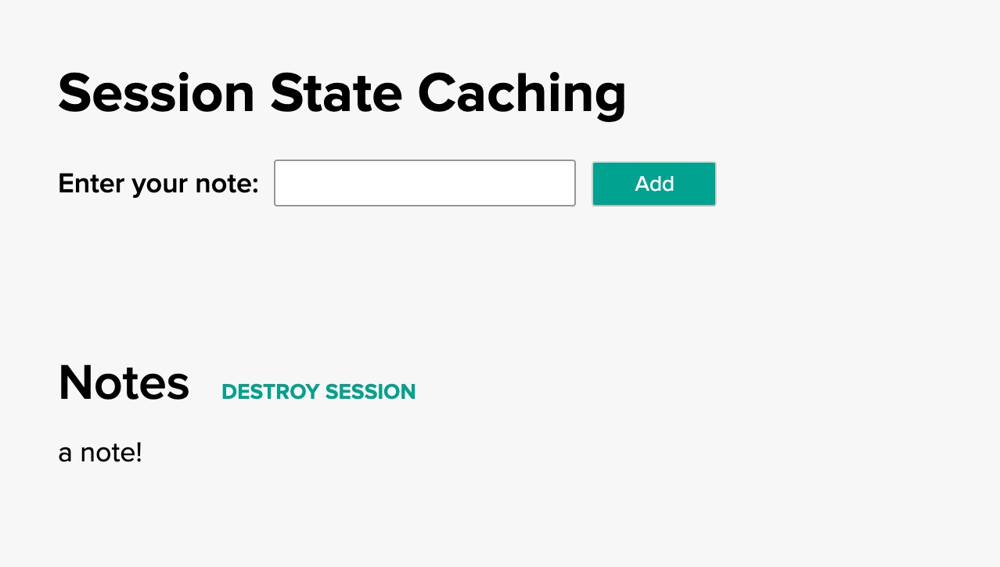

This guide walks you through how to implement a session state cache using Tanzu GemFire and [Spring Boot for Apache Geode](https://docs.spring.io/spring-boot-data-geode-build/current/reference/html5/).
## When should I use a session state cache?

Session state caching is useful for storing data associated with an HTTP session. Storing this data in a cache allows it to be retrieved quickly and persisted across log-ins. Some examples where this might be useful include:
* Shopping cart entries
* User preferences (name, site theme, etc.)
* Single Sign On (SSO) credentials
* Site Navigation History
* etc.  

---
  
## How does session state caching work?
When a user connects to a website that utilizes sessions, an HTTP session is created.

In our example the [Spring Session](https://docs.spring.io/spring-session/docs/current/reference/html5/) library takes care of managing the user session. When a user connects, a unique ID for the session is generated and stored as a cookie in the user’s browser. On subsequent requests, the cookie is sent to the server, identifying the session.

The session UUID is used as a key in a data store holding information associated with the session (see examples of session data above.) The data store can be a traditional database, but this can lead to performance issues when there is a large volume of users, or user data, or both. A cache can improve performance in these cases.

---

## What you'll need
To complete this guide you need:

* The [Session State example](https://github.com/gemfire/spring-for-apache-geode-examples/tree/main/session-state)
* Your favorite text editor or IDE
* JDK 8 or 11
* A Spring Boot application (using 2.3 or greater)
* The Spring Boot for Apache Geode dependency.

**If running on the Tanzu Application Service for VMs**
* A [Tanzu GemFire service instance](/data/tanzu-gemfire/guides/get-started-tgf4vms-sbdg/) on the Tanzu Application Service.

**If running on Kubernetes**
* A [Tanzu GemFire Cluster](/data/tanzu-gemfire/guides/get-started-tgf4k8s-sbdg/).

    For this example:
     * Our **namespace** is `tanzu-gemfire`
     * Our **GemFire cluster** is `notes-app-gemfire-cluster` 
* [Docker](https://docs.docker.com/get-docker/) installed. 
* An image repository for the Session State Example example (we used Docker Hub).

---

## Where do we begin?
This example consists of a simple Spring Boot back end application and a React front end application that records user-provided notes, and associates them with the user’s session. If the user navigates away, and then returns to the site, their notes will still be available. The app also offers the ability to destroy the session - analogous to logging out of a website or closing the browser/tab.

The back end (in the `src/main/java/sessionstate/` directory) handles all the session management and storage, and is the main focus of the example.

The front end (in the `frontend/` directory) is provided to illustrate how a web app can interact with the session data. The example front end is written using the React framework, but clients can use any language or framework capable of interacting with a REST endpoint.

You can download the complete application from the [Tanzu GemFire examples](https://github.com/gemfire/spring-for-apache-geode-examples) GitHub repository.

```
$ git clone https://github.com/gemfire/spring-for-apache-geode-examples.git
```


### Add the Spring Boot for Apache Geode Dependency
To allow the application to work with Tanzu GemFire and utilize the Spring Boot for Apache Geode dependency, add the following dependency information (the example code uses Gradle)

**Gradle**
```groovy
ext {
  set('springGeodeVersion', "1.4.0")
}

dependencies {
  implementation 'org.springframework.geode:spring-geode-starter'
  testImplementation 'org.springframework.geode:spring-geode-starter-test'
  ...
}

dependencyManagement {
  imports {
    mavenBom "org.springframework.geode:spring-geode-bom:${springGeodeVersion}"
  }
}
```

**Maven**
```xml
<properties>
    ...
    <spring-geode.version>1.4.0</spring-geode.version>
    ...
</properties>

<dependencies>
    <dependency>
        <groupId>org.springframework.geode</groupId>
        <artifactId>spring-geode-starter</artifactId>
    </dependency>
    
    <dependency>
            <groupId>org.springframework.geode</groupId>
            <artifactId>spring-geode-starter-test</artifactId>
    </dependency>
</dependencies>

<dependencyManagement>
    <dependencies>
      <dependency>
        <groupId>org.springframework.geode</groupId>
        <artifactId>spring-geode-bom</artifactId>
        <version>${spring-geode.version}</version>
        <type>pom</type>
        <scope>import</scope>
      </dependency>
    </dependencies>
</dependencyManagement>
```

{}
Make sure that the minor version of Spring Boot you are using, matches the Spring Boot for Apache Geode version you declare in your dependency.
{} 

### Add Spring Boot for Apache Geode Annotations
The Spring Boot application will need the following annotations

```java
@SpringBootApplication
@EnableClusterAware
public class SessionStateApplication {
  public static void main(String[] args) {
     SpringApplication.run(SessionStateApplication.class, args);
  }
}
```
[@EnableClusterAware](https://docs.spring.io/autorepo/docs/spring-boot-data-geode-build/current/reference/html5/#geode-configuration-declarative-annotations-productivity-enableclusteraware)
Allows the application to seamlessly switch between local-only (application running on local machine) and client/server (in a managed environment such as Tanzu Application Service). This annotation includes the [@EnableClusterConfiguration](https://docs.spring.io/autorepo/docs/spring-boot-data-geode-build/current/reference/html5/#geode-configuration-declarative-annotations-productivity-enableclusteraware) annotation, which dynamically creates regions if they do not exist already. Note that the @EnableClusterConfiguration annotation will only create Regions, it will not delete or update existing regions.

The example Spring Boot application uses a `RestController` that allows the front end application to interact with a REST API to read, update, and destroy session data.

```java
@RestController
public class SessionController {
    @GetMapping("/getSessionNotes")
    public List<String> getSessionNotes(HttpServletRequest request) {
        List<String> notes = (List<String>) request.getSession().getAttribute("NOTES");
        return notes;
    }

    @PostMapping("/addSessionNote")
    public void addSessionNote(@RequestBody String note, HttpServletRequest request) {
        List<String> notes = (List<String>) request.getSession().getAttribute("NOTES");

        if (notes == null) {
            notes = new ArrayList<>();
        }

        notes.add(note);
        request.getSession().setAttribute("NOTES", notes);
    }

    @PostMapping("/invalidateSession")
    public void invalidateSession(HttpServletRequest request) {
        request.getSession(false).invalidate();
    }
}
```

### Accessing and Displaying Session Data from the Front End
The front end web application accesses the back end REST API using standard GET and POST HTTP methods. See `frontend/src/sessionService.js`

```javascript
import axios from 'axios';

const instance = axios.create();

const addNote = async (note) => {
   await instance.post('/addSessionNote', note,{
       headers: { 'Content-Type': 'text/plain' }
   });
};

const getNotes = async () => {
   const response = await instance.get('/getSessionNotes');
   return response.data;
};

const destroySession = async () => {
   await instance.post('/invalidateSession');
};
```

### Testing Tip
When unit testing during development, to verify caching, `@Autowire` a CacheManager and use it to confirm that session data is properly stored in the cache.

 The [@DirtiesContext](https://docs.spring.io/spring/docs/current/javadoc-api/org/springframework/test/annotation/DirtiesContext.html) is used to destroy the test region and its data after the test is run. This prevents interference with other tests.

```java
@RunWith(SpringRunner.class)
@SpringBootTest(classes = SessionStateApplication.class)
@AutoConfigureMockMvc
public class SessionControllerTest {
   @Autowired
   MockMvc mockMvc;

   @Autowired
   CacheManager cacheManager;

   static String NOTE1 = "Nothing More Than Memories";

...

   @Test
   @DirtiesContext
   public void addSessionNote_should_addNoteToSessionInCache() throws Exception {
       MvcResult mvcResult = mockMvc.perform(post("/addSessionNote")
               .content(NOTE1))
               .andExpect(status().isOk())
               .andReturn();

       String encodedSessionUUID = mvcResult.getResponse().getCookie("SESSION").getValue();

       List<String> notesList = getNotesForSessionInCache(encodedSessionUUID);

       assertEquals(NOTE1, (notesList.get(0)));
   }
...
```

---


## Run the App Locally
Navigate to the root of the project  in a command line and run the Spring Boot run command.

### Build the App
To run the app on your local machine, in a terminal, navigate to the root of the project and build the app  

**Gradle**
```
./gradlew clean build
```

 **Maven**
```
mvn clean package
``` 

### Start the Spring Boot App
Then run the Spring Boot command.

**Gradle**
```
./gradlew bootRun
```

 **Maven**
```
mvn spring-boot:run
``` 

When the app is running, open a browser and go to <http://localhost:8080>.

- The "Enter your note:" form can be used to enter notes. 
- The "DESTROY SESSION" button can be used to clear the session data and delete the notes.



---

## Run the App on the Tanzu Application Service


 
 {}
  To deploy the application to the Tanzu Application
   Service (TAS) make sure you have [created a Tanzu GemFire service instance](/data/tanzu-gemfire/guides/get-started-tgf4vms-sbdg/).
 {} 
 

 
### Update the manifest.yaml file
 In the project root directory, open the `manifest.yml` file and replace  `<SERVICE-INSTANCE-NAME>` with the name of your service instance.


### Push the app to your TAS space 
 Once the Tanzu GemFire service instance is running (you can check the status by running the `cf services` command), push your app to TAS with `cf push`.
 
 After the app has successfully been pushed, in the output find the `route`.  Then open a browser and copy and paste the route into the browser.  
 

 
---
 
 ## Run the App on Kubernetes
 

        
 {}
 To deploy the Session State Example application on Kubernetes make sure you have [created a Tanzu GemFire cluster on Kubernetes](/data/tanzu-gemfire/guides/get-started-tgf4k8s-sbdg/).
 
 For this example:
 * Our **namespace** is `tanzu-gemfire`
 * Our **GemFire cluster** is `notes-app-gemfire-cluster` 
 {} 
         

  
### Edit the `application.properties` file
* Navigate to the application directory. 
* Open the `application.properties`. 
* Uncomment the two listed properties.
* Replace the value for `spring.data.gemfire.pool.locators:` with your Tanzu GemFire cluster information, for each locator (in this example we only have one locator).  The information will follow the form:

   ```
   [GEMFIRE-CLUSTER-NAME]-locator-[LOCATOR-NUMBER].[GEMFIRE-CLUSTER-NAME]-locator.[NAMESPACE-NAME][10334]
   ```
    For our example the value looks like this:

    ```
    spring.data.gemfire.pool.locators: notes-app-gemfire-cluster-locator-0.notes-app-gemfire-cluster-locator.tanzu-gemfire[10334]
    ```
   * Replace `notes-app-gemfire-cluster` with the name of your GemFire cluster if different.
   * Replace `tanzu-gemfire` with your namespace if different.
  

* Replace the value for `spring.data.gemfire.management.http.host:` with your Tanzu GemFire cluster information.  This will allow Spring Boot for Apache Geode to push your [initial cluster configuration](https://docs.spring.io/autorepo/docs/spring-boot-data-geode-build/current/reference/html5/#geode-configuration-declarative-annotations-productivity-enableclusteraware) to your Tanzu GemFire cluster.  The information follows a similar form as above:

   ```
   [GEMFIRE-CLUSTER-NAME]-locator-[LOCATOR-NUMBER].[GEMFIRE-CLUSTER-NAME]-locator.[NAMESPACE-NAME][GEMFIRE LOCATOR PORT]
   ```
    For our example the value looks like this:
    
     ```
      spring.data.gemfire.management.http.host: notes-app-gemfire-cluster-locator-0.notes-app-gemfire-cluster-locator.tanzu-gemfire
     ```
  
   * Replace `notes-app-gemfire-cluster` with the name of your GemFire cluster if different.
   * Replace `tanzu-gemfire` with your namespace if different.
      
### Build a Docker Image with Gradle or Maven

Starting with Spring Boot 2.3, you can now customize and create an OCI image using Spring Boot. In this example we're using the [Gradle - packaging OCI images option](https://docs.spring.io/spring-boot/docs/current/gradle-plugin/reference/htmlsingle/#build-image).  If you are using Maven check out the instructions found [here](https://docs.spring.io/spring-boot/docs/current/maven-plugin/reference/htmlsingle/#build-image).

* In a terminal, navigate to the application directory.
* Build the application with ` ./gradlew clean build`
* Open the `build.gradle` file and update the `bootBuildImage` section, with your Docker repository username. This will build an image with the name `docker.io/[YOUR DOCKER USERNAME]/notes-app:0.0.1-SNAPSHOT`.  
* Build the image with `./gradlew bootBuildImage`


### Push your Docker Image to Docker Hub

For this example, we're using Docker Hub as our registry. This will create a repository on Docker Hub called `notes-app` and push the image we created into that repository.

In a terminal
* Login to your Docker account
* Run the `docker push [IMAGE NAME HERE]`.  For this example it should be similar to this

    ```
    docker push docker.io/[YOUR DOCKER USERNAME]/notes-app:0.0.1-SNAPSHOT
    ```

### Create a deployment in your Kubernetes cluster

Create a Kubernetes deployment for your *Notes* app. This will create a deployment, replicaset, and pod using the image we created above.

   ```
     kubectl --namespace=tanzu-gemfire create deployment notes-app-deployment --image=docker.io/[YOUR DOCKER USERNAME]/notes-app:0.0.1-SNAPSHOT
   ```  
 * Replace `tanzu-gemfire` with your namespace if different.
 
If successful you should see `deployment.apps/notes-app-deployment created`

### Create a LoadBalancer to access the app
In order to access the `Notes` app from a browser, we need to expose the deployment.

```
kubectl --namespace=tanzu-gemfire expose deployment/notes-app-deployment --type="LoadBalancer" --port=80 --target-port=8080
```

* Replace `tanzu-gemfire` with your namespace if different.

> If you're trying this locally with MiniKube, you will need to replace `LoadBalancer` with `NodePort`.

### Access the Notes App

Once the Load Balancer has been created, you can now access the *Notes* app using the `External IP` on the LoadBalancer service.

```
kubectl -n tanzu-gemfire get services
``` 
* Replace `tanzu-gemfire` with your namespace if different.

This should output something similar to (your *locator* and *server* names may be different).

```
NAME                        TYPE           CLUSTER-IP    EXTERNAL-IP      PORT(S)              AGE
notes-app-cluster-locator   ClusterIP      None          <none>           10334/TCP,4321/TCP   26h
notes-app-cluster-server    ClusterIP      None          <none>           40404/TCP,4321/TCP   26h
notes-app-deployment        LoadBalancer   10.0.113.16   52.170.169.174   80:30109/TCP         26h
```

In your browser, go to the `EXTERNAL-IP` of the `notes-app-deployment` and you should see a working *Notes* app.


### Confirm your app is connected to your Tanzu GemFire cluster

* Open a terminal

* Start gfsh for kubernetes
    ```
    kubectl -n tanzu-gemfire exec -it GEMFIRE-CLUSTER-NAME-locator-0 -- gfsh
    ```  

  * Replace `tanzu-gemfire` with the name of your namespace, if it's different.
  * Replace `GEMFIRE-CLUSTER-NAME` with the name of your Tanzu GemFire cluster. 

* Once you see that `GFSH` has started, connect to your cluster with the `connect` command

    ```
    gfsh> connect
    ``` 
* Once connected run the `list regions` command

    ```
    gfsh> list regions
    ``` 

You should see something similar to

  ```
    List of regions
    ------------------
    ClusteredSpringSessions
  ```
This shows that the Spring Boot for Apache Geode app has connected to the Tanzu GemFire cluster and pushed the initial Session configuration, including a region called `ClusteredSpringSessions`), to the cluster.

> If the `ClusteredSpringSessions` region IS NOT listed, the first item to check is the `application.properties` file.  Confirm that the spring data property values are set correctly.  If you need to update them, make sure you also increment your build number of your image.  This will force [Kubernetes to pull the new image](https://kubernetes.io/docs/concepts/containers/images/) (as opposed to using a cached version of the image).


---

**Congratulations! You have now deployed a Spring Boot for Apache Geode app that implements Session State Caching**