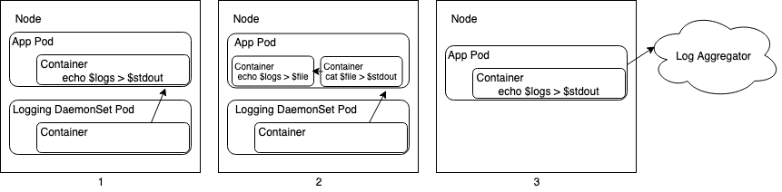

Logs help you monitor events and debug problems in an application. As complexity
of a cloud-native environment grows with the number of deployed applications,
debugging and monitoring become more difficult. Organizations can maintain
observability and the ability to troubleshoot by adhering to the following
guidelines.

## Logging Types

Cloud-native platforms handle application logging in three primary ways:

1. Centralized Logging - An external system pulls logs from `stdout`
   of your application. You do not need to configure anything.
2. Centralized Logging with Sidecar - An external system pulls logs
   from `stdout` of a sidecar container. You must redirect logs from your
   application's output location to `stdout` of a sidecar container.
3. Logs Pushed from Application - Your application pushes logs directly to a
   centralized log aggregation service.

The following diagram illustrates these concepts in the context of a Kubernetes
cluster. In this example, a centralized logging tool is deployed as a DaemonSet
and sidecars are deployed as containers within application pods.



This document focuses on the first and second approaches outlined above. In
general, VMware advises against the third option as it requires the application
logic to also be responsible for logging.

## Output Location

Since changes made to disk are lost on a container restart, applications should
not log to a file within the container. A best practice in container-based
environments is to log to `stdout` and `stderr`, and allow a separate logging
agent to handle logs for the application. This simplifies implementation of
logging for a developer because logging to `stdout` and `stderr` is easy to
implement. Furthermore, cluster operators may deploy tooling which can easily
consume and analyze these logs.

## Output Redirection

Not all existing applications follow best practice by logging to `stdout` and
`stderr`, as some are configured store to logs on one or more locations on disk.
If you cannot modify the application, deploy a sidecar container to redirect
application logs to `stdout` and `stderr` as a workaround.

Consider the following example of a Kubernetes pod where a container writes to
two files on disk. The second and third pods `tail` the files on disk, which
allows logging utilities to consume log events as they are redirected to
`stdout` and `stderr`.

```yaml
apiVersion: v1
kind: Pod
metadata:
  name: counter
spec:
  containers:
  - name: count
    image: busybox
    args:
    - /bin/sh
    - -c
    - >
      i=0;
      while true;
      do
        echo "$i: $(date)" >> /var/log/1.log;
        echo "$(date) INFO $i" >> /var/log/2.log;
        i=$((i+1));
        sleep 1;
      done
    volumeMounts:
    - name: varlog
      mountPath: /var/log
  - name: count-log-1
    image: busybox
    args: [/bin/sh, -c, 'tail -n+1 -f /var/log/1.log']
    volumeMounts:
    - name: varlog
      mountPath: /var/log
  - name: count-log-2
    image: busybox
    args: [/bin/sh, -c, 'tail -n+1 -f /var/log/2.log']
    volumeMounts:
    - name: varlog
      mountPath: /var/log
  volumes:
  - name: varlog
    emptyDir: {}
```

This allows you to abide by logging best practices in a cloud-native environment
without making changes to application code. However, VMware recommends logging
to `stdout` in the application layer when possible to minimize resource
overhead.

For more details on logging in Kubernetes, refer to the [official reference
documentation](https://kubernetes.io/docs/concepts/cluster-administration/logging/)

## Structured vs. Unstructured Logs

Logging application events in a structured format makes consumption and querying
of logs easier. Logs are normally presented as strings with information such as
log level, timestamp and a description of the event. These are considered
_unstructured logs_ because they do not conform to a data format such as JSON.
Automation _can_ parse _Structured logs_ on the other hand, because they are
organized into a machine-readable data format. This allows you to construct
queries that reference specific parts of the logs. For example, structured logs
allow a user to easily construct a query to filter all events based on their
timestamp, log level or other user-defined metadata. 

### Language Support for Structured Logging

A best practice for structured logging is to implement it directly in
application code with a logging library. This results in logs conforming to a
data format by the time another tool consumes them, which prevents CPU cycles
from being spent on parsing. Most languages have a native logging library that
supports structured logging. 

Consider the following example implementation of structured logging in
[_Logrus_](https://github.com/sirupsen/logrus/tree/v1.4.2), a logging library
for Go. This example is modified from Logrus' GitHub page.

```go
package main

import (
  "os"
  log "github.com/sirupsen/logrus"
)

func init() {
  // Log as JSON
  log.SetFormatter(&log.JSONFormatter{})

  // Output to stdout
  log.SetOutput(os.Stdout)
}

func main() {
  log.WithFields(log.Fields{
    "animal": "walrus",
    "size":   10,
  }).Info("A group of walrus emerges from the ocean")

  log.WithFields(log.Fields{
    "omg":    true,
    "number": 122,
  }).Warn("The group's number increased tremendously!")

  log.WithFields(log.Fields{
    "omg":    true,
    "number": 100,
  }).Fatal("The ice breaks!")
}
```

The code referenced above produces the following output:
```shell
{"animal":"walrus","level":"info","msg":"A group of walrus emerges from the
ocean","size":10,"time":"2014-03-10 19:57:38.562264131 -0400 EDT"}

{"level":"warning","msg":"The group's number increased tremendously!",
"number":122,"omg":true,"time":"2014-03-10 19:57:38.562471297 -0400 EDT"}

{"level":"fatal","msg":"The ice breaks!","number":100,"omg":true,
"time":"2014-03-10 19:57:38.562543128 -0400 EDT"}
```

Note the trade-off between human and machine readability with, with structured
logs being more difficult for humans to read and easier for machines to parse.
Carefully consider who the consumers of logs are and take this into account when
you implement logging.

### Consuming Structured Logs in Elastic

_Elasticsearch_ is a log aggregation and search tool used by operations teams to
aggregate and query logs in a cloud-native environment. By adhering to a
pre-defined logging structure at the application layer expressed as a
[_mapping_](https://www.elastic.co/guide/en/elasticsearch/reference/7.x/mapping.html#CO157-1)
object to Elasticsearch, logs are ingested without Elasticsearch having to parse
the raw input. This allows both developers and operators to effectively
troubleshoot as a cloud environment becomes more complex.

Elasticsearch could use the following mapping configuration to parse the
previous section's logs.
```shell
{
  "mappings": {
    "properties": { 
      "animal":    { "type": "text"  }, 
      "level":     { "type": "text"  }, 
      "msg":       { "type": "text" },  
      "time":  {
        "type":   "date", 
        "format": "strict_date_optional_time||epoch_millis"
      }
    }
  }
}
```

Notice that `title`, `name`, and `age` properties each have an assigned data
type, and the `created` property has both an assigned data type and defined
format. 

### Structured-Logging Sidecar

If an application does not implement structured logging and you cannot modify
the application, parsing may occur after the application has emitted log events.
Use [_Fluentbit_](https://fluentbit.io/documentation/0.12/), a log shipper that
VMware recommends, to deploy a sidecar (as described in the previous section)
which parses logs before shipping them. 

Consider the following example from the Fluentbit documentation. Fluentbit may
take the following as input:

```shell
192.168.2.20 - - [28/Jul/2006:10:27:10 -0300] "GET /cgi-bin/try/ HTTP/1.0" 200 3395
```

And produce the following output:
```shell
{
  "host":    "192.168.2.20",
  "user":    "-",
  "method":  "GET",
  "path":    "/cgi-bin/try/",
  "code":    "200",
  "size":    "3395",
  "referer": "",
  "agent":   ""
 }
 ```

Although this sidecar implements simple logic and its overhead is low, VMware
recommends that your application print structured logs to avoid the overhead
introduced by additional containers.