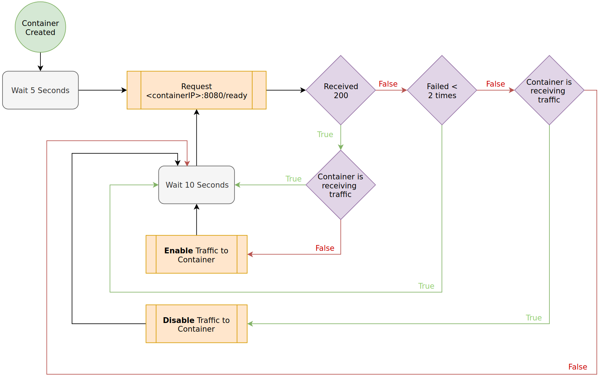
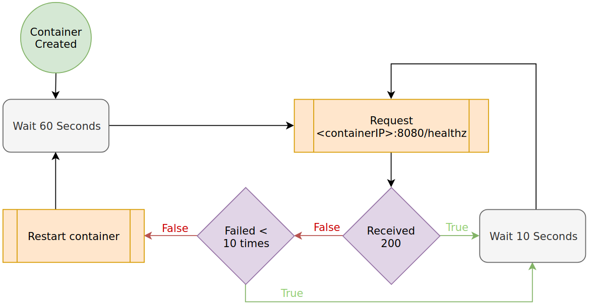

Kubernetes does not demand specifics about the applications that run on top of
it. They don't not need to be microservices, 12 factor, or maintain other specific
software philosophies. However, for an application to run well on Kubernetes, there
are aspects of your application you may wish to reconsider.

Kubernetes is a distributed system that has behaviors different from what many
are used to in a traditional environment. These include:

* Workloads must be packaged in a container.
* Workloads may be moved (stopped and recreated) based on the needs of the
  system.
* Workload IP addresses are [generally] ephemeral.
* Workloads have no affinity to hosts.

Aside from the above constraints, how your application is developed and run is
up to you. There are multiple considerations you can make to comply with more
idiomatic Kubernetes software practices. The following checklist covers the
considerations for running an application in Kubernetes.

## Popular Tooling & Approaches

### Application Probes

Kubernetes supports a multitude of probes that indicate state of a running
workload. For details on implementing probes, see [the guide on Probing
Application State](../app-enhancements-probing-app-state).

#### Readiness Probe

You should use readiness probes as they gate whether your application is
considered 'Ready' to a cluster. Until applications are 'Ready' they do not
receive traffic. A simple HTTP check that reports ready, post initialization is
often adequate.

For implementation details, see [the guide on Probing Application
State](../app-enhancements-probing-app-state).

#### Liveness Probe

You should consider liveness probes as a 'safety' check for your application to
ensure it hasn't halted operation unexpectedly. These checks should **not** rely
on external dependencies as you don't want your application to restart due to
external issues.

For implementation details, see [the guide on Probing Application
State](../app-enhancements-probing-app-state).

#### Startup Probe

You should consider a startup probe for legacy applications that require a
larger amount of time for their initial startup. This probe only executes on
first start-up and does not continue probing over time (like readiness and
liveness). After a startup probe succeeds, if configured, a liveness probe will
continue. Ideally, modern applications **do not** require this kind of
protection, but it can be helpful when long start ups cannot be worked around.

### Externalized Configuration

In Kubernetes based-platform, you should keep all application configuration
outside of the application / container when possible. This will enable you to
dynamically change how your application runs by altering ConfigMaps and Secrets.
It's also helpful when deploying the application into different context or
environments.

For details on how to externalize configuration, see the [externalizing
configuration guide](../app-enhancements-externalizing-configuration).

### Graceful Shutdown Mechanics Handlers

As Kubernetes moves workloads around the cluster, an instance of your
application can be asked to stop so a new instance of it can be started
elsewhere. If your application requires any amount of graceful shutdown, you
should ensure your application can handle this event.

When a pod is being deleted, moved, or recreated each container's PID 1 receives
a SIGTERM. The process then has a grace-period to do what it needs and exit.
The default grace-period is 30 seconds; check with your cluster administrator to
understand what your cluster is set to. If the grace period expires, a SIGKILL
is sent. For more details, see the [Termination of Pods
documentation](https://kubernetes.io/docs/concepts/workloads/pods/pod/#termination-of-pods).

If a process, script, or HTTP endpoints must be called to terminate gracefully,
you can also add a [preStop
hook](https://kubernetes.io/docs/concepts/containers/container-lifecycle-hooks)
to your Kubernetes manifest.

For details on how to gracefully shutdown pods, see the [graceful shutdown guide](../app-enhancements-graceful-shutdown).

### Structured Logging

Structured logging allows log aggregation systems to provide a better view of your
applications logs. You should consider this approach for applications running
Kubernetes. Typically it's as simple as creating log-helper functions or
introducing a logging library. For implementation details, see the [logging
practice guide](../app-enhancements-logging-practices).

### Export Application Metrics

When exposing metrics about your application, it is a common practice to use
an exporter. This allows you to introduce metrics to your application and a
scraping system, such as [prometheus](https://prometheus.io), to gather those
metrics over time.  There are exporter libraries for most languages. See the
[Client Library](https://prometheus.io/docs/instrumenting/clientlibs/)
documentation for a list of examples.

Work with your platform team to determine if scrape-based monitoring system such
as prometheus, Datadog, or Elastic is available.

For more details, see the [Exporting Application Metrics
guide](../app-observability-exporting-metrics)

### Trace Points

In service based architectures, a request can move through many
applications and thus across network boundaries multiple times. A trade-off to
these architectures is detecting where issues in the stack are occurring. For
example, where is most of the latency in a request coming from?

If your workload falls into this architecture, implementing tracing in your
application(s) is worth considering. Often you need a system that lets you view
trace results, before running one, you may wish to check with your platform team
to see if something pre-exists.

For more details on this concern, see the
[Observability section](../app-observability).