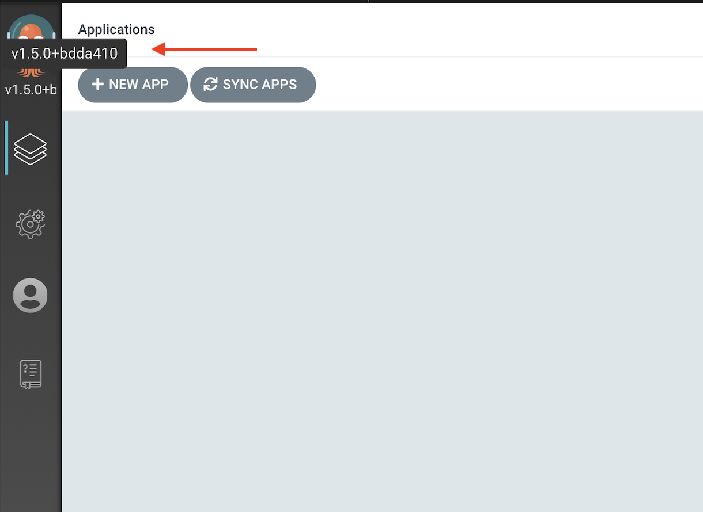
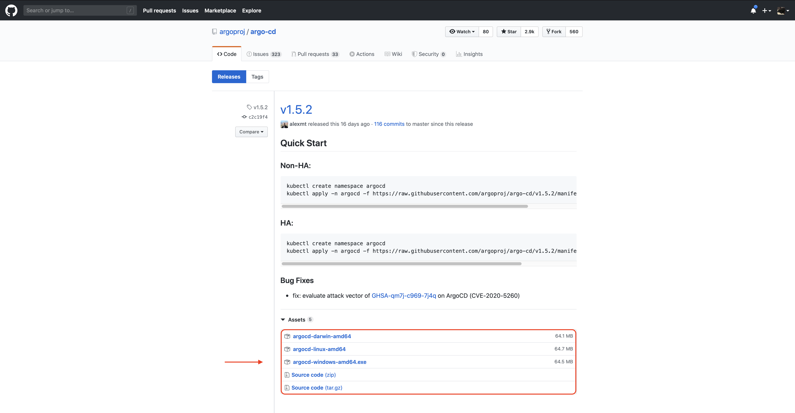

ArgoCD is a declarative GitOps tool built to deploy applications to Kubernetes. While the continuous delivery (CD) space is seen by some as crowded these days, ArgoCD does bring some interesting capabilities to the table.

Unlike other tools, ArgoCD is lightweight and easy to configure. It is purpose-built to deploy applications to Kubernetes so it doesn’t have the UI overhead of many tools built to deploy to multiple locations.

It was also built with a [GitOps](https://www.weave.works/technologies/gitops/) flow in mind. That means everything ArgoCD sees as its source of truth is stored in a repository, which makes permissions and access control easier to handle since no one can change files locally to impact the behavior of ArgoCD. It also increases security by not storing any of these configuration files locally.

And it’s fast! After using it I am sure you will agree that ArgoCD is very performant. It feels like a native, local application even though it's running distributed microservices on Kubernetes.

In this guide, you will install ArgoCD onto Kubernetes. Then you will configure ArgoCD to pull Kubernetes configuration files from GitHub, and a Docker image to run from Docker Hub. Then you will “sync” that image to another Kubernetes cluster.

Ready to get started? Here you go!

## Prerequisites

Before you get started, you will need to do a number of things.

- **Install [Minikube](https://minikube.sigs.k8s.io/docs/start/)**: You will use Minikube to build the Kubernetes clusters referenced in this guide. Other options for running local Kubernetes clusters may also work but have not been tested in this guide.
- **Install [kubectl](https://kubernetes.io/docs/tasks/tools/install-kubectl/)**: If you have worked with Kubernetes before, you likely already have kubectl installed. If not, you will need it to manage your clusters, as well as give ArgoCD a way to connect to them through the kubeconfig file.
- **Install [Docker](https://docs.docker.com/desktop/#download-and-install) and log in (optional)**: If you choose, there are some optional steps in this guide for building your own demo application. To perform these steps, you will use Docker to build and push your container to Docker Hub.
- **Have a [DockerHub](http://dockerhub.com/) account (optional)**: As discussed above, if you choose to go through the optional steps, you will need a Docker Hub account to push your container to.
- **Set aside 10-15 minutes**: About how long this guide will take to complete unless you do the optional steps.

## Create the Kubernetes clusters

Once you have these config files, the next step is to create two Kubernetes clusters: On one, you will install ArgoCD; the other is where you will push your application and run it.

You will use [Minikube](https://minikube.sigs.k8s.io/docs/) to create these clusters. Other options may work, but Minikube is an easy tool for creating multiple clusters without too much troubleshooting when it comes to managing ingress and external connections.

First, start the target Kubernetes cluster.

```
minikube start -p target-k8s
```

Then, start the cluster on which you will install ArgoCD.

```
minikube start -p argocd-k8s
```

In the next section, you will be working on the `argocd-k8s` cluster to complete the install of ArgoCD. Because of the order you created these clusters in, your `kubectl context` should already be pointed at this cluster, but it’s good to be sure. The following will confirm that your context is set correctly.

```
kubectl config use-context argocd-k8s
```

## Optional: Download the git repo

As the “[Getting Started](https://argoproj.github.io/argo-cd/getting_started/)” documentation from ArgoCD will show, the install process is very straightforward (much of this guide uses commands found there). Even so, you will still need some configuration files to get your pipeline to start delivering applications to production.

Rather than creating everything from scratch, the environment has been created for you. Look through these files and understand their function. If you have some experience with Kubernetes configuration files, they will be fairly straightforward.

To make this viewing easier, you may decide to clone the repo locally. You will not be changing these files in this guide, as ArgoCD pulls them directly from the repository.

```
git clone https://github.com/anthonyvetter/argocd-getting-started.git && cd argocd-getting-started
```

You will have the option of creating these environments using your own GitHub and Docker Hub images later in this post, but it’s not required to get started.

## Install ArgoCD

Now that you have created your Kubernetes clusters, you can start the install process. It’s really just two commands. The first is to create a namespace where you will install ArgoCD.

```
kubectl create namespace argocd
```

The second—and mostly final step—is to apply this script from the ArgoCD team, which will take care of the rest.

```
kubectl apply -n argocd -f https://raw.githubusercontent.com/argoproj/argo-cd/stable/manifests/install.yaml
```

This command will complete quickly, but pods will still be spinning up on the back end. These need to be in a running state before you can move forward. Use the watch command to ensure the pods are running and ready.

```
watch kubectl get pods -n argocd
```

**Troubleshooting**: I and several others have run into an issue at this step, where pods will enter a `CrashLoopBackOff` or `ImgPullError` state. These install steps are exactly the same as on the ArgoCD “Getting Started” guide. If it happens to you, know that I had good luck simply using Minikube to stop and start the Kubernetes cluster again and retrying.

Once the pods are ready, ArgoCD will be running. But it will not be accessible from outside the cluster. Since this is a demo environment, use port-forward to expose a port to the service, and forward it to `localhost`.

```
kubectl port-forward svc/argocd-server -n argocd 8080:443
```

Once run, your ArgoCD cluster will be available at [https://localhost:8080](https://localhost:8080). Since you didn’t deploy any certificates, you will need to accept your browser’s certificate exception. The `port-forward` command will also now be running in the foreground of your terminal. Open another terminal window or tab and cd back into the working directory.

In the UI, you will not be able to log in yet. ArgoCD uses the unique name of its server pod as a default password, so every installation will be different. Pretty clever! The following command will list the pods and format the output to provide just the line you want. It will have the format `argocd-server-<number>-<number>`.

```
kubectl get pods -n argocd -l app.kubernetes.io/name=argocd-server -o name | cut -d'/' -f 2
```

To log in to the ArgoCD UI, the default username is `admin` and the default password is the output of the above command. Save this password; you will need it for the next step of installing and configuring the ArgoCD command-line agent.

At this stage, take some time to familiarize yourself with the ArgoCD UI. While the rest of the steps in this guide can be done either through the UI or the CLI, you will be using the CLI.

## Install and set up the ArgoCD CLI

There are two primary methods for installing the ArgoCD CLI tool. If you are on a Mac computer running brew, there is a tap for argocd. Otherwise, you will need to install the binary from [here](https://github.com/argoproj/argo-cd/releases/latest).

**To install with brew**:

```
brew tap argoproj/tap && brew install argoproj/tap/argocd
```

**To install the binary**: First, you need to confirm the version of ArgoCD you are running. The script does install the latest stable version, but it’s good to ensure version compatibility.
Log in to the ArgoCD UI. In the upper left-hand corner, you will see the ArgoCD squid, and underneath that, you will see the major version listed. Hovering your cursor over it will show the full version string.



Then go to the [releases page](https://github.com/argoproj/argo-cd/releases) on the ArgoCD GitHub site and find the version associated with your ArgoCD version. Under the Assets section, download the argocd version appropriate for your platform.



Once downloaded, rename the file and move it into your `$PATH`. Modify this command for your platform.

```
mv argocd-darwin-amd64 argocd && mv argocd /usr/local/bin
```

Now that the `argocd` client is installed, you can log it into your ArgoCD installation. Use the password from the previous section.

```
argocd login localhost:8080
```
{}
**Note**: Again, as with the UI, you will need to accept the server certificate error.
{}


**Optional step**: You can change your password at this stage if you like. This command will prompt you for your current password, your new password, then to confirm that new password.

```
argocd account update-password
```

You are now almost ready to deploy your application. But first you need to tell ArgoCD about your deployment target. By default, if you do not add an additional Kubernetes cluster target, ArgoCD will deploy applications to the cluster on which it is installed. To add your target Kubernetes cluster to ArgoCD, use the following:

```
argocd cluster add target-k8s
```

This will add an ArgoCD service account onto the cluster, which will allow ArgoCD to deploy applications to it.

## Optional: The demo application

For an application to deploy, you are going to be using [spring-petclinic](https://github.com/spring-projects/spring-petclinic). It’s an application that is pretty easy to understand, and packaged into a container to run on Kubernetes. It's been packaged already on a public [DockerHub](https://hub.docker.com/repository/docker/anthonyvetter/spring-petclinic) repo. No steps are required in this guide to package your own. You will configure ArgoCD to pull this image.

**Optional steps**: You may, at some point, want to create your own container to pull from your own registry. It is recommended that you run through this guide once as-is so you understand how things work in ArgoCD. But if you are ready to package your own application, these are the steps.

Within the optional directory of the GitHub repo you cloned, there is a Dockerfile for building spring-petclinic. To build it, run the following:

```
docker build optional/. -t spring-petclinic
```

This Dockerfile uses [Maven](https://maven.apache.org/what-is-maven.html) to package the application in an OCI container image; it will take some time to run. In the end, you will have a container on your local system called spring-petclinic.

To push this container to DockerHub, first tag your container. Modify this command and the next to add your DockerHub username.

```
docker tag spring-petclinic <your-dh-username>/spring-petclinic:latest
```

Then push your container to Docker Hub.

```
docker push <your-dh-username>/spring-petclinic
```

The configuration files you may have cloned earlier are still written to call from my DockerHub account. And if you have run through this guide once already, you know that ArgoCD pulls those files directly from GitHub (modifying them locally will have no effect on this behavior).

There are many methods to create your own configuration files for ArgoCD, but the easiest is probably to [fork](https://help.github.com/en/github/getting-started-with-github/fork-a-repo) my repository into your own, then modify the `deployment.yml` to pull the image from your DockerHub account. You will then need to modify the later `argo app create` flags in the next section to use your GitHub repo.

## Add your app to ArgoCD

You are now ready to add your application to ArgoCD to monitor and push to your target. But first you need to set up a couple of environment variables so as to make some of the following commands a little easier.

This variable will tell the argocd CLI client where our ArgoCD installation resides. It gets the cluster information from your kubectl context, but it needs the namespace. Without setting this variable, you will need to add the `--port-forward-namespace` flag to all commands run with argocd.

```
export ARGOCD_OPTS='--port-forward-namespace argocd'
```

This variable you will use to tell ArgoCD where your target cluster API URL is.

```
export MINIKUBE_IP=https://$(minikube ip -p target-k8s):8443
```

With these variables set, use argocd to create the application record. Here you are telling ArgoCD to pull in configuration files from my GitHub repository, and that the files are in the root directory. Then you are telling it to deploy that application onto your target cluster, in the default namespace.

```
argocd app create spring-petclinic --repo https://github.com/anthonyvetter/argocd-getting-started.git --path . --dest-server $MINIKUBE_IP --dest-namespace default
```

Once this completes, you can see the status and configuration of your app by running the following:

```
argocd app list
```

Notice the `STATUS: OutOfSync` and `HEALTH: Missing`. That’s because ArgoCD creates applications with manual triggers by default. Automated triggers are available and are [straightforward to configure](https://argoproj.github.io/argo-cd/user-guide/auto_sync/), but in this guide , you will stick with manual triggers in order to go through the process slowly.

“Sync” is the terminology ArgoCD uses to describe the application on your target cluster as being up to date with the sources ArgoCD is pulling from. You have set up ArgoCD to monitor the GitHub repository with the configuration files as well as the spring-petclinic container image in Docker Hub. Once the initial sync is completed, a change to either of these sources will cause the status in ArgoCD to change to `OutOfSync`.

For a more detailed view of your application configuration, run:

```
argocd app get spring-petclinic
```

Now you are ready to sync your application to your target cluster. To do this, simply use the sync command for your application:

```
argocd app sync spring-petclinic
```

Once completed, your target Kubernetes cluster will be creating the pod on which spring-petclinic will be running. But as with ArgoCD, the UI will not be available outside the cluster. To forward a port, you first need to change kubectl contexts to your target cluster.

```
kubectl config use-context target-k8s
```
{}
**Note**: Since the argocd CLI client uses your kubectl context to connect to your cluster, any argocd commands you run from this point won’t work. You will need to change contexts back to your argocd-k8s cluster to manage ArgoCD.
{}


Now simply forward the port as you did for the ArgoCD UI. Once completed, spring-petclinic will be available at [http://localhost:9090](http://localhost:9090).

```
kubectl port-forward svc/spring-petclinic -n default 9090:8080
```

And there you have it! You have a running application deployed to Kubernetes with ArgoCD. For further learning, try setting up your own environment using the optional steps provided throughout this guide. Find out how to set up [automated triggers](https://argoproj.github.io/argo-cd/user-guide/auto_sync/), and maybe configure ArgoCD with your own custom Kubernetes application. Finally, look at adding ArgoCD into your CI/CD pipeline and deploying applications into external Kubernetes environments.

For further learning, the [Operator Manual](https://argoproj.github.io/argo-cd/operator-manual/) from ArgoCD is a terrific resource. If you want to look at developing a third-party integration for ArgoCD, see the Developer [Guides](https://argoproj.github.io/argo-cd/developer-guide/).

