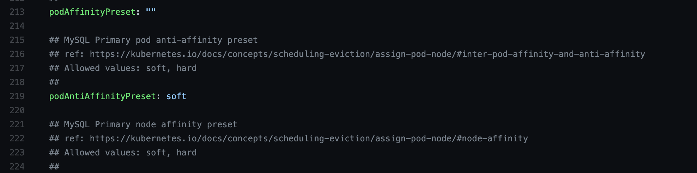
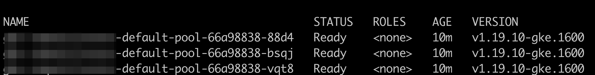
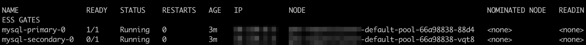
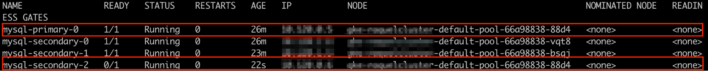
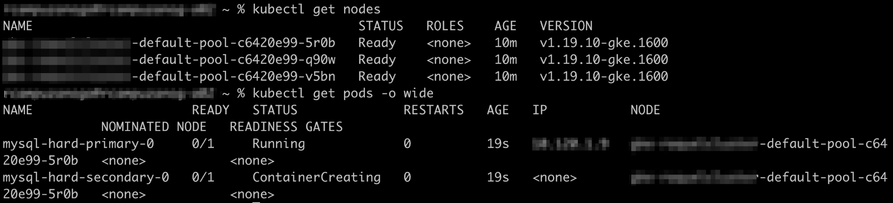
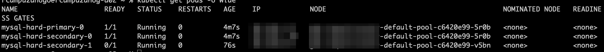

First published on https://docs.bitnami.com/tutorials/assign-pod-nodes-helm-affinity-rules/

When you install an application in a Kubernetes cluster, the [Kubernetes scheduler](https://kubernetes.io/docs/concepts/scheduling-eviction/kube-scheduler/) decides in which nodes the application pods will be installed unless certain constraints are defined. For example, Kubernetes scheduler may decide to install application pods in a node with more available memory. This is mostly useful except when cluster administrators prefer to distribute a group of pods across the cluster in a specific manner. For this use case, they need a tool that can force Kubernetes to follow custom rules specified by the user.

Affinity rules supply a way to force the scheduler to follow specific rules that determine where pods should be distributed. To help users to implement affinity rules, Bitnami has enhanced its Helm charts by including opinionated affinities in their manifest files. Cluster administrators now only need to define the criteria to be followed by the scheduler when placing application pods in cluster nodes. They can then enable this feature via a simple install-time parameter

This tutorial will demonstrate the available affinity rules and how they can be adapted to your needs.


## Assumptions and Prerequisites

This article assumes that:
* You have a Google Cloud account. [Register for a Google Cloud account](https://cloud.google.com/free).
* You have a Kubernetes cluster running with Helm v3.x and `kubectl` installed. [Learn more about getting started with Kubernetes and Helm using different cloud providers](https://docs.bitnami.com/kubernetes/).

{} 
**Note**: This guide uses a Kubernetes cluster created in GKE. These steps are the same for all Kubernetes engines. They don't work, however, in Minikube, since with Minikube you only can create single-node clusters. 
{}

## How Affinity Rules Work in Bitnami Helm Charts

All Bitnami infrastructure solutions available in the [Bitnami Helm charts catalog](https://github.com/bitnami/charts/tree/master/bitnami) now include pre-defined affinity rules exposed through the `podAffinityPreset` and `podAntiAffinitypreset` parameters in their `values.yml` file:



Pod affinity and anti-affinity rules allow you to define how the scheduler should behave when locating application pods in your cluster eligible nodes. Depending on the option you choose, the scheduler will behave as follows:

* `podAffinityPreset` - Using the `podAffinity` rule, the scheduler will locate a new pod on the same node where other pods with the same label are located. This approach is especially helpful to group under the same node pods that meet specific pre-defined patterns.
* `podAntiAffinitypreset` - Using the `podAntiAffinity` parameter lets the scheduler locates one pod in each node. Thus, you will prevent locating a new pod on the same node as other pods are running. This option is convenient if your deployment will demand high availability.

Having the pods distributed across all nodes allows Kubernetes to ensure high availability of your cluster by keeping running the remaining nodes when one node fails.

These are the values you can set for both pod affinity and anti-affinity rules:

* **Soft** - Use this value to make the scheduler enforce a rule wherever it can be met (best-effort approach). If the rule cannot be met, the scheduler will deploy the required pods in the nodes with enough resources.
* **Hard** - Use this value to make the scheduler enforce a rule. This means that if there are remaining pods that do not comply with the pre-defined rule, they won't be allocated in any node.

Bitnami Helm charts have the `podAntiAffinity` rule with the `soft` value enabled by default. Hence, if there are not enough nodes to place one pod per node, it will leave the scheduler to decide where the remaining pods should be located.

The following section shows two different use cases of configuring `podAntiaffinity` parameter.


## Deploying a Chart Using the `podAntiAffinity` Rule

The following examples illustrate how the `podAntiAffinity` rule works in the context of the Bitnami MySQL Helm chart. They cover two use cases: installing the chart with the default `podAntiAffinity` value and changing the `podAntiAffinity` value from `soft` to `hard`.


### Use Case 1: Install the Chart with the Default `podAntiaffinity` Value

* Install the Bitnami Helm charts repository by running:

```
helm repo add bitnami https://charts.bitnami.com/bitnami 
```

* Deploy the MySQL Helm chart by executing the command below. Note that the chart will deploy the cluster with three nodes and two replicas - one primary and one secondary. To make the scheduler follow the default `podAntiAffinity` rule, set the parameter as follows:

```
helm install mysql bitnami/mysql --set architecture=replication --set secondary.replicaCount=2 --set secondary.podAntiAffinityPreset=soft 
```

* Verify the cluster by checking the nodes. Use the following command to list the connected nodes:

```
kubectl get nodes 
```

* You will see an output message like this:



Three nodes are running in the cluster.

* Check how the pods are distributed. Execute the command below:

```
kubectl get pods -o wide 
```



As expected, both the primary and the secondary pods are in different nodes.

To verify how the scheduler acts when the _soft_ value is defined, scale up the cluster by setting the number of secondary replicas to three instead of one. Thus, the resulting number of pods will be four, instead of two.

* To scale the cluster, use the command below:

```
kubectl scale sts/mysql-secondary --replicas 3 
```

* Check the pods by running again the `kubectl get pods` command. The `soft` value left the scheduler to locate the remaining pod that didn't comply with the "one pod per node" rule:



Note that two pods are running in the same node.


### Use Case 2: Change the `podAntiAffinity` Value from Soft to Hard

To try the `hard` type of the `podAntiAffinity` rule, deploy the chart again by changing the `secondary.podAntiAffinityPreset` value from `soft` to `hard` as shown below. The chart will deploy the cluster with three nodes and two replicas - one primary and one secondary.

```
helm install mysql-hard bitnami/mysql --set architecture=replication --set secondary.replicaCount=2 --set secondary.podAntiAffinityPreset=hard
```

* Check the nodes and the pods by running the `kubectl get nodes` and the `kubectl get pods –o wide` commands:




Both the primary and secondary pods are running in the same node.

To verify how the scheduler acts when the `hard` value is defined, scale up the cluster by setting the number of secondary replicas to three instead of one. Thus, the resulting number of pods will be four, instead of two.

* Scale up the cluster by executing the command below:

```
kubectl scale sts/mysql-hard secondary --replicas 3 
```

* When checking the pods, you will see that the scheduler has ignored the "one pod per node" rule and also located only as many pods as there are nodes. The fourth pod was not deployed as there are only three nodes available.



The `podAntiAffinity` rule is an easy way to control how application pods will be distributed across the cluster nodes when installing a Helm chart. Deploy your favorite Bitnami applications and enable this feature via a simple install-time parameter.


## Useful Links

To learn more about the topics discussed in this article, use the links below:

* [Bitnami Helm charts catalog](https://github.com/bitnami/charts)
* [Bitnami Helm charts documentation](https://docs.bitnami.com/kubernetes/)
* [Kubernetes scheduler documentation](https://kubernetes.io/docs/concepts/scheduling-eviction/kube-scheduler/)
* [Kubernetes pod affinity documentation](https://kubernetes.io/docs/concepts/scheduling-eviction/assign-pod-node/)