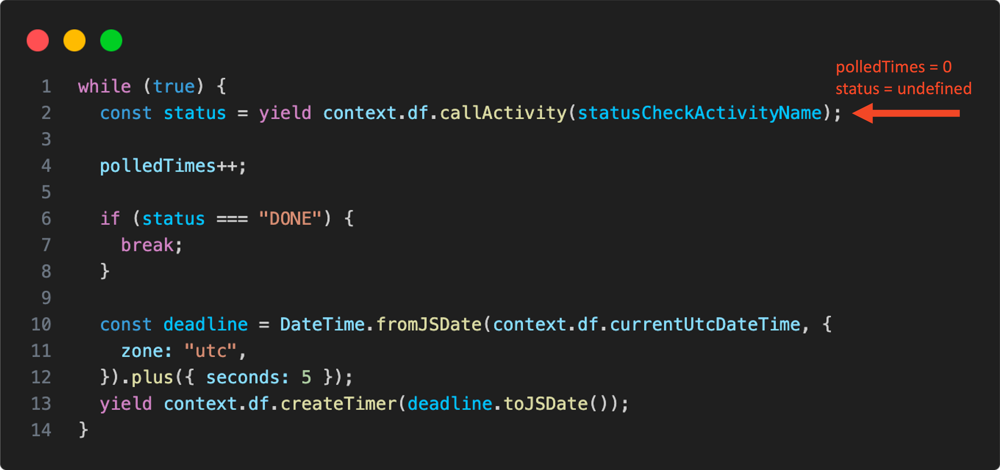
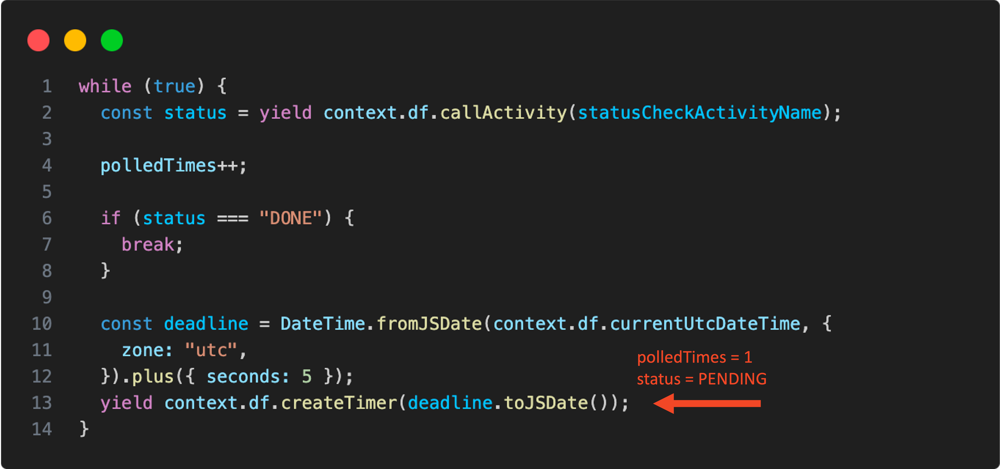
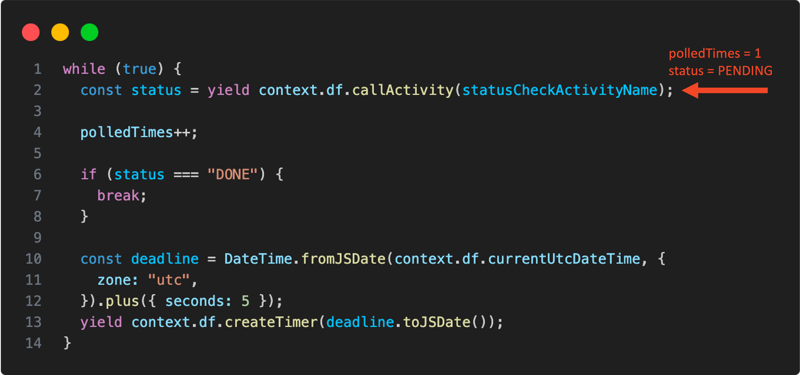
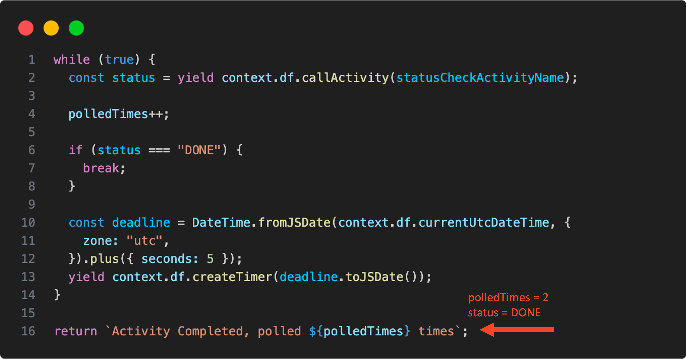
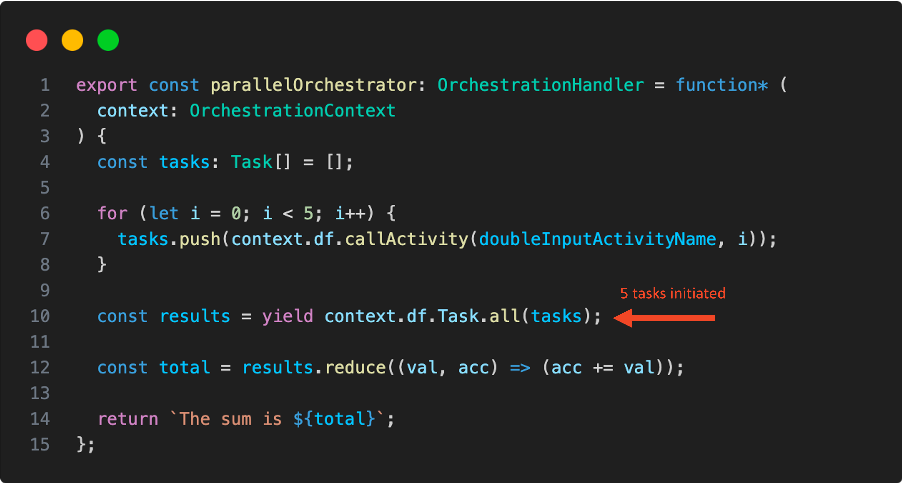
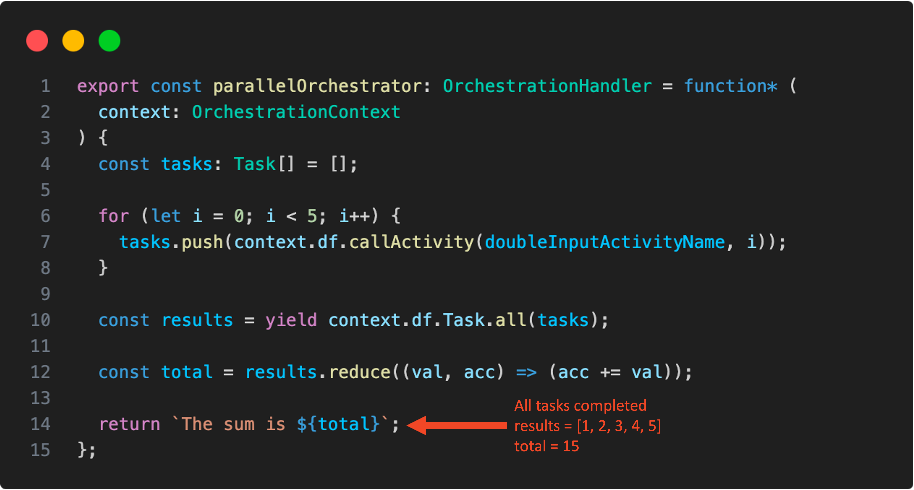

Azure Durable Functions offer an excellent way for you to implement stateful workflows and orchestrations in the cloud. In this article, we will guide you through 2 implementation scenarios while focusing on unit testing.

## When Should You Use Durable Functions?

Regular Azure functions are a perfect choice for running stateless logic. However, there are situations when you need to handle more complex workflows, such as those requiring manual approval, chaining multiple functions together, or performing polling. You can explore other use cases in the official [Azure Docs](https://learn.microsoft.com/en-us/azure/azure-functions/durable/durable-functions-overview?tabs=in-process%2Cnodejs-v3%2Cv1-model&pivots=csharp#chaining).

### Understanding Generator Functions

Generator functions are a special type of function that can be paused and resumed during execution. In languages like JavaScript, generator functions use a unique syntax (`function*`) and the `yield` keyword to control value production.

For more detailed information on generator functions, check out [this article](https://javascript.info/generators).

Durable Functions leverage generator functions as orchestrator functions, particularly in scenarios involving asynchronous tasks.

## Implementing Polling via a Monitor Pattern

In this scenario, you will create an API that transforms an asynchronous operation into a synchronous one.

For this example, we will be using the v4 programming model. You can find details on migrating from v3 to v4 in [this article](https://learn.microsoft.com/en-us/azure/azure-functions/durable/durable-functions-node-model-upgrade?tabs=nodejs-v4&pivots=programming-language-javascript).

To achieve this, we will use a durable function that uses an [Azure activity function](https://learn.microsoft.com/en-us/azure/azure-functions/durable/durable-functions-types-features-overview#activity-functions) to continuously monitor an operation's status until it completes (or the orchestrator client times out).

```typescript
export const monitorOrchestrator: OrchestrationHandler = function* (
  context: OrchestrationContext
) {
  let polledTimes = 0;

  // 1. Infinite loop until completion
  while (true) {
    // 2. Invoke activity function to check status
    const status = yield context.df.callActivity(statusCheckActivityName);

    polledTimes++;

    if (status === "DONE") {
      // 3. Break out of the loop once it's completed
      break;
    }

    const deadline = DateTime.fromJSDate(context.df.currentUtcDateTime, {
      zone: "utc",
    }).plus({ seconds: 5 });
    // 4. While not completed pause the execution for 5 seconds
    yield context.df.createTimer(deadline.toJSDate());
  }

  return `Activity Completed, polled ${polledTimes} times`;
};
```


Here's how it works:

1. We employ an infinite loop since we are polling until completion or timeout. This loop is eventually exited once the task is completed.

2. We use an activity function to check the status. This is the first `yield` statement. The orchestrator function pauses execution here until a value is yielded by the status check function.

3. If the status is `DONE`, we break out of the loop and complete the orchestration.

4. While the status is not 'DONE' and loop continues, we create a timer and use `yield` to pause execution until the timer elapses.

## Unit Testing of the Monitor Orchestrator Function

To test the orchestrator function, you will call the `monitorOrchestrator` function with a mock `OrchestrationContext`. This provides an instance of a `Generator` that you can use to execute the business logic by calling the `next()` method.

```typescript
describe("monitor orchestrator", () => {
  it("polls 2 times until status is DONE", () => {
    const mockContext: OrchestrationContext = {
      df: {
        callActivity: jest.fn(),
        currentUtcDateTime: Date.now(),
        createTimer: jest.fn()
      },
    } as unknown as OrchestrationContext;

    // 1. creates the generator function
    const generator = monitorOrchestrator(mockContext);

    let result: IteratorResult<Task, unknown>
    // 2. runs until the first yield
    result = generator.next() 
    expect(result.done).toBe(false)
    
    // 3. yields the status check value to be PENDING
    result = generator.next('PENDING')
    expect(result.done).toBe(false)
    
    // 4. yields the timer
    result = generator.next()
    expect(result.done).toBe(false)
    
    // 5. yields the status check value to be DONE
    result = generator.next('DONE')
    expect(result.done).toBe(true)


    expect(result.value).toEqual('Activity Completed, polled 2 times')
  });
});
```

Let's walk through the steps in the test and how they execute different parts of the generator function:

**Step 1:** First, you create the generator function. Note that the function code hasn't been executed yet.

**Step 2:** This step executes the function code until it reaches the first `yield` statement. In this case, it's the first invocation of the status check activity.

<p align="center">

</p>

**Step 3:** Here, you call `next()` on the generator, passing a value of `PENDING`. This resumes execution from the previous step, giving `status` a yielded value of `PENDING`. The function continues until it encounters the next `yield` statement, which is the timer.

<p align="center">

</p>

**Step 4:** You call `next()` again on the generator, this time without parameters, as there's no need to yield any values from `createTimer()`. The function proceeds with execution. Since we're still in the while loop, we'll pause again at the `yield` statement of `callActivity()`, with an increased `polledTimes`. Note that the value of `status` remains `PENDING` from the previous loop.

<p align="center">

</p>

**Step 5:** Now, you call `next()` with a yielded value of `DONE`. This makes the function break out of the loop and completes the execution. This completes the test, passing the final assertion.

<p align="center">

</p>

## Implementing Parallel Function Execution

In this scenario, we have an orchestrator that initiates multiple tasks running in parallel. Each task doubles the input value and returns it as a result. The orchestrator then waits for all tasks to complete, adds their results, and returns the sum.

```typescript
export const parallelOrchestrator: OrchestrationHandler = function* (
  context: OrchestrationContext
) {
  const tasks: Task[] = [];

  // 1. Start all parallel activities
  for (let i = 0; i < 5; i++) {
    tasks.push(context.df.callActivity(doubleInputActivityName, i));
  }

  // 2. Wait for all parallel activities to complete
  const results = yield context.df.Task.all(tasks);

  // 3. Process the results
  const total = results.reduce((val, acc) => (acc += val));

  return `The sum is ${total}`;
};
```

Here's the breakdown:

1. The orchestrator starts 5 tasks by calling `callActivity()` in a loop, assigning each of them an initial input from 0 to 4. Notice that we don't use the `yield` keyword when starting the tasks, allowing them to run in parallel.

2. We pass the array of tasks to `Task.all()` and use `yield` on it. This pauses the durable function's execution until all tasks are completed. Their results are assigned to the `results` variable, similar to how `Promise.all()` works.

3. Once all tasks are completed, the sum of the results is calculated and stored in `total`, which is returned later.

## Unit Testing of Parallel Function Execution

To test this scenario, follow a similar approach as in the previous example. Create the generator function and use `next()` to provide values to the yield statements. In this case, there's only one `yield` statement pausing until all tasks are completed.

```typescript
describe("parallel orchestrator", () => {
  it("calculates sum of all parallel activities results", () => {
    const mockContext: OrchestrationContext = {
      df: {
        callActivity: jest.fn(),
        Task: {
          all: jest.fn(),
        },
      },
    } as unknown as OrchestrationContext;

    const generator = parallelOrchestrator(mockContext);
    
    // 1. Runs until the Task.all() yield
    generator.next();
    expect(mockContext.df.callActivity).toHaveBeenCalledTimes(5);

    // 2. Yields Task.all() with an array of results
    const result = generator.next([1, 2, 3, 4, 5]);
    expect(result.value).toEqual("The sum is 15");
    expect(result.done).toBe(true);
  });
});
```

**Step 1:** After creating the generator function, this step executes the function code until it reaches the first `yield` statement, which pauses until all tasks are complete.

<p align="center">

</p>

**Step 2:** Here, you call `next()` again to yield the return values of all 5 tasks, which are `[1, 2, 3, 4, 5]`. This array is used to calculate the sum, resulting in the final output string, "_The sum is 15_".

<p align="center">

</p>

## Code Repository

You can find all the code used in this article on [GitHub](https://github.com/anavarromartin/azure-durable-functions-examples).

Now, you're well-equipped to implement and test Azure Durable Functions in TypeScript. Happy coding!
