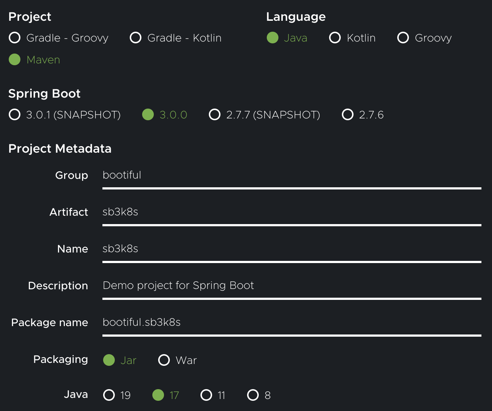

With the update of [Spring Boot 3.0](https://spring.io/blog/2022/11/24/spring-boot-3-0-goes-ga) there is [now support for building Spring Boot-powered GraalVM native images ](https://docs.spring.io/spring-boot/docs/3.0.0/reference/html/native-image.html#native-image) in the official Kubernetes Java client!

You probably know what [Spring Boot](https://docs.spring.io/spring-boot/docs/current/reference/html/getting-started.html) is, but in case you’re unfamiliar with it, it “helps you to create stand-alone, production-grade Spring-based applications that you can run”. It’s the application development sensation that’s sweeping the nation! The trouble is with Java. Java is fast, very fast, but nobody would argue that it’s small. And in the age of serverless, of a metered cloud infrastructure consumption, of global warming and carbon emissions, etc., it *pays* to be small. So the question is: how do we make Spring Boot applications, running on Java, *small*? Enter GraalVM, originally a research project from Oracle Labs. It’s a drop in replacement for OpenJDK, but it comes with some extra utilities, one of which is the `native-image` compiler. The native image compiler enforces a closed world view of your application. It assumes that the classpath, resources, and types present at compile time are the only types that will be present at runtime, and so it throws *everything* else out the window. The result is a very small binary that starts in tens of milliseconds and takes tens of megabytes of RAM. And, if you should try to do things like reflection, JNI, resource loading, object proxies, etc., then that very small binary that starts in tens of milliseconds and takes tens of megabytes of RAM will *also* crash, hard. Remember: there’s a closed world assumption and you just violated it by trying to work with types and resources that GraalVM could not anticipate in its compile time static analysis that you’d need at runtime. You can make this stuff work, but you’ll need to furnish configuration - typically configuration files ending in `.json` - to the compiler telling it where and how you intend to do these things. As you can imagine, this gets very tedious, very quickly. 

Spring Boot 3 ships with a new ahead-of-time (AOT) compilation engine that transforms Spring Boot applications, rendering the configuration files out for you, automatically. These then get fed into the `native-image` compiler, resulting in super small binaries without the fuss.  

I said automatically, but that’s not quite true. It does the work automatically, most of the time. But there may arise some situations where you will do some of these things without Spring Boot being aware of it. You need to account for those situations. Spring Framework ships with a new component model that’s designed to make it trivial for application developers and library developers alike to support exceptional use cases. Which brings us back around to the just-released Kubernetes Java client 17.0.0 release: it ships with support for turning any code using the Kubernetes Java client with Spring Boot 3.0 into a [GraalVM native image](https://www.graalvm.org/22.0/reference-manual/native-image/)! 

Let’s take a look at how to use this!

If this is your first time using Java, let alone Java with Kubernetes, install [`sdkman`](https://sdkman.io/). You’ll need to use GraalVM 22.3 or later. You’ll also need a build tool, so install Apache Maven or Gradle. We’ll be using Apache Maven in this article. 

```shell
sdk install java 22.3.r17-grl && sdk default java 22.3.r17-grl
sdk install maven
```

First, we’re going to Josh Long’s second favorite place on the internet: [start.spring.io](https://start.spring.io/). We want to use Maven as the project and Spring Boot 3.0 or later. Let’s give it the group name `bootiful` and the artifact name `sb3k8s`.




Unzip the file and open it up in the IDE of your choice.

All you need to do to use the Kubernetes Java client with the new AOT integration is to add the following dependency to your `pom.xml`:

```xml
       <dependency>
           <groupId>io.kubernetes</groupId>
           <artifactId>client-java-spring-aot-integration</artifactId>
           <version>17.0.0</version>
           <optional>true</optional>
       </dependency>
```

Time for Java. Open up `Sb3k8sApplication.java`. Let’s just do something simple here and list out all running services in the default namespace. There should at least be the Kubernetes service.

```shell
kubectl get services
NAME         TYPE        CLUSTER-IP   EXTERNAL-IP   PORT(S)   AGE
kubernetes   ClusterIP   10.48.0.1    <none>        443/TCP   508d
```

Under `main`, we need to add a bean for `CoreV1Api` since that’s where services reside. 

Note: If you’re ever unsure what API group a resource belongs in, you can use the following command:
```
kubectl api-resources
```

Update `main` to the following so that it blocks until you stop the process. We will use this to check the resident set size (RSS) of a given process (which is how much memory (RAM) is being used).

```java
   public static void main(String[] args) throws InterruptedException {
       SpringApplication.run(Sb3k8sApplication.class, args);
       Thread.currentThread().join();
   }
```

First add the following imports to the top of the class:
```java
import org.springframework.context.annotation.Bean;

import io.kubernetes.client.openapi.apis.CoreV1Api;
```

Now we need to add the bean for `CoreV1Api` inside the `Sb3k8sApplication` class.
```java
   @Bean
   CoreV1Api coreV1Api(ApiClient apiClient) {
       return new CoreV1Api(apiClient);
   }
```

Now we need to add the following imports to create a Spring bean that listens for an application startup event and then talks to the Kubernetes API.
```java
import org.springframework.boot.context.event.ApplicationReadyEvent;
import org.springframework.context.ApplicationListener;

import io.kubernetes.client.openapi.ApiClient;
import io.kubernetes.client.openapi.ApiException;
```

We’re using the Kubernetes Java API’s `listNamespacedService` to list up to 10 services in the `default` namespace.

```java
   @Bean
   ApplicationListener<ApplicationReadyEvent> readyEventApplicationListener(CoreV1Api coreV1Api) {
       return event -> {
           try {
               coreV1Api
               .listNamespacedService("default", "true", false, "", "", "", 10, "", "", 100, false)
               .getItems()
               .forEach( svc -> System.out.println( "Service: " + svc.toString()));
           }
           catch (ApiException e) {
               throw new RuntimeException(e);
           }
       };
   }
```

Hit the run button in your IDE.

You should at the very least see the default Kubernetes service if you don’t have anything other services:
```json
class V1Service {
    apiVersion: null
    kind: null
    metadata: class V1ObjectMeta {
        annotations: null
        creationTimestamp: 2021-07-22T21:18:48Z
        deletionGracePeriodSeconds: null
        deletionTimestamp: null
        finalizers: null
        generateName: null
        generation: null
        labels: {component=apiserver, provider=kubernetes}
        managedFields: [class V1ManagedFieldsEntry {
            apiVersion: v1
            fieldsType: FieldsV1
            fieldsV1: {f:metadata={f:labels={.={}, f:component={}, f:provider={}}}, f:spec={f:clusterIP={}, f:ports={.={}, k:{"port":443,"protocol":"TCP"}={.={}, f:name={}, f:port={}, f:protocol={}, f:targetPort={}}}, f:sessionAffinity={}, f:type={}}}
            manager: kube-apiserver
            operation: Update
            subresource: null
            time: 2021-07-22T21:18:48Z
        }]
        name: kubernetes
        namespace: default
        ownerReferences: null
        resourceVersion: 155
        selfLink: null
        uid: a0762bb7-3795-463e-b30c-7db98d601244
    }
    spec: class V1ServiceSpec {
        allocateLoadBalancerNodePorts: null
        clusterIP: 10.48.0.1
        clusterIPs: [10.48.0.1]
        externalIPs: null
        externalName: null
        externalTrafficPolicy: null
        healthCheckNodePort: null
        internalTrafficPolicy: Cluster
        ipFamilies: [IPv4]
        ipFamilyPolicy: SingleStack
        loadBalancerClass: null
        loadBalancerIP: null
        loadBalancerSourceRanges: null
        ports: [class V1ServicePort {
            appProtocol: null
            name: https
            nodePort: null
            port: 443
            protocol: TCP
            targetPort: 443
        }]
        publishNotReadyAddresses: null
        selector: null
        sessionAffinity: None
        sessionAffinityConfig: null
        type: ClusterIP
    }
    status: class V1ServiceStatus {
        conditions: null
        loadBalancer: class V1LoadBalancerStatus {
            ingress: null
        }
    }
}
```

Great, that works!

Take a look at how long it said it took to run the application and keep that in mind for when we run the native image.

Here’s a script called `rss.sh` that I use to capture the resident set size (RSS) of a given process. So, assuming a UNIX-like shell environment, put this in a file called `rss.sh`:

```shell
#!/usr/bin/env bash  
PID=${1}
RSS=`ps -o rss ${PID} | tail -n1`
RSS=`bc <<< "scale=1; ${RSS}/1024"`
echo "${PID}: ${RSS}M"
````

Spring Boot prints out the process identifier (PID) towards the top of the application’s logs, near the ASCII art banner. Grab it and then in another terminal, feed it to this script after making it executable:

```shell
chmod +x rss.sh
rss.sh <YOUR_APP_PID>
```


Mine says
```
81941: 144.7M
```

Remember yours for later.

Run `ctrl-c` to stop the process.

Now let’s create a native image!

```shell
mvn -Pnative -DskipTests native:compile
```

Once that finishes building, we can run the binary it created.
```shell
./target/sb3k8s
```

If we take a look at how long it took to run, it is significantly faster! And, best of all, if you measure the resident set size (RSS), the memory footprint is markedly smaller! 

```shell
rss.sh <YOUR_APP_PID>
```
On my machine, it prints out: 

```
67796: 64.8M
```

Congrats on building a Kubernetes Client with Spring Boot 3’s new AOT engine and GraalVM native images!