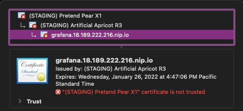
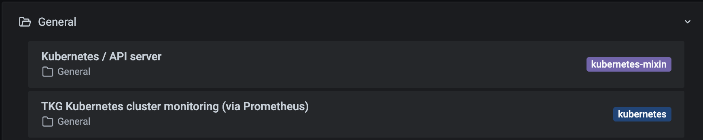

{} This guide leverages the cert-manager [official documentation](https://cert-manager.io/docs/). Refer there if you need a deeper dive. {}

## What is cert-manager?

TLS certificates are a popular way for clients and servers to authenticate (prove who they are) to each other. For instance, each time you connect to an address with the `https://` protocol, the server (the website) presents to the client (your web browser) its TLS certificate—a bit like an identity document proving "yes, I'm really `www.yourbanksite.com`, and you're not about to send your precious banking login information to a malicious person trying to impersonate your banking website."

There is also mutual TLS (mTLS), when both the client and the server present a certificate to each other. While rarely used in web browsers, this method is frequently used by services that need to authenticate to each other in a secure fashion. For instance, in Kubernetes, each kubelet (the Kubernetes agents that run on every node of the cluster) authenticates to the API server using mTLS. This means that when new nodes join the cluster, Kubernetes needs to issue them their own certificate. Furthermore, since certificates have an expiration date, they need to be renewed regularly. Bottom line: you need a way to automatically issue and renew these certificates.

The Kubernetes API has a [`CertificateSigningRequest`](https://kubernetes.io/docs/reference/access-authn-authz/certificate-signing-requests/) resource to automate certificate issuance and renewal, but currently it is mostly intended for Kubernetes’ internal use. It doesn't offer a lot of flexibility otherwise. This is where cert-manager shines. It supports numerous ways of generating certificates. It can be used as a standard certificate authority, but it can also use external authorities like [HashiCorp Vault](https://www.vaultproject.io), services like [Let’s Encrypt](https://letsencrypt.org), or it can generate self-signed certificates. Even better, all these methods can be supported side by side, so that a single cert-manager install can support everyone's TLS needs on the cluster.

Another strong point of cert-manager is its deep integration with other Kubernetes resources. For instance, if you need a certificate for a web application exposed through an Ingress resource, you can ask cert-manager to obtain and configure that certificate by adding an annotation to that Ingress resource. Since tools like Carvel, Helm, or Kustomize almost always expose hooks to add annotations to the resources that they provision, it gives us a straightforward method to enable `HTTPS` on your apps and services without having to fiddle with custom resources, for instance.

Alright, you're sold on cert-manager. How do you get started with it? In the following tutorial, you're going to use it together with Contour to expose a web app (Grafana) over `HTTPS`.

## Prerequisites

* A Kubernetes cluster – This guide assumes you are using a [VMware Tanzu Community Edition](https://tanzucommunityedition.io/) cluster. It has all the software you will be using as packages. However, guidance will be provided for other cluster types.
* [Docker](https://docs.docker.com/get-docker/) installed –  or have a tool like `getent` to get an IP address from a load balancer.

### Optional: For a non–Tanzu Community Edition Cluster

If you’re not using a Tanzu Community Edition cluster, you can still use its package repository with your cluster. To install it that way, you will need the Carvel tool, [kapp-controller](https://carvel.dev/kapp-controller/). 

To install `kapp-controller`, follow the [Getting Started with kapp-controller guide](/guides/kubernetes/kapp-controller-gs/) and use the [Package Consumption section](/guides/kubernetes/kapp-controller-gs/) for the packages you install in this guide.

## Install cert-manager

cert-manager is available within Tanzu Community Edition and will often be one of the first packages you install in a cluster.

1. Add the package repository.

    ```sh
    tanzu package repository add tce-repo --url projects.registry.vmware.com/tce/main:stable --namespace tanzu-package-repo-global
    ```

2. Verify it is there and has reconciled.

    ```sh
    tanzu package repository list --namespace tanzu-package-repo-global
    ```

3. Now you can see all of the available packages.

    ```sh
    tanzu package available list
    ```

4. You will need to see what versions of cert-manager are available.

    ```
    tanzu package available list cert-manager.community.tanzu.vmware.com
    ```

5. Pick the latest version, replace it in the command, and install it.

    ```sh
    tanzu package install cert-manager \
    --package-name cert-manager.community.tanzu.vmware.com \
    --version <VERSION>
    ```

6. Now you can see that you have cert-manager installed.

    ```sh
    tanzu package installed list
    ```

## Ingress Controller

The Kubernetes [Ingress](https://kubernetes.io/docs/concepts/services-networking/ingress/) is an API object that provides routes for traffic (`HTTP` and `HTTPS`) from outside the cluster to services within the cluster.

To satisfy an Ingress, you need an [Ingress Controller](https://kubernetes.io/docs/concepts/services-networking/ingress-controllers/). Tanzu Community Edition has a package for the [Contour](https://tanzu.vmware.com/developer/guides/service-routing-contour-to-ingress-and-beyond/) Ingress Controller.

The Grafana package, which you will be installing in the next section, needs an Ingress Controller. Additionally, you will need this Ingress Controller for enabling TLS later.

1. List the available packages in your repository. 

    ```sh
    tanzu package available list contour.community.tanzu.vmware.com
    ```

2. Install the latest version of Contour.

    ```sh
    tanzu package install contour \
    --package-name contour.community.tanzu.vmware.com \
    --version <VERSION>
    ```

## Grafana

You will use the Grafana dashboard for your website since it is a built-in package for Tanzu Community Edition.

1. List available packages in your repository.

    ```sh
    tanzu package available list grafana.community.tanzu.vmware.com
    ```

2. Install [Grafana](https://grafana.com/) to get a metrics dashboard. You will configure Grafana to serve `HTTPS` using a Certificate object. 

    ```sh
    tanzu package install grafana \
    --package-name grafana.community.tanzu.vmware.com \
    --version <VERSION>
    ```

3. Wait for the load balancer for Grafana to be ready. Run `Ctrl-C` to terminate the command when the load balancer is ready.

    ```sh
    kubectl -n grafana get service grafana -w
    ```

5. Go to the `EXTERNAL-IP` path in your web browser. 

    ```sh
    kubectl -n grafana get service grafana -o jsonpath='{.status.loadBalancer.ingress[0].hostname}'
    ```

    To log in, the username and password are just `admin` by default. If you click on the set of four squares, you can go to the existing dashboards and see data from Prometheus.

## Ingress

First, you need an Ingress. This guide will use `nip.io`, which provides wildcard DNS for any IP address for the domain. If you’d like to use your own domain, follow the instructions in the guide [Installing Harbor on Kubernetes with Project Contour, Cert Manager, and Let’s Encrypt](https://tanzu.vmware.com/developer/guides/harbor-gs/#set-up-dns) to set up DNS.

1. If you’re using `nip.io` (or another similar site), you’ll need to get the IP address for the Envoy load balancer.

    ```sh
    LB=$(kubectl -n projectcontour get svc envoy -o jsonpath='{.status.loadBalancer.ingress[0].hostname}')
    echo $LB
    LBIP=$(docker run alpine getent hosts $LB | awk '{print $1}')
    echo $LBIP
    ```

2. Now create the Ingress. If you’re using your own domain, you’d substitute it here instead of `${LBIP}.nip.io`.

    ```sh 
    kubectl -n grafana create ingress grafana --class=contour  "--rule=grafana.${LBIP}.nip.io/*=grafana:80,tls=grafana.${LBIP}.nip.io"
    ```

3. Do a `get` on the Ingress. 

    ```sh
    kubectl -n grafana get ingress grafana -o yaml
    ```

    It should look something like this.

    ```yaml
    apiVersion: networking.k8s.io/v1
    kind: Ingress
    metadata:
    creationTimestamp: "2021-10-29T01:39:08Z"
    generation: 1
    name: grafana
    namespace: grafana
    resourceVersion: "136075"
    uid: 930c3017-bbc9-488c-a6f4-01fa82011d59
    spec:
    ingressClassName: contour
    rules:
    - host: grafana.18.189.222.216.nip.io
        http:
        paths:
        - backend:
            service:
                name: grafana
                port:
                number: 80
            path: /
            pathType: Prefix
    tls:
    - hosts:
        - grafana.18.189.222.216.nip.io
        secretName: grafana.18.189.222.216.nip.io
    status:
    loadBalancer:
        ingress:
        - hostname: a0a28d9b7f348457bafc05dd74e4e992-1884336594.us-east-2.elb.amazonaws.com
    ```

1. Go to the following host path in a web browser to reach Grafana.

    ```sh
    INGRESS=$(kubectl -n grafana get ingress grafana -o jsonpath='{.spec.rules[0].host}')
    echo $INGRESS
    ```

    You will see the following where it says Not Secure.

    

Next, you will make it so you can use `HTTPS`.

## Issuers and certificates

OK, now back to cert-manager.

In order to issue certificates, you need to [configure an Issuer](https://cert-manager.io/docs/configuration/). Some of the common types are `SelfSigned`, CA, and ACME. In this guide, you will be using an ACME (Automated Certificate Management Environment) Issuer. To ensure the client actually owns the domain that the client is requesting a certificate for, the ACME CA server has `HTTP01` and `DNS01` challenges. To learn more about these challenges, check out the [cert-manager docs](https://cert-manager.io/docs/configuration/acme/#solving-challenges).

Create an ACME Issuer using [Let’s Encrypt](https://letsencrypt.org/), a nonprofit Certificate Authority.

Let’s Encrypt recommends starting with the [staging](https://letsencrypt.org/docs/staging-environment/https://letsencrypt.org/docs/staging-environment/) server to verify you have things right first and avoid rate limiting. 

This Cluster Issuer uses a single challenge `HTTP01` solver with Contour, your Ingress Controller. 

Check out the docs to see more about [Issuer Configuration](https://cert-manager.io/docs/configuration/). Here is an example of a resource definition for the Let’s Encrypt staging issuer.

1. Replace the value of `$CERT_EMAIL` with your own email address.

    ```sh
    CERT_EMAIL=”user@example.com”
    ```

2. Create a file called `cm-clusterissuer-staging.yaml` with the following.

    ```sh
    cat <<EOF > cm-clusterissuer-staging.yaml
    apiVersion: cert-manager.io/v1
    kind: ClusterIssuer
    metadata:
    name: letsencrypt-staging
    spec:
    acme:
    # Remember to update this if you use this manifest to obtain real certificates :)
    email: $CERT_EMAIL
    server: https://acme-staging-v02.api.letsencrypt.org/directory
    privateKeySecretRef:
        name: issuer-letsencrypt-staging
    solvers:
    - http01:
        ingress:
            class: contour
    EOF
    ```

3. Create the issuer.

    ```sh
    kubectl apply -f cm-clusterissuer-staging.yaml
    ```

4. Take a look and see the secret that is created.

    ```sh
    kubectl -n cert-manager get secret issuer-letsencrypt-staging -o yaml
    ```

5. Once you have an Issuer configured properly, you can create a Certificate object.
Certificates specify a `secretName` that cert-manager will either create or update with your new crypto identity. In your case, it’ll be the secret name in the Ingress you created, which is the value of `$INGRESS`.

6. Check the secret name.

    ```sh
    kubectl -n grafana get ingress grafana -o jsonpath='{.spec.tls[0].secretName}'
    ```

7. Create a Certificate object by creating a file called `cm-certificate-staging.yaml` with the following.

    ```sh
    cat << EOF > cm-certificate-staging.yaml
    apiVersion: cert-manager.io/v1
    kind: Certificate
    metadata:
    name: $INGRESS
    namespace: grafana
    spec:
    secretName: $INGRESS
    dnsNames:
    - $INGRESS
    issuerRef:
    name: letsencrypt-staging
    kind: ClusterIssuer
    EOF
    ```

8. Make sure that it filled in the names.

    ```sh
    cat cm-certificate-staging.yaml
    ```

9. Apply the file.

    ```sh
    kubectl apply -f cm-certificate-staging.yaml
    ```

    {} 
    You could instead add an annotation, and the certificate would be created for you.

    kubectl annotate ingress grafana -n grafana \
      "cert-manager.io/cluster-issuer=letsencrypt-staging"
    {}

10. Wait for the certificate to be ready. Run `Ctrl-C` to terminate it when it’s ready.

    ```sh
    kubectl get certificate $INGRESS -w -n grafana
    ```

11. You can see the secret in the default namespace.

    ```sh
    kubectl get secret | grep grafana
    ```

12. Now, back in your web browser, change your URL to be `https://` instead. You should see something similar to this where it issued a certificate, but it’s not valid. This is expected as you are still using the Let’s Encrypt staging issuer. 

    
    

13. Create another `ClusterIssuer`, but this time with the production server.

    ```sh
    cat <<EOF > cm-clusterissuer-prod.yaml
    apiVersion: cert-manager.io/v1
    kind: ClusterIssuer
    metadata:
    name: letsencrypt-prod
    spec:
    acme:
    # Remember to update this if you use this manifest to obtain real certificates :)
    email: $CERT_EMAIL
    server: https://acme-v02.api.letsencrypt.org/directory
    privateKeySecretRef:
        name: issuer-letsencrypt-prod
    solvers:
    - http01:
        ingress:
            class: contour
    EOF
    ```

14. Apply the file. 

    ```sh
    kubectl apply -f cm-clusterissuer-prod.yaml
    ```

15. Switch staging to prod and apply to use the prod server.

    ```sh
    cat << EOF > cm-certificate-prod.yaml
    apiVersion: cert-manager.io/v1
    kind: Certificate
    metadata:
    name: $INGRESS
    namespace: grafana
    spec:
    secretName: $INGRESS
    dnsNames:
    - $INGRESS
    issuerRef:
    name: letsencrypt-prod
    kind: ClusterIssuer
    EOF
    ```

16. Apply the file.

    ```sh
    kubectl apply -f cm-certificate-prod.yaml
    ```

17. Refresh your browser. Your HTTPS connection will be secure and have a valid certificate.

    
    

## Wrap-up

Congrats, you did it! 

In a nutshell, you used cert-manager to make your web page secure by using HTTPS instead of just HTTP. Here's what you just did. You...
* Installed cert-manager
* Installed Contour as your Ingress Controller
* Created a web page (Grafana)
* Created an Ingress
* Created (ACME) Issuers and Certificates using Let’s Encrypt

Now if you have your own web pages running on Kubernetes, you can make them secure as well!

Want to play around some more? Check out the next section to actually get metric data into Grafana with Prometheus and also the Resources section to learn more.

## Optional: Get metric data in Grafana

Set up [Prometheus](https://prometheus.io/) for metrics collection so you can actually see data in a dashboard in Grafana.

1. List the packages available in your repository.

    ```sh
    tanzu package available list prometheus.community.tanzu.vmware.com
    ```

2. Install Prometheus.

    ```sh
    tanzu package install prometheus \
    --package-name prometheus.community.tanzu.vmware.com \
    --version <VERSION>
    ```

2. Make sure Prometheus is up and running.

    ```sh
    kubectl -n prometheus get pods
    ```

3. Now go back to Grafana in the browser.
   
    ```sh
    echo https://$INGRESS
    ```

4. If you haven’t already logged in, the default username and password are `admin`.

5. Click on the word `General` in the top left corner

    

6. Click on the second one that mentions Prometheus.

    

    You should now see a large dashboard with a bunch of charts and data to poke around in, such as the following.

    

    You can also create your own dashboards.

## Resources

* To discover the many rich use cases cert-manager supports, check out the [official docs](https://cert-manager.io/docs/) and [tutorials](https://cert-manager.io/docs/tutorials/).
* Also, check out our guide [Installing Harbor on Kubernetes with Project Contour, Cert Manager, and Let’s Encrypt](https://tanzu.vmware.com/developer/guides/kubernetes/harbor-gs/) if you haven’t already.
* To learn more about Tanzu Community Edition and Carvel, go to [tanzucommunityedition.io](https://tanzucommunityedition.io/) and [carvel.dev](https://carvel.dev/).