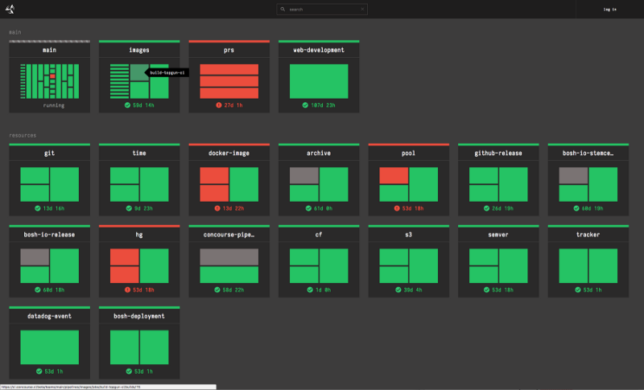
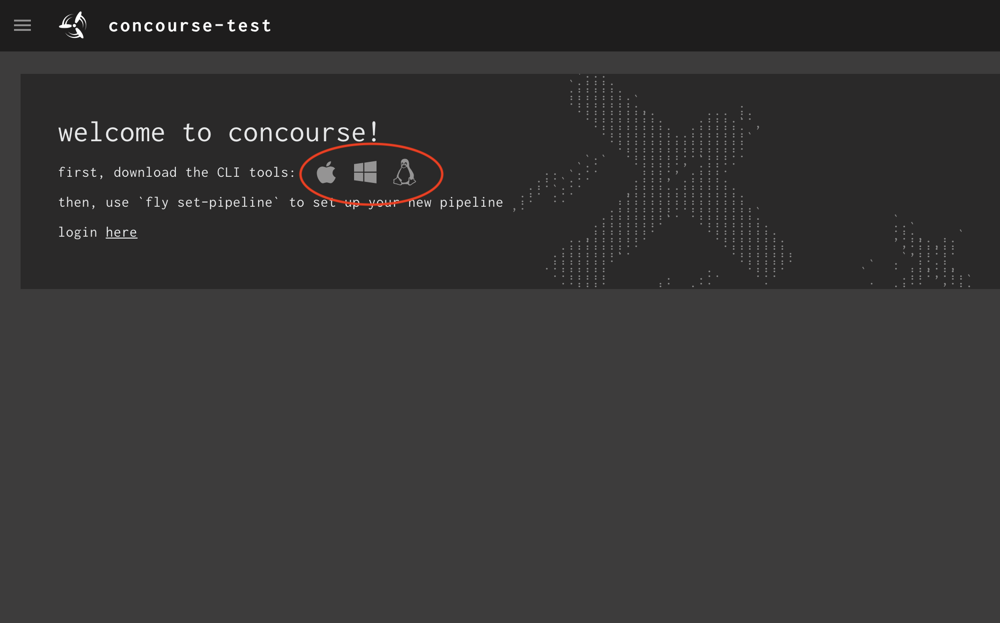
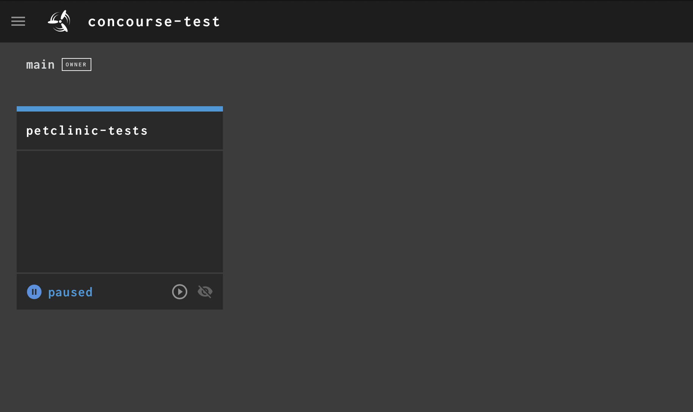
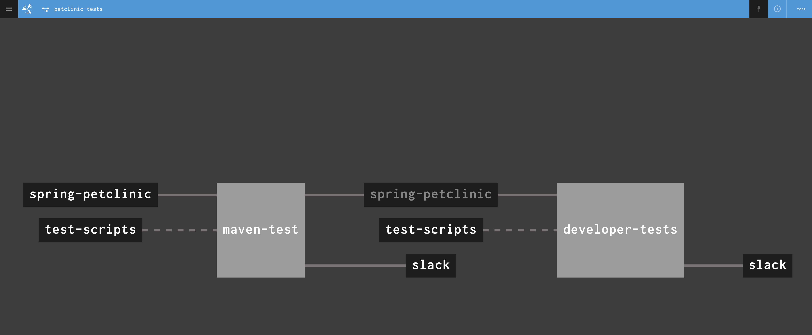

Writing code is one thing. Testing and deploying that code into production is another. Many tools exist to automate the workflow, from code commit to production release. Continuous Integration (CI), Continuous Deployment (CD), Continuous Delivery (CD again), artifact registries, code security scanners, and various other tools are used to achieve this goal. But it all starts with code integration.

How can you make sure your code is ready to be integrated into a release? Continuous Integration (CI) is not a new concept for most developers, and—once the system is implemented, it is rarely thought about deeply again. Even when it’s agreed that the current implementation is non-optimal, the CI system runs in the background, churning away. For the most part, it “just works.”

But what if there was a better system? One that was built for cloud native development paradigms on the foundation of a stateless architecture where all pipelines are built and treated as code? That’s where Concourse CI comes in.



An example Concourse CI dashboard showing the status of many pipelines

## Concourse CI
Concourse CI is a system built with a loosely coupled microservices architecture; a [database node](https://concourse-ci.org/postgresql-node.html) using PostgreSQL is the only state saved by the system. All build histories, stored pipelines, as well as user and group access privileges are stored here. 

A [web node](https://concourse-ci.org/concourse-web.html) service provides the user interface to Concourse CI. Here, developers and administrators can get a quick view of their pipelines, including their status. Broken pipelines can be easily identified so users can fix any issues. 

[Worker nodes](https://concourse-ci.org/concourse-worker.html) run each of the tasks defined in a Concourse CI pipeline. They download container images, clone git repositories, and run tests as defined. And when they are done, the testing containers are entirely ephemeral, so you get a clean test every time. 

Concourse CI pipelines are built using three different abstraction paradigms: tasks, jobs, and resources. 

[Tasks](https://concourse-ci.org/tasks.html) are the smallest unit of work Concourse CI does. They can be called to run a script or even just a single command within the testing container. Meanwhile, task output is provided as detailed log files, which can be parsed programmatically if needed.

[Jobs](https://concourse-ci.org/jobs.html) are a package of tasks. By bundling up a group of tasks as a job, Concourse CI users can make their pipeline code reusable for other systems. Such bundling provides a higher-level abstraction as pipelines get larger and more complex, which makes it easier for new team members to get up to speed.

[Resources](https://concourse-ci.org/resources.html) are what jobs perform actions on. A typical example would be a git repository; once configured, Concourse CI can pull in new code to test, run test scripts stored in git, or even push its own changes. And since everything in Concourse CI is configured as code, even resource configurations can be managed in git and reused across an organization. 

Intrigued? What follows here is a guide to get started with Concourse CI. You will deploy a small Concourse CI cluster locally on top of Kubernetes. Then you will push a new pipeline to your cluster, which will run a series of tests on a sample application, which you will clone. 

## Prerequisites
Before you get started, you will need to do a number of things.
* **Install [Docker Desktop](https://www.docker.com/products/docker-desktop) and [enable Kubernetes](https://docs.docker.com/docker-for-mac/#kubernetes)**: Other methods of deploying a local Kubernetes cluster like [KIND](https://kind.sigs.k8s.io/docs/user/quick-start/) or [Minikube](https://kubernetes.io/docs/tasks/tools/install-minikube/) may also work. Cloud-based or other production Kubernetes deployments should work, too. This guide was written using Docker Desktop; other methods will require modification of commands and have not been fully tested for use in this guide.
* **Install [Helm 3](https://helm.sh/docs/intro/install/)**: Helm 3 will be used to install Concourse CI.
* **Install [kubectl](https://kubernetes.io/docs/tasks/tools/install-kubectl/)**: This is the local client application you will use for interacting with your Kubernetes cluster. It is also how Helm will reach and interact with your cluster.
* **Secure a Slack instance**: One via which you have access to create webhooks and can post messages to a channel.
* **Set aside 15-20 minutes**: Roughly the time it will take to run through this guide. 

## Setting up
To make the installation and configuration of Concourse CI and its pipelines a little easier, a GitHub repo is provided here along with some helpful files. Download it, then `cd` into that directory. In this guide, commands will assume this as your working directory unless otherwise noted.
```
git clone https://github.com/anthonyvetter/concourse-getting-started.git && cd concourse-getting-started
```
In this repository are three directories: `install`, `pipelines`, and `test-scripts`. You will explore the `pipelines` and `test-scripts` directories later on in this guide. They contain a helpful starter pipeline you will push to our Concourse CI cluster, as well as some unit test scripts. The `install` directory contains an abbreviated version of the Concourse CI `values.yml` file, and a (very) small BASH script for exposing access to Concourse CI locally. Let’s get into that next.

Next, define a variable for your username of your GitHub account.
```
export GH_USERNAME=your-github-username
```

## Installation
Let’s get started by installing Concourse CI onto Kubernetes. This installation will be abbreviated; it’s intended for demonstration and learning purposes only. Full installation instructions using Helm can be found [via the Concourse CI team](https://github.com/concourse/concourse-chart) from which the installation instructions in this guide borrow heavily.

**Optional step**: Concourse CI installation in a local context is fairly straightforward. There are some default attributes contained in the `install/values.yml` file; leaving these as their default values will get you a working installation. That said, there are a few values that you may choose to modify in order to slightly customize your installation and experiment with Concourse CI. Modify this file to suit your needs. Comments on each line will explain their respective functions.

```
vim install/values.yml # replace vim with your text editor of choice
```

Helm 3 does not come with the chart repository for Concourse CI by default (it doesn’t include any repositories by default). So the next step is to add that to Helm and update Helm’s caches.

```
helm repo add concourse https://concourse-charts.storage.googleapis.com/ && helm repo update
```

These are pretty much the only required steps prior to install. But before you run the install command, be sure to check kubectl to ensure you are targeting the correct Kubernetes cluster. If you are using Docker Desktop, this should be your output.

```
❯ kubectl config get-contexts

CURRENT   NAME                 CLUSTER          AUTHINFO         NAMESPACE
*         docker-desktop       docker-desktop   docker-desktop
```

Further instructions for managing contexts and clusters using kubectl can be found [here](https://kubernetes.io/docs/tasks/access-application-cluster/configure-access-multiple-clusters/). 

Now you can install Concourse CI. This command will use Helm to install the cluster into the default Kubernetes namespace using our `values.yml` file. If you left this file as default, then the `-f` flag can be left out.

```
helm install concourse concourse/concourse -f install/values.yml
```

This command will complete quickly, but there will still be pods spinning up on the back end. To see the status of the system as it is being deployed, use `watch`. 

```
watch kubectl get pods
```

This will show a list of pods in the default namespace and their status. Wait until they are all in a running status.

Once all the pods are ready, Concourse CI will be up and running. But it won’t be accessible outside the cluster. To expose it, run the provided expose script.

```
./install/expose-concourse.sh
```

Running this script opens up a node port in your Kubernetes cluster and forwards it to your localhost. Assuming you left these values as default, your Concourse CI cluster should now be available at [http://localhost:8080](http://localhost:8080). 

{}
**Note**: This port-forward task is running in the foreground in your terminal. To keep UI access available, open a new terminal window or tab and cd back into your working directory.
{}

You can access the cluster by logging in using the credentials set in the `values.yml` file. If you left them as default the username and the password are both `test`. At this point, there are no pipelines set; you need to install the fly client application first.

## Installing fly
Fly is the local client application developers and Concourse CI administrators use as their primary way to interact with the cluster from the command line. To install fly, download the binary from your Concourse CI cluster directly by clicking the link appropriate for your system, as shown here. 



The Concourse CI interface upon a new installation showing download links for the fly client application

Once completed, make the binary executable, then move it into your `$PATH`. That’s it!

```
sudo chmod +x ~/Downloads/fly && mv ~/Downloads/fly /usr/local/bin
```
{}
**Note**: These commands are for use on a Macintosh computer. They will need to be modified for other platforms.
{}

Now you need to let fly know about your Concourse CI cluster. Do that with the `target` command for your fly client. Notice we are giving our Concourse CI a name of `demo`. It can be any name you want, just keep it short. Every command run using fly must include the `--target` flag to explicitly run commands on a specific cluster, so unless you `alias` it, you will be typing it a lot.

```
fly --target demo login --concourse-url http://127.0.0.1:8080 -u test -p test
```

Then, to ensure compatible versions of Concourse CI and fly are running, use the `sync` command.

```
fly -t demo sync
```

Notice you can abbreviate `--target` with `-t`, making commands shorter to type. There are many abbreviations in fly like this. You will use these abbreviations throughout this guide.

## Creating the demo application
For this guide, you will use [spring-petclinic](https://github.com/spring-projects/spring-petclinic) as an application to test against in your pipeline, which is a small Java application written in Spring. But there are no specific dependencies on this application other than the test scripts running Maven testing jobs. 

To follow along, [fork](https://help.github.com/en/github/getting-started-with-github/fork-a-repo) this application ([linked here](https://github.com/spring-projects/spring-petclinic)) into your own GitHub repository or provide your own application and modify the test scripts as needed (they are very rudimentary).

Next, clone the repository locally and place it anywhere on your system. Then `cd` into the directory.

```
git clone https://github.com/$GH_USERNAME/spring-petclinic.git && cd spring-petclinic
```

Next, you need to create a test branch. You can mimic an example GitOps flow where a new feature or bug fix is pulled into this branch for testing; the automated system takes it from there. 

```
git checkout -b test
```

This will create a test branch for your project, which will be monitored by Concourse CI. Next, push this branch to your repository so Concourse CI can monitor it. 

```
git push origin test
```

The result is that once you deploy the pipeline and push a change to this branch, Concourse CI will pick it up and run its configured automated tests.

## Deploying a pipeline
Now that your Concourse CI installation is up and running, it’s time to create your first pipeline. Go back to the concourse-getting-started folder for the configuration files. But before you set that pipeline to Concourse CI, take a look at each of the sections to understand what they are doing. Comments are provided within the pipeline YAML as well, to describe each section.

```
cat pipelines/pipeline.yml | less
```

This pipeline is going to pull in your demo application from your repository. Then it will pull in test scripts from a separate repository. And finally, it will run those tests, one at a time, in a dedicated container, all the while reporting out status via Slack. Review the comments in the file to understand the function of each section. 

You will notice there are a few `((variables))` contained within the pipeline; you will define those next. The `credentials.yml` file contains those variable assignments. Open the file and fill in the variables for your environment. Again, the comments in the file will help you understand the function of each line.   

```
vim pipelines/credentials.yml # replace vim with your favorite text editor
```
{}
**Note**: This will include a step for setting up a Slack webhook integration. A link to the instructions from Slack to set it up is provided in the file, or you can view it [here](https://slack.com/help/articles/115005265063-Incoming-Webhooks-for-Slack).
{}

{}
**Note**: Using credentials files in this way provides an easy way to make changes to a pipeline. For example, by modifying just this one file in a straightforward way, the pipeline can be used flexibly across many environments, with many applications. However, in a production environment you would want to configure Concourse CI to use a [credential management system](https://concourse-ci.org/creds.html) like [Vault](https://learn.hashicorp.com/vault/getting-started/install), [CredHub](https://docs.cloudfoundry.org/credhub/), or something similar. 
{}

That’s because using a credentials file provides just a simple translation done at the time when the pipeline is set. Which is not a big deal when it's just URLs, but when these files contain access tokens, private SSH keys, passwords, and the like, you will want a more secure system.

Now you will set the pipeline onto your Concourse CI deployment by using fly and the `set-pipeline` command, which can be abbreviated `sp`. Here the `-c` flag denotes which configuration file you will use for your pipeline. The `-p` flag will be the name of your pipeline in Concourse CI and the `-l` flag will tell Concourse CI where to load variables from. Once it is run, type `y` to accept the configuration changes.

```
fly -t demo set-pipeline -c pipelines/pipeline.yml -p petclinic-tests -l pipelines/credentials.yml
```

Pipelines start “paused,” meaning they won’t start running until you tell them to, which you can do from the UI or the fly CLI tool. But before you unpause, take a look at the UI to confirm your pipeline has been created successfully.



The main Concourse CI UI showing your pipeline set

When clicking into that pipeline, you will see the jobs and resources depicted as connected entities. The jobs are the big gray boxes; the resources used by the jobs are the smaller, black boxes.



## The pipeline 

Back at the CLI, unpause the pipeline using the `unpause-pipeline` command, which can be abbreviated `up`. 

```
fly -t demo unpause-pipeline -p petclinic-tests
```

Watch the pipeline complete. Then click into the running job and watch it complete in more detail.


## The pipeline and job run details 

That’s it! Your pipeline is now monitoring your test branch for changes. Whenever a change is made, this pipeline will be kicked off and the tests will be run. Feel free to keep experimenting with this pipeline configuration, and build it to suit your needs. Push more changes to the application and watch Concourse CI trigger a new test run. 

For more information on Concourse CI, check out the [open source project](https://concourse-ci.org/) site. For information about the commercially-supported version, check out the Concourse CI [page](https://tanzu.vmware.com/concourse) on VMware.com.
