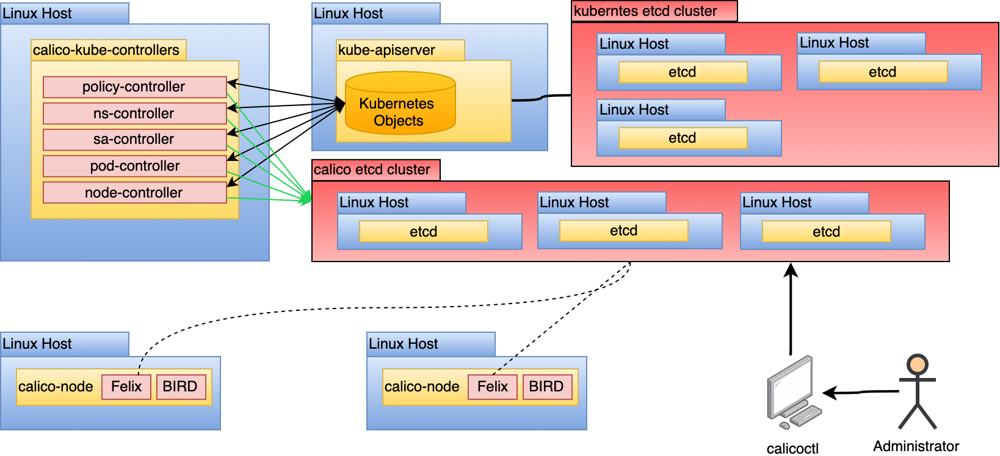
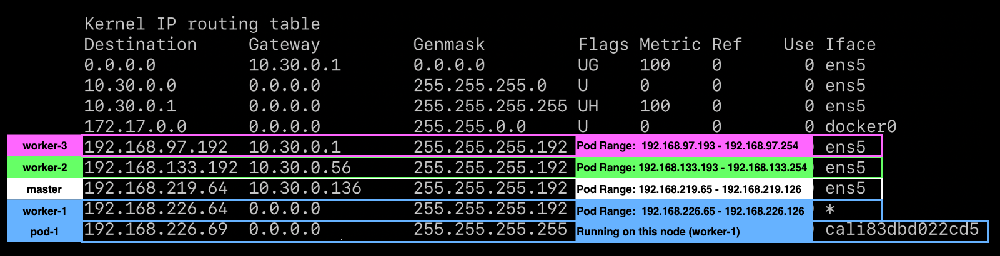
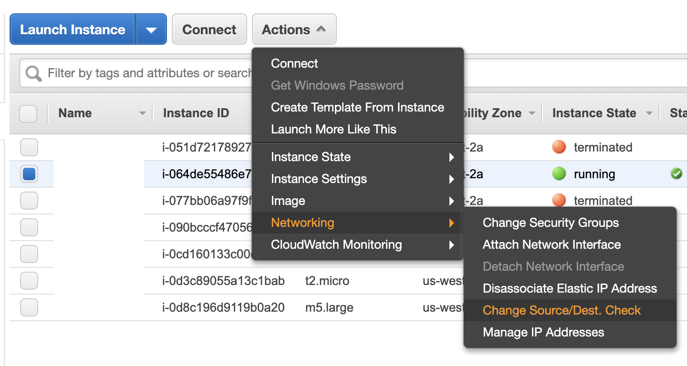
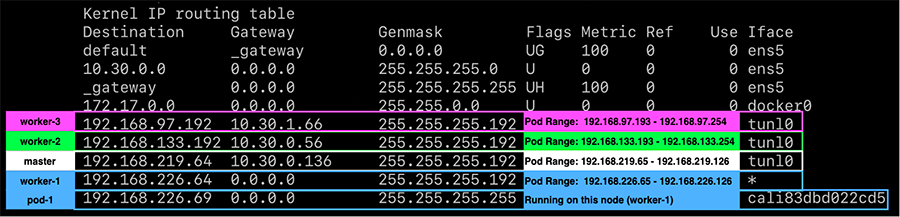
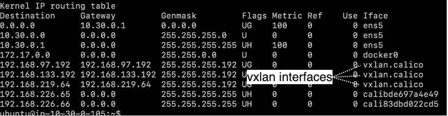

This document details a reference architecture for running
[Calico](https://docs.projectcalico.org/introduction) as the container
networking plugin (CNI) for a Kubernetes cluster, such as [Tanzu Kubernetes Grid
(TKG)](https://my.vmware.com/web/vmware/info/slug/infrastructure_operations_management/vmware_tanzu_kubernetes_grid/1_16).
It covers architectural considerations, network integration approaches, and best
practices. This document represents how the VMware field team approaches Calico
deployments in large enterprise Kubernetes environments.

Each section covers architectural recommendations and, at times, configuration
for each concern in a Calico deployment. At a high-level, the key
recommendations are:

- Use the Kubernetes datastore.
- Install Typha to ensure datastore scalability.
- Use no encapsulation for single subnet clusters.
- Use IP-in-IP in CrossSubnet mode for multi-subnet clusters.
- Configure Calico MTU based on the network MTU and the chosen routing mode.
- Add global route reflectors for clusters capable of growing above 50 nodes.
- Use GlobalNetworkPolicy for cluster-wide ingress and egress rules. Modify the
  policy by adding namespace-scoped `NetworkPolicy`.

Solution design is complex and requires a multitude of considerations that a
simple list cannot encapsulate. The sections below cover in detail the various
design decisions and examples of their configuration.

## Calico Component Overview

Calico is a CNI plugin offering container networking to a Kubernetes cluster. It
uses Linux-native tools to facilitate traffic routing and enforce network
policy. It also hosts a BGP daemon for distributing routes to other nodes.
Calico's tools run as a DaemonSet atop a Kubernetes cluster. This enables
administrators to install Calico with
`kubectl apply -f ${CALICO_MANIFESTS}.yaml` and no need to setup additional
services or infrastructure. In this reference architecture, there are a
multitude of components.


Here are some details and functionalities of each of the core components:

### calico-node

The `calico-node` pod runs on every host. It is responsible for 2 pieces of
functionality:

- **Route programming**: Based on known routes to pods in the Kubernetes
  cluster, configure the Linux host to facilitate routing accordingly.

- **Route sharing**: Based on pods running on this host, provide a mechanism to
  share known routes with other hosts. Typically accomplished with [Border
  Gateway Protocol
  (BGP)](https://en.wikipedia.org/wiki/Border_Gateway_Protocol).

To accomplish the above mentioned functionalities, the `calico-node` container
runs 2 processes, [Felix](https://github.com/projectcalico/felix) and
[BIRD](https://github.com/projectcalico/bird), which are shown in the diagram
below:


[Felix](https://github.com/projectcalico/felix) is responsible for programming
the host to satisfy pod routes and network policy. To do this, it interacts with
the Linux kernel's route tables and the Linux IPtables (for network policy).
Felix will configure the route tables statically translating what is learned to
static routes in the host's routing table. Calico's use of IPtables can raise
concerns around scalability, however the use of IPtables has a [time complexity
of
`O(1)`](https://www.projectcalico.org/comparing-kube-proxy-modes-iptables-or-ipvs).
Calico relies on
[kube-proxy](https://kubernetes.io/docs/reference/command-line-tools-reference/kube-proxy)
to facilitate services, which (in IPtables mode) can have a complexity closer to
`O(n)`. This should be considered for clusters featuring thousands of services.

[BIRD](https://github.com/projectcalico/bird) takes routing rules written by
Felix and peers with other BIRD instances that run on all hosts by default.
These BGP peers are constantly sharing routing information about their known
routes. BIRD is a capable daemon that enables a multitude of topologies. This
will be covered in greater depth in the Route Distribution section.

### calico-kube-controller

The `calico-kube-controller` is responsible for recognizing changes in
Kubernetes objects that impact routing. The controller contains multiple
controllers inside of it, watching changes in the following:

- Network Policies (used to program IPtables for network access enforcement)
- Pods (e.g. labels)
- Namespaces (used to determine if enforcement is needed for the new namespace)
- Service Accounts (used for setting up Calico
  [profiles](https://docs.projectcalico.org/v3.9/reference/resources/profile))
- Nodes (used to determine the associated subnet and inform the routing topology)


Based on changes seen by the controllers, Calico can update its datastore, which
will eventually be seen and enforced in each calico-node.

### Typha

Typha is a process that fans out configuration to all calico-node instances in a
cluster. It acts as a cache that can de-duplicate events from the API server,
lessening load significantly. As the Calico datastore changes, these changes
must be propagated to every instance of calico-node, which can be hundreds or
thousands of instances. This creates scaling issues in a cluster with more than
50 nodes as every node will be opening up a watch for API server events. Typha
gets around this by being an intermediary between the API server and all
instances of calico-node.


For brevity, only 8 hosts are displayed above. However, it's important to
consider this model at scale as connecting each calico-node to the datastore
could impact `kube-apiserver` performance.

## Calico Datastore

The Calico Datastore is a generic term referring to whatever is used to store
Calico configuration, routing, policy, and other information. Calico supports 2
datastore modes, Kubernetes and etcd. The types of resources you can expect in
this datastore are:

- [BGPConfiguration](https://docs.projectcalico.org/reference/resources/bgpconfig)

  - Set global BGP configuration settings. Allows you to set an autonomous
    system (AS) number for your network, disable node-to-node mesh (used when
    peering with route reflectors or top of rack switches), and settings to
    advertise clusterIPs.

- [BGPPeer](https://docs.projectcalico.org/reference/resources/bgppeer)

  - Represents each BGP peer containing the peer's IP and AS it's associated
    with.

- [FelixConfiguration](https://docs.projectcalico.org/reference/resources/felixconfig)

  - Low-level Felix settings that impact these routing daemons. This is where
    you alter IPtables settings, MTU sizes, and routing protocols.

- [GlobalNetworkPolicy](https://docs.projectcalico.org/reference/resources/globalnetworkpolicy)

  - Network policy rules that are applied cluster-wide rather than namespace
    wide.

- [GlobalNetworkSet](https://docs.projectcalico.org/reference/resources/globalnetworkset)

  - List of external network IPs or CIDRs that can be executed on via a Calico
    GlobalNetworkPolicy.

- [HostEndpoint](https://docs.projectcalico.org/reference/resources/hostendpoint)

  - Represents the interfaces attached to each host running Calico.

- [IPPool](https://docs.projectcalico.org/reference/resources/ippool)

  - Represents the pool(s) of IP addresses and their preferences from which
    endpoint IPs will be assigned to pods. You can set the pool's encapsulation
    protocol such as IP-in-IP, VXLAN, or Native. A cluster can have multiple
    IPPools, each with its own configuration.

- [NetworkPolicy](https://docs.projectcalico.org/reference/resources/networkpolicy)

  - Namespace-scoped network policy that extends the functionality of Kubernetes
    default network policy API.

- [NetworkSet](https://docs.projectcalico.org/reference/resources/networkset)

  - List of external network IPs or CIDRs that can be executed on via a Calico
    NetworkPolicy.

- [Node](https://docs.projectcalico.org/reference/resources/node)

  - Represents a Kubernetes node and holds details on its IPv4/6 number, AS
    association, and tunnel address (IP-in-IP or VXLAN).

- [Profile](https://docs.projectcalico.org/reference/resources/profile)

  - Configuration to group multiple endpoints by auto-applying labels to them.

- [WorkloadEndpoint](https://docs.projectcalico.org/reference/resources/workloadendpoint)

  - The association of an endpoint to a workload. Includes details such as what
    the container ID is, pod name, MAC address, interface association (cali\*),
    and IP network(s).

Some of the above resources are editable by administrators while others are
automatically configured and updated by the `calico-kube-controllers`.

### Kubernetes Datastore Mode (Recommended)

In almost all cases, it's preferable to use the Kubernetes datastore instead of
etcd. In this model, all persisted data used by Calico is stored through the
Kubernetes API server as custom resource definitions (CRDs).


Support for a Kubernetes backend was introduced after the etcd backend. For some
time after its release, it did not offer the same features as the etcd backend.
In current Calico (3.9+), feature parity has been achieved. Another issue with
the Kubernetes backend was its inability to scale. With hundreds of Felix
instances trying to interact with the kube-apiserver to get the latest updates
and changes, it had a negative impact on the system. This has been remedied with
the introduction of [Typha](https://github.com/projectcalico/typha). With the
feature parity and scalability solved, the etcd mode incurs an unnecessary cost
of administering a second etcd cluster. It also requires the implementation of
authentication and authorization controls to prevent unauthorized modification
of the Calico datastore. In the Kubernetes backend mode, it uses the
administrator's kubeconfig, which means access to Calico resources can be
controlled by Kubernetes RBAC. Based on the practices in this reference
architecture, verify the following to ensure you're using the Kubernetes
datastore mode and leveraging typha:

1. Check the `kube-system/calico-config` configmap to verify the following is
   set.

   ```yaml
   kind: ConfigMap
   apiVersion: v1
   metadata:
     name: calico-config
     namespace: kube-system
   data:
     # other config removed for brevity.

     typha_service_name: "calico-typha"

     cni_network_config: |-
       {
         "name": "k8s-pod-network",
         "cniVersion": "0.3.1",
         "plugins": [
           {
             "type": "calico",
             "log_level": "info",
             "datastore_type": "kubernetes",
             "nodename": "__KUBERNETES_NODE_NAME__",
             "mtu": __CNI_MTU__,
             "ipam": {
                 "type": "calico-ipam"
             },
             "policy": {
                 "type": "k8s"
             },
             "kubernetes": {
                 "kubeconfig": "__KUBECONFIG_FILEPATH__"
             }
           },

           # other config removed for brevity
         ]
       }
   ```

   The above has some configuration removed. But the attributes left should be
   checked to ensure you're running in the Kubernetes datastore mode using
   Typha.

2. Check the `calico/node` container spec to ensure the following environment
   variables are being set:

   ```yaml
   env:
     # Use Kubernetes API as the backing datastore.
     - name: DATASTORE_TYPE
       value: "kubernetes"
     # Typha support: controlled by the ConfigMap.
     - name: FELIX_TYPHAK8SSERVICENAME
       valueFrom:
         configMapKeyRef:
           name: calico-config
           key: typha_service_name
   ```

3. Verify that the following Typha resources have been deployed:

   1. Typha Service
   2. Typha Deployment
   3. Typha PodDisruptionBudget

### etcd Datastore Mode

The etcd datastore mode is still supported and considered a viable approach for
running Calico.



For the reasons stated in the previous section, this approach is not recommended
as it introduces unnecessary complexity and security risk. If this model is
used, **do not** use the Kubernetes etcd cluster as the datastore for Calico. No
process outside of core Kubernetes should have access to the cluster's etcd for
security and performance reasons.

### Datastore Interaction

For all datastore interaction, it's recommended you use
[calicoctl](https://docs.projectcalico.org/getting-started/clis/calicoctl/install)
to interact with the datastore. The Calico documentation also describes how to
run `calicoctl` as a container inside your Kubernetes cluster. Since the
Kubernetes datastore exposes the Calico objects as CRDs, it is also possible to
interact through `kubectl`. However, `calicoctl` is still recommended as it adds
additional validation to your interaction with the Calico datastore objects.
`calicoctl` needs to be configured based on your datastore. Below are the steps
for setting up `calicoctl` to connect to the Kubernetes datastore:

1. Download and setup the appropriate calicoctl binary from
   https://github.com/projectcalico/calicoctl/releases.

2. Export the `DATASTORE_TYPE` variable to `kubernetes`.

   ```bash
   CALICO_DATASTORE_TYPE=kubernetes
   ```

3. Export the `CALICO_KUBECONFIG` variable to the location of your kubeconfig.

   ```bash
   CALICO_KUBECONFIG=${LOCATION_OF_YOUR_KUBECONFIG}
   ```

   The `CALICO` prefix is optional, but since it can conflict with the
   `kubectl` CLI, it's best to add it and possibly persist this setting
   somewhere such as `~/.bashrc`.

## Routing Configuration

Calico supports multiple routing modes each with unique trade-offs. This section
details the differences in those routing modes, our recommendations based on
topology, and an overview of alternative configurations.

### Routing Methods

Calico supports 3 routing modes:

1. Native: Packets routed as-is, no encapsulation.

1. IP-in-IP: Minimal encapsulation; outer header includes host
   source/destination IPs and inner header includes pod source/destination.

1. VXLAN: Robust encapsulation using UDP over IP; outer header includes host
   source/destination IP addresses and inner header includes pod
   source/destination IP addresses as well as Ethernet headers.

#### Native

Native routing does not encapsulate packets to and from pods. As such, it's a
highly performant routing method as you're not incurring the overhead of
encapsulation, decapsulation, and larger header sizes. It also makes
troubleshooting simpler as analyzing network traffic does not involve looking
inside a packet for another packet. When running in this mode, the packet
structure looks as shown in the diagram below:


The interface data path is simplified in this diagram to keep the focus on the
packet in transit. Additionally, Calico will prefer the NIC of the default
route.

In order to facilitate this model, Felix programs the route table to use the
default interface and send traffic to the target pod via its host, seen below as the
Gateway:



The above image shows the output of `worker-1`'s routing table. In this cluster
there are 3 other nodes, `worker-2`, `worker-3`, and `master`. Each of the nodes
have their own pod CIDR specified.

This routing mode can be problematic in environments that:

1. Cross multiple subnets or feature routers that rely on the destination IP to
   determine the host it should route the packet to.

2. Enforce source/destination checks for inbound packets.
   - Some networks such as AWS allow you to disable these checks.



3. Environments that block all BGP, which is used in this model for route
   distribution.

#### IP-in-IP

IP-in-IP is a simple form of encapsulation that wraps the packet with an outer
IP header that appears as if the source and destination are hosts rather than
pods. Therefore, when a host receives an IP-in-IP packet, it examines the
internal IP header to determine the target pod. This is Calico's default routing
method. While this routing method incurs more overhead than native routing, it
does work in most environments without modification, especially in environments
that cross multiple subnets. When running in this mode, the packet structure
looks as shown in the diagram below:


Note the ethernet frame destination is set to the `$GATEWAY`, this could be
targeting a node's mac address or a router depending on whether the request is
crossing a subnet boundary.

In order to facilitate this model, Felix programs the route table to use
IP-in-IP tunnel interfaces to provide routing across nodes.



At the cost of the additional IP-in-IP overhead, this model works in most
network topologies. Environments where this model can be problematic are:

1. Environments that explicitly disallow IP-in-IP, such as Azure.

2. Environments that block all BGP, which is used in this model for route
   distribution.

#### VXLAN

VXLAN is a feature-rich form of encapsulation that enables the creation of
virtualized layer 2 networks. This is achieved by completely encapsulating the
pod's ethernet frame and adding some header information specific to VXLAN. The
VXLAN mode **does not** require BGP, which is ideal for environments where BGP
peering is blocked. When running in this mode, the packet structure looks as
shown in the diagram below:


Note the outer ethernet frame destination is set to the `$GATEWAY`, this could
be targeting a node's mac address or a router depending on whether the request
is crossing a subnet boundary.

In order to facilitate this model, Felix programs the route table to use VXLAN
tunnel interfaces to provide routing across nodes.



VXLAN is arguably a more complex encapsulation option. However, it's a known and
capable protocol, which a network team may prefer.

### Single Subnet Configuration

For clusters deployed in a single subnet, use the Native routing mode. This will
provide the best performance and simplest network model as there will be no
encapsulation. Packets traversing the network will contain the source and
destination IPs of pods in their IP headers. If for any reason, networks or
hosts cannot allow this type of configuration, you'll need to look into a full
IP-in-IP configuration instead.


To enable this mode, the IPPools in the cluster must have `ipipMode` and
`vxlanMode` set to `Never`. This should be done during deployment of Calico, but
it can be changed after.

To ensure native routing is setup during the deployment, verify that the
following is set in the `calico-node` container manifest:

```yaml
env:
  # other variables removed for brevity

  # Enable IPIP
  - name: CALICO_IPV4POOL_IPIP
    value: "Never"
```

Using `calicoctl`, you can verify (or modify) the `IPPool` setting. The default
pool is exposed as follows:

```bash
calicoctl get ippool default-ipv4-ippool
```

The output should show the current setting for `ipipMode` and `vxlanMode`. Both
of these must be set to `Never` as shown below:

```yaml
apiVersion: projectcalico.org/v3
kind: IPPool
metadata:
  name: default-ipv4-ippool
spec:
  blockSize: 26
  cidr: 192.168.0.0/16
  ipipMode: Never
  natOutgoing: true
  nodeSelector: all()
  vxlanMode: Never
```

### Multi-Subnet Configuration

For clusters that are deployed across subnets, it's likely native routing will
work for intra-subnet traffic. However, when pods are communicating across the
subnet boundary, they are often met with a router that relies on the destination
IP to determine what host to route to. IP-in-IP solves this, however, you're
taking an unnecessary hit to performance and complexity for intra-subnet
traffic.

For these cases, the recommended option is to run `ipipMode` in `CrossSubnet`.
With this setting enabled, native routing is used for all intra-subnet
communication and IP-in-IP (encapsulation) is used when crossing the subnet
boundary as illustrated in the diagram below:


In our experience, the majority of clusters span subnets. Thus, this is the most
common recommended topology.

To ensure native cross-subnet IP-in-IP is setup during the deployment, verify
that the following is set in the `calico-node` container manifest.

```yaml
env:
  # other variables removed for brevity

  # Enable IPIP
  - name: CALICO_IPV4POOL_IPIP
    value: "CrossSubnet"
```

Using `calicoctl`, you can verify (or modify) the `IPPool` setting. The default
pool is exposed as follows:

```bash
calicoctl get ippool default-ipv4-ippool
```

The output should show the current setting for `ipipMode` as `CrossSubnet` and
`vxlanMode` as `Never`:

```yaml
apiVersion: projectcalico.org/v3
kind: IPPool
metadata:
  name: default-ipv4-ippool
spec:
  blockSize: 26
  cidr: 192.168.0.0/16
  ipipMode: CrossSubnet
  natOutgoing: true
  nodeSelector: all()
  vxlanMode: Never
```

### Full IP-in-IP Configuration

If native routing for intra-subnet traffic is not possible in your environment,
e.g. the network performs source/destination checks against the IP datagram, you
can use full IP-in-IP configuration. This is the default for most Calico
deployments. To verify that, you can check the following in the `calico-node`
manifest:

```yaml
env:
  # other variables removed for brevity

  # Enable IPIP
  - name: CALICO_IPV4POOL_IPIP
    value: "Always"
```

Using `calicoctl`, you can verify (or modify) the `IPPool` setting. The default
pool is exposed as follows:

```bash
calicoctl get ippool default-ipv4-ippool
```

The output should show the current setting for `ipipMode` as `Always` and
`vxlanMode` as `Never`:

```yaml
apiVersion: projectcalico.org/v3
kind: IPPool
metadata:
  name: default-ipv4-ippool
spec:
  blockSize: 26
  cidr: 192.168.0.0/16
  ipipMode: Always
  natOutgoing: true
  nodeSelector: all()
  vxlanMode: Never
```

IP-in-IP and Native both require BGP to distribute routes amongst nodes. In some
environments, BGP peering might not be possible. In these cases it's best to
consider VXLAN, where BGP is optional.

### VXLAN Configuration

For environments where VXLAN is preferred or BGP is not possible, Calico can be
configured to operate in this mode. Due to the changes in routing and route
sharing between Native/IP-in-IP and VXLAN, **do not** change this setting in a
running cluster. Instead, follow the steps below to ensure a cluster has VXLAN
enabled. Unless you plan to peer IPPools with existing network hardware, **you
should disable BGP peering to reduce overhead**:

1. The `calico-config` configmap has `backend` set to `vxlan` as shown below:

   ```yaml
   kind: ConfigMap
   apiVersion: v1
   metadata:
     name: calico-config
     namespace: kube-system
   data:
     # other settings removed for brevity

     # value changed from bird to vxlan
     calico_backend: “vxlan”
   ```

1. The `calico-node` manifest has `CALICO_IPVPOOL_VXLAN` set to `Always` as
   shown below:

   ```yaml
   env:
     # other variables removed for brevity

     # Enable VXLAN
     - name: CALICO_IPV4POOL_VXLAN
       value: "Always"
   ```

1. The `calico-node` manifest is not setting `CALICO_IPVPOOL_IPIP`.

1. The `calico-node` manifest has all BIRD-related liveness and readiness checks
   disabled as shown below:

   ```yaml
   livenessProbe:
   exec:
     command:
       - /bin/calico-node
       - -felix-live

     # disable bird liveness test
     # - -bird-live

   periodSeconds: 10
   initialDelaySeconds: 10
   failureThreshold: 6
   readinessProbe:
     exec:
       command:
         - /bin/calico-node
         - -felix-ready

       # disable bird readiness test
       #- -bird-ready

     periodSeconds: 10
   ```

If the above is true, Calico will operate in VXLAN mode for all traffic.

### MTU Configuration

MTU calculation is done by determining the Network MTU and then subtracting
based on your routing configuration:

- Native: Subtract by `0`.
- IP-in-IP: Subtract by `20`.
- VXLAN: Subtract by `50`.

The following table shows 2 sets of example calculation:


| Network MTU | Native MTU | IP-in-IP MTU | VXLAN MTU |
| -------------------------------------------------------------------------------------------------------------- | ---------- | ------------ | --------- |
| 1500 | 1500 | 1480 | 1450 |
| 9001 ([AWS Jumbo](https://docs.aws.amazon.com/AWSEC2/latest/UserGuide/network_mtu.html#jumbo_frame_instances)) | 9001 | 8981 | 8951 |


To set the MTU, the `calico-config` configmap can be set as follows:

```yaml
kind: ConfigMap
apiVersion: v1
metadata:
  name: calico-config
  namespace: kube-system
data:
  # other config omitted for brevity

  # SET THE MTU based on routing mode and network MTU
  veth_mtu: "1440"
```

If this is set after deployment, **only new pods will respect the MTU change**.
Any existing pods must be restarted or `calico-node` (on the host) must be
restarted.

## Route Distribution

Unless running in VXLAN mode, Calico requires the Border Gateway Protocol (BGP)
to share routes amongst hosts. BGP is a common protocol that many routers are
able to peer with. By default, Calico requires no BGP-capable routers to be
deployed. Instead it runs a routing daemon (BIRD) in each node, creating a BGP
mesh.


Each colored line represents a peering relationship. This model is referred to
as a node-to-node mesh, as it does not centralize route distribution. Using
`calicoctl` on 1 of the 4 hosts reveals the peering relationship.

```bash
sudo calicoctl node status

Calico process is running.

IPv4 BGP status
+--------------+-------------------+-------+----------+--------------------------------+
| PEER ADDRESS |     PEER TYPE     | STATE |  SINCE   |              INFO              |
+--------------+-------------------+-------+----------+--------------------------------+
| 10.30.0.17   | node-to-node mesh | up    | 01:17:08 | Established                    |
| 10.30.0.16   | node-to-node mesh | up    | 01:17:07 | Established                    |
| 10.30.0.14   | node-to-node mesh | up    | 01:29:06 | Established                    |
+--------------+-------------------+-------+----------+--------------------------------+
```

Running the above on 1 out of 4 hosts reveals the host is peered with 3 others.
For small clusters (under 50 nodes), this model is adequate and should not
change. However, when a cluster is running 50 to thousands of nodes, this
peering relationship between every node becomes a bottle neck. For clusters that
plan to scale into hundreds of nodes, route reflectors should be leveraged.

There are two types of targets Calico may be configured to peer routes with:

- `calico-node` configured reflector:

  - In this model, nodes run dedicated `calico-node` instances responsible for
    acting as reflectors. The configuration of this model is demonstrated in
    the Global Route Reflection section below.

- Top of rack (ToR) switch or router:

  - In this model, Calico is configured to peer with existing network gear that
    supports BGP. This is a valid approach for making pod `IPPools` routable to
    the network fabric. The configuration of this model is demonstrated in the
    Node-Specific Route Reflection section below.

### Global Route Reflection

BGP route reflectors provide centralized, highly-available route sharing hubs
that nodes can peer with. In the default node-to-node mesh topology, the
quantity of node peers are `N-1`, where N is the total number of hosts in the
cluster. In the route reflector model, the number of peers become the quantity
of reflectors deployed. For clusters exceeding 50 nodes and potentially growing
far beyond that, this topology is recommended. Once applied, the route sharing
model looks as shown in the diagram below:


This model is referred to as global reflection because nodes peer to all route
reflectors made available to the cluster. This is an ideal model for most
deployments as it is simple and scalable. However, it does assume a single layer
2 network that `calico-node` instances can peer to reflectors. For more complex
or massive-scale deployments, nodes may need to peer with specific routers in
their segment. This model is covered in the Node-Specific Route Reflection
section.

Clusters wishing to achieve the global reflection model without additional
routers can leverage the `calico-node` container. To configure this, add two
nodes to the Kubernetes cluster running `calico-node` containers. These nodes
are tainted to ensure **only** the reflector will run on them. For each node,
the Calico `Node` CRD is altered to include a label representing the instance of
`calico-node` as a reflector as show below:

```yaml
apiVersion: projectcalico.org/v3
kind: Node
metadata:
  name: k8s-node-z

  # Set to represent this node is a reflector
  labels:
    route-reflector: true

spec:
  bgp:
    ipv4Address: 10.30.0.13/22
    ipv4IPIPTunnelAddr: 192.168.0.1
    routeReflectorClusterID: 1.0.0.1
```

With nodes labeled via the `Node` CRD, `BGPPeer` CRDs are added for peering
configuration. These `BGPPeers` instruct the nodes to peer with the reflectors
and the reflectors to peer with each other.

Worker-to-reflector `BGPPeer` configuration:

```yaml
kind: BGPPeer
apiVersion: projectcalico.org/v3
metadata:
  name: node-peer-to-rr
spec:
  nodeSelector: !has(route-reflector)
  peerSelector: has(route-reflector)
```

Reflector-to-reflector `BGPPeer` configuration:

```yaml
kind: BGPPeer
apiVersion: projectcalico.org/v3
metadata:
  name: rr-to-rr-peer
spec:
  nodeSelector: has(route-reflector)
  peerSelector: has(route-reflector)
```

With peering for the route reflectors setup, the cluster has the node-to-node
BGP mesh disabled by modifying the `BGPConfiguration` CRD.

```yaml
apiVersion: projectcalico.org/v3
kind: BGPConfiguration
metadata:
  name: default
spec:
  logSeverityScreen: Info

  # Set to disable node mesh and leverage route reflectors
  nodeToNodeMeshEnabled: false

  asNumber: 63400
```

The cluster's new peer table looks as follows from the perspective of any node:

```bash
sudo calicoctl node status

Calico process is running.

IPv4 BGP status
+--------------+-----------+-------+----------+-------------+
| PEER ADDRESS | PEER TYPE | STATE |  SINCE   |    INFO     |
+--------------+-----------+-------+----------+-------------+
| 10.30.0.45   | global    | up    | 03:52:51 | Established |
| 10.30.0.46   | global    | up    | 03:54:11 | Established |
+--------------+-----------+-------+----------+-------------+
```

Clusters that run in this mode introduce a (highly-available) centralized point
of failure. For this reason, you should ensure that at least 2 route reflectors
are running per cluster. Furthermore, in multi-subnet environments, ensure that
at least 1 route reflector is running per subnet.

### Node-Specific Route Reflection

Peering can be configured for BGP-capable hardware in a datacenter's network.
Most commonly setup with top of rack (ToR) switches. Each grouping of reflected
routes typically represent a separate network AS as illustrated in the diagram
below:


To configure the above model, each node should be labeled with an identifier
representing the part of the network it runs in.

```yaml
apiVersion: projectcalico.org/v3
kind: Node
metadata:
  name: k8s-node-z

  # Add rack label; used for BGPPeer
  labels:
    rack: a

spec:
  bgp:
    ipv4Address: 10.30.0.13/22
    ipv4IPIPTunnelAddr: 192.168.0.1
    routeReflectorClusterID: 1.0.0.1
```

With nodes labeled via the `Node` CRD, `BGPPeer` CRDs are added for each target
switch / router to be peered with. These `BGPPeers` instruct the nodes to peer
with the ToR.

Here is a Worker-to-ToR `BGPPeer` configuration:

```yaml
kind: BGPPeer
apiVersion: projectcalico.org/v3
metadata:
  name: node-peer-rack-a
spec:
  # peer all nodes with label rack: a with peerIP
  nodeSelector: rack == 'a'
  peerIP: 192.168.1.1

  # remote AS number of the peer
  asNumber: 64400
```

With peering for the switch or router setup, the cluster's node-to-node
BGP mesh is disabled by modifying the `BGPConfiguration` CRD as follows:

```yaml
apiVersion: projectcalico.org/v3
kind: BGPConfiguration
metadata:
  name: default
spec:
  logSeverityScreen: Info

  # Set to disable node mesh and leverage route reflectors
  nodeToNodeMeshEnabled: false

  asNumber: 63400
```

### Routable Pod and Service Networks

Calico supports making pod and service networks routable to the entire network.
By default, the pod network and service networks are only routable from the
hosts that `calico-node` runs on. The need for routable pod and service networks
should be considered carefully. In many architectures, an external load balancer
paired with an ingress controller can achieve a more idiomatic network topology
for Kubernetes. Making these networks routable can come with some downsides:

- Reliance on routing directly to Pod IPs.

  - Kubernetes treats pod IPs ephemerally. Assuming a pod's IP will stay
    consistent is generally an anti-pattern.

- Service IPs, when routable, are still backed by `kube-proxy`.

  - `kube-proxy` implements simple round-robin load balancing with IPtables.
    The limited routing capabilities and scalability of IPtables may be a
    concern.

- Routing pod networks can consume a large chunk of an organization's IPv4 space.

If your use case justifies routable pods, the following sections discuss how to
setup various topologies:

#### Routable Pod Network

To make the entire pod network routable, `BGPPeer`s are to be configured. The
Node-Specific Route Reflection of this reference architecture covers this in
detail. However, for routable pods, global or node-specific peering is
acceptable. The key is to peer with a ToR that propagates routes to the larger
network as illustrated in the diagram below:


An example peering configuration to accomplish the above is as follows:

```yaml
kind: BGPPeer
apiVersion: projectcalico.org/v3
metadata:
  name: node-peer-router
spec:
  # peer all nodes containing label network-node with ToR
  nodeSelector: has('network-node')
  peerIP: 192.168.1.1

  # remote AS number of the peer
  asNumber: 64400
```

Node-to-node meshing should be disabled.

In this topology, the entire pod CIDR is routable. This can be non-desirable as
a pod CIDR can often be as large as a `/16` and consuming that much IP space is
unrealistic. In these cases, additional `IPPool`(s) can be introduced to target
a smaller routable space. With another `IPPool`, the topology may look as
follows:


This topology makes deployment, management, and networking more complex than
usual. If routable pods are a use case, it's worth considering running a
dedicated cluster with a smaller pod CIDR to facilitate routable pods as opposed
to running a single cluster fostering multiple routing models.

The routable pods model relies on labels in the
[Node](https://docs.projectcalico.org/v3.11/reference/resources/node) CRD. The
above requires a common label for nodes containing non-routable pods and labels
for nodes containing routable pods. To start, the cluster adds a label qualifier
to only apply the default IPPool to specific nodes (based on label).

```yaml
apiVersion: projectcalico.org/v3
kind: IPPool
metadata:
  name: default-ipv4-ippool
spec:
  blockSize: 26
  cidr: 192.168.0.0/16
  ipipMode: Never
  natOutgoing: true

  # Use IPs from this pool for all non-routable nodes.
  nodeSelector: network-type == 'non-routable'

  vxlanMode: Never
```

A second IPPool is added to represent the routable pod pool.

```yaml
apiVersion: projectcalico.org/v3
kind: IPPool
metadata:
  name: default-ipv4-ippool
spec:
  blockSize: 26

  # Introduce a smaller routable pod CIDR
  cidr: 192.168.100.0/24

  ipipMode: Never
  natOutgoing: true

  # Use IPs from this pool for all routable nodes.
  nodeSelector: network-type == 'routable'

  vxlanMode: Never
```

This would apply to worker-AA and worker-BB in the diagram above.

[BGPPeer](https://docs.projectcalico.org/v3.11/reference/resources/bgppeer)s are
setup for the non-routable pods, in the same way described in Global Route
Reflection section. The only difference is the `nodeSelector` must only select
nodes where `nodeSelector: network-type == 'routable'`. A `BGPPeer` for the
nodes featuring routable pods looks as follows:

```yaml
kind: BGPPeer
apiVersion: projectcalico.org/v3
metadata:
  name: node-peer-router
spec:
  nodeSelector: network-type == 'routable'
  peerIP: 192.168.1.1

  # remote AS number of the peer
  asNumber: 64400
```

With the above in place, there is now an internally routable (default) `IPPool`
and a fully routable `IPPool`. Using taints and admission control, the cluster
can be configured to ensure only select workloads land in the routable space.

#### Routable Service Network

Along with pod IPs, services can be routable. This means propagating
`ClusterIP`s to upstream routers over BGP. To enable this feature set, add the
service CIDRs to the `BGPConfiguration`. This assumes `BGPPeers` are already
configured.

```yaml
apiVersion: projectcalico.org/v3
kind: BGPConfiguration
metadata:
  name: default
spec:
  serviceClusterIPs:
    - cidr: 172.34.12.0/24
```

It is important that ToR components support ECMP load balancing. If they do not,
service traffic will be routed through a single node.

## Network Policy Enforcement

While network policy designs are out of scope for this reference architecture,
it is a core feature of Calico and thus is mentioned here to provide initial
guidance.

Calico enforces 3 types of policies:

1. NetworkPolicy: Kubernetes API: Namespace scoped
2. NetworkPolicy: Calico CRD: Namespace scoped
3. GlobalNetworkPolicy: Calico CRD: Cluster scoped

The Calico CRDs are more capable than the Kubernetes API, however the Kubernetes
API policies are portable, should migration to another CNI-plugin happen in the
future. Many organizations want to enforce default policy to every namespace.
Normally, administrators need to ensure default policy rules are deployed to
every namespace. This can be challenging over time as changes to the default
policy rules require changes to every namespace. Calico's `GlobalNetworkPolicy`
enables creating cluster-wide policies that impact every workload based on label
selectors. Cluster-wide policy set in `GlobalNetworkPolicy` can be overwritten
by `NetworkPolicy` (namespace scoped) from both the Kubernetes API and Calico
CRD. The example below enforces a global default deny-all policy:

```yaml
# This GlobalNetworkPolicy uses Calico's CRD
# (https://docs.projectcalico.org/v3.5/reference/calicoctl/resources/globalnetworkpolicy)
apiVersion: projectcalico.org/v3
kind: GlobalNetworkPolicy
metadata:
  name: global-deny-all
spec:
  # order controls the precedence. Calico applies the policy with the lowest value first.
  # Kubernetes NetworkPolicy does not support order. They are automatically converted to an order
  # value of 1000 by Calico. Setting this value to 2000, provides flexibility for 999 additional
  # GlobalNetworkPolicies to be added and ensures Kubernetes namespace-scoped policies always take
  # precedence.
  order: 2000
  types:
    - Ingress
    - Egress

  # egress network rules
  egress:
    # Allow all egress traffic from kube-system.
    - action: Allow
      destination: {}
      source:
        namespaceSelector: name == 'kube-system'

    # Allow egress DNS traffic to any destination.
    - action: Allow
      protocol: UDP
      destination:
        nets:
          - 0.0.0.0/0
        ports:
          - 53

  # ingress network rules
  ingress:
    # Allow all ingress traffic for the kube-system namespace.
    - action: Allow
      destination:
        namespaceSelector: name == 'kube-system'
      source: {}
```

The policy above denies all pod network traffic by default, except for workloads
in `kube-system` and DNS communications (UDP:53). With this in place, a
namespace could open up ingress traffic to port 80 for any workload in it, by
adding the following `NetworkPolicy`:

```yaml
apiVersion: networking.k8s.io/v1
kind: NetworkPolicy
metadata:
  name: team-netpol
  namespace: org-1
spec:
  podSelector: {}
  policyTypes:
    - Ingress
    - Egress
  ingress:
    # allow all inbound traffic on port 80
    - from:
      ports:
        - protocol: TCP
          port: 80
```

With appropriate admission control, the above model can provide powerful policy
constructs impacting egress and ingress traffic for a cluster.